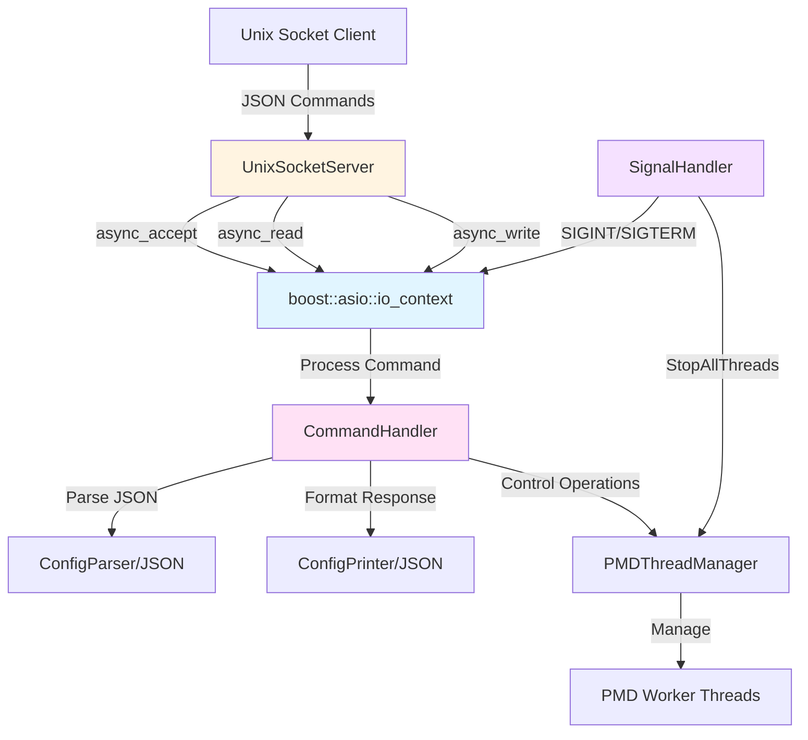

# Design Document: Asio Control Loop

## Overview

This design implements a Boost.Asio-based event loop for the control plane of a DPDK packet processing system. The control plane runs on the main lcore and provides a Unix domain socket interface for receiving JSON-formatted commands while PMD worker threads handle packet processing on other lcores.

The design integrates three key components:
1. A Unix domain socket server that accepts client connections and receives JSON commands
2. A command handler that processes commands using the existing JSON parser/printer infrastructure
3. A signal handler that integrates POSIX signals (SIGINT, SIGTERM) into the event loop for graceful shutdown

The event loop architecture ensures that all control plane operations execute on the main lcore without interfering with packet processing performance on worker lcores. The design reuses existing components (ConfigParser, ConfigPrinter, PMDThreadManager) to maintain consistency with the codebase.

## Architecture

### Component Diagram



### Threading Model

The system uses a single-threaded event loop model for the control plane:

- **Main Lcore Thread**: Runs the boost::asio::io_context event loop, handles all I/O operations, command processing, and signal handling
- **Worker Lcore Threads**: Run PMD packet processing loops independently, managed by PMDThreadManager

This design avoids thread synchronization complexity by ensuring all control plane operations execute on a single thread. Communication with PMD threads occurs through thread-safe interfaces provided by PMDThreadManager.

### Execution Flow

1. **Initialization Phase**:
   - Verify execution on main lcore
   - Create boost::asio::io_context
   - Initialize UnixSocketServer with configured socket path
   - Register signal handlers for SIGINT/SIGTERM
   - Start accepting connections

2. **Runtime Phase**:
   - Event loop processes asynchronous I/O events
   - Accept new client connections
   - Read JSON commands from connected clients
   - Parse and execute commands
   - Send JSON responses back to clients
   - Handle signals for graceful shutdown

3. **Shutdown Phase**:
   - Signal handler stops accepting new connections
   - Wait for in-flight commands to complete
   - Stop PMD threads via PMDThreadManager
   - Wait for PMD threads to terminate
   - Stop event loop
   - Clean up socket file

## Components and Interfaces

### ControlPlane Class

The main orchestrator that initializes and runs the event loop.

```cpp
namespace dpdk_config {

class ControlPlane {
 public:
  struct Config {
    std::string socket_path = "/tmp/dpdk_control.sock";
    uint32_t shutdown_timeout_seconds = 10;
  };

  explicit ControlPlane(PMDThreadManager* thread_manager);
  
  // Initialize the control plane on the main lcore
  // Returns error if not on main lcore or initialization fails
  absl::Status Initialize(const Config& config);
  
  // Run the event loop (blocks until shutdown)
  // Returns after graceful shutdown completes
  absl::Status Run();
  
  // Initiate graceful shutdown
  void Shutdown();
  
 private:
  PMDThreadManager* thread_manager_;  // Not owned
  Config config_;
  std::unique_ptr<boost::asio::io_context> io_context_;
  std::unique_ptr<UnixSocketServer> socket_server_;
  std::unique_ptr<SignalHandler> signal_handler_;
  std::unique_ptr<CommandHandler> command_handler_;
  bool shutdown_initiated_ = false;
};

}  // namespace dpdk_config
```

**Responsibilities**:
- Verify execution on main lcore using rte_lcore_id()
- Create and manage the io_context lifecycle
- Coordinate initialization of all sub-components
- Provide shutdown coordination between components

**Key Design Decisions**:
- Takes PMDThreadManager as a non-owning pointer since it's created during DPDK initialization
- Config struct allows customization of socket path and timeouts
- Run() blocks until shutdown, matching the existing main loop pattern
- Shutdown() can be called from signal handler or command handler

### UnixSocketServer Class

Manages the Unix domain socket lifecycle and client connections.

```cpp
namespace dpdk_config {

class UnixSocketServer {
 public:
  using MessageCallback = std::function<void(
      const std::string& message,
      std::function<void(const std::string&)> response_callback)>;
  
  UnixSocketServer(boost::asio::io_context& io_context,
                   const std::string& socket_path);
  ~UnixSocketServer();
  
  // Start accepting connections
  absl::Status Start(MessageCallback callback);
  
  // Stop accepting new connections and close existing ones
  void Stop();
  
 private:
  class Connection;
  
  void StartAccept();
  void HandleAccept(std::shared_ptr<Connection> conn,
                    const boost::system::error_code& error);
  void RemoveConnection(Connection* conn);
  
  boost::asio::io_context& io_context_;
  std::string socket_path_;
  std::unique_ptr<boost::asio::local::stream_protocol::acceptor> acceptor_;
  MessageCallback message_callback_;
  std::vector<std::shared_ptr<Connection>> connections_;
  bool accepting_ = false;
};

}  // namespace dpdk_config
```

**Responsibilities**:
- Create and bind Unix domain socket
- Remove existing socket file if present
- Accept new client connections asynchronously
- Manage multiple concurrent connections
- Read newline-delimited JSON messages from clients
- Write JSON responses back to clients
- Clean up socket file on destruction

**Key Design Decisions**:
- Uses callback pattern to decouple socket I/O from command processing
- Connection class (private nested) manages per-client state and I/O operations
- Supports multiple concurrent clients through shared_ptr-managed connections
- Newline-delimited JSON allows streaming multiple commands over one connection

### Connection Class (Nested in UnixSocketServer)

Manages a single client connection.

```cpp
class UnixSocketServer::Connection 
    : public std::enable_shared_from_this<Connection> {
 public:
  Connection(boost::asio::io_context& io_context,
             UnixSocketServer* server,
             MessageCallback callback);
  
  boost::asio::local::stream_protocol::socket& Socket();
  
  void Start();
  void Close();
  void SendResponse(const std::string& response);
  
 private:
  void StartRead();
  void HandleRead(const boost::system::error_code& error,
                  size_t bytes_transferred);
  void HandleWrite(const boost::system::error_code& error);
  
  boost::asio::local::stream_protocol::socket socket_;
  UnixSocketServer* server_;  // Not owned
  MessageCallback callback_;
  boost::asio::streambuf read_buffer_;
  std::string write_buffer_;
  bool reading_ = false;
};
```

**Responsibilities**:
- Manage socket lifecycle for one client
- Read data asynchronously using async_read_until with newline delimiter
- Parse newline-delimited JSON messages
- Invoke callback for each complete message
- Write responses asynchronously
- Handle connection errors and cleanup

**Key Design Decisions**:
- Uses enable_shared_from_this to safely capture 'this' in async callbacks
- streambuf for efficient buffered reading
- Newline delimiter allows simple message framing
- Callback receives response_callback to send reply back to specific client

### CommandHandler Class

Processes JSON commands and generates responses.

```cpp
namespace dpdk_config {

class CommandHandler {
 public:
  explicit CommandHandler(PMDThreadManager* thread_manager,
                          std::function<void()> shutdown_callback);
  
  // Process a JSON command and return JSON response
  std::string HandleCommand(const std::string& json_command);
  
 private:
  struct CommandRequest {
    std::string command;
    nlohmann::json params;
  };
  
  struct CommandResponse {
    std::string status;  // "success" or "error"
    nlohmann::json result;
    std::string error;
  };
  
  absl::StatusOr<CommandRequest> ParseCommand(const std::string& json_str);
  std::string FormatResponse(const CommandResponse& response);
  
  CommandResponse ExecuteCommand(const CommandRequest& request);
  CommandResponse HandleShutdown(const nlohmann::json& params);
  CommandResponse HandleStatus(const nlohmann::json& params);
  CommandResponse HandleGetThreads(const nlohmann::json& params);
  
  PMDThreadManager* thread_manager_;  // Not owned
  std::function<void()> shutdown_callback_;
};

}  // namespace dpdk_config
```

**Responsibilities**:
- Parse JSON command strings using nlohmann::json
- Validate command structure (required "command" field)
- Route commands to appropriate handlers
- Execute commands and generate results
- Format responses as JSON strings
- Handle parsing errors gracefully

**Key Design Decisions**:
- Reuses nlohmann::json library consistent with ConfigParser
- Follows same error handling pattern as ConfigParser::ParseString()
- Shutdown callback allows triggering ControlPlane::Shutdown()
- Returns string responses (not StatusOr) since errors are encoded in JSON
- Extensible design allows adding new commands easily

### SignalHandler Class

Integrates POSIX signals into the event loop.

```cpp
namespace dpdk_config {

class SignalHandler {
 public:
  SignalHandler(boost::asio::io_context& io_context,
                std::function<void()> shutdown_callback);
  
  // Start listening for signals
  void Start();
  
  // Stop listening for signals
  void Stop();
  
 private:
  void StartWait();
  void HandleSignal(const boost::system::error_code& error, int signal_number);
  
  boost::asio::signal_set signals_;
  std::function<void()> shutdown_callback_;
  bool waiting_ = false;
};

}  // namespace dpdk_config
```

**Responsibilities**:
- Register handlers for SIGINT and SIGTERM
- Integrate signal delivery into event loop using boost::asio::signal_set
- Invoke shutdown callback when signal received
- Prevent signal handler race conditions

**Key Design Decisions**:
- Uses boost::asio::signal_set instead of traditional signal() for thread safety
- Signals are delivered as asynchronous events in the io_context
- Shutdown callback triggers ControlPlane::Shutdown() from event loop thread
- Replaces the global signal handler in main.cc with event loop integration

## Data Models

### JSON Command Protocol

All commands follow a consistent JSON structure for requests and responses.

#### Command Request Format

```json
{
  "command": "command_name",
  "params": {
    // Command-specific parameters (optional)
  }
}
```

**Fields**:
- `command` (string, required): The operation to perform
- `params` (object, optional): Command-specific parameters

#### Command Response Format

```json
{
  "status": "success",
  "result": {
    // Command-specific result data
  }
}
```

Or for errors:

```json
{
  "status": "error",
  "error": "Error message describing what went wrong"
}
```

**Fields**:
- `status` (string, required): Either "success" or "error"
- `result` (object, optional): Present on success, contains command output
- `error` (string, optional): Present on error, describes the failure

### Supported Commands

#### shutdown Command

Initiates graceful system shutdown.

**Request**:
```json
{
  "command": "shutdown"
}
```

**Response**:
```json
{
  "status": "success",
  "result": {
    "message": "Shutdown initiated"
  }
}
```

**Behavior**:
- Stops accepting new connections
- Allows in-flight commands to complete
- Stops all PMD threads
- Stops event loop

#### status Command

Returns system health and status information.

**Request**:
```json
{
  "command": "status"
}
```

**Response**:
```json
{
  "status": "success",
  "result": {
    "main_lcore": 0,
    "num_pmd_threads": 4,
    "uptime_seconds": 3600
  }
}
```

**Behavior**:
- Returns current lcore ID
- Returns number of running PMD threads
- Returns system uptime (future enhancement)

#### get_threads Command

Returns information about all PMD threads.

**Request**:
```json
{
  "command": "get_threads"
}
```

**Response**:
```json
{
  "status": "success",
  "result": {
    "threads": [
      {"lcore_id": 1},
      {"lcore_id": 2},
      {"lcore_id": 3},
      {"lcore_id": 4}
    ]
  }
}
```

**Behavior**:
- Queries PMDThreadManager for active lcore IDs
- Returns array of thread information

### Error Response Examples

**Invalid JSON**:
```json
{
  "status": "error",
  "error": "JSON parse error at byte 15: unexpected end of input"
}
```

**Missing Command Field**:
```json
{
  "status": "error",
  "error": "Missing required field: command"
}
```

**Unknown Command**:
```json
{
  "status": "error",
  "error": "Unknown command: invalid_cmd"
}
```

## Error Handling

### Error Categories

1. **Initialization Errors**:
   - Not running on main lcore
   - Socket path directory doesn't exist
   - Socket file cannot be created
   - Failed to bind socket

2. **Runtime Errors**:
   - Client connection failures
   - JSON parsing errors
   - Invalid command structure
   - Unknown commands
   - Socket I/O errors

3. **Shutdown Errors**:
   - Timeout waiting for PMD threads
   - Failed to clean up socket file

### Error Handling Strategy

**Initialization Phase**:
- All initialization functions return absl::Status
- Errors propagate to main() for process exit code
- Failed initialization prevents event loop from starting

**Runtime Phase**:
- Socket errors logged but don't stop event loop
- Failed connections cleaned up automatically
- JSON parsing errors returned as error responses to client
- Command execution errors encoded in JSON response
- Event loop continues running despite individual operation failures

**Shutdown Phase**:
- Shutdown timeout enforced (default 10 seconds)
- If timeout exceeded, log warning and force termination
- Socket cleanup errors logged but don't prevent shutdown
- Always attempt to stop event loop even if PMD threads timeout

### Logging Strategy

Use existing logging patterns from the codebase:
- Initialization: Print to stdout/stderr
- Errors: Print to stderr with descriptive messages
- Signal reception: Print shutdown message
- Verbose mode: Print connection events and command processing

Example logging:
```cpp
std::cout << "Control plane listening on " << socket_path << "\n";
std::cerr << "Failed to accept connection: " << error.message() << "\n";
std::cout << "Received command: " << command_name << "\n";
```

## Testing Strategy

### Unit Testing Approach

Unit tests verify specific examples, edge cases, and error conditions:

**ControlPlane Tests**:
- Initialization on main lcore succeeds
- Initialization on non-main lcore fails
- Shutdown coordination sequence

**UnixSocketServer Tests**:
- Socket creation and binding
- Existing socket file removal
- Connection acceptance
- Message reading with newline delimiter
- Response writing
- Multiple concurrent connections
- Connection cleanup on client disconnect

**CommandHandler Tests**:
- Valid command parsing
- Invalid JSON handling
- Missing command field
- Unknown command handling
- Each supported command (shutdown, status, get_threads)
- Response formatting

**SignalHandler Tests**:
- Signal registration
- Signal delivery triggers callback
- Multiple signals handled correctly

**Integration Tests**:
- Full event loop lifecycle
- Client connection and command execution
- Signal-triggered shutdown
- Graceful shutdown with running PMD threads

### Property-Based Testing Approach

Property tests verify universal properties across all inputs using a property-based testing library (Google Test with custom generators or Hypothesis for C++).

Each property test will:
- Run minimum 100 iterations with randomized inputs
- Reference the corresponding design property
- Use tag format: `// Feature: asio-control-loop, Property N: <property text>`

Property tests will be implemented after the prework analysis in the Correctness Properties section.

### Test Configuration

- Unit tests: Google Test framework (consistent with existing tests)
- Property tests: Google Test with custom input generators
- Mock objects: Use test doubles for PMDThreadManager in unit tests
- Integration tests: Use real Unix sockets with test socket paths

### Testing PMDThreadManager Integration

Since PMDThreadManager interacts with DPDK, tests will use:
- Mock PMDThreadManager for unit tests
- Real PMDThreadManager for integration tests (requires DPDK initialization)
- Test mode flag to avoid actual packet processing


## Correctness Properties

A property is a characteristic or behavior that should hold true across all valid executions of a system—essentially, a formal statement about what the system should do. Properties serve as the bridge between human-readable specifications and machine-verifiable correctness guarantees.

### Property 1: Lcore Affinity Enforcement

For any thread context, initialization on the main lcore should succeed, and initialization on any non-main lcore should return an error status.

**Validates: Requirements 1.2, 1.3**

### Property 2: Socket Path Configuration

For any valid socket path string, the Unix socket server should create the socket file at exactly that path.

**Validates: Requirements 2.1, 8.1**

### Property 3: Concurrent Connection Support

For any number N of concurrent client connections (where N >= 1), the server should accept and maintain all N connections simultaneously.

**Validates: Requirements 2.5**

### Property 4: Connection Cleanup

For any client connection that disconnects, all associated resources should be freed and the connection should no longer appear in the active connections list.

**Validates: Requirements 2.6**

### Property 5: Newline-Delimited Message Parsing

For any sequence of valid JSON objects separated by newlines, each JSON object should be parsed and processed as a separate command.

**Validates: Requirements 3.4**

### Property 6: Invalid JSON Error Handling

For any string that is not valid JSON, the command handler should return a JSON error response with status "error" and a descriptive error message.

**Validates: Requirements 3.3, 9.2**

### Property 7: Command Processing

For any valid JSON command object with a recognized "command" field, the command handler should process the command and return a response.

**Validates: Requirements 3.5**

### Property 8: Response Structure Completeness

For any command response, the JSON response should contain a "status" field, and if status is "success" then a "result" field should be present, and if status is "error" then an "error" field should be present.

**Validates: Requirements 6.3, 6.4, 6.5**

### Property 9: Command Field Validation

For any JSON object without a "command" field, the command handler should return an error response indicating the missing required field.

**Validates: Requirements 6.1**

### Property 10: Optional Parameters Support

For any valid command, the command should execute successfully both with and without a "params" field present.

**Validates: Requirements 6.2**

### Property 11: Signal-Triggered Shutdown

For any SIGINT or SIGTERM signal received, the signal handler should initiate graceful shutdown by invoking the shutdown callback.

**Validates: Requirements 4.2**

### Property 12: Event Loop Thread Affinity

For any I/O operation processed by the event loop, the operation should execute on the main lcore thread (verified by rte_lcore_id() returning the main lcore ID).

**Validates: Requirements 7.1**

### Property 13: Socket Path Validation

For any socket path where the parent directory does not exist or is not writable, initialization should return an error status.

**Validates: Requirements 8.5**

### Property 14: Command Round-Trip Serialization

For any valid command object, serializing to JSON then deserializing should produce an equivalent command object with the same command name and parameters.

**Validates: Requirements 9.5**

### Property 15: Initialization Status Propagation

For any initialization function in the event loop components, the function should return absl::Status indicating success or failure.

**Validates: Requirements 5.1**

### Property 16: Socket Error Logging

For any socket operation that fails with a boost::system::error_code, the error should be logged with the error message.

**Validates: Requirements 5.2**

