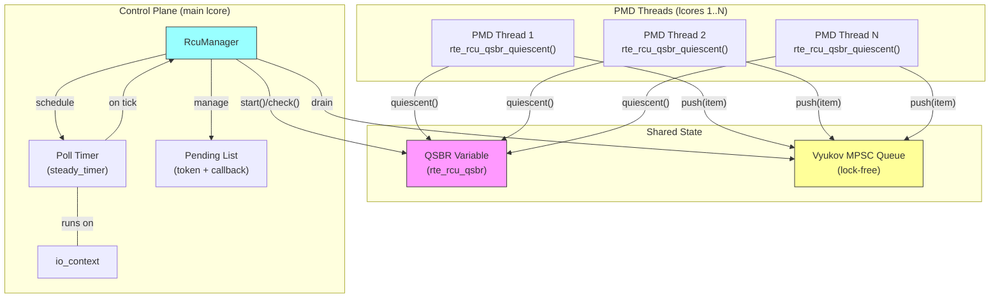
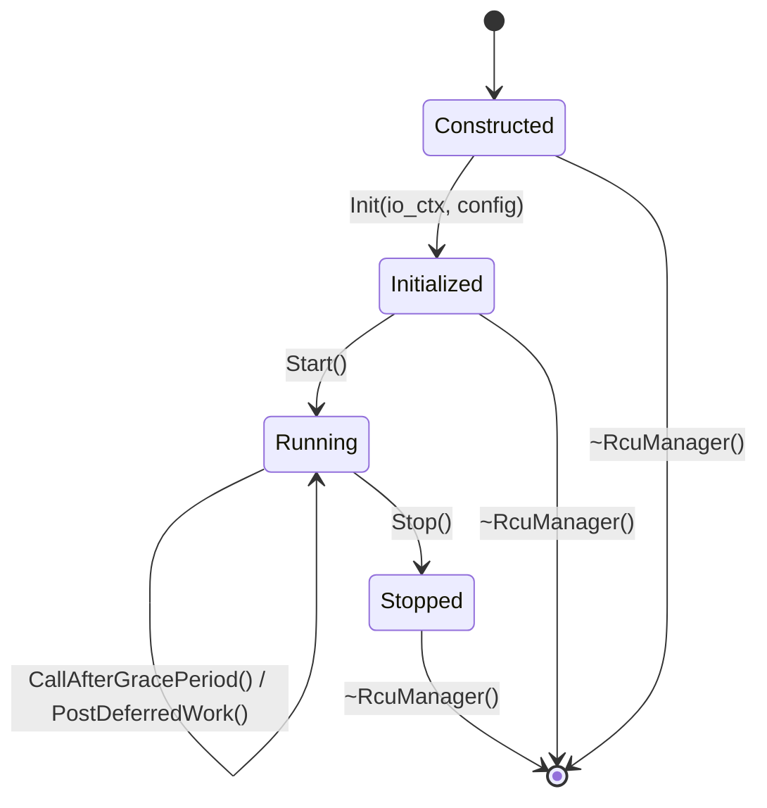
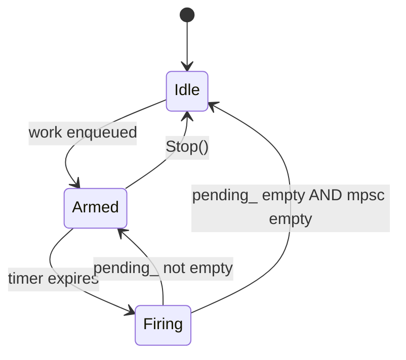

# Design Document: DPDK RCU Async Grace Period System

## Overview

This design adds an asynchronous RCU (Read-Copy-Update) system that bridges DPDK's QSBR (Quiescent State Based Reclamation) library with the existing boost.asio control plane event loop. The system enables non-blocking, callback-driven grace period completion for safe memory reclamation in a lock-free packet processing pipeline.

The architecture has two data paths:

1. **Control-plane path**: The control plane calls `call_after_grace_period(Fn)` to schedule a callback that fires once all PMD threads have passed through a quiescent state. A boost.asio `steady_timer` polls DPDK's `rte_rcu_qsbr_check()` to detect grace period completion without blocking.

2. **PMD-thread path**: PMD threads push deferred work items into a lock-free Vyukov intrusive MPSC queue. Each item carries an RCU token and a callback. The control plane drains this queue on each poll timer tick, checks token completion, and either invokes the callback immediately or moves it to the pending list.

Both paths converge on a single pending list owned by the control plane, polled by the same timer.

## Architecture

### System Architecture Diagram



### Thread Safety Model

| Operation | Thread | Synchronization |
|---|---|---|
| `rte_rcu_qsbr_quiescent()` | PMD threads | Per-thread atomic store (DPDK) |
| `MpscQueue::Push()` | PMD threads | Wait-free (single XCHG) |
| `MpscQueue::Pop()` | Control plane only | Lock-free (single consumer) |
| `call_after_grace_period()` | Control plane only | None needed (single thread) |
| `OnPollTimer()` | Control plane only | None needed (asio strand) |
| `RegisterThread()` | Any thread | DPDK thread-safe API |
| `UnregisterThread()` | Any thread | DPDK thread-safe API |
| `Start()` / `Stop()` | Control plane only | None needed (single thread) |


## Components and Interfaces

### New Files

```
rcu/
├── BUILD                    # Bazel build targets
├── rcu_manager.h            # RcuManager class declaration
├── rcu_manager.cc           # RcuManager implementation
├── mpsc_queue.h             # Vyukov intrusive MPSC queue (header-only)
└── deferred_work_item.h     # DeferredWorkItem node struct (header-only)
```

### Modified Files

| File | Change |
|---|---|
| `processor/processor_registry.h` | Replace `LauncherFn` signature to always accept `rte_rcu_qsbr*`; remove old non-RCU launcher; single `ProcessorEntry::launcher` field |
| `config/pmd_thread_manager.h/.cc` | Accept optional `RcuManager*`, register/unregister threads, pass QSBR var to launcher |
| `config/pmd_thread.h/.cc` | Update `Run()` to pass QSBR variable pointer to the launcher |
| `BUILD` (root) | Add `//rcu:rcu_manager` dep to main binary |

### Component 1: DeferredWorkItem

**File**: `rcu/deferred_work_item.h`

The intrusive node for the MPSC queue. Each node embeds its link pointer, an RCU token, and a type-erased callback.

```cpp
#include <atomic>
#include <cstdint>
#include <functional>

namespace rcu {

// Type-erased move-only callable. We use std::function here for simplicity;
// a production system might use a custom MoveOnlyFunction to avoid the
// std::function copy requirement. For our use case, lambdas capturing
// shared_ptr or raw pointers are the common pattern, so std::function works.
using DeferredAction = std::function<void()>;

struct DeferredWorkItem {
  // Intrusive link for the MPSC queue. Written by producers (XCHG),
  // read by the consumer. Must be the first field for cache-line alignment.
  std::atomic<DeferredWorkItem*> next{nullptr};

  // RCU token from rte_rcu_qsbr_start(). The grace period is complete
  // when rte_rcu_qsbr_check(qsbr_var, token, false) returns true.
  uint64_t token{0};

  // The callback to invoke once the grace period completes.
  DeferredAction callback;
};

}  // namespace rcu
```

### Component 2: Vyukov Intrusive MPSC Queue

**File**: `rcu/mpsc_queue.h`

Lock-free MPSC queue based on Dmitry Vyukov's algorithm (1024cores.net). Producers enqueue with a single `exchange` (wait-free). The single consumer dequeues in a lock-free manner.

**Algorithm**:

The queue uses a sentinel (stub) node. `head_` is an atomic pointer that producers XCHG to enqueue. `tail_` is a plain pointer used only by the consumer.

**Push (producer, wait-free)**:
```
FUNCTION Push(node: DeferredWorkItem*)
  node->next.store(nullptr, relaxed)
  prev = head_.exchange(node, acq_rel)   // single XCHG instruction
  prev->next.store(node, release)        // link previous to new node
END FUNCTION
```

**Pop (consumer, lock-free)**:
```
FUNCTION Pop() -> DeferredWorkItem*
  tail = tail_
  next = tail->next.load(acquire)
  IF tail == &stub_ THEN
    // Consumer is looking at the stub node
    IF next == nullptr THEN
      RETURN nullptr   // queue is empty
    END IF
    tail_ = next       // skip past stub
    tail = next
    next = next->next.load(acquire)
  END IF
  IF next != nullptr THEN
    tail_ = next
    RETURN tail        // return the dequeued node
  END IF
  // Only one node left and it might be the last producer's node
  // whose next pointer hasn't been linked yet
  head_node = head_.load(acquire)
  IF tail != head_node THEN
    RETURN nullptr     // producer hasn't finished linking yet
  END IF
  // Re-insert stub to allow the last node to be dequeued
  Push(&stub_)
  next = tail->next.load(acquire)
  IF next != nullptr THEN
    tail_ = next
    RETURN tail
  END IF
  RETURN nullptr
END FUNCTION
```

**Interface**:

```cpp
#include <atomic>
#include "rcu/deferred_work_item.h"

namespace rcu {

class MpscQueue {
 public:
  MpscQueue();

  // Push a node into the queue. Wait-free. Safe to call from any thread.
  void Push(DeferredWorkItem* node);

  // Pop a node from the queue. Lock-free. Must be called from a single
  // consumer thread only (the control plane).
  // Returns nullptr if the queue is empty or temporarily inconsistent.
  DeferredWorkItem* Pop();

  // Check if the queue appears empty. Approximate — may return false
  // negatives during concurrent Push operations.
  bool Empty() const;

 private:
  // Sentinel node. Always present in the queue.
  DeferredWorkItem stub_;

  // Head pointer. Producers XCHG here to enqueue.
  std::atomic<DeferredWorkItem*> head_;

  // Tail pointer. Consumer-only. Points to the next node to dequeue.
  DeferredWorkItem* tail_;
};

}  // namespace rcu
```

**Construction**:
```
MpscQueue::MpscQueue() {
  stub_.next.store(nullptr, relaxed);
  head_.store(&stub_, relaxed);
  tail_ = &stub_;
}
```

### Component 3: RcuManager

**File**: `rcu/rcu_manager.h`, `rcu/rcu_manager.cc`

Central coordinator. Owns the QSBR variable, the MPSC queue, the pending list, and the poll timer.

**Interface**:

```cpp
#include <cstdint>
#include <list>
#include <memory>

#include "absl/status/status.h"
#include "boost/asio/io_context.hpp"
#include "boost/asio/steady_timer.hpp"
#include "rcu/deferred_work_item.h"
#include "rcu/mpsc_queue.h"

struct rte_rcu_qsbr;  // Forward declaration

namespace rcu {

class RcuManager {
 public:
  struct Config {
    // Maximum number of threads that can register with the QSBR variable.
    uint32_t max_threads = 64;
    // Poll timer interval in milliseconds.
    uint32_t poll_interval_ms = 1;
  };

  RcuManager();
  ~RcuManager();

  // Non-copyable, non-movable.
  RcuManager(const RcuManager&) = delete;
  RcuManager& operator=(const RcuManager&) = delete;

  // Initialize the QSBR variable and bind to the io_context.
  // Must be called before Start().
  // Thread safety: call from control plane thread only.
  absl::Status Init(boost::asio::io_context& io_ctx, const Config& config = {});

  // Register a PMD thread by lcore ID. Calls rte_rcu_qsbr_thread_register()
  // and rte_rcu_qsbr_thread_online().
  // Thread safety: safe to call from any thread.
  absl::Status RegisterThread(uint32_t lcore_id);

  // Unregister a PMD thread by lcore ID. Calls rte_rcu_qsbr_thread_offline()
  // and rte_rcu_qsbr_thread_unregister().
  // Thread safety: safe to call from any thread.
  absl::Status UnregisterThread(uint32_t lcore_id);

  // Get the raw QSBR variable pointer for PMD threads to call
  // rte_rcu_qsbr_quiescent() directly.
  // Thread safety: the returned pointer is safe for concurrent use by
  // PMD threads (DPDK guarantees this).
  struct rte_rcu_qsbr* GetQsbrVar() const { return qsbr_var_; }

  // Schedule a callback to run after the current grace period completes.
  // Obtains a token via rte_rcu_qsbr_start() and enqueues the callback.
  // Thread safety: call from control plane thread only.
  absl::Status CallAfterGracePeriod(DeferredAction callback);

  // Post a deferred work item from a PMD thread into the MPSC queue.
  // The caller must have already obtained a token via rte_rcu_qsbr_start().
  // Thread safety: safe to call from any thread (wait-free).
  void PostDeferredWork(DeferredWorkItem* item);

  // Start the poll timer. Must be called after Init().
  // Thread safety: call from control plane thread only.
  absl::Status Start();

  // Stop the poll timer and discard all pending actions.
  // In-progress callback invocations complete before this returns.
  // Thread safety: call from control plane thread only.
  void Stop();

  // Returns true if the manager has been started and not yet stopped.
  bool IsRunning() const { return running_; }

 private:
  // Poll timer callback. Drains MPSC queue, checks pending tokens,
  // invokes completed callbacks, reschedules if work remains.
  void OnPollTimer();

  // Drain all items from the MPSC queue into the pending list.
  void DrainMpscQueue();

  // Check all pending items and invoke those whose grace periods completed.
  void ProcessPendingItems();

  // Arm or re-arm the poll timer.
  void ArmTimer();

  // QSBR variable allocated via rte_zmalloc.
  struct rte_rcu_qsbr* qsbr_var_ = nullptr;

  // Configuration.
  Config config_;

  // The io_context we're bound to. Not owned.
  boost::asio::io_context* io_ctx_ = nullptr;

  // Poll timer.
  std::unique_ptr<boost::asio::steady_timer> timer_;

  // MPSC queue for PMD thread → control plane deferred work.
  MpscQueue mpsc_queue_;

  // Pending items waiting for grace period completion.
  // Owned by the control plane thread — no synchronization needed.
  std::list<std::unique_ptr<DeferredWorkItem>> pending_;

  // Running state.
  bool running_ = false;

  // Track registered thread IDs for duplicate detection.
  // Only accessed from RegisterThread/UnregisterThread which use
  // DPDK's thread-safe APIs, but we need our own tracking for
  // duplicate detection. Protected by a simple mutex since
  // registration is infrequent (startup/shutdown only).
  std::mutex registration_mu_;
  std::unordered_set<uint32_t> registered_threads_;
};

}  // namespace rcu
```


### RcuManager Implementation Details

**Init**:
```
FUNCTION Init(io_ctx, config)
  // Calculate memory size for QSBR variable
  sz = rte_rcu_qsbr_get_memsize(config.max_threads)
  IF sz < 0 THEN RETURN error

  // Allocate from DPDK hugepage memory (cache-line aligned)
  qsbr_var_ = rte_zmalloc(nullptr, sz, RTE_CACHE_LINE_SIZE)
  IF qsbr_var_ == nullptr THEN RETURN error("QSBR allocation failed")

  // Initialize the QSBR variable
  ret = rte_rcu_qsbr_init(qsbr_var_, config.max_threads)
  IF ret != 0 THEN
    rte_free(qsbr_var_)
    RETURN error("QSBR init failed")
  END IF

  io_ctx_ = &io_ctx
  config_ = config
  timer_ = make_unique<steady_timer>(io_ctx)
  RETURN OK
END FUNCTION
```

**CallAfterGracePeriod**:
```
FUNCTION CallAfterGracePeriod(callback)
  IF !running_ THEN RETURN error("RcuManager not running")

  token = rte_rcu_qsbr_start(qsbr_var_)
  item = make_unique<DeferredWorkItem>()
  item->token = token
  item->callback = move(callback)
  pending_.push_back(move(item))

  // If timer is idle, restart it
  ArmTimer()
  RETURN OK
END FUNCTION
```

**OnPollTimer**:
```
FUNCTION OnPollTimer()
  IF !running_ THEN RETURN

  // Phase 1: Drain MPSC queue into pending list
  DrainMpscQueue()

  // Phase 2: Check all pending items
  ProcessPendingItems()

  // Phase 3: Reschedule if work remains
  IF !pending_.empty() THEN
    ArmTimer()
  END IF
  // If pending_ is empty, timer stops (idle optimization)
END FUNCTION
```

**DrainMpscQueue**:
```
FUNCTION DrainMpscQueue()
  LOOP
    item = mpsc_queue_.Pop()
    IF item == nullptr THEN BREAK
    // Transfer ownership to pending list
    pending_.push_back(unique_ptr<DeferredWorkItem>(item))
  END LOOP
END FUNCTION
```

**ProcessPendingItems**:
```
FUNCTION ProcessPendingItems()
  it = pending_.begin()
  WHILE it != pending_.end() DO
    IF rte_rcu_qsbr_check(qsbr_var_, (*it)->token, false) THEN
      // Grace period complete — invoke callback
      (*it)->callback()
      it = pending_.erase(it)
    ELSE
      ++it
    END IF
  END WHILE
END FUNCTION
```

**ArmTimer**:
```
FUNCTION ArmTimer()
  timer_->expires_after(milliseconds(config_.poll_interval_ms))
  timer_->async_wait([this](error_code ec) {
    IF !ec THEN OnPollTimer()
    // If ec is operation_aborted, timer was cancelled (shutdown)
  })
END FUNCTION
```

**Stop**:
```
FUNCTION Stop()
  IF !running_ THEN RETURN
  running_ = false

  // Cancel the timer (any in-flight handler will see !running_)
  timer_->cancel()

  // Drain MPSC queue one final time to avoid leaking nodes
  DrainMpscQueue()

  // Discard all pending items without invoking callbacks
  pending_.clear()
END FUNCTION
```

**Destructor**:
```
FUNCTION ~RcuManager()
  Stop()
  IF qsbr_var_ != nullptr THEN
    rte_free(qsbr_var_)
  END IF
END FUNCTION
```

### Component 4: Integration with ProcessorRegistry

The `MakeProcessorEntry<T>()` template in `processor/processor_registry.h` generates the hot loop. The existing `LauncherFn` signature is replaced with an RCU-aware signature that always accepts a QSBR variable pointer. The old non-RCU launcher is deleted — there is only one launcher now.

**Updated LauncherFn signature** (replaces the old one):

```cpp
// The launcher always receives a QSBR variable pointer.
// When qsbr_var is nullptr, quiescent state reporting is simply skipped.
// This eliminates the need for two launcher variants.
using LauncherFn = std::function<int(
    const dpdk_config::PmdThreadConfig& config,
    std::atomic<bool>* stop_flag,
    struct rte_rcu_qsbr* qsbr_var)>;
```

**Updated ProcessorEntry** (single launcher field):

```cpp
struct ProcessorEntry {
  LauncherFn launcher;   // RCU-aware launcher (the only launcher)
  CheckFn checker;
};
```

**Updated MakeProcessorEntry<T>()** (generates the RCU-aware launcher directly):

```cpp
template <typename ProcessorType>
ProcessorEntry MakeProcessorEntry() {
  return ProcessorEntry{
    .launcher =
        [](const dpdk_config::PmdThreadConfig& config,
           std::atomic<bool>* stop_flag,
           struct rte_rcu_qsbr* qsbr_var) -> int {
      ProcessorType proc(config);
      while (!stop_flag->load(std::memory_order_relaxed)) {
        proc.process_impl();
        if (qsbr_var) {
          rte_rcu_qsbr_quiescent(qsbr_var, rte_lcore_id());
        }
      }
      return 0;
    },
    .checker = /* existing implementation unchanged */,
  };
}
```

**Callers** (`PmdThread::Run()`, `PMDThreadManager::LaunchThreads`) always pass the QSBR variable pointer (or `nullptr` if no RcuManager is configured). No branching on launcher variant is needed.

### Component 5: Integration with PMDThreadManager

`PMDThreadManager` gains an optional `RcuManager*` parameter:

```cpp
class PMDThreadManager {
 public:
  // Set the RCU manager. When set, LaunchThreads will register threads
  // and the hot loop will report quiescent states.
  void SetRcuManager(rcu::RcuManager* rcu_manager);

  // Existing interface unchanged...

 private:
  rcu::RcuManager* rcu_manager_ = nullptr;  // Not owned
};
```

**Modified LaunchThreads flow**:
```
FUNCTION LaunchThreads(thread_configs)
  // ... existing validation ...

  // Resolve QSBR var pointer once (nullptr if no RCU manager)
  qsbr_var = rcu_manager_ ? rcu_manager_->GetQsbrVar() : nullptr

  FOR EACH config IN thread_configs DO
    // ... existing processor lookup and check ...

    IF rcu_manager_ != nullptr THEN
      status = rcu_manager_->RegisterThread(config.lcore_id)
      IF !status.ok() THEN RETURN status
    END IF

    // Always use the single launcher, passing qsbr_var (may be nullptr).
    // The launcher internally skips quiescent reporting when qsbr_var is null.
    // entry->launcher(config, &stop_flag_, qsbr_var)

    // ... existing rte_eal_remote_launch ...
  END FOR
END FUNCTION
```

**Modified StopAllThreads / WaitForThreads**:
After `WaitForThreads` completes, unregister all threads from the RCU manager:

```
FUNCTION WaitForThreads()
  // ... existing wait logic ...

  IF rcu_manager_ != nullptr THEN
    FOR EACH [lcore_id, thread] IN threads_ DO
      rcu_manager_->UnregisterThread(lcore_id)
    END FOR
  END IF
END FUNCTION
```

### Component 6: Integration with ControlPlane

The `ControlPlane` creates and owns the `RcuManager`, initializing it with its `io_context`:

```cpp
class ControlPlane {
 public:
  // Access the RCU manager (for passing to PMDThreadManager).
  rcu::RcuManager* GetRcuManager() { return rcu_manager_.get(); }

 private:
  std::unique_ptr<rcu::RcuManager> rcu_manager_;
};
```

**Initialization sequence**:
```
ControlPlane::Initialize(config)
  // ... existing init ...
  io_context_ = make_unique<io_context>()

  rcu_manager_ = make_unique<RcuManager>()
  status = rcu_manager_->Init(*io_context_, rcu_config)
  IF !status.ok() THEN RETURN status

  // ... rest of init ...
```

**Shutdown sequence**:
```
ControlPlane::Shutdown()
  // Stop RCU manager before stopping threads
  IF rcu_manager_ THEN rcu_manager_->Stop()

  // ... existing thread stop/wait ...
  // ... existing io_context stop ...
```

### Bazel Build Target

**File**: `rcu/BUILD`

```python
load("@rules_cc//cc:defs.bzl", "cc_library", "cc_test")

cc_library(
    name = "deferred_work_item",
    hdrs = ["deferred_work_item.h"],
    visibility = ["//visibility:public"],
)

cc_library(
    name = "mpsc_queue",
    hdrs = ["mpsc_queue.h"],
    visibility = ["//visibility:public"],
    deps = [":deferred_work_item"],
)

cc_library(
    name = "rcu_manager",
    srcs = ["rcu_manager.cc"],
    hdrs = ["rcu_manager.h"],
    visibility = ["//visibility:public"],
    deps = [
        ":deferred_work_item",
        ":mpsc_queue",
        "//:dpdk_lib",
        "@abseil-cpp//absl/status",
        "@boost.asio",
    ],
)

cc_test(
    name = "mpsc_queue_test",
    srcs = ["mpsc_queue_test.cc"],
    deps = [
        ":mpsc_queue",
        "@googletest//:gtest_main",
        "@rapidcheck",
    ],
)

cc_test(
    name = "rcu_manager_test",
    srcs = ["rcu_manager_test.cc"],
    deps = [
        ":rcu_manager",
        "//:dpdk_lib",
        "@googletest//:gtest_main",
        "@rapidcheck",
    ],
)
```

## Data Models

### DeferredWorkItem (Intrusive Node)

```
┌─────────────────────────────────┐
│ DeferredWorkItem                │
├─────────────────────────────────┤
│ next: atomic<DeferredWorkItem*> │  ← intrusive link (MPSC queue)
│ token: uint64_t                 │  ← RCU grace period token
│ callback: DeferredAction        │  ← type-erased callable
└─────────────────────────────────┘
```

- `next`: Used by the MPSC queue for linking. Producers write via XCHG, consumer reads.
- `token`: Obtained from `rte_rcu_qsbr_start()`. Checked via `rte_rcu_qsbr_check()`.
- `callback`: Invoked on the control plane thread once the grace period completes.

### MPSC Queue State

```
┌──────────────────────────────────────────────────────────────┐
│ MpscQueue                                                    │
├──────────────────────────────────────────────────────────────┤
│ head_: atomic<DeferredWorkItem*>  → points to newest node    │
│ tail_: DeferredWorkItem*          → points to oldest node    │
│ stub_: DeferredWorkItem           → sentinel node            │
└──────────────────────────────────────────────────────────────┘

Initial state:
  head_ → stub_
  tail_ → stub_
  stub_.next → nullptr

After Push(A):
  head_ → A
  tail_ → stub_
  stub_.next → A
  A.next → nullptr

After Push(A), Push(B):
  head_ → B
  tail_ → stub_
  stub_.next → A
  A.next → B
  B.next → nullptr

After Pop() returns A:
  head_ → B
  tail_ → A  (now A, which points to B)
  ... consumer advances tail_ to B
```

### RcuManager State

```
┌────────────────────────────────────────────────┐
│ RcuManager                                     │
├────────────────────────────────────────────────┤
│ qsbr_var_: rte_rcu_qsbr*                      │  ← DPDK QSBR variable
│ config_: Config {max_threads, poll_interval_ms}│
│ io_ctx_: io_context*                           │  ← not owned
│ timer_: unique_ptr<steady_timer>               │  ← poll timer
│ mpsc_queue_: MpscQueue                         │  ← PMD → CP channel
│ pending_: list<unique_ptr<DeferredWorkItem>>   │  ← awaiting grace period
│ running_: bool                                 │  ← lifecycle state
│ registration_mu_: mutex                        │  ← guards registered_threads_
│ registered_threads_: unordered_set<uint32_t>   │  ← duplicate detection
└────────────────────────────────────────────────┘
```

### Lifecycle State Machine



### Poll Timer State Machine




## Correctness Properties

*A property is a characteristic or behavior that should hold true across all valid executions of a system — essentially, a formal statement about what the system should do. Properties serve as the bridge between human-readable specifications and machine-verifiable correctness guarantees.*

### Property 1: MPSC Queue Preserves All Items Under Concurrent Push

*For any* set of N DeferredWorkItems pushed concurrently by M producer threads into the MPSC queue, popping from the single consumer thread should eventually yield exactly N items, with no items lost or duplicated.

**Validates: Requirements 9.7, 10.6**

### Property 2: Thread Registration Round Trip

*For any* valid lcore ID (less than max_threads), registering and then unregistering the thread should both succeed, and after unregistration the same lcore ID should be registerable again.

**Validates: Requirements 2.1, 2.2**

### Property 3: Registration Rejects Out-of-Range Thread IDs

*For any* lcore ID greater than or equal to the configured max_threads, calling RegisterThread should return an error status.

**Validates: Requirements 2.3**

### Property 4: Registration Rejects Duplicate Thread IDs

*For any* valid lcore ID that has already been registered, calling RegisterThread a second time (without an intervening UnregisterThread) should return an error status indicating duplicate registration.

**Validates: Requirements 2.4**

### Property 5: Grace Period Callbacks Fire After Quiescent States

*For any* set of deferred actions enqueued via `call_after_grace_period`, if all registered threads subsequently report a quiescent state, then all enqueued callbacks should be invoked on the control plane thread.

**Validates: Requirements 4.1, 4.3, 10.3**

### Property 6: Callbacks Fire in FIFO Order

*For any* sequence of N calls to `call_after_grace_period`, the associated callbacks should be invoked in the same order they were enqueued (earliest token first).

**Validates: Requirements 4.4**

### Property 7: Stop Discards All Pending Callbacks

*For any* set of pending deferred actions (from either `call_after_grace_period` or the MPSC queue), calling `Stop()` should result in none of those callbacks being invoked, and the pending list should be empty after stop returns.

**Validates: Requirements 6.1**

### Property 8: CallAfterGracePeriod Returns Error After Stop

*For any* callable, calling `call_after_grace_period` after the RcuManager has been stopped should return an error status, and the callable should not be stored or invoked.

**Validates: Requirements 6.4**

### Property 9: MPSC Drain Processes All Available Items Per Tick

*For any* N items pushed into the MPSC queue before a poll timer tick, the drain phase of that tick should move all N items into the pending list in a single pass.

**Validates: Requirements 10.2, 10.6, 5.2**

### Property 10: Items With Incomplete Grace Periods Remain Pending

*For any* deferred work item whose token does not satisfy `rte_rcu_qsbr_check()` (i.e., not all threads have reported quiescent since the token was issued), the item's callback should not be invoked and the item should remain in the pending list for subsequent poll timer ticks.

**Validates: Requirements 10.4**

## Error Handling

### Initialization Errors

| Error | Cause | Status Code |
|---|---|---|
| QSBR allocation failed | `rte_zmalloc` returns nullptr (hugepage exhaustion) | `absl::ResourceExhaustedError` |
| QSBR init failed | `rte_rcu_qsbr_init` returns non-zero | `absl::InternalError` |
| Invalid max_threads | max_threads is 0 | `absl::InvalidArgumentError` |

### Registration Errors

| Error | Cause | Status Code |
|---|---|---|
| Thread ID out of range | lcore_id >= max_threads | `absl::InvalidArgumentError` |
| Duplicate registration | lcore_id already registered | `absl::AlreadyExistsError` |
| Thread not registered | UnregisterThread called for unregistered ID | `absl::NotFoundError` |
| DPDK register failed | `rte_rcu_qsbr_thread_register` returns error | `absl::InternalError` |

### Runtime Errors

| Error | Cause | Status Code |
|---|---|---|
| Not running | `CallAfterGracePeriod` called before Start or after Stop | `absl::FailedPreconditionError` |
| Not initialized | `Start` called before Init | `absl::FailedPreconditionError` |

### Error Recovery Strategy

- **Initialization failures**: Fatal. The application should log the error and exit, as RCU is required for safe memory reclamation.
- **Registration failures**: The PMDThreadManager should propagate the error from LaunchThreads and abort the launch sequence. Already-launched threads should be stopped.
- **Runtime failures**: `CallAfterGracePeriod` errors after stop are expected during shutdown and can be safely ignored by callers.

### MPSC Queue Error Handling

The MPSC queue itself has no error paths — `Push` is always successful (it's a linked list with no capacity limit), and `Pop` returns nullptr when empty. The queue cannot fail at runtime, only during construction (which is trivial).

## Testing Strategy

### Property-Based Testing

**Library**: RapidCheck (already in MODULE.bazel as a dependency)

**Configuration**: Each property test runs a minimum of 100 iterations with randomized inputs.

**Tag format**: Each test is tagged with a comment: `// Feature: dpdk-rcu-async, Property N: <property text>`

#### MPSC Queue Property Tests (`rcu/mpsc_queue_test.cc`)

These tests exercise the queue in isolation, without DPDK dependencies:

- **Property 1 test**: Spawn M threads, each pushing K items. Single consumer pops all. Verify total count = M × K and no items lost.
  - Generator: random M ∈ [1, 8], random K ∈ [1, 1000]
  - Verification: count popped items, compare to expected total

- **FIFO per-producer test** (unit test): Single producer pushes items with sequential IDs. Consumer pops and verifies order.

- **Empty queue test** (unit test): Pop from empty queue returns nullptr.

- **Single item test** (unit test): Push one item, pop returns that item, next pop returns nullptr.

#### RcuManager Property Tests (`rcu/rcu_manager_test.cc`)

These tests require DPDK EAL initialization (or a mock QSBR interface):

- **Property 2 test**: Generate random valid lcore IDs, register then unregister each, verify success and re-registrability.
- **Property 3 test**: Generate random lcore IDs >= max_threads, verify RegisterThread fails.
- **Property 4 test**: Generate random valid lcore ID, register twice, verify second fails.
- **Property 5 test**: Enqueue N callbacks, simulate quiescent states on all threads, run io_context, verify all callbacks fired.
- **Property 6 test**: Enqueue N callbacks with sequential markers, verify invocation order matches enqueue order.
- **Property 7 test**: Enqueue N callbacks, call Stop(), run io_context, verify zero callbacks fired.
- **Property 8 test**: Stop the manager, attempt CallAfterGracePeriod, verify error returned.
- **Property 9 test**: Push N items into MPSC queue, trigger one poll tick, verify all N items appear in pending list.
- **Property 10 test**: Enqueue items, do NOT report quiescent states, trigger poll tick, verify no callbacks fired and items remain pending.

### Unit Tests

Unit tests cover specific examples and edge cases:

- **DeferredWorkItem**: Verify struct layout, default values, callback invocation.
- **MpscQueue**: Empty pop, single push/pop, push-push-pop-pop sequence, stub re-insertion.
- **RcuManager lifecycle**: Init → Start → Stop → destroy. Init → destroy (without start). Double stop is safe.
- **Timer idle optimization**: Verify timer stops when no work pending, restarts when work arrives.
- **Backward compatibility**: PMDThreadManager with nullptr RcuManager passes nullptr as qsbr_var to the launcher, which skips quiescent reporting.

### Integration Tests

Integration tests require a running DPDK EAL environment:

- **Full lifecycle**: Init RcuManager → register threads → launch PMD threads → enqueue deferred work → verify callbacks fire → stop → unregister → destroy.
- **PMD thread integration**: Verify that `rte_rcu_qsbr_quiescent()` is called in the hot loop when qsbr_var is non-null, and skipped when qsbr_var is nullptr.
- **Shutdown ordering**: Verify that stopping the RcuManager before stopping PMD threads doesn't deadlock or crash.

### Test Organization

```
rcu/
├── mpsc_queue_test.cc       # MPSC queue unit + property tests
├── rcu_manager_test.cc      # RcuManager unit + property tests
└── BUILD                    # Test targets (already shown above)
```

