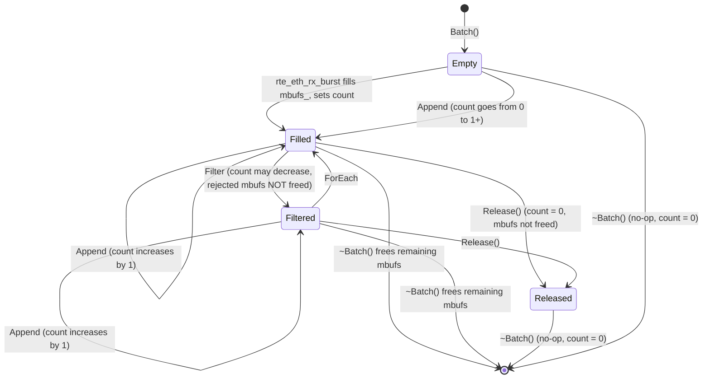

# Design Document: DPDK RX/TX Utility Classes

## Overview

This design document specifies the architecture and implementation of zero-copy, cache-friendly utility classes for DPDK packet processing. The feature introduces two core abstractions:

1. **Packet** — a class that maps directly onto `rte_mbuf` memory via placement new, providing typed access to packet data without heap allocation or pointer indirection.
2. **Batch** — a compile-time-sized container of `rte_mbuf*` pointers (not `Packet*`) that wraps the burst array returned by `rte_eth_rx_burst`, with `ForEach` and `Filter` iteration methods that internally convert mbuf pointers to `Packet` references on the fly.

These utilities sit between the DPDK burst API and the application's packet processing logic inside the PMD thread loop (`PmdThread::Run`). The design preserves full DPDK API compatibility — `Batch` stores raw `rte_mbuf*` and exposes the underlying array for direct use with `rte_eth_rx_burst` / `rte_eth_tx_burst`.

### Key Design Goals

- Zero-copy: `Packet` is constructed in-place over the mbuf, no copies
- Cache-friendly: metadata region is cache-line aligned, layout is predictable
- DPDK-compatible: `Batch` stores `rte_mbuf*` directly, passable to burst APIs
- Compile-time sizing: batch capacity and safety mode are template parameters
- Zero-overhead safety toggle: `SafeMode` template parameter selects bounds-checked or unchecked Append at compile time via `if constexpr`
- Safe lifecycle: non-copyable types, RAII mbuf cleanup in `Batch` destructor

## Architecture

### Component Overview

```
┌──────────────────────────────────────────────────┐
│                  PmdThread::Run()                 │
│              (packet processing loop)             │
└──────────┬───────────────────────────┬───────────┘
           │                           │
           ▼                           ▼
┌──────────────────────────┐  ┌─────────────────────┐
│ Batch<16>          (prod)│  │   rte_eth_tx_burst   │
│ Batch<16, true>   (test) │  │   (raw rte_mbuf**)   │
│   .Data() ───────────────┼─►└─────────────────────┘
│   .CountPtr()            │
│   .ForEach(fn)           │
│   .Filter(fn)            │
│   .Append(pkt/mbuf)      │
│   .Release()             │
└──────────┬───────────────┘
           │  internally calls
           ▼
┌─────────────────────┐
│   Packet::from()    │
│   (placement new)   │
└──────────┬──────────┘
           │  returns Packet&
           ▼
┌─────────────────────┐
│   Packet            │
│   .Data()           │
│   .Length()          │
│   .Mbuf()           │
│   .Free()           │
└─────────────────────┘
```

### Memory Layout

The `Packet` class overlays the mbuf memory region. The layout is:

```
Address of rte_mbuf* received from rte_eth_rx_burst:
┌─────────────────────────────────────────────────────────┐
│  rte_mbuf struct (2 cache lines = 128 bytes)            │  offset 0
├─────────────────────────────────────────────────────────┤
│  Metadata_Region (0 bytes initially, cache-line aligned)│  offset 128
├─────────────────────────────────────────────────────────┤
│  RTE_PKTMBUF_HEADROOM remainder                         │
├─────────────────────────────────────────────────────────┤
│  Packet payload data (pointed to by rte_pktmbuf_mtod)   │
└─────────────────────────────────────────────────────────┘
```

`Packet::from(rte_mbuf*)` performs `new (mbuf) Packet` — placement new at the mbuf address — and returns a `Packet&`. Since `Packet`'s first member is the `rte_mbuf` itself (or rather, `Packet` IS the mbuf memory reinterpreted), this is a zero-cost abstraction.

### Data Flow in PMD Thread

```
rte_eth_rx_burst(port, queue, batch.Data(), BatchSize)
        │
        ▼  fills batch.mbufs_[] and sets count via batch.CountPtr()
batch.ForEach([](Packet& pkt) {
    // read pkt.Data(), pkt.Length()
    // modify packet in-place
});
        │
        ▼
batch.Filter([](Packet& pkt) -> bool {
    // return true to keep, false to exclude (mbuf NOT freed)
});
        │
        ▼
rte_eth_tx_burst(port, queue, batch.Data(), batch.Count())
        │
        ▼  batch destructor frees any unsent mbufs
```

### Module Organization

```
rxtx/
├── BUILD              # Bazel build targets
├── packet.h           # Packet class (header-only)
├── batch.h            # Batch class template (header-only)
├── packet_test.cc     # Packet unit + property tests
└── batch_test.cc      # Batch unit + property tests
```

Both `Packet` and `Batch` are header-only since they are templates / trivially inlined. This avoids link-time dependencies and enables full inlining in the hot path.

## Components and Interfaces

### Packet Class

```cpp
// rxtx/packet.h
#ifndef RXTX_PACKET_H_
#define RXTX_PACKET_H_

#include <cstddef>
#include <cstdint>
#include <new>
#include <rte_mbuf.h>

namespace rxtx {

// Size of the rte_mbuf structure: 2 cache lines
inline constexpr std::size_t kMbufStructSize = 128;

// Cache line size
inline constexpr std::size_t kCacheLineSize = 64;

// Metadata region size (zero initially, reserved for future use)
inline constexpr std::size_t kMetadataSize = 0;

class Packet {
 public:
  // Construct a Packet in-place over an existing rte_mbuf.
  // Returns a reference to the Packet occupying the same memory.
  static Packet& from(rte_mbuf* mbuf) {
    return *new (mbuf) Packet;
  }

  // Pointer to the start of packet payload data
  uint8_t* Data() {
    return rte_pktmbuf_mtod(&mbuf_, uint8_t*);
  }

  const uint8_t* Data() const {
    return rte_pktmbuf_mtod(&mbuf_, const uint8_t*);
  }

  // Packet data length in bytes
  uint16_t Length() const {
    return rte_pktmbuf_data_len(&mbuf_);
  }

  // Access the underlying rte_mbuf
  rte_mbuf* Mbuf() { return &mbuf_; }
  const rte_mbuf* Mbuf() const { return &mbuf_; }

  // Free the underlying mbuf back to its mempool
  void Free() {
    rte_pktmbuf_free(&mbuf_);
  }

  // Non-copyable, non-default-constructible
  Packet() = delete;
  Packet(const Packet&) = delete;
  Packet& operator=(const Packet&) = delete;

  // Static assertions on layout
  static_assert(kMetadataSize + kMbufStructSize <= kMbufStructSize + RTE_PKTMBUF_HEADROOM,
                "Metadata region must fit within mbuf headroom");

 private:
  rte_mbuf mbuf_;  // occupies first 128 bytes
  // Metadata_Region would follow here when kMetadataSize > 0
  // alignas(kCacheLineSize) std::array<uint8_t, kMetadataSize> metadata_;
};

}  // namespace rxtx

#endif  // RXTX_PACKET_H_
```

### Batch Class Template

```cpp
// rxtx/batch.h
#ifndef RXTX_BATCH_H_
#define RXTX_BATCH_H_

#include <cstdint>
#include <rte_mbuf.h>

#include "rxtx/packet.h"

namespace rxtx {

template <uint16_t BatchSize, bool SafeMode = false>
class Batch {
 public:
  Batch() : count_(0) {}

  // Non-copyable
  Batch(const Batch&) = delete;
  Batch& operator=(const Batch&) = delete;

  // Destructor frees all remaining mbufs
  ~Batch() {
    for (uint16_t i = 0; i < count_; ++i) {
      rte_pktmbuf_free(mbufs_[i]);
    }
  }

  // Raw pointer to mbuf array — pass directly to rte_eth_rx_burst / rte_eth_tx_burst
  rte_mbuf** Data() { return mbufs_; }

  // Pointer to count — pass to rte_eth_rx_burst to receive the burst count
  uint16_t* CountPtr() { return &count_; }

  // Current number of packets in the batch
  uint16_t Count() const { return count_; }

  // Set count (used after rte_eth_rx_burst)
  void SetCount(uint16_t count) { count_ = count; }

  // Compile-time capacity
  static constexpr uint16_t Capacity() { return BatchSize; }

  // Apply fn to each packet in order [0, count)
  template <typename Fn>
  void ForEach(Fn&& fn) {
    for (uint16_t i = 0; i < count_; ++i) {
      Packet& pkt = Packet::from(mbufs_[i]);
      fn(pkt);
    }
  }

  // Retain packets where fn returns true. Rejected mbufs are NOT freed —
  // they are simply excluded from the compacted result.
  // Retained packets are compacted to contiguous positions [0, new_count).
  template <typename Fn>
  void Filter(Fn&& fn) {
    uint16_t write = 0;
    for (uint16_t i = 0; i < count_; ++i) {
      Packet& pkt = Packet::from(mbufs_[i]);
      if (fn(pkt)) {
        mbufs_[write++] = mbufs_[i];
      }
    }
    count_ = write;
  }

  // Append a Packet's underlying mbuf to the batch.
  // SafeMode=false: void, no bounds check, maximum performance.
  // SafeMode=true: returns bool, checks capacity first.
  auto Append(Packet& pkt) {
    return Append(pkt.Mbuf());
  }

  // Append a raw rte_mbuf* to the batch.
  // SafeMode=false: void, no bounds check, maximum performance.
  // SafeMode=true: returns bool, checks capacity first.
  auto Append(rte_mbuf* mbuf) {
    if constexpr (SafeMode) {
      if (count_ >= BatchSize) {
        return false;
      }
      mbufs_[count_++] = mbuf;
      return true;
    } else {
      mbufs_[count_++] = mbuf;
    }
  }

  // Release ownership of all mbufs without freeing them. Resets count to 0.
  void Release() {
    count_ = 0;
  }

 private:
  rte_mbuf* mbufs_[BatchSize];
  uint16_t count_;
};

}  // namespace rxtx

#endif  // RXTX_BATCH_H_
```

## Data Models

### Packet Memory Model

The `Packet` class is a reinterpret-cast-style overlay on `rte_mbuf` memory. It does not own additional storage. The key invariant is:

```
&packet == &packet.mbuf_ == original rte_mbuf* from rx_burst
```

| Region | Offset | Size | Description |
|--------|--------|------|-------------|
| `rte_mbuf` struct | 0 | 128 bytes (2 cache lines) | DPDK mbuf header |
| Metadata region | 128 | 0 bytes (initial) | Reserved, cache-line aligned |
| Headroom remainder | 128 | `RTE_PKTMBUF_HEADROOM - kMetadataSize` | Available headroom |
| Packet payload | `128 + RTE_PKTMBUF_HEADROOM` | variable | Actual packet data |

### Batch Storage Model

`Batch<N>` (or `Batch<N, SafeMode>`) stores exactly:
- `rte_mbuf* mbufs_[N]` — fixed-size array of raw pointers
- `uint16_t count_` — number of valid entries in `[0, count_)`

No heap allocation. No smart pointers. The array is directly passable to DPDK burst APIs. The `SafeMode` parameter affects only the Append method's compile-time behavior — it does not change the storage layout.

### Batch State Transitions



### Integration with PmdThread

The PMD thread loop will use these utilities as follows:

```cpp
int PmdThread::Run() {
  Batch<32> rx_batch;
  Batch<32> drop_batch;  // collects rejected packets for separate handling

  while (!stop_flag_ptr_->load(std::memory_order_relaxed)) {
    for (const auto& rxq : config_.rx_queues) {
      rx_batch.SetCount(rte_eth_rx_burst(
          rxq.port_id, rxq.queue_id,
          rx_batch.Data(), rx_batch.Capacity()));

      if (rx_batch.Count() == 0) continue;

      // Process packets
      rx_batch.ForEach([](Packet& pkt) {
        // application logic here
      });

      // Snapshot mbufs before filter to find rejected ones
      std::array<rte_mbuf*, 32> pre_filter;
      uint16_t pre_count = rx_batch.Count();
      std::copy(rx_batch.Data(), rx_batch.Data() + pre_count, pre_filter.begin());

      // Filter unwanted packets (rejected mbufs are NOT freed)
      rx_batch.Filter([](Packet& pkt) -> bool {
        return pkt.Length() > 0;  // example predicate
      });

      // Append rejected mbufs to drop_batch (or another batch for different TX)
      for (uint16_t i = 0; i < pre_count; ++i) {
        bool retained = false;
        for (uint16_t j = 0; j < rx_batch.Count(); ++j) {
          if (rx_batch.Data()[j] == pre_filter[i]) { retained = true; break; }
        }
        if (!retained) {
          drop_batch.Append(pre_filter[i]);
        }
      }

      // Transmit retained packets
      uint16_t sent = rte_eth_tx_burst(
          txq.port_id, txq.queue_id,
          rx_batch.Data(), rx_batch.Count());

      // Free unsent packets
      for (uint16_t i = sent; i < rx_batch.Count(); ++i) {
        rte_pktmbuf_free(rx_batch.Data()[i]);
      }
      rx_batch.Release();  // we handled all mbufs manually
    }

    // Free or forward drop_batch contents as needed
    // drop_batch destructor will free any remaining mbufs
  }
  return 0;
}
```


## Correctness Properties

*A property is a characteristic or behavior that should hold true across all valid executions of a system — essentially, a formal statement about what the system should do. Properties serve as the bridge between human-readable specifications and machine-verifiable correctness guarantees.*

### Property 1: Packet address identity

*For any* valid `rte_mbuf*` pointer `m`, calling `Packet::from(m)` shall return a `Packet&` reference `p` such that `&p == m` and `p.Mbuf() == m`. The Packet occupies the exact same memory as the mbuf with no additional allocation.

**Validates: Requirements 1.1, 1.2, 1.8, 2.3**

### Property 2: Packet accessor equivalence

*For any* valid `rte_mbuf*` pointer `m` with arbitrary data offset and data length, `Packet::from(m).Data()` shall equal `rte_pktmbuf_mtod(m, uint8_t*)` and `Packet::from(m).Length()` shall equal `rte_pktmbuf_data_len(m)`.

**Validates: Requirements 2.1, 2.2**

### Property 3: Packet Free returns mbuf to pool

*For any* `rte_mbuf*` allocated from a mempool, calling `Packet::from(m).Free()` shall return the mbuf to its originating mempool, increasing the pool's available count by one.

**Validates: Requirements 2.4**

### Property 4: Batch storage round-trip

*For any* `Batch<N>` and any count `c` where `0 <= c <= N`, writing `c` distinct `rte_mbuf*` values into `Data()[0..c)` and calling `SetCount(c)` shall result in `Count() == c`, `Capacity() == N`, and `Data()[i]` returning the same pointer for each `i` in `[0, c)`.

**Validates: Requirements 3.2, 3.3, 3.4**

### Property 5: ForEach visits all packets in order

*For any* `Batch<N>` containing `c` mbufs (where `c >= 0`), `ForEach(fn)` shall invoke `fn` exactly `c` times, once per packet, in index order from 0 to `c-1`. The `Packet&` passed to each invocation shall alias the corresponding `mbufs_[i]`.

**Validates: Requirements 4.2, 4.3**

### Property 6: Filter correctness

*For any* `Batch<N>` containing `c` mbufs and *for any* boolean predicate `fn`, after calling `Filter(fn)`:
- `Count()` shall equal the number of mbufs for which `fn` returned true
- `Data()[0..Count())` shall contain exactly those mbufs, in their original relative order, occupying contiguous positions
- No mbufs shall have been freed by the Filter operation (rejected mbufs are simply excluded, not freed)

**Validates: Requirements 5.2, 5.3, 5.4, 5.5, 5.6, 5.7**

### Property 7: Batch destructor frees remaining mbufs

*For any* `Batch<N>` containing `c` mbufs (where `c >= 0`), when the batch is destroyed, all `c` mbufs shall be freed back to their mempool. If `c == 0`, no free operations shall occur.

**Validates: Requirements 6.1, 6.2**

### Property 8: Batch Release prevents freeing

*For any* `Batch<N>` containing `c` mbufs, calling `Release()` shall set `Count()` to 0 without freeing any mbufs. Subsequent destruction of the batch shall not free any mbufs.

**Validates: Requirements 6.3**

### Property 9: Batch Append correctness (unsafe mode)

*For any* `Batch<N>` (default `SafeMode=false`) with current count `c` where `c < N`, calling `Append(mbuf)` shall store the mbuf pointer at index `c`, increment `Count()` to `c + 1`, and return void. Calling `Append(Packet& pkt)` shall be equivalent to calling `Append(pkt.Mbuf())`.

**Validates: Requirements 7.1, 7.2, 7.3, 7.4**

### Property 10: Batch Append correctness (safe mode)

*For any* `Batch<N, true>` with current count `c` where `c < N`, calling `Append(mbuf)` shall store the mbuf pointer at index `c`, increment `Count()` to `c + 1`, and return true. *For any* `Batch<N, true>` with `Count() == N`, calling `Append(mbuf)` shall return false and leave `Count()` unchanged. Calling `Append(Packet& pkt)` shall be equivalent to calling `Append(pkt.Mbuf())`.

**Validates: Requirements 7.1, 7.2, 7.3, 7.5**

## Error Handling

### Packet

- `Packet::from(nullptr)` is undefined behavior. The caller (Batch iteration methods) is responsible for ensuring non-null mbuf pointers. This is consistent with DPDK's own API contracts where `rte_eth_rx_burst` guarantees valid pointers for indices `[0, count)`.
- No exceptions are thrown. All Packet methods are `noexcept`-safe (they call DPDK macros that don't throw).

### Batch

- In the default unsafe mode (`SafeMode=false`), `Batch` does not validate that `count_ <= BatchSize` on Append. The caller is responsible for not overflowing the array. In practice, `rte_eth_rx_burst` is called with `Capacity()` as the max, so this is naturally bounded. For development and testing, `Batch<N, true>` provides bounds-checked Append that returns false when full.
- `Filter` and `ForEach` propagate any exceptions thrown by the user-provided callable. If the callable throws mid-iteration, mbufs that haven't been visited yet remain in the batch and will be freed by the destructor.
- `Release()` is a deliberate ownership transfer. If the caller calls `Release()` without having transmitted or freed the mbufs, those mbufs are leaked. This is by design — it's the caller's responsibility after `Release()`.

### Defensive Measures

- `static_assert` on metadata region fitting within headroom (compile-time)
- `static_assert` on `sizeof(rte_mbuf) == kMbufStructSize` to catch DPDK version mismatches
- Non-copyable types prevent accidental double-free
- Non-default-constructible `Packet` prevents dangling instances

## Testing Strategy

### Testing Framework

Unit tests use the project's existing test pattern (simple `main()` with `TestCase` helper, as seen in `config_parser_test.cc`). Property-based tests use [RapidCheck](https://github.com/emil-e/rapidcheck) — a C++ property-based testing library that integrates well with Bazel and provides generators for arbitrary data.

### Bazel Dependency

```python
# Add to MODULE.bazel
bazel_dep(name = "rapidcheck", version = "...")
```

If RapidCheck is not available via the Bazel Central Registry, a `http_archive` rule can be used in `MODULE.bazel` to fetch it from GitHub.

### Test Structure

Tests are split into two files:

1. **`rxtx/packet_test.cc`** — Packet unit tests and property tests
2. **`rxtx/batch_test.cc`** — Batch unit tests and property tests

### Mock Mbuf Strategy

Since tests run without a real DPDK environment, we need a mock mbuf allocation strategy:

- Allocate `rte_mbuf`-sized memory blocks from a test mempool or via `aligned_alloc`
- Initialize the mbuf fields that `Packet` accessors depend on (`data_off`, `data_len`, `buf_addr`, `buf_len`, `pool`)
- For pool-count verification (Properties 3, 7, 8), use a simple test allocator that tracks allocation/free counts

### Unit Tests

Unit tests cover specific examples and edge cases:

- Packet type traits: `!is_default_constructible`, `!is_copy_constructible`, `!is_copy_assignable`
- Batch type traits: `!is_copy_constructible`, `!is_copy_assignable`
- `Batch<16>::Capacity() == 16`, `Batch<32>::Capacity() == 32`
- `sizeof(rte_mbuf) == 128` (compile-time, but good to have as a runtime sanity check)
- `kMetadataSize == 0`
- ForEach on empty batch invokes callback zero times
- Filter on empty batch invokes callback zero times
- Filter does not free any mbufs (rejected mbufs remain accessible)
- Append to empty batch succeeds and sets Count() to 1 (both modes)
- Append to full batch returns false (SafeMode=true only)
- Append to full batch in unsafe mode is UB — not tested, but documented
- Append(Packet&) stores the same mbuf as Append(pkt.Mbuf()) (both modes)
- Append return type is void in unsafe mode, bool in safe mode (static_assert / compile-time check)
- Destructor on empty batch is a no-op

### Property-Based Tests

Each property test runs a minimum of 100 iterations with randomly generated inputs.

Each test is tagged with a comment referencing the design property:

```cpp
// Feature: dpdk-rxtx-utils, Property 1: Packet address identity
rc::check("Packet::from returns reference at mbuf address", [](/* ... */) {
  // ...
});
```

Property tests:

1. **Feature: dpdk-rxtx-utils, Property 1: Packet address identity** — Generate random mbuf-sized aligned memory, call `Packet::from`, verify address identity and `Mbuf()` round-trip.

2. **Feature: dpdk-rxtx-utils, Property 2: Packet accessor equivalence** — Generate mbufs with random `data_off` and `data_len` values, verify `Data()` and `Length()` match DPDK macros.

3. **Feature: dpdk-rxtx-utils, Property 3: Packet Free returns mbuf to pool** — Allocate mbufs from a test pool, call `Free()`, verify pool available count increases.

4. **Feature: dpdk-rxtx-utils, Property 4: Batch storage round-trip** — Generate random count `c` in `[0, N]`, fill `Data()` with `c` mock mbuf pointers, call `SetCount(c)`, verify `Count()` and each `Data()[i]`.

5. **Feature: dpdk-rxtx-utils, Property 5: ForEach visits all packets in order** — Generate batches of random size, record visited addresses in ForEach callback, verify they match `Data()[0..Count())` in order.

6. **Feature: dpdk-rxtx-utils, Property 6: Filter correctness** — Generate batches of random size and a random boolean predicate (e.g., based on data_len parity), call Filter, verify retained set matches predicate, contiguous layout, correct count, and that no mbufs were freed by the Filter operation.

7. **Feature: dpdk-rxtx-utils, Property 7: Batch destructor frees remaining mbufs** — Generate batches of random size, let them go out of scope, verify all mbufs returned to pool.

8. **Feature: dpdk-rxtx-utils, Property 8: Batch Release prevents freeing** — Generate batches of random size, call Release(), verify Count() == 0, then destroy batch and verify no additional frees occurred.

9. **Feature: dpdk-rxtx-utils, Property 9: Batch Append correctness (unsafe mode)** — Generate batches with random initial count `c < N` (default `SafeMode=false`), append a mock mbuf, verify it appears at index `c` and Count() increments. Verify `Append(Packet&)` is equivalent to `Append(pkt.Mbuf())`. Verify Append returns void (compile-time check).

10. **Feature: dpdk-rxtx-utils, Property 10: Batch Append correctness (safe mode)** — Generate `Batch<N, true>` with random initial count `c < N`, append a mock mbuf, verify it appears at index `c`, Count() increments, and Append returns true. Also test that appending to a full `Batch<N, true>` returns false and leaves Count() unchanged. Verify `Append(Packet&)` is equivalent to `Append(pkt.Mbuf())`.
