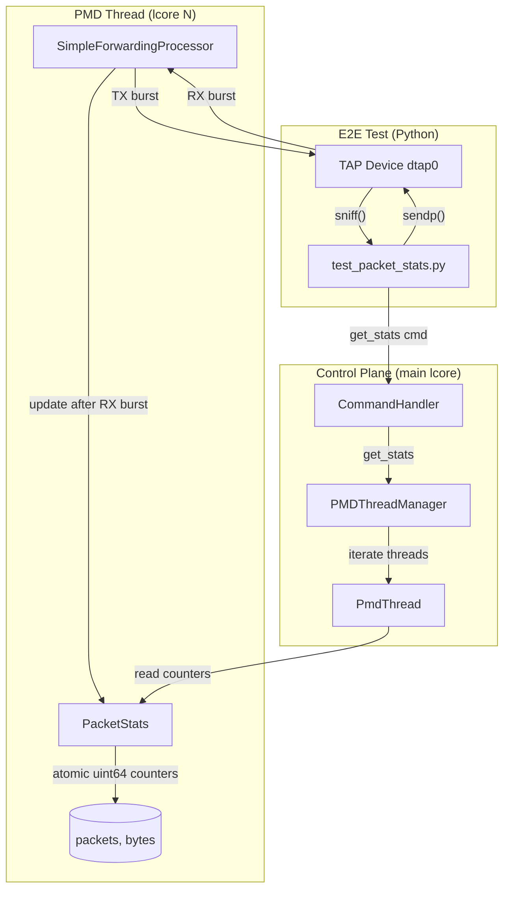

# Design Document: E2E Packet Stats

## Overview

This design adds per-PMD-thread packet and byte statistics tracking to the DPDK packet processing application, exposes those counters via a new `get_stats` control plane command, and provides end-to-end tests that use Scapy for packet crafting and PTF for packet verification.

The stats module lives in `processor/` as a header-only component (`processor/packet_stats.h`) that maintains per-thread counters using `std::atomic<uint64_t>`. The `SimpleForwardingProcessor` updates counters after each RX burst. The `CommandHandler` gains a `get_stats` command that reads all thread counters and returns per-thread and total statistics as JSON.

E2E tests in `tests/e2e/test_packet_stats.py` send crafted Ethernet frames into TAP devices via Scapy, verify the forwarding processor echoes them back, and confirm the stats command reports correct packet/byte counts.

### Key Design Decisions

- **Relaxed atomic load/add/store, not `fetch_add`**: Each `PacketStats` instance is written by a single PMD thread only, so there is no write contention. Instead of `fetch_add` (which compiles to `lock xadd` on x86-64), we use `load(relaxed)` + plain add + `store(relaxed)` to avoid the bus lock overhead. Aligned 64-bit stores are naturally atomic on x86-64, so the control plane reader always sees a consistent (though possibly slightly stale) value — acceptable for monitoring stats.
- **Stats module in `processor/`**: Keeps stats close to the processor code that updates them. No new directory needed.
- **Header-only `PacketStats`**: The class is small and benefits from inlining in the hot loop.
- **Scapy + PTF in tests**: Scapy crafts packets at Layer 2 for injection into TAP devices. PTF provides `verify_packet` utilities for comparing received packets against expected templates.
- **Single `PacketStats` instance per processor**: Each `SimpleForwardingProcessor` owns a `PacketStats` object. The `CommandHandler` accesses stats through the `PMDThreadManager` → `PmdThread` → processor chain.

## Architecture



### Data Flow

1. **Packet path**: Scapy `sendp()` → TAP device → DPDK RX burst → `SimpleForwardingProcessor::process_impl()` → stats update → TX burst → TAP device → Scapy `sniff()`
2. **Stats read path**: Python `control_client.get_stats()` → Unix socket → `CommandHandler::HandleGetStats()` → iterate `PMDThreadManager` threads → read atomic counters → JSON response

## Components and Interfaces

### 1. PacketStats (`processor/packet_stats.h`)

Header-only class that holds per-thread atomic counters.

```cpp
namespace processor {

class PacketStats {
 public:
  PacketStats() : packets_(0), bytes_(0) {}

  // Hot path: called by processor after each RX burst.
  // Single-writer per instance (one PMD thread), so we use
  // load + add + store instead of fetch_add to avoid the
  // lock prefix (lock xadd) overhead on x86-64.
  void RecordBatch(uint16_t packet_count, uint64_t byte_count) {
    packets_.store(packets_.load(std::memory_order_relaxed) + packet_count,
                   std::memory_order_relaxed);
    bytes_.store(bytes_.load(std::memory_order_relaxed) + byte_count,
                 std::memory_order_relaxed);
  }

  // Cold path: called by control plane to read counters
  uint64_t GetPackets() const {
    return packets_.load(std::memory_order_relaxed);
  }

  uint64_t GetBytes() const {
    return bytes_.load(std::memory_order_relaxed);
  }

 private:
  std::atomic<uint64_t> packets_;
  std::atomic<uint64_t> bytes_;
};

}  // namespace processor
```

### 2. SimpleForwardingProcessor Changes (`processor/simple_forwarding_processor.h/.cc`)

Add a `PacketStats` member and update it in `process_impl()` after each successful RX burst.

```cpp
// In process_impl(), after rte_eth_rx_burst:
if (batch.Count() > 0) {
  uint64_t total_bytes = 0;
  for (uint16_t i = 0; i < batch.Count(); ++i) {
    total_bytes += rte_pktmbuf_pkt_len(batch.Data()[i]);
  }
  stats_.RecordBatch(batch.Count(), total_bytes);
}
```

The processor exposes a `const PacketStats& GetStats() const` accessor.

### 3. Stats Access Chain

To let the `CommandHandler` read stats, we need a path from `PMDThreadManager` down to each processor's `PacketStats`:

- `PmdThread` stores a `PacketStats*` pointer set by the launcher before entering the hot loop.
- `PmdThread` exposes `const PacketStats* GetStats() const`.
- `PMDThreadManager` iterates threads and collects stats via `PmdThread::GetStats()`.

The launcher in `MakeProcessorEntry()` is modified to:
1. Create the processor.
2. Set the processor's stats pointer on the `PmdThread` (passed via a new field in the launcher signature or via a shared stats pointer).

Since the launcher currently receives `(config, stop_flag, qsbr_var)`, adding `PacketStats*` as a 4th positional arg would make the signature unwieldy and fragile for future extensions.

**Chosen approach**: Introduce a `ProcessorContext` struct that bundles extensible per-thread context. The `PmdThread` owns a `PacketStats` instance and populates a `ProcessorContext` before calling the launcher. `stop_flag` and `qsbr_var` remain separate args since they have different ownership/lifecycle semantics (owned by `PMDThreadManager` and `RcuManager` respectively).

New struct in `processor/processor_context.h`:
```cpp
namespace processor {

// Extensible context passed to processor launchers.
// New per-thread resources go here instead of adding more
// positional args to LauncherFn.
struct ProcessorContext {
  PacketStats* stats = nullptr;
};

}  // namespace processor
```

Updated launcher signature:
```cpp
using LauncherFn = std::function<int(
    const dpdk_config::PmdThreadConfig& config,
    std::atomic<bool>* stop_flag,
    struct rte_rcu_qsbr* qsbr_var,
    const processor::ProcessorContext& ctx)>;
```

The `MakeProcessorEntry()` template lambda receives `ctx` and passes `ctx.stats` to the processor constructor. Future per-thread resources (e.g., flow tables, timers) can be added to `ProcessorContext` without changing the `LauncherFn` signature again.

### 4. CommandHandler: `get_stats` Command

New handler method `HandleGetStats()` added to `CommandHandler`:

```cpp
CommandHandler::CommandResponse CommandHandler::HandleGetStats(
    const nlohmann::json& params) {
  CommandResponse response;
  response.status = "success";

  json threads_array = json::array();
  uint64_t total_packets = 0;
  uint64_t total_bytes = 0;

  if (thread_manager_) {
    for (uint32_t lcore_id : thread_manager_->GetLcoreIds()) {
      PmdThread* thread = thread_manager_->GetThread(lcore_id);
      if (thread && thread->GetStats()) {
        uint64_t pkts = thread->GetStats()->GetPackets();
        uint64_t byts = thread->GetStats()->GetBytes();
        threads_array.push_back({
          {"lcore_id", lcore_id},
          {"packets", pkts},
          {"bytes", byts}
        });
        total_packets += pkts;
        total_bytes += byts;
      }
    }
  }

  response.result = {
    {"threads", threads_array},
    {"total", {{"packets", total_packets}, {"bytes", total_bytes}}}
  };
  return response;
}
```

Dispatch added in `ExecuteCommand()`:
```cpp
} else if (request.command == "get_stats") {
  return HandleGetStats(request.params);
}
```

### 5. ControlClient: `get_stats()` Method (`tests/fixtures/control_client.py`)

```python
def get_stats(self) -> Dict[str, Any]:
    """Send get_stats command and return parsed response."""
    return self.send_command("get_stats")
```

### 6. E2E Test File (`tests/e2e/test_packet_stats.py`)

Test class `TestPacketStats` with methods:
- `test_packet_forwarding`: Send packets via Scapy, verify receipt via sniff/PTF.
- `test_stats_counters`: Send known packets, query `get_stats`, verify counts.
- `test_stats_baseline_zero`: Query stats before traffic, verify zero counters.
- `test_multi_thread_stats`: With 2 PMD threads, verify per-thread and total stats.

## Data Models

### PacketStats Counters (C++)

| Field     | Type                    | Description                        |
|-----------|-------------------------|------------------------------------|
| packets_  | `std::atomic<uint64_t>` | Total packets processed by thread  |
| bytes_    | `std::atomic<uint64_t>` | Total bytes processed by thread    |

### get_stats JSON Response

```json
{
  "status": "success",
  "result": {
    "threads": [
      {"lcore_id": 1, "packets": 100, "bytes": 6400},
      {"lcore_id": 2, "packets": 50, "bytes": 3200}
    ],
    "total": {"packets": 150, "bytes": 9600}
  }
}
```

### get_stats Response (no threads running)

```json
{
  "status": "success",
  "result": {
    "threads": [],
    "total": {"packets": 0, "bytes": 0}
  }
}
```

### Test Packet Structure (Scapy)

```python
pkt = Ether(dst="ff:ff:ff:ff:ff:ff") / IP(dst="10.0.0.1") / Raw(load="X" * 50)
```

The packet size is deterministic: 14 (Ethernet) + 20 (IP) + 50 (payload) = 84 bytes. This allows exact byte count verification in stats tests.


## Correctness Properties

*A property is a characteristic or behavior that should hold true across all valid executions of a system — essentially, a formal statement about what the system should do. Properties serve as the bridge between human-readable specifications and machine-verifiable correctness guarantees.*

### Property 1: RecordBatch counter accuracy

*For any* sequence of `RecordBatch(packet_count, byte_count)` calls on a `PacketStats` instance, `GetPackets()` shall equal the sum of all `packet_count` arguments and `GetBytes()` shall equal the sum of all `byte_count` arguments.

**Validates: Requirements 1.2, 1.3**

### Property 2: Per-thread counter isolation

*For any* two distinct `PacketStats` instances (representing two PMD threads), calling `RecordBatch` on one instance shall not change the counters of the other instance.

**Validates: Requirements 1.1**

### Property 3: Stats response contains required fields

*For any* set of PMD threads with known packet and byte counters, the `get_stats` JSON response shall contain a `threads` array where each entry has `lcore_id`, `packets`, and `bytes` fields matching the actual counters, and a `total` object with `packets` and `bytes` fields.

**Validates: Requirements 3.1, 3.2, 3.5**

### Property 4: Total stats equal sum of per-thread stats

*For any* `get_stats` response containing N thread entries, `total.packets` shall equal the sum of all `threads[i].packets` and `total.bytes` shall equal the sum of all `threads[i].bytes`.

**Validates: Requirements 3.3, 7.5**

### Property 5: Packet forwarding round-trip

*For any* valid Ethernet frame sent into a TAP device, the `SimpleForwardingProcessor` shall forward it back out the same TAP device with protocol fields and payload intact.

**Validates: Requirements 6.1, 6.4**

### Property 6: Stats accuracy after known traffic

*For any* set of N packets with known sizes sent through a TAP device, the `get_stats` command shall report a total packet count equal to N and a total byte count equal to the sum of all packet sizes.

**Validates: Requirements 7.1, 7.2**

## Error Handling

### Stats Module Errors

- **No error states**: `PacketStats` uses atomic operations that cannot fail. `RecordBatch` is a void function with no failure mode.
- **Overflow**: 64-bit unsigned counters can hold up to 2^64 - 1 packets. At 100 Gbps line rate with 64-byte packets, overflow would take ~75 years. No overflow handling is needed.

### Command Handler Errors

- **Unknown command**: Existing error handling returns `{"status": "error", "error": "Unknown command: ..."}`. The `get_stats` command is added to the dispatch chain; unknown commands continue to produce errors (Requirement 3.6).
- **No threads running**: `HandleGetStats()` returns an empty `threads` array and zero totals when `thread_manager_` is null or has no threads (Requirement 3.4).
- **Thread manager null**: Guarded by `if (thread_manager_)` check, same pattern as existing `HandleStatus()`.

### E2E Test Error Handling

- **Packet not received**: Scapy `sniff()` with a timeout. If no matching packet arrives, the test fails with a descriptive assertion message (Requirement 6.5).
- **Stats mismatch**: Tests assert exact counter values after sending known traffic. Mismatches produce clear assertion messages showing expected vs actual counts.
- **TAP interface not up**: Tests call `ip link set <iface> up` before sending packets. Failure to bring the interface up causes a test skip or failure (Requirement 6.6).

## Testing Strategy

### Dual Testing Approach

Both unit tests and property-based tests are used for comprehensive coverage:

- **Unit tests**: Verify specific examples, edge cases (zero threads, empty batches), and error conditions (unknown commands).
- **Property-based tests**: Verify universal properties across randomly generated inputs (batch sizes, byte counts, packet sequences).

### Property-Based Testing Configuration

- **Library**: [Hypothesis](https://hypothesis.readthedocs.io/) for Python e2e tests, [RapidCheck](https://github.com/emil-e/rapidcheck) for C++ unit tests (already in the project via `MODULE.bazel`).
- **Minimum iterations**: 100 per property test.
- **Tag format**: Each property test includes a comment referencing the design property:
  ```
  # Feature: e2e-packet-stats, Property 1: RecordBatch counter accuracy
  ```

### Unit Tests (C++)

Located in `processor/packet_stats_test.cc`:

- `PacketStats` starts at zero.
- `RecordBatch` with zero packets/bytes is a no-op.
- Single `RecordBatch` call updates counters correctly.
- Multiple `RecordBatch` calls accumulate correctly (Property 1 via RapidCheck).
- Two `PacketStats` instances are independent (Property 2 via RapidCheck).

### Unit Tests (C++ - CommandHandler)

Located in `control/command_handler_test.cc` (extend existing):

- `get_stats` with no threads returns empty array and zero totals (edge case for Requirement 3.4).
- `get_stats` response has correct JSON structure (Property 3 via RapidCheck).
- `get_stats` totals equal sum of per-thread values (Property 4 via RapidCheck).

### E2E Tests (Python)

Located in `tests/e2e/test_packet_stats.py`:

| Test Method | Description | Properties Validated |
|---|---|---|
| `test_stats_baseline_zero` | Query stats before traffic, verify zero counters | Edge case (Req 7.3) |
| `test_packet_forwarding` | Send packets via Scapy, verify receipt | Property 5 |
| `test_stats_after_traffic` | Send N packets, verify stats counters match | Property 6 |
| `test_multi_thread_stats_sum` | With 2 threads, verify per-thread sum equals total | Property 4 (e2e) |

### Test Dependencies and Python venv

Tests run inside a Python virtual environment at `tests/.venv` to isolate dependencies from the system Python. The venv is created from system Python and deps are installed via pip.

Add to `tests/requirements.txt`:
```
scapy>=2.5.0
ptf>=0.9.3
hypothesis>=6.0.0
```

A helper script `tests/scripts/setup_venv.sh` bootstraps the environment:
```bash
#!/usr/bin/env bash
set -euo pipefail
SCRIPT_DIR="$(cd "$(dirname "$0")" && pwd)"
TESTS_DIR="$(dirname "$SCRIPT_DIR")"
VENV_DIR="$TESTS_DIR/.venv"

python3 -m venv "$VENV_DIR"
"$VENV_DIR/bin/pip" install --upgrade pip
"$VENV_DIR/bin/pip" install -r "$TESTS_DIR/requirements.txt"
echo "venv ready at $VENV_DIR"
```

Running tests with root (needed for Scapy raw sockets and TAP devices):
```bash
sudo tests/.venv/bin/pytest tests/e2e/
```

`tests/.venv/` is added to `.gitignore`.

### E2E Test Fixtures

The new tests reuse existing fixtures from `tests/conftest.py`:
- `dpdk_process`: Launches the DPDK binary with test config.
- `control_client`: Connects to the Unix socket control plane.
- `tap_interfaces`: Waits for TAP devices to appear and verifies them.
- `test_config`: Generates `dpdk.json` with net_tap virtual PMD.

The `control_client` fixture gains the `get_stats()` convenience method.
