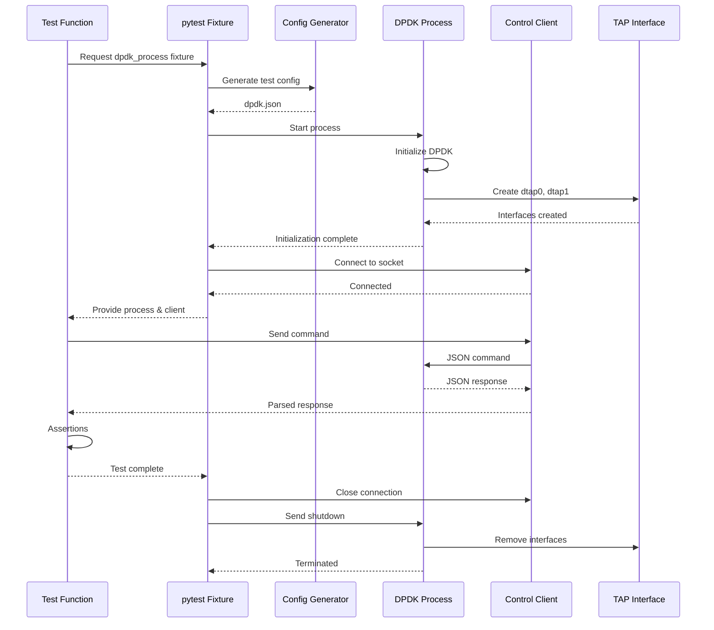
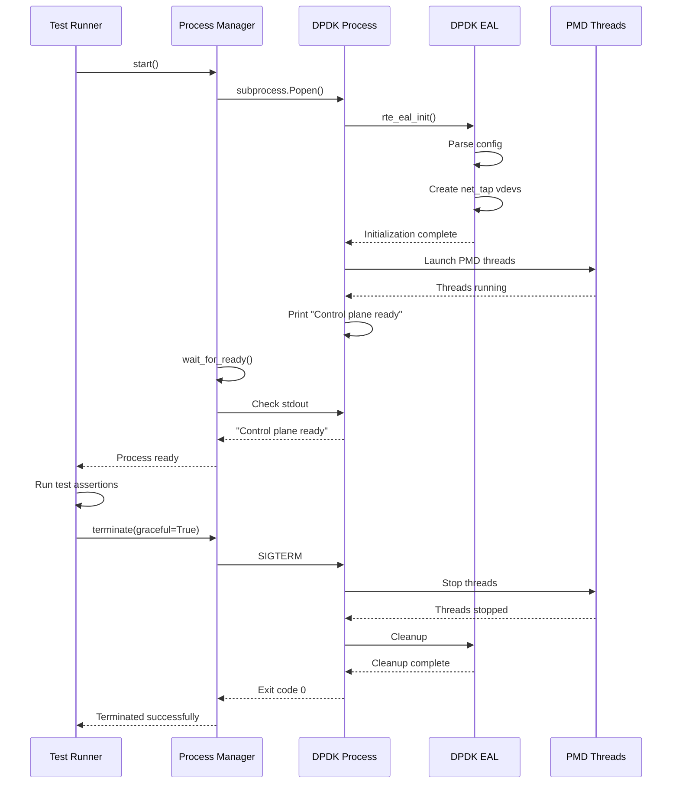
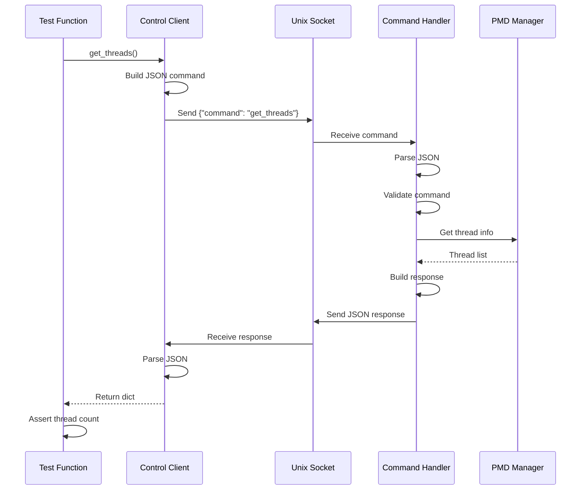

# Design Document: End-to-End Test Framework

## Overview

This design document specifies the architecture and implementation of a comprehensive end-to-end (e2e) test framework for the DPDK control plane system. The framework enables automated testing of the complete system lifecycle—from process launch through control plane operations to graceful shutdown—without requiring physical DPDK-compatible NICs.

The framework uses pytest as the test runner and leverages DPDK's net_tap virtual PMD driver to create actual Linux TAP interfaces with multi-queue support. This approach enables real packet I/O testing in VM environments, CI/CD pipelines, and development workstations without hugepages or physical hardware.

### Key Design Goals

- Enable automated e2e testing in CI/CD environments
- Support testing without physical NICs using net_tap virtual PMD
- Provide comprehensive test coverage for control plane functionality
- Integrate seamlessly with existing Bazel unit tests
- Generate machine-readable test reports for CI integration
- Support parallel test execution where possible
- Provide clear diagnostics for test failures

### Virtual PMD Driver Selection

The framework uses **net_tap** as the virtual PMD driver for the following reasons:

- **Real packet I/O**: Creates actual Linux TAP interfaces (dtap0, dtap1, etc.) that support real packet transmission and reception
- **Multi-queue support**: Supports multiple RX/TX queues per port, enabling realistic PMD thread testing
- **Standard Linux tools**: TAP interfaces can be tested with standard tools (ping, tcpdump, ip commands)
- **No manual setup**: Interfaces are automatically created when DPDK initializes with net_tap vdevs
- **VM compatibility**: Works in virtualized environments without special hardware or kernel modules
- **No hugepages required**: Can operate with --no-huge flag for resource-constrained environments

## Architecture

### Component Overview

```
┌─────────────────────────────────────────────────────────────┐
│                      pytest Test Runner                      │
│                    (tests/e2e/test_*.py)                     │
└───────────────┬─────────────────────────────────────────────┘
                │
                ├──────────────────┬──────────────────┬─────────────────┐
                ▼                  ▼                  ▼                 ▼
        ┌───────────────┐  ┌──────────────┐  ┌─────────────┐  ┌──────────────┐
        │ Test Config   │  │ DPDK Process │  │   Control   │  │  TAP Interface│
        │  Generator    │  │   Manager    │  │   Client    │  │   Manager     │
        └───────┬───────┘  └──────┬───────┘  └──────┬──────┘  └──────┬───────┘
                │                  │                  │                 │
                ▼                  ▼                  ▼                 │
        ┌───────────────┐  ┌──────────────┐  ┌─────────────┐         │
        │  dpdk.json    │  │ Main Binary  │  │ Unix Socket │         │
        │ (net_tap cfg) │  │ (--no-huge)  │  │  Commands   │         │
        └───────────────┘  └──────┬───────┘  └─────────────┘         │
                                   │                                   │
                                   ▼                                   ▼
                           ┌──────────────┐                   ┌──────────────┐
                           │ DPDK Runtime │                   │ dtap0, dtap1 │
                           │  (net_tap)   │──────────────────▶│ TAP Devices  │
                           └──────────────┘                   └──────────────┘
```

### Test Execution Flow

```
1. Test Setup Phase
   ├─ Generate test configuration (dpdk.json with net_tap)
   ├─ Launch DPDK process with --no-huge flag
   ├─ Wait for initialization (TAP interfaces created)
   └─ Verify TAP interfaces exist (dtap0, dtap1)

2. Test Execution Phase
   ├─ Connect control client to Unix socket
   ├─ Send test commands (status, get_threads, etc.)
   ├─ Verify responses match expected format
   └─ Perform packet I/O tests (optional)

3. Test Teardown Phase
   ├─ Send shutdown command via control client
   ├─ Wait for graceful termination (timeout: 10s)
   ├─ Force kill if necessary
   ├─ Verify TAP interfaces cleaned up
   └─ Collect logs and artifacts on failure
```

### Directory Structure

```
project_root/
├── tests/
│   ├── README.md                    # Test framework documentation
│   ├── conftest.py                  # pytest fixtures and configuration
│   ├── e2e/
│   │   ├── __init__.py
│   │   ├── test_process_lifecycle.py    # Process launch/shutdown tests
│   │   ├── test_control_plane.py        # Control command tests
│   │   ├── test_pmd_threads.py          # PMD thread configuration tests
│   │   └── test_multi_config.py         # Multi-queue/thread scenarios
│   ├── fixtures/
│   │   ├── __init__.py
│   │   ├── config_generator.py      # Test configuration generation
│   │   ├── dpdk_process.py          # DPDK process management
│   │   ├── control_client.py        # Unix socket control client
│   │   └── tap_interface.py         # TAP interface verification
│   ├── scripts/
│   │   ├── manual_test_commands.sh  # Moved from root
│   │   ├── test_control_plane.sh    # Moved from root
│   │   └── run_all_tests.sh         # Run unit + e2e tests
│   └── docs/
│       ├── VERIFICATION_SUMMARY.md  # Moved from root
│       └── TESTING_GUIDE.md         # Moved from root
├── config/                          # Existing C++ code
├── control/                         # Existing C++ code
├── main.cc                          # Main binary
└── BUILD                            # Bazel build file
```

## Components and Interfaces

### Test Configuration Generator

**Location**: `tests/fixtures/config_generator.py`

**Purpose**: Generate dpdk.json configuration files for test scenarios with net_tap virtual PMD.

**Interface**:

```python
from dataclasses import dataclass
from typing import List, Dict, Any
import json

@dataclass
class QueueAssignment:
    """Represents a (port, queue) assignment."""
    port_id: int
    queue_id: int

@dataclass
class PmdThreadConfig:
    """Configuration for a single PMD thread."""
    lcore_id: int
    rx_queues: List[QueueAssignment]
    tx_queues: List[QueueAssignment]

@dataclass
class PortConfig:
    """Configuration for a DPDK port."""
    port_id: int
    num_rx_queues: int
    num_tx_queues: int
    num_descriptors: int
    mbuf_pool_size: int
    mbuf_size: int

class TestConfigGenerator:
    """Generates DPDK configuration files for testing."""
    
    @staticmethod
    def generate_config(
        num_ports: int = 2,
        num_threads: int = 2,
        num_queues: int = 2,
        use_hugepages: bool = False
    ) -> Dict[str, Any]:
        """
        Generate a test configuration with net_tap virtual PMD.
        
        Args:
            num_ports: Number of virtual ports (1-4)
            num_threads: Number of PMD threads (1-8)
            num_queues: Number of queues per port (1-8)
            use_hugepages: Whether to use hugepages (default: False)
        
        Returns:
            Dictionary representing dpdk.json configuration
        """
        pass
    
    @staticmethod
    def write_config(config: Dict[str, Any], path: str) -> None:
        """Write configuration to JSON file."""
        with open(path, 'w') as f:
            json.dump(config, f, indent=2)
    
    @staticmethod
    def generate_core_mask(num_threads: int) -> str:
        """
        Generate core mask for given number of threads.
        Reserves lcore 0 for main thread.
        
        Args:
            num_threads: Number of PMD worker threads
        
        Returns:
            Hexadecimal core mask string (e.g., "0x1f" for 5 cores)
        """
        # Main lcore (0) + worker lcores (1..num_threads)
        total_cores = num_threads + 1
        mask = (1 << total_cores) - 1
        return f"0x{mask:x}"
    
    @staticmethod
    def distribute_queues(
        num_ports: int,
        num_queues: int,
        num_threads: int
    ) -> List[PmdThreadConfig]:
        """
        Distribute queues evenly across PMD threads.
        
        Args:
            num_ports: Number of ports
            num_queues: Number of queues per port
            num_threads: Number of PMD threads
        
        Returns:
            List of PMD thread configurations
        """
        pass
```

**Implementation Details**:

The generator creates configurations with the following structure:

```json
{
  "core_mask": "0x7",
  "memory_channels": 4,
  "additional_params": [
    ["--no-huge", ""],
    ["--no-pci", ""],
    ["--vdev", "net_tap0,iface=dtap0"],
    ["--vdev", "net_tap1,iface=dtap1"]
  ],
  "ports": [
    {
      "port_id": 0,
      "num_rx_queues": 2,
      "num_tx_queues": 2,
      "num_descriptors": 512,
      "mbuf_pool_size": 4096,
      "mbuf_size": 2048
    }
  ],
  "pmd_threads": [
    {
      "lcore_id": 1,
      "rx_queues": [{"port_id": 0, "queue_id": 0}],
      "tx_queues": [{"port_id": 0, "queue_id": 0}]
    },
    {
      "lcore_id": 2,
      "rx_queues": [{"port_id": 0, "queue_id": 1}],
      "tx_queues": [{"port_id": 0, "queue_id": 1}]
    }
  ]
}
```

**Key Configuration Parameters**:

- `core_mask: "0x7"`: Use 3 cores (lcore 0 for main, lcores 1-2 for PMD threads) - limited for VM resource constraints
- `--no-huge`: Disable hugepages for VM/CI compatibility
- `--no-pci`: Disable PCI device probing (using virtual devices only)
- `--vdev=net_tap0,iface=dtap0`: Create net_tap virtual device with TAP interface dtap0
- Port configurations use small descriptor counts (512) and pool sizes (4096) for testing
- Default configuration uses 2 PMD threads with 2 queues for multi-queue testing in resource-constrained VMs

### DPDK Process Manager

**Location**: `tests/fixtures/dpdk_process.py`

**Purpose**: Manage the lifecycle of the DPDK application process under test.

**Interface**:

```python
import subprocess
import time
from pathlib import Path
from typing import Optional, List
import signal

class DpdkProcess:
    """Manages DPDK application process lifecycle."""
    
    def __init__(
        self,
        binary_path: str,
        config_path: str,
        startup_timeout: int = 30,
        shutdown_timeout: int = 10
    ):
        """
        Initialize DPDK process manager.
        
        Args:
            binary_path: Path to main DPDK binary
            config_path: Path to dpdk.json configuration
            startup_timeout: Maximum seconds to wait for startup
            shutdown_timeout: Maximum seconds to wait for shutdown
        """
        self.binary_path = binary_path
        self.config_path = config_path
        self.startup_timeout = startup_timeout
        self.shutdown_timeout = shutdown_timeout
        self.process: Optional[subprocess.Popen] = None
        self.stdout_lines: List[str] = []
        self.stderr_lines: List[str] = []
    
    def start(self) -> bool:
        """
        Launch the DPDK process.
        
        Returns:
            True if process started successfully, False otherwise
        """
        pass
    
    def wait_for_ready(self) -> bool:
        """
        Wait for DPDK process to complete initialization.
        Looks for "Control plane ready" message in output.
        
        Returns:
            True if process is ready, False if timeout
        """
        pass
    
    def is_running(self) -> bool:
        """Check if process is currently running."""
        return self.process is not None and self.process.poll() is None
    
    def terminate(self, graceful: bool = True) -> bool:
        """
        Terminate the DPDK process.
        
        Args:
            graceful: If True, send SIGTERM; if False, send SIGKILL
        
        Returns:
            True if process terminated successfully
        """
        pass
    
    def get_stdout(self) -> str:
        """Get captured stdout output."""
        return '\n'.join(self.stdout_lines)
    
    def get_stderr(self) -> str:
        """Get captured stderr output."""
        return '\n'.join(self.stderr_lines)
    
    def get_exit_code(self) -> Optional[int]:
        """Get process exit code (None if still running)."""
        if self.process is None:
            return None
        return self.process.poll()
```

**Implementation Details**:

- Uses `subprocess.Popen` with `stdout=PIPE`, `stderr=PIPE` for output capture
- Monitors stdout for initialization markers (e.g., "Control plane ready")
- Implements timeout-based waiting with polling
- Captures all output for diagnostic purposes
- Supports both graceful (SIGTERM) and forced (SIGKILL) termination

### Control Client

**Location**: `tests/fixtures/control_client.py`

**Purpose**: Connect to Unix socket and send control plane commands.

**Interface**:

```python
import socket
import json
from typing import Dict, Any, Optional
from pathlib import Path

class ControlClient:
    """Client for DPDK control plane Unix socket."""
    
    def __init__(self, socket_path: str = "/tmp/dpdk_control.sock"):
        """
        Initialize control client.
        
        Args:
            socket_path: Path to Unix domain socket
        """
        self.socket_path = socket_path
        self.sock: Optional[socket.socket] = None
    
    def connect(self, timeout: float = 5.0) -> bool:
        """
        Connect to the control plane socket.
        
        Args:
            timeout: Connection timeout in seconds
        
        Returns:
            True if connected successfully
        """
        pass
    
    def send_command(self, command: str, **kwargs) -> Dict[str, Any]:
        """
        Send a command to the control plane.
        
        Args:
            command: Command name (e.g., "status", "get_threads")
            **kwargs: Additional command parameters
        
        Returns:
            Parsed JSON response
        
        Raises:
            ConnectionError: If not connected
            ValueError: If response is invalid JSON
        """
        pass
    
    def status(self) -> Dict[str, Any]:
        """Send status command."""
        return self.send_command("status")
    
    def get_threads(self) -> Dict[str, Any]:
        """Send get_threads command."""
        return self.send_command("get_threads")
    
    def shutdown(self) -> Dict[str, Any]:
        """Send shutdown command."""
        return self.send_command("shutdown")
    
    def close(self) -> None:
        """Close the socket connection."""
        if self.sock:
            self.sock.close()
            self.sock = None
    
    def __enter__(self):
        """Context manager entry."""
        return self
    
    def __exit__(self, exc_type, exc_val, exc_tb):
        """Context manager exit."""
        self.close()
```

**Implementation Details**:

- Uses Python `socket` module with `AF_UNIX` socket family
- Sends JSON-encoded commands with newline delimiter
- Receives and parses JSON responses
- Implements timeout handling for socket operations
- Provides context manager interface for automatic cleanup

### TAP Interface Manager

**Location**: `tests/fixtures/tap_interface.py`

**Purpose**: Verify and manage TAP network interfaces created by net_tap.

**Interface**:

```python
import subprocess
import time
from typing import List, Optional

class TapInterfaceManager:
    """Manages TAP network interfaces for testing."""
    
    @staticmethod
    def interface_exists(interface_name: str) -> bool:
        """
        Check if a TAP interface exists.
        
        Args:
            interface_name: Interface name (e.g., "dtap0")
        
        Returns:
            True if interface exists
        """
        pass
    
    @staticmethod
    def wait_for_interface(
        interface_name: str,
        timeout: float = 10.0
    ) -> bool:
        """
        Wait for a TAP interface to be created.
        
        Args:
            interface_name: Interface name to wait for
            timeout: Maximum seconds to wait
        
        Returns:
            True if interface appeared within timeout
        """
        pass
    
    @staticmethod
    def get_interface_info(interface_name: str) -> Optional[Dict[str, Any]]:
        """
        Get information about a TAP interface.
        
        Args:
            interface_name: Interface name
        
        Returns:
            Dictionary with interface info (state, mtu, etc.) or None
        """
        pass
    
    @staticmethod
    def set_interface_up(interface_name: str) -> bool:
        """
        Bring a TAP interface up.
        
        Args:
            interface_name: Interface name
        
        Returns:
            True if successful
        """
        pass
    
    @staticmethod
    def verify_interfaces(interface_names: List[str]) -> bool:
        """
        Verify that all specified interfaces exist.
        
        Args:
            interface_names: List of interface names to verify
        
        Returns:
            True if all interfaces exist
        """
        pass
```

**Implementation Details**:

- Uses `ip link show` command to check interface existence
- Parses output to extract interface state, MTU, and other properties
- Implements polling-based waiting for interface creation
- Uses `ip link set up` to bring interfaces online
- Requires appropriate permissions (may need sudo in some environments)

## Data Models

### Test Configuration Schema

Test configurations follow the existing dpdk.json schema with net_tap-specific additions:

```json
{
  "core_mask": "string (hex)",
  "memory_channels": "integer",
  "additional_params": [
    ["--no-huge", ""],
    ["--no-pci", ""],
    ["--vdev", "net_tap0,iface=dtap0"],
    ["--vdev", "net_tap1,iface=dtap1"]
  ],
  "ports": [
    {
      "port_id": "integer",
      "num_rx_queues": "integer",
      "num_tx_queues": "integer",
      "num_descriptors": "integer (power of 2)",
      "mbuf_pool_size": "integer",
      "mbuf_size": "integer"
    }
  ],
  "pmd_threads": [
    {
      "lcore_id": "integer",
      "rx_queues": [{"port_id": "integer", "queue_id": "integer"}],
      "tx_queues": [{"port_id": "integer", "queue_id": "integer"}]
    }
  ]
}
```

### Control Command Protocol

Commands and responses follow JSON format:

**Status Command**:
```json
Request:  {"command": "status"}
Response: {"status": "ok", "result": {"state": "running", "uptime": 123}}
```

**Get Threads Command**:
```json
Request:  {"command": "get_threads"}
Response: {
  "status": "ok",
  "result": {
    "threads": [
      {"lcore_id": 1, "rx_queues": [...], "tx_queues": [...]},
      {"lcore_id": 2, "rx_queues": [...], "tx_queues": [...]}
    ]
  }
}
```

**Shutdown Command**:
```json
Request:  {"command": "shutdown"}
Response: {"status": "ok", "result": {"message": "Shutting down"}}
```

### Test Result Schema

pytest generates JUnit XML output for CI integration:

```xml
<testsuites>
  <testsuite name="test_process_lifecycle" tests="5" failures="0" errors="0">
    <testcase classname="test_process_lifecycle" name="test_launch_with_net_tap" time="2.5"/>
    <testcase classname="test_process_lifecycle" name="test_graceful_shutdown" time="1.2"/>
  </testsuite>
</testsuites>
```


## pytest Fixtures

### Fixture Architecture

pytest fixtures provide reusable test components with automatic setup and teardown:

```python
# tests/conftest.py

import pytest
from pathlib import Path
from fixtures.config_generator import TestConfigGenerator
from fixtures.dpdk_process import DpdkProcess
from fixtures.control_client import ControlClient
from fixtures.tap_interface import TapInterfaceManager

@pytest.fixture(scope="session")
def binary_path():
    """Path to the DPDK main binary."""
    # Locate Bazel-built binary
    return Path("bazel-bin/main")

@pytest.fixture(scope="session")
def test_output_dir(tmp_path_factory):
    """Directory for test outputs and artifacts."""
    return tmp_path_factory.mktemp("dpdk_tests")

@pytest.fixture
def test_config(test_output_dir, request):
    """
    Generate test configuration based on test parameters.
    
    Usage:
        @pytest.mark.parametrize("num_threads,num_queues", [(1,1), (2,2)])
        def test_something(test_config):
            # test_config is automatically generated
    """
    # Extract parameters from test markers
    params = getattr(request, 'param', {})
    num_threads = params.get('num_threads', 2)
    num_queues = params.get('num_queues', 2)
    num_ports = params.get('num_ports', 2)
    
    # Generate configuration
    config = TestConfigGenerator.generate_config(
        num_ports=num_ports,
        num_threads=num_threads,
        num_queues=num_queues
    )
    
    # Write to file
    config_path = test_output_dir / f"dpdk_test_{request.node.name}.json"
    TestConfigGenerator.write_config(config, str(config_path))
    
    return config_path

@pytest.fixture
def dpdk_process(binary_path, test_config, test_output_dir):
    """
    DPDK process fixture with automatic lifecycle management.
    
    Provides:
        - Automatic process launch
        - Startup verification
        - Output capture
        - Automatic cleanup on test completion
    """
    process = DpdkProcess(
        binary_path=str(binary_path),
        config_path=str(test_config)
    )
    
    # Start process
    if not process.start():
        pytest.fail("Failed to start DPDK process")
    
    # Wait for initialization
    if not process.wait_for_ready():
        stdout = process.get_stdout()
        stderr = process.get_stderr()
        pytest.fail(f"DPDK process failed to initialize.\nStdout:\n{stdout}\nStderr:\n{stderr}")
    
    yield process
    
    # Cleanup
    if process.is_running():
        process.terminate(graceful=True)
        time.sleep(1)
        if process.is_running():
            process.terminate(graceful=False)
    
    # Save logs on failure
    if hasattr(pytest, 'current_test_failed') and pytest.current_test_failed:
        log_file = test_output_dir / f"{request.node.name}_output.log"
        with open(log_file, 'w') as f:
            f.write("=== STDOUT ===\n")
            f.write(process.get_stdout())
            f.write("\n=== STDERR ===\n")
            f.write(process.get_stderr())

@pytest.fixture
def control_client(dpdk_process):
    """
    Control client fixture with automatic connection management.
    
    Provides:
        - Automatic socket connection
        - Connection verification
        - Automatic cleanup
    """
    client = ControlClient()
    
    # Connect to socket
    if not client.connect():
        pytest.fail("Failed to connect to control socket")
    
    yield client
    
    # Cleanup
    client.close()

@pytest.fixture
def tap_interfaces(test_config):
    """
    TAP interface fixture for verification.
    
    Provides:
        - Interface existence verification
        - Interface configuration
        - Automatic cleanup verification
    """
    # Determine expected interfaces from config
    with open(test_config) as f:
        config = json.load(f)
    
    # Extract interface names from vdev parameters
    interfaces = []
    for param_pair in config.get('additional_params', []):
        if param_pair[0] == '--vdev' and 'net_tap' in param_pair[1]:
            # Parse "net_tap0,iface=dtap0" to extract "dtap0"
            parts = param_pair[1].split(',')
            for part in parts:
                if part.startswith('iface='):
                    interfaces.append(part.split('=')[1])
    
    # Wait for interfaces to appear
    for iface in interfaces:
        if not TapInterfaceManager.wait_for_interface(iface, timeout=10):
            pytest.fail(f"TAP interface {iface} did not appear")
    
    yield interfaces
    
    # Verify cleanup (interfaces should be removed after process termination)
    # Note: This happens after dpdk_process fixture cleanup
    time.sleep(1)
    for iface in interfaces:
        if TapInterfaceManager.interface_exists(iface):
            pytest.fail(f"TAP interface {iface} was not cleaned up")
```

### Fixture Dependency Graph

```
test_output_dir (session)
        │
        ├─────────────┐
        │             │
binary_path      test_config
  (session)           │
        │             │
        └─────┬───────┘
              │
        dpdk_process
              │
              ├──────────────┬─────────────┐
              │              │             │
        control_client  tap_interfaces  (test function)
```

## Test Scenarios

### Test Suite Organization

Tests are organized by functionality:

1. **Process Lifecycle Tests** (`test_process_lifecycle.py`)
   - Process launch with net_tap configuration
   - Initialization timeout handling
   - Graceful shutdown
   - Forced termination
   - Crash recovery

2. **Control Plane Tests** (`test_control_plane.py`)
   - Socket connection
   - Status command
   - Get threads command
   - Shutdown command
   - Invalid command handling
   - Concurrent connections

3. **PMD Thread Tests** (`test_pmd_threads.py`)
   - Single thread configuration
   - Dual thread configuration (default for VM environments with 3 cores total)
   - Queue distribution verification
   - Thread lcore assignment

4. **Multi-Configuration Tests** (`test_multi_config.py`)
   - Various queue counts (1, 2)
   - Various port counts (1, 2)
   - Various thread counts (1, 2)
   - Parameterized test matrix (limited for VM resource constraints)

### Example Test Implementation

```python
# tests/e2e/test_process_lifecycle.py

import pytest
import time

class TestProcessLifecycle:
    """Test DPDK process lifecycle management."""
    
    def test_launch_with_net_tap(self, dpdk_process, tap_interfaces):
        """Test that DPDK process launches successfully with net_tap."""
        assert dpdk_process.is_running()
        assert len(tap_interfaces) == 2
        assert 'dtap0' in tap_interfaces
        assert 'dtap1' in tap_interfaces
    
    def test_initialization_output(self, dpdk_process):
        """Test that initialization produces expected output."""
        stdout = dpdk_process.get_stdout()
        assert 'EAL: Detected' in stdout
        assert 'net_tap' in stdout
        assert 'Control plane ready' in stdout
    
    def test_graceful_shutdown(self, control_client, dpdk_process):
        """Test graceful shutdown via control command."""
        # Send shutdown command
        response = control_client.shutdown()
        assert response['status'] == 'ok'
        
        # Wait for process to terminate
        timeout = 10
        start = time.time()
        while dpdk_process.is_running() and (time.time() - start) < timeout:
            time.sleep(0.1)
        
        assert not dpdk_process.is_running()
        assert dpdk_process.get_exit_code() == 0
    
    def test_startup_timeout(self, binary_path, test_output_dir):
        """Test that startup timeout is enforced."""
        # Create invalid configuration
        config = TestConfigGenerator.generate_config(num_ports=99)  # Invalid
        config_path = test_output_dir / "invalid_config.json"
        TestConfigGenerator.write_config(config, str(config_path))
        
        process = DpdkProcess(
            binary_path=str(binary_path),
            config_path=str(config_path),
            startup_timeout=5
        )
        
        process.start()
        ready = process.wait_for_ready()
        
        assert not ready
        process.terminate(graceful=False)


# tests/e2e/test_control_plane.py

import pytest

class TestControlPlane:
    """Test control plane command interface."""
    
    def test_status_command(self, control_client):
        """Test status command returns expected format."""
        response = control_client.status()
        
        assert response['status'] == 'ok'
        assert 'result' in response
        assert 'state' in response['result']
    
    def test_get_threads_command(self, control_client):
        """Test get_threads command returns thread information."""
        response = control_client.get_threads()
        
        assert response['status'] == 'ok'
        assert 'result' in response
        assert 'threads' in response['result']
        
        threads = response['result']['threads']
        assert isinstance(threads, list)
        assert len(threads) > 0
        
        # Verify thread structure
        for thread in threads:
            assert 'lcore_id' in thread
            assert 'rx_queues' in thread
            assert 'tx_queues' in thread
    
    def test_invalid_command(self, control_client):
        """Test that invalid commands are rejected."""
        response = control_client.send_command("invalid_command")
        
        assert response['status'] == 'error'
        assert 'message' in response
    
    def test_malformed_json(self, control_client):
        """Test handling of malformed JSON."""
        # Send raw data through socket
        control_client.sock.sendall(b"not valid json\n")
        
        # Should receive error response
        data = control_client.sock.recv(4096)
        response = json.loads(data.decode())
        
        assert response['status'] == 'error'


# tests/e2e/test_pmd_threads.py

import pytest

class TestPmdThreads:
    """Test PMD thread configuration and management."""
    
    @pytest.mark.parametrize("num_threads", [1, 2])
    def test_thread_count(self, num_threads, control_client, test_config):
        """Test various PMD thread counts (limited to 1-2 for VM resources)."""
        # Generate config with specified thread count
        # (handled by test_config fixture with parametrization)
        
        response = control_client.get_threads()
        threads = response['result']['threads']
        
        assert len(threads) == num_threads
    
    @pytest.mark.parametrize("num_queues", [1, 2])
    def test_queue_distribution(self, num_queues, control_client):
        """Test queue distribution across threads (limited to 1-2 queues for VM resources)."""
        response = control_client.get_threads()
        threads = response['result']['threads']
        
        # Verify all queues are assigned
        all_rx_queues = []
        for thread in threads:
            all_rx_queues.extend(thread['rx_queues'])
        
        # Should have num_queues per port
        port_0_queues = [q for q in all_rx_queues if q['port_id'] == 0]
        assert len(port_0_queues) == num_queues
    
    def test_lcore_assignments(self, control_client):
        """Test that threads are assigned to correct lcores."""
        response = control_client.get_threads()
        threads = response['result']['threads']
        
        # Verify lcore IDs are unique
        lcore_ids = [t['lcore_id'] for t in threads]
        assert len(lcore_ids) == len(set(lcore_ids))
        
        # Verify no thread uses lcore 0 (reserved for main)
        assert 0 not in lcore_ids


# tests/e2e/test_multi_config.py

import pytest

class TestMultiConfiguration:
    """Test various configuration combinations."""
    
    @pytest.mark.parametrize("num_ports,num_threads,num_queues", [
        (1, 1, 1),
        (1, 2, 2),
        (2, 2, 2),
    ])
    def test_configuration_matrix(
        self,
        num_ports,
        num_threads,
        num_queues,
        dpdk_process,
        control_client
    ):
        """Test various combinations of ports, threads, and queues (limited for VM resources)."""
        # Verify process is running
        assert dpdk_process.is_running()
        
        # Verify thread configuration
        response = control_client.get_threads()
        threads = response['result']['threads']
        assert len(threads) == num_threads
        
        # Verify status
        status = control_client.status()
        assert status['status'] == 'ok'
```

### Parameterized Test Configuration

pytest's parametrize decorator enables testing multiple configurations:

```python
@pytest.fixture
def test_config(test_output_dir, request):
    """Generate configuration based on test parameters."""
    # Get parameters from test
    marker = request.node.get_closest_marker('parametrize')
    if marker:
        # Extract current parameter values
        params = request.param if hasattr(request, 'param') else {}
    else:
        params = {}
    
    num_threads = params.get('num_threads', 2)
    num_queues = params.get('num_queues', 2)
    num_ports = params.get('num_ports', 2)
    
    config = TestConfigGenerator.generate_config(
        num_ports=num_ports,
        num_threads=num_threads,
        num_queues=num_queues
    )
    
    config_path = test_output_dir / f"config_{num_ports}p_{num_threads}t_{num_queues}q.json"
    TestConfigGenerator.write_config(config, str(config_path))
    
    return config_path
```

## Correctness Properties

*A property is a characteristic or behavior that should hold true across all valid executions of a system—essentially, a formal statement about what the system should do. Properties serve as the bridge between human-readable specifications and machine-verifiable correctness guarantees.*

Now I'll perform the prework analysis to determine which acceptance criteria are testable as properties:


### Property Reflection

After analyzing all acceptance criteria, I've identified the following areas of potential redundancy:

1. **Configuration Generation Properties**: Several properties test that the generator creates valid configurations with various parameters (1.3, 1.4, 1.5, 1.6, 7.1, 7.2, 7.5, 7.6). These can be consolidated into a single comprehensive property about configuration validity.

2. **Process Lifecycle Properties**: Properties about process launch (4.1, 4.2, 9.1) and termination (4.5, 4.8) can be combined into lifecycle management properties.

3. **Output Capture Properties**: Properties about capturing stdout/stderr (4.3), error output (11.1, 11.2), and configuration details (11.3) all relate to diagnostic capture and can be consolidated.

4. **Interface Management Properties**: Properties about interface creation (3.1), verification (3.6), and cleanup (3.3) form a complete lifecycle that can be expressed more concisely.

5. **Control Client Properties**: Properties about sending commands (5.2), receiving responses (5.3), validating structure (5.4), and supporting all commands (5.5, 5.8) overlap significantly.

6. **Test Scenario Support**: Properties about supporting various thread counts (6.1), queue counts (6.2), and port counts (6.3) can be combined into a single parameterization property.

After reflection, I'll write consolidated properties that provide unique validation value without redundancy.

### Property 1: Configuration Generation Completeness

*For any* valid combination of test parameters (num_ports, num_threads, num_queues), the Test_Configuration_Generator should produce a valid dpdk.json configuration that includes net_tap vdev specifications, appropriate core_mask, required EAL arguments (--no-huge, --no-pci), and properly distributed queue assignments.

**Validates: Requirements 1.3, 1.4, 1.5, 1.6, 7.1, 7.2, 7.3, 7.4, 7.5, 7.6**

### Property 2: Configuration Round-Trip Preservation

*For any* generated test configuration, serializing it to JSON and then parsing it back should produce an equivalent configuration object.

**Validates: Requirements 7.7**

### Property 3: TAP Interface Lifecycle

*For any* DPDK process launched with net_tap vdev configuration, the corresponding TAP interfaces (dtap0, dtap1, etc.) should exist after initialization and should not exist after process termination.

**Validates: Requirements 3.1, 3.3, 3.5, 3.6**

### Property 4: Process Launch with Required Flags

*For any* test execution, the DPDK process should be launched with the --no-huge flag and the generated configuration file path.

**Validates: Requirements 4.1, 4.2, 9.1**

### Property 5: Process Output Capture

*For any* DPDK process execution, both stdout and stderr should be captured and available for inspection throughout the process lifecycle.

**Validates: Requirements 4.3**

### Property 6: Initialization Sequencing

*For any* test, test assertions should not execute until DPDK process initialization completes successfully or times out.

**Validates: Requirements 4.4**

### Property 7: Graceful Termination

*For any* test completion, the DPDK process should be terminated via shutdown command first, and only force-killed if graceful termination fails within the timeout period.

**Validates: Requirements 4.5, 4.8**

### Property 8: Startup Timeout Enforcement

*For any* DPDK process that does not complete initialization within the configured startup timeout, the test should fail with captured diagnostic output.

**Validates: Requirements 4.7**

### Property 9: Control Client Connection

*For any* running DPDK process with control plane enabled, the Control_Client should successfully connect to the Unix socket.

**Validates: Requirements 5.1**

### Property 10: Command Response Validity

*For any* valid control plane command (status, get_threads, shutdown), sending the command should produce a JSON response with status field and appropriate result structure.

**Validates: Requirements 5.2, 5.3, 5.4, 5.5, 5.8**

### Property 11: Error Command Handling

*For any* invalid command or malformed JSON sent to the control plane, the response should have status "error" and include an error message.

**Validates: Requirements 5.6**

### Property 12: Command Response Timing

*For any* control plane command, the response should be received within a reasonable timeout period (default 5 seconds).

**Validates: Requirements 5.7**

### Property 13: Thread Configuration Verification

*For any* configuration with N PMD threads, the get_threads command should return exactly N thread entries, each with unique lcore_id (not 0), and all configured queues should be assigned.

**Validates: Requirements 6.4, 6.5, 6.6**

### Property 14: Test Parameterization Support

*For any* valid combination of test parameters (num_ports ∈ {1,2}, num_threads ∈ {1,2}, num_queues ∈ {1,2}), the test framework should successfully create and execute a test scenario.

**Validates: Requirements 6.1, 6.2, 6.3**

### Property 15: No-Hugepage Initialization

*For any* test execution, the DPDK process should successfully initialize without requiring hugepages (using --no-huge flag).

**Validates: Requirements 9.2**

### Property 16: Test Failure Diagnostics

*For any* test failure, the test report should include captured process output (stdout/stderr), control plane responses, and configuration details.

**Validates: Requirements 11.1, 11.2, 11.3, 11.6, 11.7**

### Property 17: Concurrent Connection Handling

*For any* number of concurrent control client connections (up to a reasonable limit), the control plane should handle all connections and respond to commands correctly.

**Validates: Requirements 13.2**

### Property 18: Control Operations Non-Interference

*For any* control plane command execution, PMD threads should continue processing packets without interruption.

**Validates: Requirements 13.5**

### Property 19: Signal Handling Reliability

*For any* signal (SIGINT, SIGTERM) sent to the DPDK process, the process should terminate gracefully and clean up resources (socket, TAP interfaces).

**Validates: Requirements 13.6, 13.7**

### Property 20: Non-Interactive Execution

*For any* test suite execution, all tests should complete without requiring interactive user input.

**Validates: Requirements 14.1**

### Property 21: Exit Code Correctness

*For any* test suite execution, the exit code should be 0 if all tests pass and non-zero if any test fails.

**Validates: Requirements 14.2**

### Property 22: Test Suite Timeout

*For any* full test suite execution, completion should occur within the configured time limit (default 5 minutes).

**Validates: Requirements 14.3**

### Property 23: Machine-Readable Results

*For any* test suite execution, results should be available in JUnit XML format for CI integration.

**Validates: Requirements 14.5**

## Error Handling

### Error Handling Strategy

The test framework implements comprehensive error handling at multiple levels:

1. **Configuration Errors**: Invalid test parameters, malformed JSON
2. **Process Errors**: Launch failures, initialization timeouts, crashes
3. **Network Errors**: Socket connection failures, interface creation failures
4. **Command Errors**: Invalid commands, malformed requests, timeout
5. **Cleanup Errors**: Resource leaks, incomplete teardown

### Error Categories

| Error Type | Detection | Handling | Example |
|------------|-----------|----------|---------|
| Config Generation Error | Parameter validation | Fail test with clear message | "Invalid num_threads: must be 1-8" |
| Process Launch Error | subprocess.Popen failure | Capture stderr, fail test | "Binary not found: bazel-bin/main" |
| Initialization Timeout | Polling with timeout | Capture output, force kill | "Process did not initialize within 30s" |
| Socket Connection Error | socket.connect() failure | Retry with backoff, then fail | "Failed to connect to /tmp/dpdk_control.sock" |
| Interface Creation Error | ip link show failure | Capture system error, fail test | "TAP interface dtap0 not found" |
| Command Timeout | socket.settimeout() | Return error response | "Command timed out after 5s" |
| Cleanup Failure | Resource still exists | Log warning, continue | "Warning: TAP interface dtap0 still exists" |

### Error Propagation

```python
# Example error handling pattern

class DpdkProcess:
    def start(self) -> bool:
        """Launch DPDK process with error handling."""
        try:
            self.process = subprocess.Popen(
                [self.binary_path, '-i', self.config_path],
                stdout=subprocess.PIPE,
                stderr=subprocess.PIPE,
                text=True
            )
            return True
        except FileNotFoundError as e:
            self.error_message = f"Binary not found: {self.binary_path}"
            return False
        except PermissionError as e:
            self.error_message = f"Permission denied: {self.binary_path}"
            return False
        except Exception as e:
            self.error_message = f"Failed to launch process: {e}"
            return False
    
    def wait_for_ready(self) -> bool:
        """Wait for initialization with timeout."""
        start_time = time.time()
        while time.time() - start_time < self.startup_timeout:
            if not self.is_running():
                self.error_message = "Process terminated during initialization"
                return False
            
            # Check for ready marker in output
            if "Control plane ready" in self.get_stdout():
                return True
            
            time.sleep(0.1)
        
        self.error_message = f"Initialization timeout after {self.startup_timeout}s"
        return False
```

### Diagnostic Output

On test failure, the framework provides comprehensive diagnostics:

```
FAILED test_process_lifecycle.py::test_launch_with_net_tap

=== Test Failure Diagnostics ===
Configuration: /tmp/dpdk_tests/dpdk_test_launch.json
Exit Code: 1
Duration: 2.5s

=== STDOUT ===
EAL: Detected 8 lcore(s)
EAL: Detected 1 NUMA nodes
EAL: Multi-process socket /var/run/dpdk/rte/mp_socket
EAL: Probing VFIO support...
EAL: VFIO support initialized
EAL: Error - exiting with code: 1
  Cause: Invalid EAL arguments

=== STDERR ===
EAL: invalid parameter for --vdev

=== Configuration ===
{
  "core_mask": "0x1f",
  "additional_params": [
    ["--no-huge", ""],
    ["--vdev", "invalid_device"]
  ]
}

=== Recommendation ===
Check vdev parameter format in configuration
```

## Testing Strategy

### Dual Testing Approach

The e2e test framework complements existing unit tests:

- **Unit tests** (Bazel/GoogleTest): Test individual C++ components (config parser, validator, port manager, PMD threads)
- **E2E tests** (pytest): Test complete system integration (process lifecycle, control plane, multi-component interactions)

Both are necessary for comprehensive coverage:
- Unit tests catch bugs in specific components with fast feedback
- E2E tests verify that components work together correctly in realistic scenarios

### Test Organization

```
Unit Tests (C++)                    E2E Tests (Python)
├── config_parser_test.cc          ├── test_process_lifecycle.py
├── config_validator_test.cc       ├── test_control_plane.py
├── config_printer_test.cc         ├── test_pmd_threads.py
├── dpdk_port_test.cc              └── test_multi_config.py
├── pmd_thread_test.cc
└── command_handler_test.cc
```

### Test Execution Workflow

```
1. Developer Workflow:
   bazel test //...                    # Run unit tests
   pytest tests/e2e/                   # Run e2e tests
   ./tests/scripts/run_all_tests.sh    # Run both

2. CI/CD Pipeline:
   - Build: bazel build //...
   - Unit Tests: bazel test //... --test_output=all
   - E2E Tests: pytest tests/e2e/ --junitxml=results.xml
   - Report: Publish JUnit XML to CI dashboard

3. Pre-Commit Hook:
   - Run unit tests (fast feedback)
   - Skip e2e tests (too slow for pre-commit)

4. Nightly Build:
   - Run full test suite with extended iterations
   - Run performance tests
   - Generate coverage reports
```

### pytest Configuration

**File**: `tests/pytest.ini`

```ini
[pytest]
# Test discovery
python_files = test_*.py
python_classes = Test*
python_functions = test_*

# Output options
addopts = 
    -v
    --tb=short
    --strict-markers
    --junitxml=test-results/junit.xml
    --html=test-results/report.html
    --self-contained-html

# Markers for test categorization
markers =
    slow: marks tests as slow (deselect with '-m "not slow"')
    requires_root: marks tests requiring root privileges
    multi_thread: marks tests with multiple PMD threads
    multi_queue: marks tests with multiple queues

# Timeout for individual tests
timeout = 60

# Parallel execution
# Run with: pytest -n auto
# Requires: pip install pytest-xdist
```

### Test Markers Usage

```python
import pytest

@pytest.mark.slow
def test_long_running_scenario():
    """Test that takes >10 seconds."""
    pass

@pytest.mark.requires_root
def test_interface_configuration():
    """Test that requires root to configure interfaces."""
    if os.geteuid() != 0:
        pytest.skip("Requires root privileges")
    pass

@pytest.mark.multi_thread
@pytest.mark.parametrize("num_threads", [4, 8])
def test_high_thread_count(num_threads):
    """Test with many PMD threads."""
    pass
```

### Running Tests Selectively

```bash
# Run all tests
pytest tests/e2e/

# Run only fast tests
pytest tests/e2e/ -m "not slow"

# Run only multi-thread tests
pytest tests/e2e/ -m multi_thread

# Run specific test file
pytest tests/e2e/test_control_plane.py

# Run specific test
pytest tests/e2e/test_control_plane.py::TestControlPlane::test_status_command

# Run with verbose output
pytest tests/e2e/ -v

# Run in parallel (requires pytest-xdist)
pytest tests/e2e/ -n auto

# Run with coverage (requires pytest-cov)
pytest tests/e2e/ --cov=tests/fixtures --cov-report=html
```

### CI/CD Integration

**GitHub Actions Example**:

```yaml
name: E2E Tests

on: [push, pull_request]

jobs:
  e2e-tests:
    runs-on: ubuntu-latest
    
    steps:
      - uses: actions/checkout@v3
      
      - name: Set up Python
        uses: actions/setup-python@v4
        with:
          python-version: '3.10'
      
      - name: Install dependencies
        run: |
          pip install pytest pytest-timeout pytest-html
      
      - name: Build DPDK binary
        run: |
          bazel build //:main
      
      - name: Run E2E tests
        run: |
          pytest tests/e2e/ \
            --junitxml=test-results/junit.xml \
            --html=test-results/report.html \
            -m "not requires_root"
      
      - name: Upload test results
        if: always()
        uses: actions/upload-artifact@v3
        with:
          name: test-results
          path: test-results/
      
      - name: Publish test results
        if: always()
        uses: EnricoMi/publish-unit-test-result-action@v2
        with:
          files: test-results/junit.xml
```

### Test Coverage Goals

- **E2E Test Coverage**: All major user workflows and integration points
- **Process Lifecycle**: 100% coverage of launch, initialization, shutdown paths
- **Control Commands**: 100% coverage of all defined commands
- **Error Paths**: Coverage of common failure scenarios
- **Configuration Variations**: Representative sample of parameter combinations

### Performance Testing

Performance tests measure control plane responsiveness:

```python
import time
import pytest

class TestPerformance:
    """Performance and reliability tests."""
    
    def test_command_response_time(self, control_client):
        """Test that commands respond within acceptable time."""
        iterations = 100
        times = []
        
        for _ in range(iterations):
            start = time.time()
            response = control_client.status()
            elapsed = time.time() - start
            times.append(elapsed)
            
            assert response['status'] == 'ok'
        
        avg_time = sum(times) / len(times)
        max_time = max(times)
        
        # Performance assertions
        assert avg_time < 0.01, f"Average response time {avg_time}s exceeds 10ms"
        assert max_time < 0.05, f"Max response time {max_time}s exceeds 50ms"
    
    def test_rapid_command_sequence(self, control_client):
        """Test handling of rapid command sequences."""
        commands = ['status', 'get_threads', 'status'] * 100
        
        for cmd in commands:
            response = control_client.send_command(cmd)
            assert response['status'] == 'ok'
    
    @pytest.mark.slow
    def test_concurrent_connections(self, dpdk_process):
        """Test multiple concurrent control connections."""
        num_clients = 10
        clients = []
        
        try:
            # Create multiple clients
            for _ in range(num_clients):
                client = ControlClient()
                assert client.connect()
                clients.append(client)
            
            # All clients send commands simultaneously
            import concurrent.futures
            with concurrent.futures.ThreadPoolExecutor(max_workers=num_clients) as executor:
                futures = [executor.submit(client.status) for client in clients]
                results = [f.result() for f in futures]
            
            # Verify all succeeded
            assert all(r['status'] == 'ok' for r in results)
        
        finally:
            for client in clients:
                client.close()
```

### Test Data Management

Test configurations are generated programmatically to ensure consistency:

```python
# tests/fixtures/config_generator.py

class TestConfigGenerator:
    """Generate test configurations programmatically."""
    
    # Standard test configurations
    CONFIGS = {
        'minimal': {
            'num_ports': 1,
            'num_threads': 1,
            'num_queues': 1
        },
        'standard': {
            'num_ports': 2,
            'num_threads': 2,
            'num_queues': 2
        },
        'multi_thread': {
            'num_ports': 2,
            'num_threads': 4,
            'num_queues': 4
        },
        'high_throughput': {
            'num_ports': 2,
            'num_threads': 8,
            'num_queues': 8
        }
    }
    
    @classmethod
    def get_standard_config(cls, name: str) -> Dict[str, Any]:
        """Get a standard test configuration by name."""
        if name not in cls.CONFIGS:
            raise ValueError(f"Unknown config: {name}")
        
        params = cls.CONFIGS[name]
        return cls.generate_config(**params)
```

### Continuous Testing

Tests run automatically at multiple stages:

1. **Pre-commit**: Fast unit tests only
2. **Pull Request**: Full unit tests + basic e2e tests
3. **Merge to main**: Full test suite including slow tests
4. **Nightly**: Extended test suite with performance tests
5. **Release**: Full test suite + manual verification


## Implementation Details

### Configuration Generator Implementation

The configuration generator creates valid DPDK configurations with net_tap virtual PMD:

```python
# tests/fixtures/config_generator.py

from dataclasses import dataclass, asdict
from typing import List, Dict, Any
import json

@dataclass
class QueueAssignment:
    port_id: int
    queue_id: int

@dataclass
class PmdThreadConfig:
    lcore_id: int
    rx_queues: List[Dict[str, int]]
    tx_queues: List[Dict[str, int]]

@dataclass
class PortConfig:
    port_id: int
    num_rx_queues: int
    num_tx_queues: int
    num_descriptors: int
    mbuf_pool_size: int
    mbuf_size: int

class TestConfigGenerator:
    """Generates DPDK test configurations with net_tap virtual PMD."""
    
    @staticmethod
    def generate_config(
        num_ports: int = 2,
        num_threads: int = 2,
        num_queues: int = 2,
        use_hugepages: bool = False
    ) -> Dict[str, Any]:
        """
        Generate a complete test configuration.
        
        Args:
            num_ports: Number of virtual ports (1-4)
            num_threads: Number of PMD threads (1-8)
            num_queues: Number of queues per port (1-8)
            use_hugepages: Whether to use hugepages
        
        Returns:
            Dictionary representing dpdk.json configuration
        """
        # Validate parameters
        if not 1 <= num_ports <= 4:
            raise ValueError("num_ports must be 1-4")
        if not 1 <= num_threads <= 2:
            raise ValueError("num_threads must be 1-2 (VM resource constraint)")
        if not 1 <= num_queues <= 2:
            raise ValueError("num_queues must be 1-2 (VM resource constraint)")
        
        # Generate core mask (main lcore + worker lcores)
        core_mask = TestConfigGenerator.generate_core_mask(num_threads)
        
        # Generate additional EAL parameters
        additional_params = []
        if not use_hugepages:
            additional_params.append(["--no-huge", ""])
        additional_params.append(["--no-pci", ""])
        
        # Add vdev for each port
        for port_id in range(num_ports):
            vdev_spec = f"net_tap{port_id},iface=dtap{port_id}"
            additional_params.append(["--vdev", vdev_spec])
        
        # Generate port configurations
        ports = []
        for port_id in range(num_ports):
            port = PortConfig(
                port_id=port_id,
                num_rx_queues=num_queues,
                num_tx_queues=num_queues,
                num_descriptors=512,  # Small for testing
                mbuf_pool_size=4096,  # Sufficient for test workloads
                mbuf_size=2048        # Standard Ethernet
            )
            ports.append(asdict(port))
        
        # Distribute queues across threads
        pmd_threads = TestConfigGenerator.distribute_queues(
            num_ports, num_queues, num_threads
        )
        
        # Build configuration
        config = {
            "core_mask": core_mask,
            "memory_channels": 4,
            "additional_params": additional_params,
            "ports": ports,
            "pmd_threads": [asdict(t) for t in pmd_threads]
        }
        
        return config
    
    @staticmethod
    def generate_core_mask(num_threads: int) -> str:
        """
        Generate core mask for given number of threads.
        Reserves lcore 0 for main thread.
        
        Args:
            num_threads: Number of PMD worker threads
        
        Returns:
            Hexadecimal core mask string
        """
        # Main lcore (0) + worker lcores (1..num_threads)
        total_cores = num_threads + 1
        mask = (1 << total_cores) - 1
        return f"0x{mask:x}"
    
    @staticmethod
    def distribute_queues(
        num_ports: int,
        num_queues: int,
        num_threads: int
    ) -> List[PmdThreadConfig]:
        """
        Distribute queues evenly across PMD threads.
        
        Strategy:
        - Round-robin assignment of (port, queue) pairs to threads
        - Each thread gets approximately equal number of queues
        
        Args:
            num_ports: Number of ports
            num_queues: Number of queues per port
            num_threads: Number of PMD threads
        
        Returns:
            List of PMD thread configurations
        """
        # Create thread configs
        threads = []
        for i in range(num_threads):
            lcore_id = i + 1  # Skip lcore 0 (main)
            threads.append(PmdThreadConfig(
                lcore_id=lcore_id,
                rx_queues=[],
                tx_queues=[]
            ))
        
        # Distribute queues round-robin
        thread_idx = 0
        for port_id in range(num_ports):
            for queue_id in range(num_queues):
                assignment = {"port_id": port_id, "queue_id": queue_id}
                threads[thread_idx].rx_queues.append(assignment)
                threads[thread_idx].tx_queues.append(assignment)
                thread_idx = (thread_idx + 1) % num_threads
        
        return threads
    
    @staticmethod
    def write_config(config: Dict[str, Any], path: str) -> None:
        """Write configuration to JSON file."""
        with open(path, 'w') as f:
            json.dump(config, f, indent=2)
```

### DPDK Process Manager Implementation

```python
# tests/fixtures/dpdk_process.py

import subprocess
import time
import signal
from pathlib import Path
from typing import Optional, List
import threading

class DpdkProcess:
    """Manages DPDK application process lifecycle."""
    
    def __init__(
        self,
        binary_path: str,
        config_path: str,
        startup_timeout: int = 30,
        shutdown_timeout: int = 10
    ):
        self.binary_path = binary_path
        self.config_path = config_path
        self.startup_timeout = startup_timeout
        self.shutdown_timeout = shutdown_timeout
        self.process: Optional[subprocess.Popen] = None
        self.stdout_lines: List[str] = []
        self.stderr_lines: List[str] = []
        self.error_message: str = ""
        self._output_thread: Optional[threading.Thread] = None
        self._stop_output_capture = False
    
    def start(self) -> bool:
        """Launch the DPDK process."""
        try:
            self.process = subprocess.Popen(
                [self.binary_path, '-i', self.config_path],
                stdout=subprocess.PIPE,
                stderr=subprocess.PIPE,
                text=True,
                bufsize=1  # Line buffered
            )
            
            # Start output capture thread
            self._stop_output_capture = False
            self._output_thread = threading.Thread(
                target=self._capture_output,
                daemon=True
            )
            self._output_thread.start()
            
            return True
            
        except FileNotFoundError:
            self.error_message = f"Binary not found: {self.binary_path}"
            return False
        except PermissionError:
            self.error_message = f"Permission denied: {self.binary_path}"
            return False
        except Exception as e:
            self.error_message = f"Failed to launch process: {e}"
            return False
    
    def _capture_output(self):
        """Capture stdout and stderr in background thread."""
        while not self._stop_output_capture and self.process:
            # Read stdout
            if self.process.stdout:
                line = self.process.stdout.readline()
                if line:
                    self.stdout_lines.append(line.rstrip())
            
            # Read stderr
            if self.process.stderr:
                line = self.process.stderr.readline()
                if line:
                    self.stderr_lines.append(line.rstrip())
            
            # Check if process terminated
            if self.process.poll() is not None:
                # Read remaining output
                if self.process.stdout:
                    remaining = self.process.stdout.read()
                    if remaining:
                        self.stdout_lines.extend(remaining.splitlines())
                if self.process.stderr:
                    remaining = self.process.stderr.read()
                    if remaining:
                        self.stderr_lines.extend(remaining.splitlines())
                break
            
            time.sleep(0.01)
    
    def wait_for_ready(self) -> bool:
        """Wait for DPDK process to complete initialization."""
        start_time = time.time()
        
        while time.time() - start_time < self.startup_timeout:
            # Check if process terminated
            if not self.is_running():
                self.error_message = "Process terminated during initialization"
                return False
            
            # Check for ready marker in output
            stdout = self.get_stdout()
            if "Control plane ready" in stdout:
                return True
            
            # Check for initialization errors
            if "EAL: Error" in stdout or "FATAL" in stdout:
                self.error_message = "Initialization error detected in output"
                return False
            
            time.sleep(0.1)
        
        self.error_message = f"Initialization timeout after {self.startup_timeout}s"
        return False
    
    def is_running(self) -> bool:
        """Check if process is currently running."""
        return self.process is not None and self.process.poll() is None
    
    def terminate(self, graceful: bool = True) -> bool:
        """Terminate the DPDK process."""
        if not self.process:
            return True
        
        if not self.is_running():
            return True
        
        try:
            if graceful:
                # Send SIGTERM
                self.process.terminate()
                
                # Wait for graceful shutdown
                try:
                    self.process.wait(timeout=self.shutdown_timeout)
                    return True
                except subprocess.TimeoutExpired:
                    # Fall through to force kill
                    pass
            
            # Force kill
            self.process.kill()
            self.process.wait(timeout=5)
            return True
            
        except Exception as e:
            self.error_message = f"Failed to terminate process: {e}"
            return False
        finally:
            self._stop_output_capture = True
            if self._output_thread:
                self._output_thread.join(timeout=1)
    
    def get_stdout(self) -> str:
        """Get captured stdout output."""
        return '\n'.join(self.stdout_lines)
    
    def get_stderr(self) -> str:
        """Get captured stderr output."""
        return '\n'.join(self.stderr_lines)
    
    def get_exit_code(self) -> Optional[int]:
        """Get process exit code (None if still running)."""
        if self.process is None:
            return None
        return self.process.poll()
```

### Control Client Implementation

```python
# tests/fixtures/control_client.py

import socket
import json
import time
from typing import Dict, Any, Optional

class ControlClient:
    """Client for DPDK control plane Unix socket."""
    
    def __init__(self, socket_path: str = "/tmp/dpdk_control.sock"):
        self.socket_path = socket_path
        self.sock: Optional[socket.socket] = None
        self.timeout = 5.0
    
    def connect(self, timeout: float = 5.0, retry_interval: float = 0.5) -> bool:
        """
        Connect to the control plane socket with retry.
        
        Args:
            timeout: Total timeout in seconds
            retry_interval: Time between retry attempts
        
        Returns:
            True if connected successfully
        """
        start_time = time.time()
        
        while time.time() - start_time < timeout:
            try:
                self.sock = socket.socket(socket.AF_UNIX, socket.SOCK_STREAM)
                self.sock.settimeout(self.timeout)
                self.sock.connect(self.socket_path)
                return True
            except (FileNotFoundError, ConnectionRefusedError):
                # Socket not ready yet, retry
                if self.sock:
                    self.sock.close()
                    self.sock = None
                time.sleep(retry_interval)
            except Exception as e:
                if self.sock:
                    self.sock.close()
                    self.sock = None
                raise
        
        return False
    
    def send_command(self, command: str, **kwargs) -> Dict[str, Any]:
        """
        Send a command to the control plane.
        
        Args:
            command: Command name
            **kwargs: Additional command parameters
        
        Returns:
            Parsed JSON response
        
        Raises:
            ConnectionError: If not connected
            ValueError: If response is invalid JSON
            TimeoutError: If command times out
        """
        if not self.sock:
            raise ConnectionError("Not connected to control socket")
        
        # Build command
        cmd = {"command": command}
        cmd.update(kwargs)
        
        # Send command (with newline delimiter)
        message = json.dumps(cmd) + '\n'
        self.sock.sendall(message.encode())
        
        # Receive response
        try:
            data = self.sock.recv(4096)
            if not data:
                raise ConnectionError("Socket closed by remote")
            
            response = json.loads(data.decode())
            return response
            
        except socket.timeout:
            raise TimeoutError(f"Command '{command}' timed out after {self.timeout}s")
        except json.JSONDecodeError as e:
            raise ValueError(f"Invalid JSON response: {e}")
    
    def status(self) -> Dict[str, Any]:
        """Send status command."""
        return self.send_command("status")
    
    def get_threads(self) -> Dict[str, Any]:
        """Send get_threads command."""
        return self.send_command("get_threads")
    
    def shutdown(self) -> Dict[str, Any]:
        """Send shutdown command."""
        return self.send_command("shutdown")
    
    def close(self) -> None:
        """Close the socket connection."""
        if self.sock:
            try:
                self.sock.close()
            except:
                pass
            self.sock = None
    
    def __enter__(self):
        return self
    
    def __exit__(self, exc_type, exc_val, exc_tb):
        self.close()
```

### TAP Interface Manager Implementation

```python
# tests/fixtures/tap_interface.py

import subprocess
import time
import re
from typing import List, Optional, Dict, Any

class TapInterfaceManager:
    """Manages TAP network interfaces for testing."""
    
    @staticmethod
    def interface_exists(interface_name: str) -> bool:
        """Check if a TAP interface exists."""
        try:
            result = subprocess.run(
                ['ip', 'link', 'show', interface_name],
                capture_output=True,
                text=True,
                timeout=5
            )
            return result.returncode == 0
        except (subprocess.TimeoutExpired, FileNotFoundError):
            return False
    
    @staticmethod
    def wait_for_interface(
        interface_name: str,
        timeout: float = 10.0
    ) -> bool:
        """Wait for a TAP interface to be created."""
        start_time = time.time()
        
        while time.time() - start_time < timeout:
            if TapInterfaceManager.interface_exists(interface_name):
                return True
            time.sleep(0.1)
        
        return False
    
    @staticmethod
    def get_interface_info(interface_name: str) -> Optional[Dict[str, Any]]:
        """Get information about a TAP interface."""
        try:
            result = subprocess.run(
                ['ip', '-details', 'link', 'show', interface_name],
                capture_output=True,
                text=True,
                timeout=5
            )
            
            if result.returncode != 0:
                return None
            
            output = result.stdout
            
            # Parse output
            info = {
                'name': interface_name,
                'exists': True
            }
            
            # Extract state (UP/DOWN)
            if 'state UP' in output:
                info['state'] = 'UP'
            elif 'state DOWN' in output:
                info['state'] = 'DOWN'
            else:
                info['state'] = 'UNKNOWN'
            
            # Extract MTU
            mtu_match = re.search(r'mtu (\d+)', output)
            if mtu_match:
                info['mtu'] = int(mtu_match.group(1))
            
            return info
            
        except (subprocess.TimeoutExpired, FileNotFoundError):
            return None
    
    @staticmethod
    def set_interface_up(interface_name: str) -> bool:
        """Bring a TAP interface up."""
        try:
            result = subprocess.run(
                ['ip', 'link', 'set', interface_name, 'up'],
                capture_output=True,
                timeout=5
            )
            return result.returncode == 0
        except (subprocess.TimeoutExpired, FileNotFoundError):
            return False
    
    @staticmethod
    def verify_interfaces(interface_names: List[str]) -> bool:
        """Verify that all specified interfaces exist."""
        return all(
            TapInterfaceManager.interface_exists(name)
            for name in interface_names
        )
```

## Sequence Diagrams

### Test Execution Sequence



### Process Lifecycle Sequence



### Control Command Sequence



## Documentation Requirements

### tests/README.md

The framework includes comprehensive documentation:

```markdown
# DPDK E2E Test Framework

## Overview

This directory contains end-to-end tests for the DPDK control plane system.
Tests use pytest and DPDK's net_tap virtual PMD driver to enable testing
without physical NICs.

## Quick Start

```bash
# Install dependencies
pip install pytest pytest-timeout pytest-html

# Build DPDK binary
bazel build //:main

# Run all tests
pytest tests/e2e/

# Run specific test
pytest tests/e2e/test_control_plane.py::TestControlPlane::test_status_command
```

## Directory Structure

- `e2e/` - End-to-end test cases
- `fixtures/` - Reusable test components (config generator, process manager, etc.)
- `scripts/` - Helper scripts for manual testing
- `docs/` - Additional documentation

## Test Categories

- **Process Lifecycle**: Launch, initialization, shutdown
- **Control Plane**: Unix socket commands and responses
- **PMD Threads**: Multi-thread and multi-queue configurations
- **Multi-Configuration**: Parameterized test matrix

## Running Tests

### All Tests
```bash
pytest tests/e2e/
```

### Fast Tests Only
```bash
pytest tests/e2e/ -m "not slow"
```

### Specific Category
```bash
pytest tests/e2e/ -m multi_thread
```

### With Coverage
```bash
pytest tests/e2e/ --cov=tests/fixtures --cov-report=html
```

### In Parallel
```bash
pytest tests/e2e/ -n auto  # Requires pytest-xdist
```

## Writing New Tests

### Basic Test Structure

```python
import pytest

class TestMyFeature:
    def test_something(self, dpdk_process, control_client):
        """Test description."""
        # Use fixtures
        assert dpdk_process.is_running()
        
        # Send commands
        response = control_client.status()
        
        # Assertions
        assert response['status'] == 'ok'
```

### Parameterized Tests

```python
@pytest.mark.parametrize("num_threads,num_queues", [
    (1, 1),
    (2, 2),
    (4, 4),
])
def test_configurations(num_threads, num_queues, dpdk_process):
    """Test various configurations."""
    # Test logic here
    pass
```

## Fixtures

### dpdk_process
Provides a running DPDK process with automatic lifecycle management.

### control_client
Provides a connected control client for sending commands.

### test_config
Generates test configuration based on test parameters.

### tap_interfaces
Verifies TAP interface creation and cleanup.

## Troubleshooting

### Tests Fail to Start Process

Check that binary exists:
```bash
ls -l bazel-bin/main
```

### Socket Connection Fails

Check socket path:
```bash
ls -l /tmp/dpdk_control.sock
```

### TAP Interfaces Not Created

Check DPDK output:
```bash
pytest tests/e2e/ -v -s  # Show stdout
```

### Permission Errors

Some tests may require elevated privileges:
```bash
sudo pytest tests/e2e/
```

## CI/CD Integration

Tests generate JUnit XML for CI integration:
```bash
pytest tests/e2e/ --junitxml=results.xml
```

HTML reports:
```bash
pytest tests/e2e/ --html=report.html --self-contained-html
```

## Performance Testing

Performance tests measure control plane responsiveness:
```bash
pytest tests/e2e/test_performance.py
```

## Further Reading

- `docs/TESTING_GUIDE.md` - Comprehensive testing guide
- `docs/VERIFICATION_SUMMARY.md` - Verification results
- pytest documentation: https://docs.pytest.org/
```

### Integration with Existing Documentation

The framework moves existing test documentation to `tests/docs/`:

- `TESTING_GUIDE.md` → `tests/docs/TESTING_GUIDE.md`
- `VERIFICATION_SUMMARY.md` → `tests/docs/VERIFICATION_SUMMARY.md`
- `manual_test_commands.sh` → `tests/scripts/manual_test_commands.sh`
- `test_control_plane.sh` → `tests/scripts/test_control_plane.sh`

### Run All Tests Script

**File**: `tests/scripts/run_all_tests.sh`

```bash
#!/bin/bash
# Run all tests (unit + e2e)

set -e

echo "=== Running Unit Tests ==="
bazel test //... --test_output=errors

echo ""
echo "=== Running E2E Tests ==="
pytest tests/e2e/ -v

echo ""
echo "=== All Tests Passed ==="
```

## Summary

This design provides a comprehensive end-to-end test framework for the DPDK control plane system with the following key features:

1. **Virtual PMD Testing**: Uses net_tap driver for testing without physical NICs
2. **pytest Integration**: Leverages pytest fixtures for clean test organization
3. **Automated Lifecycle**: Manages process launch, initialization, and cleanup automatically
4. **Control Plane Testing**: Comprehensive testing of Unix socket command interface
5. **Multi-Configuration Support**: Parameterized tests for various thread/queue/port combinations
6. **CI/CD Ready**: Generates JUnit XML and HTML reports for integration
7. **Comprehensive Diagnostics**: Captures output, logs, and configuration on failure
8. **Performance Testing**: Measures control plane responsiveness and reliability

The framework complements existing unit tests by providing integration-level validation of the complete system, ensuring that all components work together correctly in realistic scenarios.

