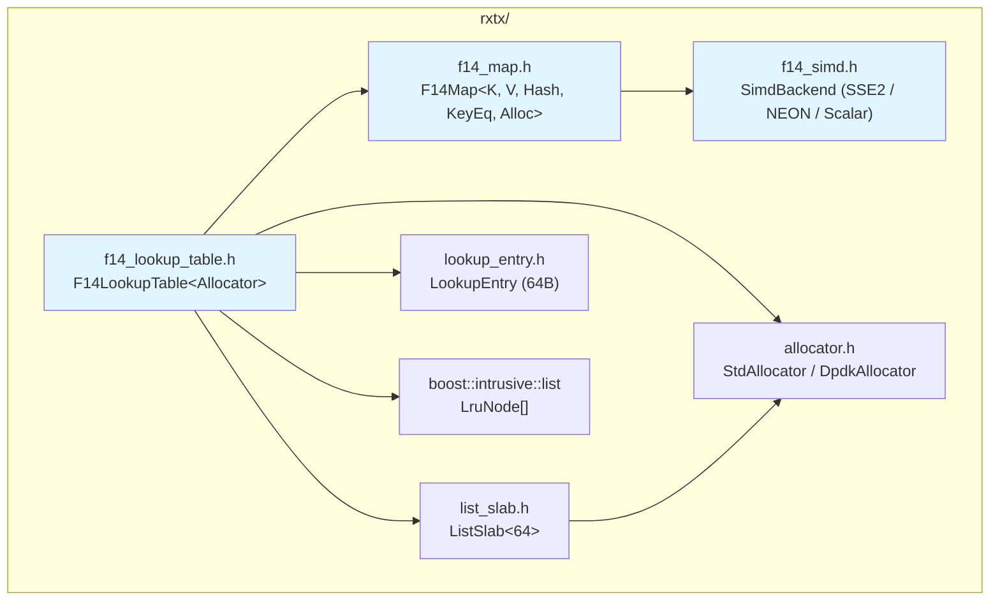

# Design Document: F14 Lookup Table

## Overview

This design ports the C-based F14 hash map (`processor/fmap.h`, `processor/fmap-detail.h`, `processor/fmap.c`) to a modern C++20 template-based implementation with cross-platform SIMD support. The result is three new header files in `rxtx/`:

1. `rxtx/f14_simd.h` — compile-time SIMD abstraction (SSE2, NEON, scalar fallback)
2. `rxtx/f14_map.h` — C++ template F14 hash map (`F14Map<Key, Value, Hash, KeyEqual, Allocator>`)
3. `rxtx/f14_lookup_table.h` — drop-in alternative to `FastLookupTable` backed by `F14Map`

The port replaces `struct fmap_ops` function-pointer dispatch with C++ template parameters so the compiler can inline hash, equality, and allocation in the hot path. All OVS dependencies (`util.h`, `ovs-atomic.h`, `dynamic-string.h`) are removed. ARM NEON support is added alongside the existing x86-64 SSE2 path, using full 128-bit `vceqq_u8` comparison and `vshrn_n_u16` narrowing shift for bitmask extraction.

The chunk layout is binary-compatible with the C fmap: 128 bytes per chunk (16-byte SIMD-aligned header with 14 tags + control + overflow, followed by 14 × 8-byte item slots). The F14 algorithm is preserved: double hashing with delta = `2*tag+1`, overflow counting (no tombstones), and automatic rehash when load exceeds `chunk_count × 12`.

## Architecture



The SIMD backend is selected at compile time via preprocessor guards (`__SSE2__`, `__ARM_NEON`). `F14Map` is a standalone generic hash map with no knowledge of `LookupEntry`. `F14LookupTable` composes `F14Map` with `ListSlab`, `LruNode[]`, and the `SetModifiable` atomic flag to match the existing `FastLookupTable` API.

### Design Decisions

1. **Header-only implementation**: All three files are header-only templates, matching the existing `fast_lookup_table.h` and `list_slab.h` pattern. This enables full inlining of the hot path.

2. **Pointer-value map**: `F14Map` stores `Key → Value` pairs directly in chunk item slots as `std::pair<Key, Value>`. For `F14LookupTable`, the map is `F14Map<LookupEntry*, LookupEntry*, LookupEntryHash, LookupEntryEq, ChunkAllocator>` where the key is a pointer and the value is the same pointer (set semantics). This matches the existing `absl::flat_hash_set<LookupEntry*>` pattern.

3. **Separate chunk allocator**: `F14Map` uses its `Allocator` template parameter for chunk memory only. `F14LookupTable` continues to use `ListSlab` for `LookupEntry` allocation, keeping the two allocation concerns separate.

4. **Item iteration via packed_begin**: The C fmap's `packed_begin` / item iteration machinery is ported as an opt-in template parameter `bool EnableItemIteration = true`. When enabled, `F14Map` maintains a `packed_begin_` pointer tracking the highest-address occupied item, and provides `ItemIterator` with three advance variants matching the C fmap. When disabled via `EnableItemIteration = false`, all tracking and iterator code is compiled out via `if constexpr` for zero overhead. This allows `F14Map` to be used both as a general-purpose map (with iteration) and as a pure lookup structure (without iteration overhead).

## Components and Interfaces

### 1. SimdBackend (`rxtx/f14_simd.h`)

```cpp
namespace rxtx::f14 {

// Bitmask type for tag match results (low 14 bits significant)
using TagMask = uint32_t;
inline constexpr TagMask kFullMask = 0x3FFF;  // (1 << 14) - 1
inline constexpr int kCapacity = 14;
inline constexpr int kDesiredCapacity = 12;    // kCapacity - 2

// Compile-time SIMD backend selection
struct Sse2Backend {
  static TagMask TagMatch(const void* header, uint8_t needle);
  static TagMask OccupiedMask(const void* header);
};

struct NeonBackend {
  static TagMask TagMatch(const void* header, uint8_t needle);
  static TagMask OccupiedMask(const void* header);
};

struct ScalarBackend {
  static TagMask TagMatch(const void* header, uint8_t needle);
  static TagMask OccupiedMask(const void* header);
};

// Platform selection
#if defined(__SSE2__)
using SimdBackend = Sse2Backend;
#elif defined(__ARM_NEON)
using SimdBackend = NeonBackend;
#else
using SimdBackend = ScalarBackend;
#endif

}  // namespace rxtx::f14
```

**SSE2 implementation** (matches C fmap):
```cpp
static TagMask TagMatch(const void* header, uint8_t needle) {
  __m128i tags = _mm_load_si128(reinterpret_cast<const __m128i*>(header));
  __m128i needle_v = _mm_set1_epi8(static_cast<char>(needle));
  __m128i eq = _mm_cmpeq_epi8(tags, needle_v);
  return static_cast<TagMask>(_mm_movemask_epi8(eq)) & kFullMask;
}
```

**NEON implementation** (full 128-bit, vshrn_n_u16 extraction):
```cpp
static TagMask TagMatch(const void* header, uint8_t needle) {
  uint8x16_t tags = vld1q_u8(reinterpret_cast<const uint8_t*>(header));
  uint8x16_t needle_v = vdupq_n_u8(needle);
  uint8x16_t eq = vceqq_u8(tags, needle_v);
  // Narrow 16-bit pairs to 8-bit with shift, producing per-byte bitmask
  uint8x8_t narrowed = vshrn_n_u16(vreinterpretq_u16_u8(eq), 4);
  uint64_t bits = vget_lane_u64(vreinterpret_u64_u8(narrowed), 0);
  // Extract one bit per byte from the narrowed result
  TagMask mask = 0;
  for (int i = 0; i < 8; ++i) {
    if ((bits >> (i * 8)) & 0x80) mask |= (1u << (2 * i + 1));
    if ((bits >> (i * 8)) & 0x08) mask |= (1u << (2 * i));
  }
  return mask & kFullMask;
}
```

*Note*: The exact NEON bitmask extraction sequence will be validated against the scalar fallback in property tests. The `vshrn_n_u16` approach follows Google's ARM optimization recommendations for converting NEON comparison results to scalar bitmasks.

**Scalar fallback**:
```cpp
static TagMask TagMatch(const void* header, uint8_t needle) {
  auto* tags = reinterpret_cast<const uint8_t*>(header);
  TagMask mask = 0;
  for (int i = 0; i < kCapacity; ++i) {
    if (tags[i] == needle) mask |= (1u << i);
  }
  return mask;
}
```

### 2. ChunkHeader and Chunk (`rxtx/f14_map.h`)

```cpp
namespace rxtx::f14 {

struct alignas(16) ChunkHeader {
  uint8_t tags[14];
  uint8_t control;   // low nibble: scale, high nibble: hosted overflow count
  uint8_t overflow;  // overflow reference count (saturates at 255)
};
static_assert(sizeof(ChunkHeader) == 16);
static_assert(alignof(ChunkHeader) == 16);

template <typename Item>
struct alignas(128) Chunk {
  ChunkHeader header;
  Item items[14];

  // Tag access
  uint8_t GetTag(int idx) const { return header.tags[idx]; }
  void SetTag(int idx, uint8_t tag) { header.tags[idx] = tag; }
  void ClearTag(int idx) { header.tags[idx] = 0; }
  bool SlotUsed(int idx) const { return header.tags[idx] != 0; }

  // Overflow counting
  uint8_t OverflowCount() const { return header.overflow; }
  void IncOverflow() { if (header.overflow != 255) ++header.overflow; }
  void DecOverflow() { if (header.overflow != 255) --header.overflow; }

  // Hosted overflow (high nibble of control)
  uint8_t HostedOverflowCount() const { return header.control >> 4; }
  void AdjHostedOverflow(int8_t delta) {
    header.control += static_cast<uint8_t>(delta << 4);
  }

  // Scale (low nibble of control, only meaningful on chunk 0)
  uint8_t Scale() const { return header.control & 0x0F; }
  void SetScale(uint8_t scale) {
    header.control = (header.control & 0xF0) | (scale & 0x0F);
  }

  // Clear all tags and control
  void Clear() { std::memset(&header, 0, sizeof(header)); }

  // SIMD operations
  TagMask OccupiedMask() const {
    return SimdBackend::OccupiedMask(&header);
  }
  TagMask TagMatch(uint8_t needle) const {
    return SimdBackend::TagMatch(&header, needle);
  }

  // First empty slot index, or -1 if full
  int FirstEmpty() const {
    TagMask empty = OccupiedMask() ^ kFullMask;
    return empty ? __builtin_ctz(empty) : -1;
  }
};

}  // namespace rxtx::f14
```

For `F14LookupTable`, `Item` is `LookupEntry*` (8 bytes), so `Chunk<LookupEntry*>` is `16 + 14×8 = 128` bytes — exactly 2 cache lines, matching the C fmap layout.

### 3. F14Map (`rxtx/f14_map.h`)

```cpp
namespace rxtx::f14 {

// Default allocator for chunk memory (aligned allocation)
struct DefaultChunkAllocator {
  void* allocate(std::size_t bytes, std::size_t alignment) {
    return ::operator new(bytes, std::align_val_t{alignment});
  }
  void deallocate(void* ptr) {
    ::operator delete(ptr, std::align_val_t{128});
  }
};

// Hash splitting: tag = (hash >> 24) | 0x80, index = hash & chunk_mask
struct HashPair {
  std::size_t hash;
  uint8_t tag;
};

inline HashPair SplitHash(std::size_t hash) {
  return {hash, static_cast<uint8_t>((hash >> 24) | 0x80)};
}

inline std::size_t ProbeDelta(uint8_t tag) {
  return 2 * static_cast<std::size_t>(tag) + 1;
}

// Packed pointer encoding: item pointer with low 3 bits storing index/2.
// Matches the C fmap's fmap_packed_ptr encoding.
struct PackedPtr {
  std::uintptr_t raw = 0;

  bool operator==(const PackedPtr& o) const { return raw == o.raw; }
  bool operator<(const PackedPtr& o) const { return raw < o.raw; }
};

inline PackedPtr PackedFromItemPtr(void* item_ptr, std::size_t index) {
  std::uintptr_t encoded = index >> 1;
  std::uintptr_t raw = reinterpret_cast<std::uintptr_t>(item_ptr) | encoded;
  return PackedPtr{raw};
}

template <typename Key, typename Value,
          typename Hash = std::hash<Key>,
          typename KeyEqual = std::equal_to<Key>,
          typename Allocator = DefaultChunkAllocator,
          bool EnableItemIteration = true>
class F14Map {
 public:
  using Item = std::pair<Key, Value>;
  using ChunkType = Chunk<Item>;

  // --- ItemIterator (only meaningful when EnableItemIteration = true) ---
  // Traverses occupied items by walking chunks backward from packed_begin_.
  // Matches the C fmap's fmap_item_iter semantics.
  class ItemIterator {
   public:
    ItemIterator() : item_ptr_(nullptr), index_(0) {}
    ItemIterator(Item* item_ptr, std::size_t index)
        : item_ptr_(item_ptr), index_(index) {}

    bool AtEnd() const { return item_ptr_ == nullptr; }
    Item& operator*() const { return *item_ptr_; }
    Item* operator->() const { return item_ptr_; }

    // Advance with EOF check and prefetch (normal iteration).
    // Matches C fmap's item_iter_advance.
    void Advance();

    // Advance without EOF check (for internal use during erase,
    // when caller knows more items exist).
    // Matches C fmap's item_iter_advance_prechecked.
    void AdvancePrechecked();

    // Advance with EOF check but likely-dead hint for compiler
    // dead-code elimination.
    // Matches C fmap's item_iter_advance_likely_dead.
    void AdvanceLikelyDead();

    bool operator==(const ItemIterator& o) const {
      return item_ptr_ == o.item_ptr_;
    }
    bool operator!=(const ItemIterator& o) const {
      return item_ptr_ != o.item_ptr_;
    }

   private:
    void AdvanceImpl(bool check_eof, bool likely_dead);
    ChunkType* ToChunk() const;

    Item* item_ptr_;
    std::size_t index_;

    friend class F14Map;
  };

  explicit F14Map(std::size_t init_capacity = 0);
  ~F14Map();

  // Core operations
  Value* Find(const Key& key);
  const Value* Find(const Key& key) const;

  // Returns pointer to value (existing or newly inserted).
  // Returns nullptr only if rehash allocation fails.
  std::pair<Value*, bool> Insert(const Key& key, const Value& value);

  bool Erase(const Key& key);

  std::size_t size() const { return size_; }
  void Clear();

  // Iterate all items: fn(const Key&, Value&) called for each entry.
  // fn may return true to request erasure of the current item.
  template <typename Fn>
  void ForEach(Fn fn);

  // --- Item iteration (enabled when EnableItemIteration = true) ---
  // Begin() returns an ItemIterator starting at packed_begin_.
  // End() returns a sentinel iterator with null item_ptr.
  ItemIterator Begin() const;
  ItemIterator End() const { return ItemIterator{}; }

 private:
  void ReserveForInsert(std::size_t incoming);
  void Rehash(std::size_t new_chunk_count, std::size_t new_scale);

  // Update packed_begin_ after inserting an item.
  // If the new item's packed pointer > current packed_begin_, update it.
  void AdjPackedBeginAfterInsert(Item* item_ptr, std::size_t index);

  // Update packed_begin_ before erasing an item.
  // If the erased item is the current begin, advance to next or reset to 0.
  void AdjPackedBeginBeforeErase(ItemIterator iter);

  ChunkType* chunks_;
  std::size_t chunk_mask_;  // chunk_count - 1
  std::size_t size_;
  Hash hash_;
  KeyEqual key_eq_;
  Allocator allocator_;

  // Conditionally compiled: only present when EnableItemIteration = true.
  // Tracks the highest-address occupied item for backward iteration.
  struct PackedBeginStorage { PackedPtr packed_begin_; };
  struct EmptyStorage {};
  [[no_unique_address]]
  std::conditional_t<EnableItemIteration, PackedBeginStorage, EmptyStorage>
      packed_storage_;
};
```

**Key algorithmic details** (preserved from C fmap):

- **Probe sequence**: `index = hp.hash & chunk_mask; delta = 2*tag+1; index += delta` on overflow.
- **Insert**: Check for existing key first. If not found, `ReserveForInsert(1)` to ensure capacity. Find first empty slot in home chunk; if full, probe forward, incrementing overflow counts.
- **Erase**: Clear tag, then walk the probe chain to decrement overflow/hosted-overflow counts. No tombstones needed because overflow counting tracks whether probing should continue.
- **Rehash**: Allocate new chunk array, re-insert all items. Growth factor: `capacity + capacity/4 + capacity/8 + capacity/32` (~1.41×), then round up to next power-of-two chunk count.
- **Capacity**: `chunk_count × kDesiredCapacity` (12 items per chunk target).

### 4. F14LookupTable (`rxtx/f14_lookup_table.h`)

```cpp
namespace rxtx {

// Hash/Eq functors for F14Map operating on LookupEntry pointers.
// Reuses existing LookupEntryHash and LookupEntryEq from lookup_entry.h.

template <typename Allocator = StdAllocator>
class F14LookupTable {
 public:
  explicit F14LookupTable(std::size_t capacity);

  LookupEntry* Insert(const IpAddress& src_ip, const IpAddress& dst_ip,
                       uint16_t src_port, uint16_t dst_port,
                       uint8_t protocol, uint32_t vni, uint8_t flags);

  LookupEntry* Find(const IpAddress& src_ip, const IpAddress& dst_ip,
                     uint16_t src_port, uint16_t dst_port,
                     uint8_t protocol, uint32_t vni, uint8_t flags);

  LookupEntry* Find(const PacketMetadata& meta);

  bool Remove(LookupEntry* entry);

  void SetModifiable(bool m) { modifiable_.store(m, std::memory_order_release); }
  bool IsModifiable() const { return modifiable_.load(std::memory_order_acquire); }

  // Visit up to count entries via LRU order. fn returns true to erase.
  template <typename Fn>
  std::size_t ForEach(std::size_t count, Fn fn);

  std::size_t EvictLru(std::size_t batch_size);

  std::size_t size() const { return map_.size(); }
  std::size_t capacity() const { return slab_.capacity(); }

 private:
  // F14Map with pointer key/value (set semantics), item iteration disabled
  // since F14LookupTable iterates via the LRU list.
  using Map = f14::F14Map<LookupEntry*, LookupEntry*,
                          LookupEntryHash, LookupEntryEq,
                          f14::DefaultChunkAllocator,
                          /*EnableItemIteration=*/false>;

  static void FillEntry(LookupEntry* entry,
                        const IpAddress& src_ip, const IpAddress& dst_ip,
                        uint16_t src_port, uint16_t dst_port,
                        uint8_t protocol, uint32_t vni, uint8_t flags);

  std::size_t SlotIndex(const LookupEntry* entry) const {
    return (reinterpret_cast<const uint8_t*>(entry) - slab_.slab_base())
           / sizeof(LookupEntry);
  }

  ListSlab<sizeof(LookupEntry), Allocator> slab_;
  Map map_;
  std::atomic<bool> modifiable_{true};
  std::unique_ptr<LruNode[]> lru_nodes_;
  LruList lru_list_;
};

}  // namespace rxtx
```

The `ForEach` signature differs slightly from `FastLookupTable`: it iterates via the LRU list rather than the hash set iterator. The LRU list provides deterministic iteration order (oldest to newest). `F14LookupTable` uses `EnableItemIteration = false` for its internal `F14Map` since it relies on the LRU list for iteration, avoiding the overhead of packed_begin tracking. Other users of `F14Map` that need direct item iteration can use the default `EnableItemIteration = true`.

## Data Models

### Chunk Memory Layout (128 bytes)

```
Offset  Size  Field
──────  ────  ─────────────────────────────
  0      14   tags[0..13]  (1 byte each, 0 = empty, non-zero = hash fingerprint)
 14       1   control      (low nibble: scale, high nibble: hosted overflow count)
 15       1   overflow     (overflow reference count, saturates at 255)
 16     112   items[0..13] (8 bytes each for pointer items)
──────  ────
128 total (2 cache lines, 128-byte aligned)
```

### HashPair Derivation

```
Given: hash = Hash(key)  →  size_t

tag        = (hash >> 24) | 0x80          // always non-zero (bit 7 set)
chunk_index = hash & chunk_mask           // chunk_mask = chunk_count - 1
probe_delta = 2 * tag + 1                 // always odd → coprime with power-of-2
```

### Capacity Model

```
chunk_count = next_power_of_2(ceil(desired / 12))
capacity    = chunk_count × 12
growth      = capacity + capacity/4 + capacity/8 + capacity/32  (~1.41×)
```

### LookupEntry (64 bytes, from `rxtx/lookup_entry.h`)

Unchanged. The `F14LookupTable` stores `LookupEntry*` pointers in the F14 chunk item slots, with entries allocated from `ListSlab<64>`. The `LookupEntryHash` and `LookupEntryEq` functors dereference these pointers, identical to the existing `FastLookupTable` usage.

### LruNode (from `rxtx/fast_lookup_table.h`)

The `LruNode` struct and `LruList` type are reused from the existing design. A parallel `LruNode[]` array indexed by slab slot provides O(1) LRU promotion on Find hits and O(1) eviction from the list head.


## Correctness Properties

*A property is a characteristic or behavior that should hold true across all valid executions of a system — essentially, a formal statement about what the system should do. Properties serve as the bridge between human-readable specifications and machine-verifiable correctness guarantees.*

### Property 1: SIMD tag matching correctness

*For any* 16-byte aligned `ChunkHeader` (with arbitrary byte values in positions 0–13 and arbitrary control/overflow bytes at positions 14–15) and *for any* needle byte value 0–255, `SimdBackend::TagMatch(header, needle)` shall return a bitmask where bit N (for N in 0..13) is set if and only if `header[N] == needle`, and bits 14–15 are always zero. Similarly, `SimdBackend::OccupiedMask(header)` shall return a bitmask where bit N is set if and only if `header[N] != 0`, with bits 14–15 always zero.

**Validates: Requirements 1.1, 1.2, 1.7**

### Property 2: SIMD cross-platform equivalence

*For any* 16-byte aligned `ChunkHeader` and *for any* needle byte, the result of `SimdBackend::TagMatch(header, needle)` shall be identical to `ScalarBackend::TagMatch(header, needle)`, and `SimdBackend::OccupiedMask(header)` shall be identical to `ScalarBackend::OccupiedMask(header)`.

**Validates: Requirements 8.5**

### Property 3: Tag derivation always non-zero

*For any* `std::size_t` hash value, `SplitHash(hash).tag` shall have bit 7 set (i.e., `tag >= 0x80`), ensuring the tag is always non-zero and thus distinguishable from an empty slot.

**Validates: Requirements 2.10, 5.6**

### Property 4: Capacity computation produces valid power-of-two

*For any* desired capacity greater than zero, the computed `chunk_count` shall be a power of two, and `chunk_count * kDesiredCapacity` shall be greater than or equal to the desired capacity.

**Validates: Requirements 2.9**

### Property 5: F14Map model-based correctness

*For any* sequence of `insert(key, value)`, `erase(key)`, and `find(key)` operations applied to both an `F14Map` and a reference `std::unordered_map`, after each operation: (a) `F14Map::size()` shall equal the reference map's size, (b) every key present in the reference map shall be found in the `F14Map` with the correct value, (c) every key absent from the reference map shall not be found in the `F14Map`, (d) the sum of occupied slots across all chunks shall equal `F14Map::size()`, and (e) the sum of `HostedOverflowCount` across all chunks shall equal the number of items stored in non-home chunks.

**Validates: Requirements 8.1, 8.2, 8.3, 8.4, 8.6, 8.7, 8.9, 2.4**

### Property 6: F14LookupTable insert-find round-trip

*For any* valid flow key (src_ip, dst_ip, src_port, dst_port, protocol, vni, flags), after inserting it into `F14LookupTable`, both `Find(src_ip, dst_ip, src_port, dst_port, protocol, vni, flags)` and `Find(PacketMetadata)` (with equivalent fields) shall return a non-null pointer to an entry whose fields match the inserted key.

**Validates: Requirements 4.1, 4.2, 4.3, 8.2**

### Property 7: F14LookupTable LRU promotion on Find hit

*For any* sequence of N inserts followed by a Find hit on entry K, entry K shall be the last entry evicted by repeated `EvictLru(1)` calls (i.e., it is promoted to the LRU tail).

**Validates: Requirements 4.7**

### Property 8: F14LookupTable behavioral equivalence with FastLookupTable

*For any* sequence of `Insert`, `Find`, `Remove`, and `EvictLru` operations applied to both `F14LookupTable` and `FastLookupTable` with the same capacity, every operation shall produce the same observable result: Insert returns non-null for the same inputs, Find returns non-null for the same inputs, Remove returns true/false identically, and `size()` is equal after each operation.

**Validates: Requirements 8.8, 4.8, 4.11**

### Property 9: PackedPtr round-trip encoding

*For any* valid item pointer (aligned to `Chunk<Item>` item slot) and *for any* item index in range [0, 13], encoding the pointer and index into a `PackedPtr` via `PackedFromItemPtr` and then decoding back shall produce the original item pointer and index. This validates the bit-packing scheme matches the C fmap's `fmap_packed_ptr` encoding.

**Validates: Requirements 9.3**

### Property 10: Item iteration visits exactly size() items

*For any* sequence of insert and erase operations on an `F14Map` with `EnableItemIteration = true`, iterating from `Begin()` to `End()` using `Advance()` shall visit exactly `size()` items, each exactly once. Furthermore, the set of items visited shall be identical when using `AdvancePrechecked()` (on a copy of the iterator, when the map is non-empty) and `AdvanceLikelyDead()`, ensuring all three advance variants produce equivalent traversals.

**Validates: Requirements 9.2, 9.4, 9.5, 9.10**

## Error Handling

| Condition | Behavior |
|---|---|
| Slab full on Insert (new key) | Return `nullptr`, map unchanged |
| Insert when `modifiable_ == false` | Return `nullptr`, no side effects |
| Remove when `modifiable_ == false` | Return `false`, no side effects |
| Remove with pointer not in set | Return `false`, no side effects |
| Find miss | Return `nullptr` |
| EvictLru on empty table | Return 0 |
| EvictLru with batch_size > size() | Remove all entries, return actual count |
| Chunk overflow count at 255 | Saturate: no increment or decrement |
| Rehash allocation failure | Map remains in previous valid state (no partial mutation) |
| Zero initial capacity | Map starts empty with no chunk allocation; first insert triggers allocation |

All error paths are non-throwing. The F14Map and F14LookupTable do not use exceptions. Allocation failures are signaled by nullptr returns.

## Testing Strategy

### Testing Framework

- **Unit tests**: Google Test (`@googletest//:gtest`)
- **Property-based tests**: RapidCheck (`@rapidcheck`, `@rapidcheck//:rapidcheck_gtest`)
- **Build system**: Bazel `cc_test` targets in `rxtx/BUILD`

### Test Files

| File | Contents |
|---|---|
| `rxtx/f14_simd_test.cc` | SIMD backend property tests (Properties 1, 2, 3) |
| `rxtx/f14_map_test.cc` | F14Map property tests (Properties 4, 5, 9, 10) + unit tests for layout static_asserts |
| `rxtx/f14_lookup_table_test.cc` | F14LookupTable property tests (Properties 6, 7, 8) + unit tests for edge cases |

### Property-Based Testing Configuration

- Library: RapidCheck (already in `MODULE.bazel`)
- Minimum 100 iterations per property test
- Each property test must be tagged with a comment referencing the design property:
  ```
  // Feature: f14-lookup-table, Property N: <property title>
  ```
- Each correctness property is implemented by a single `RC_GTEST_PROP` test

### Unit Tests (specific examples and edge cases)

- `Chunk` layout: `static_assert(sizeof(Chunk<void*>) == 128)`, `static_assert(alignof(ChunkHeader) == 16)`
- `ChunkHeader` field offsets: `offsetof(ChunkHeader, control) == 14`, `offsetof(ChunkHeader, overflow) == 15`
- Overflow saturation: increment from 255 stays at 255, decrement from 255 stays at 255
- Slab exhaustion: fill slab to capacity, verify next Insert returns nullptr
- Modifiable flag: Insert/Remove blocked when false, unblocked when re-enabled
- Empty table: Find returns nullptr, Remove returns false, EvictLru returns 0
- Duplicate insert: same pointer returned, size unchanged
- EnableItemIteration=false: `sizeof(F14Map<..., false>)` is smaller than `sizeof(F14Map<..., true>)`, confirming packed_begin_ is compiled out
- Begin()/End() on empty map with EnableItemIteration=true: Begin() equals End()

### Property Tests (universal properties across generated inputs)

| Property | Generator Strategy |
|---|---|
| Property 1 (SIMD correctness) | Random 16-byte aligned buffers + random needle bytes |
| Property 2 (SIMD equivalence) | Same as Property 1, compare SIMD vs Scalar results |
| Property 3 (tag non-zero) | Random `std::size_t` hash values |
| Property 4 (capacity computation) | Random desired capacities in range [1, 10000] |
| Property 5 (F14Map model) | Random sequences of insert/erase/find with random integer keys |
| Property 6 (LookupTable round-trip) | Random flow keys (random IPs, ports, protocol, vni, flags) |
| Property 7 (LRU promotion) | Random insert sequences + random Find target |
| Property 8 (behavioral equivalence) | Random operation sequences applied to both table implementations |
| Property 9 (PackedPtr round-trip) | Random aligned pointers + random indices in [0, 13] |
| Property 10 (item iteration) | Random sequences of insert/erase with random integer keys, then iterate and count |

### Dual Testing Approach

Unit tests and property tests are complementary:
- Unit tests verify specific examples, edge cases (overflow saturation, slab exhaustion), and compile-time layout assertions
- Property tests verify universal invariants across hundreds of randomly generated inputs, catching corner cases that hand-written examples miss
- Together they provide comprehensive coverage: unit tests catch concrete bugs at known boundaries, property tests verify general correctness across the input space
