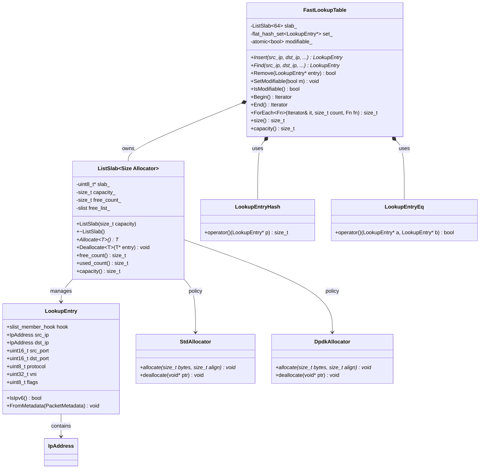

# Design Document: Fast Lookup Table

## Overview

This design introduces two components in the `rxtx` namespace: a `ListSlab<Size, Allocator>` slab allocator and a `FastLookupTable` hash table for high-performance flow lookup by 5-tuple + VNI.

`ListSlab` is parameterized by entry size (not type) to avoid template code bloat — a single instantiation handles any entry type of the same size. It pre-allocates a contiguous byte array and manages free/used entries via a `boost::intrusive::slist` (singly-linked list). The slist hook costs only 8 bytes per entry (one pointer), minimizing overhead. Allocate and deallocate are O(1) stack operations (push_front / pop_front) with no system calls or heap allocation on the fast path. Typed access is provided through templated member functions `Allocate<T>()` and `Deallocate<T>()`, which perform compile-time validation that `T` has the required slist hook and that `sizeof(T) == Size`.

`FastLookupTable` wraps an `absl::flat_hash_set<LookupEntry*>` with custom hash and equality functors that dereference the stored pointers to compute hashes and comparisons over the 5-tuple + VNI key fields. Entries are allocated from an internal `ListSlab<sizeof(LookupEntry)>`. Lookups use a stack-allocated probe pattern: a temporary `LookupEntry` is constructed on the stack, its key fields populated, and its address passed to `find()`. The custom functors dereference the pointer identically whether it points into the slab or onto the stack.

### Key Design Decisions

1. **`boost::intrusive::slist` for the free list** — A singly-linked list saves 8 bytes per entry compared to a doubly-linked list (one pointer vs two). Since the free list only needs push_front/pop_front (stack semantics), a doubly-linked list provides no benefit. This keeps `LookupEntry` at exactly 64 bytes (one cache line).

2. **`absl::flat_hash_set` instead of `flat_hash_map`** — Since the pointer itself serves as both key and value (the entry contains all data), a set is sufficient. The custom `Hash` and `Eq` functors dereference the pointer to access key fields. This avoids storing a redundant value alongside the key in the flat map's slots.

3. **Stack-allocated probe for lookups** — When performing `find()`, a temporary `LookupEntry` is constructed on the stack with the query's 5-tuple + VNI fields. Its address is passed to `find()`. The custom hash/eq functors dereference the pointer, so they work identically whether the pointer targets slab memory or the stack. This avoids allocating a slab entry just to perform a lookup.

4. **`uint8_t` flags field** — Only 1 bit is needed (IPv4 vs IPv6). Using `uint8_t` instead of `uint64_t` saves 7 bytes, which is critical for fitting the entry into a single 64-byte cache line alongside the slist hook.

5. **IPv4-optimized hashing** — When the flags field indicates IPv4, the hash and equality functors operate on only 4 bytes per IP address (`IpAddress.v4`) instead of the full 16-byte union. This reduces hash computation and comparison cost for the common IPv4 case.

6. **Allocator policy template parameter** — `ListSlab` accepts an `Allocator` template parameter with `allocate(size_t, size_t)` and `deallocate(void*)` methods. `StdAllocator` uses aligned `operator new`/`delete` for tests; `DpdkAllocator` uses `rte_malloc`/`rte_free` for production huge-page allocation.

7. **`ListSlab<Size, Allocator>` instead of `<T, Allocator>`** — The slab is parameterized by `std::size_t Size` (the entry size in bytes) rather than the entry type `T`. This avoids template code bloat: multiple entry types of the same size share a single instantiation of the slab's core logic. Typed access is provided through templated member functions `Allocate<T>()` and `Deallocate<T>()`, which use `static_assert` to verify at compile time that `sizeof(T) == Size` and that `T` has a valid `slist_member_hook<>` member named `hook`.

8. **`LookupEntry::FromMetadata()` convenience method** — A member function that populates a `LookupEntry` directly from a `PacketMetadata`, extracting the relevant 5-tuple + VNI + flags fields. This avoids manual field-by-field copying at every call site and ensures consistent mapping between the two types.

## Architecture




## Components and Interfaces

### Allocator Policies

```cpp
namespace rxtx {

// Standard heap allocator for unit tests.
struct StdAllocator {
  void* allocate(std::size_t bytes, std::size_t alignment) {
    return ::operator new(bytes, std::align_val_t{alignment});
  }
  void deallocate(void* ptr) {
    ::operator delete(ptr, std::align_val_t{kCacheLineSize});
  }
};

// DPDK huge-page allocator for production.
struct DpdkAllocator {
  void* allocate(std::size_t bytes, std::size_t alignment) {
    return rte_malloc("lookup_slab", bytes, alignment);
  }
  void deallocate(void* ptr) {
    rte_free(ptr);
  }
};

}  // namespace rxtx
```

### ListSlab Template

```cpp
namespace rxtx {

// Internal node type for the intrusive slist free list.
// Each slab slot begins with this hook, followed by Size bytes of user data.
// The hook is embedded at a fixed offset so the slist can manage raw slots
// without knowing the user type T.
struct SlabNode {
  boost::intrusive::slist_member_hook<> hook;
};

// Slab allocator parameterized by entry Size (bytes) to avoid code bloat.
// NOT thread-safe — must be accessed from a single thread.
//
// Typed access is through Allocate<T>() and Deallocate<T>(), which
// static_assert that sizeof(T) == Size and that T has a compatible
// slist_member_hook<> member named 'hook' at offset 0.
//
// Allocator must provide allocate(size_t, size_t) and deallocate(void*).
template <std::size_t Size, typename Allocator = StdAllocator>
class ListSlab {
  static_assert(Size >= sizeof(SlabNode),
                "Size must be at least sizeof(SlabNode) to hold the slist hook");

 public:
  explicit ListSlab(std::size_t capacity);
  ~ListSlab();

  // Non-copyable, non-movable.
  ListSlab(const ListSlab&) = delete;
  ListSlab& operator=(const ListSlab&) = delete;

  // Allocate one entry from the free list, returned as T*.
  // Returns nullptr if full.
  // Compile-time checks: sizeof(T) == Size, T has slist_member_hook<> hook.
  template <typename T>
  T* Allocate();

  // Return an entry to the free list.
  // Compile-time checks: sizeof(T) == Size, T has slist_member_hook<> hook.
  template <typename T>
  void Deallocate(T* entry);

  std::size_t free_count() const { return free_count_; }
  std::size_t used_count() const { return capacity_ - free_count_; }
  std::size_t capacity() const { return capacity_; }

 private:
  using FreeList = boost::intrusive::slist<
      SlabNode,
      boost::intrusive::member_hook<
          SlabNode, boost::intrusive::slist_member_hook<>, &SlabNode::hook>,
      boost::intrusive::cache_last<false>>;

  uint8_t* slab_;        // contiguous byte array: capacity * Size bytes
  std::size_t capacity_;
  std::size_t free_count_;
  FreeList free_list_;
  Allocator allocator_;

  // Get the SlabNode at index i.
  SlabNode* NodeAt(std::size_t i) {
    return reinterpret_cast<SlabNode*>(slab_ + i * Size);
  }
};

}  // namespace rxtx
```

#### ListSlab Constructor / Destructor

```cpp
template <std::size_t Size, typename Allocator>
ListSlab<Size, Allocator>::ListSlab(std::size_t capacity)
    : slab_(nullptr), capacity_(capacity), free_count_(capacity) {
  void* raw = allocator_.allocate(capacity * Size, Size);
  slab_ = static_cast<uint8_t*>(raw);
  // Placement-new a SlabNode at each slot and push onto free list.
  for (std::size_t i = 0; i < capacity; ++i) {
    auto* node = new (NodeAt(i)) SlabNode{};
    free_list_.push_front(*node);
  }
}

template <std::size_t Size, typename Allocator>
ListSlab<Size, Allocator>::~ListSlab() {
  free_list_.clear();
  for (std::size_t i = 0; i < capacity_; ++i) {
    NodeAt(i)->~SlabNode();
  }
  allocator_.deallocate(slab_);
}
```

#### ListSlab Allocate / Deallocate

```cpp
template <std::size_t Size, typename Allocator>
template <typename T>
T* ListSlab<Size, Allocator>::Allocate() {
  static_assert(sizeof(T) == Size,
                "sizeof(T) must equal the slab's Size parameter");
  static_assert(
      std::is_same_v<decltype(T::hook),
                     boost::intrusive::slist_member_hook<>>,
      "T must have a public slist_member_hook<> member named 'hook'");
  static_assert(offsetof(T, hook) == 0,
                "T::hook must be at offset 0 (first member)");

  if (free_list_.empty()) return nullptr;
  SlabNode& node = free_list_.front();
  free_list_.pop_front();
  --free_count_;
  return reinterpret_cast<T*>(&node);
}

template <std::size_t Size, typename Allocator>
template <typename T>
void ListSlab<Size, Allocator>::Deallocate(T* entry) {
  static_assert(sizeof(T) == Size,
                "sizeof(T) must equal the slab's Size parameter");
  static_assert(
      std::is_same_v<decltype(T::hook),
                     boost::intrusive::slist_member_hook<>>,
      "T must have a public slist_member_hook<> member named 'hook'");
  static_assert(offsetof(T, hook) == 0,
                "T::hook must be at offset 0 (first member)");

  auto* node = reinterpret_cast<SlabNode*>(entry);
  free_list_.push_front(*node);
  ++free_count_;
}
```

### LookupEntry Struct

```cpp
namespace rxtx {

// A single flow entry stored in the slab and referenced by the hash set.
// Aligned to kCacheLineSize (64 bytes) so that all key fields plus the
// intrusive hook fit in a single cache line.
//
// Memory layout (64 bytes):
//   Offset  0: hook       (slist_member_hook, 8 bytes — one pointer)
//   Offset  8: src_ip     (IpAddress, 16 bytes)
//   Offset 24: dst_ip     (IpAddress, 16 bytes)
//   Offset 40: src_port   (uint16_t, 2 bytes)
//   Offset 42: dst_port   (uint16_t, 2 bytes)
//   Offset 44: protocol   (uint8_t, 1 byte)
//   Offset 45: flags      (uint8_t, 1 byte)
//   Offset 46: [padding]  (2 bytes)
//   Offset 48: vni        (uint32_t, 4 bytes)
//   Offset 52: [padding]  (12 bytes to fill cache line)
struct alignas(kCacheLineSize) LookupEntry {
  boost::intrusive::slist_member_hook<> hook;

  IpAddress src_ip;
  IpAddress dst_ip;
  uint16_t src_port;
  uint16_t dst_port;
  uint8_t protocol;
  uint8_t flags;       // bit 0: 1 = IPv6, 0 = IPv4
  // 2 bytes implicit padding
  uint32_t vni;
  // 12 bytes implicit padding to 64-byte alignment

  bool IsIpv6() const { return flags & 0x01; }

  // Populate this entry's key fields from a PacketMetadata.
  // Extracts src_ip, dst_ip, src_port, dst_port, protocol, vni,
  // and the IPv6 flag from meta.flags.
  void FromMetadata(const PacketMetadata& meta) {
    src_ip = meta.src_ip;
    dst_ip = meta.dst_ip;
    src_port = meta.src_port;
    dst_port = meta.dst_port;
    protocol = meta.protocol;
    vni = meta.vni;
    flags = static_cast<uint8_t>(meta.flags & kFlagIpv6);
  }
};

static_assert(sizeof(LookupEntry) == 64,
              "LookupEntry must be exactly one cache line (64 bytes)");
static_assert(alignof(LookupEntry) == 64,
              "LookupEntry must be cache-line aligned");

}  // namespace rxtx
```

### Hash and Equality Functors

```cpp
namespace rxtx {

// Custom hash functor that dereferences LookupEntry pointers.
// IPv4-optimized: hashes only 4 bytes per address when flags indicate IPv4.
struct LookupEntryHash {
  using is_transparent = void;

  std::size_t operator()(const LookupEntry* p) const {
    absl::Hash<int> h;  // seed type doesn't matter, we use HashState
    if (p->IsIpv6()) {
      return absl::HashOf(
          absl::string_view(reinterpret_cast<const char*>(p->src_ip.v6), 16),
          absl::string_view(reinterpret_cast<const char*>(p->dst_ip.v6), 16),
          p->src_port, p->dst_port, p->protocol, p->vni, p->flags);
    }
    return absl::HashOf(
        p->src_ip.v4, p->dst_ip.v4,
        p->src_port, p->dst_port, p->protocol, p->vni, p->flags);
  }
};

// Custom equality functor that dereferences LookupEntry pointers.
// IPv4-optimized: compares only 4 bytes per address when flags indicate IPv4.
struct LookupEntryEq {
  using is_transparent = void;

  bool operator()(const LookupEntry* a, const LookupEntry* b) const {
    if (a->flags != b->flags) return false;
    if (a->src_port != b->src_port) return false;
    if (a->dst_port != b->dst_port) return false;
    if (a->protocol != b->protocol) return false;
    if (a->vni != b->vni) return false;
    if (a->IsIpv6()) {
      return std::memcmp(a->src_ip.v6, b->src_ip.v6, 16) == 0 &&
             std::memcmp(a->dst_ip.v6, b->dst_ip.v6, 16) == 0;
    }
    return a->src_ip.v4 == b->src_ip.v4 &&
           a->dst_ip.v4 == b->dst_ip.v4;
  }
};

}  // namespace rxtx
```

### FastLookupTable Class

```cpp
namespace rxtx {

// High-performance flow lookup table backed by absl::flat_hash_set
// with pointer-based hashing into slab-allocated LookupEntry items.
//
// NOT thread-safe — must be accessed from a single thread.
//
// Lookup uses a stack-allocated probe: a temporary LookupEntry is
// constructed on the stack, key fields populated, and its address
// passed to find(). The custom hash/eq functors dereference the
// pointer, so they work identically for slab and stack pointers.
template <typename Allocator = StdAllocator>
class FastLookupTable {
 public:
  using Set = absl::flat_hash_set<LookupEntry*, LookupEntryHash, LookupEntryEq>;
  using Iterator = Set::iterator;

  explicit FastLookupTable(std::size_t capacity);

  // Insert a flow entry. Returns pointer to the entry (existing or new).
  // Returns nullptr if the slab is full and the key doesn't already exist.
  // Returns nullptr without side effects if modifiable_ is false.
  LookupEntry* Insert(const IpAddress& src_ip, const IpAddress& dst_ip,
                       uint16_t src_port, uint16_t dst_port,
                       uint8_t protocol, uint32_t vni, uint8_t flags);

  // Find a flow entry. Returns pointer if found, nullptr otherwise.
  // Uses stack-allocated probe — no slab allocation needed.
  LookupEntry* Find(const IpAddress& src_ip, const IpAddress& dst_ip,
                     uint16_t src_port, uint16_t dst_port,
                     uint8_t protocol, uint32_t vni, uint8_t flags) const;

  // Convenience: find using PacketMetadata directly.
  LookupEntry* Find(const PacketMetadata& meta) const;

  // Remove a flow entry by pointer. Returns true if removed.
  // Returns false without side effects if modifiable_ is false.
  bool Remove(LookupEntry* entry);

  // Modification toggle — controls whether Insert/Remove are permitted.
  // Defaults to true at construction.
  //
  // modifiable_ is std::atomic<bool> because SetModifiable is called from
  // the ControlPlane thread while Insert/Remove/ForEach run on the PMD
  // thread. The intended call sequence is:
  //   1. ControlPlane: SetModifiable(false)          — release store
  //   2. ControlPlane: call_after_grace_period(fn)   — enqueue deferred work
  //   3. PMD thread:   fn() reads modifiable_        — acquire load
  //
  // The release store ensures the flag write is visible to the PMD thread
  // before the deferred callback executes. The acquire load in
  // Insert/Remove/IsModifiable pairs with this release.
  void SetModifiable(bool m) { modifiable_.store(m, std::memory_order_release); }
  bool IsModifiable() const { return modifiable_.load(std::memory_order_acquire); }

  // Iteration API — caller owns and manages the Iterator.
  // Iterators are invalidated by standalone Insert/Remove calls (standard
  // flat_hash_set semantics). ForEach handles erasure safely via
  // set_.erase() return value, so the iterator remains valid during
  // ForEach even when fn returns true.
  // The caller is responsible for not using invalidated iterators
  // after standalone Insert or Remove calls.
  Iterator Begin() { return set_.begin(); }
  Iterator End() { return set_.end(); }

  // Apply fn to up to count entries starting from it, advancing it past
  // each visited entry. Returns the number of entries actually visited.
  // Stops early if it reaches End().
  //
  // fn receives a LookupEntry* and returns a bool:
  //   - return true  → entry is removed from the set and deallocated to slab
  //   - return false → entry is kept, iterator advances normally
  //
  // This is NOT const because fn may trigger removals. The iterator is
  // advanced safely using the return value of set_.erase() when fn
  // returns true, so the caller's iterator remains valid throughout.
  template <typename Fn>
  std::size_t ForEach(Iterator& it, std::size_t count, Fn fn);

  std::size_t size() const { return set_.size(); }
  std::size_t capacity() const { return slab_.capacity(); }

 private:
  // Populate a LookupEntry's key fields from arguments.
  static void FillEntry(LookupEntry* entry,
                        const IpAddress& src_ip, const IpAddress& dst_ip,
                        uint16_t src_port, uint16_t dst_port,
                        uint8_t protocol, uint32_t vni, uint8_t flags);

  ListSlab<sizeof(LookupEntry), Allocator> slab_;
  Set set_;
  std::atomic<bool> modifiable_{true};
};

}  // namespace rxtx
```

#### FastLookupTable Implementation Details

```cpp
template <typename Allocator>
FastLookupTable<Allocator>::FastLookupTable(std::size_t capacity)
    : slab_(capacity) {}

template <typename Allocator>
void FastLookupTable<Allocator>::FillEntry(
    LookupEntry* entry, const IpAddress& src_ip, const IpAddress& dst_ip,
    uint16_t src_port, uint16_t dst_port,
    uint8_t protocol, uint32_t vni, uint8_t flags) {
  entry->src_ip = src_ip;
  entry->dst_ip = dst_ip;
  entry->src_port = src_port;
  entry->dst_port = dst_port;
  entry->protocol = protocol;
  entry->vni = vni;
  entry->flags = flags;
}

template <typename Allocator>
LookupEntry* FastLookupTable<Allocator>::Find(
    const IpAddress& src_ip, const IpAddress& dst_ip,
    uint16_t src_port, uint16_t dst_port,
    uint8_t protocol, uint32_t vni, uint8_t flags) const {
  // Stack-allocated probe: construct a temporary entry on the stack.
  LookupEntry probe{};
  FillEntry(&probe, src_ip, dst_ip, src_port, dst_port,
            protocol, vni, flags);
  auto it = set_.find(&probe);
  if (it == set_.end()) return nullptr;
  return *it;
}

template <typename Allocator>
LookupEntry* FastLookupTable<Allocator>::Find(
    const PacketMetadata& meta) const {
  LookupEntry probe{};
  probe.FromMetadata(meta);
  auto it = set_.find(&probe);
  if (it == set_.end()) return nullptr;
  return *it;
}

template <typename Allocator>
LookupEntry* FastLookupTable<Allocator>::Insert(
    const IpAddress& src_ip, const IpAddress& dst_ip,
    uint16_t src_port, uint16_t dst_port,
    uint8_t protocol, uint32_t vni, uint8_t flags) {
  if (!modifiable_.load(std::memory_order_acquire)) return nullptr;

  // Check if already present using stack probe.
  LookupEntry probe{};
  FillEntry(&probe, src_ip, dst_ip, src_port, dst_port,
            protocol, vni, flags);
  auto it = set_.find(&probe);
  if (it != set_.end()) return *it;

  // Allocate from slab.
  LookupEntry* entry = slab_.template Allocate<LookupEntry>();
  if (entry == nullptr) return nullptr;
  FillEntry(entry, src_ip, dst_ip, src_port, dst_port,
            protocol, vni, flags);
  set_.insert(entry);
  return entry;
}

template <typename Allocator>
bool FastLookupTable<Allocator>::Remove(LookupEntry* entry) {
  if (!modifiable_.load(std::memory_order_acquire)) return false;

  auto erased = set_.erase(entry);
  if (erased == 0) return false;
  slab_.template Deallocate<LookupEntry>(entry);
  return true;
}

template <typename Allocator>
template <typename Fn>
std::size_t FastLookupTable<Allocator>::ForEach(
    Iterator& it, std::size_t count, Fn fn) {
  std::size_t visited = 0;
  while (visited < count && it != set_.end()) {
    LookupEntry* entry = *it;
    if (fn(entry)) {
      // fn requested removal — erase returns the next valid iterator.
      it = set_.erase(it);
      slab_.template Deallocate<LookupEntry>(entry);
    } else {
      ++it;
    }
    ++visited;
  }
  return visited;
}
```

## Data Models

### LookupEntry Memory Layout

```
Offset  Size  Field
──────  ────  ─────────────────────────
 0       8    slist_member_hook (next pointer)
 8      16    src_ip (IpAddress union)
24      16    dst_ip (IpAddress union)
40       2    src_port
42       2    dst_port
44       1    protocol
45       1    flags (bit 0 = IPv6)
46       2    [padding]
48       4    vni
52      12    [padding to 64-byte alignment]
──────  ────
 0      64    Total (one cache line)
```

The `flags` field uses `uint8_t` with bit 0 as the IPv4/IPv6 discriminator (matching `MetaFlag::kFlagIpv6` semantics from `PacketMetadata`). Only 1 bit is currently used; the remaining 7 bits are reserved for future use.

### Relationship to PacketMetadata

`LookupEntry` extracts a subset of `PacketMetadata` fields for flow identification:

| PacketMetadata field | LookupEntry field | Notes |
|---|---|---|
| `src_ip` | `src_ip` | Same `IpAddress` union type |
| `dst_ip` | `dst_ip` | Same `IpAddress` union type |
| `src_port` | `src_port` | Direct copy |
| `dst_port` | `dst_port` | Direct copy |
| `protocol` | `protocol` | Direct copy |
| `vni` | `vni` | Direct copy |
| `flags & kFlagIpv6` | `flags & 0x01` | Narrowed to `uint8_t` |

Fields not needed for flow lookup (`vlan_count`, `frag_offset`, `outer_vlan_id`, `inner_vlan_id`) are excluded.

The `LookupEntry::FromMetadata(const PacketMetadata& meta)` method performs this mapping automatically, extracting the IPv6 flag from `meta.flags & kFlagIpv6` and narrowing it to `uint8_t`.

### File Organization

| File | Contents |
|---|---|
| `rxtx/lookup_entry.h` | `LookupEntry` struct, `LookupEntryHash`, `LookupEntryEq` |
| `rxtx/list_slab.h` | `SlabNode`, `ListSlab<Size, Allocator>` template (header-only) |
| `rxtx/allocator.h` | `StdAllocator`, `DpdkAllocator` policy types |
| `rxtx/fast_lookup_table.h` | `FastLookupTable<Allocator>` template (header-only) |
| `rxtx/list_slab_test.cc` | Unit + property tests for `ListSlab` |
| `rxtx/fast_lookup_table_test.cc` | Unit + property tests for `FastLookupTable` |


## Correctness Properties

*A property is a characteristic or behavior that should hold true across all valid executions of a system — essentially, a formal statement about what the system should do. Properties serve as the bridge between human-readable specifications and machine-verifiable correctness guarantees.*

### Property 1: Slab count invariant

*For any* `ListSlab` of capacity N and *for any* sequence of valid allocate and deallocate operations, `free_count() + used_count()` shall always equal `capacity()`, and immediately after construction `free_count()` shall equal N.

**Validates: Requirements 1.1, 1.2, 1.3, 1.4**

### Property 2: Allocate/deallocate round trip

*For any* `ListSlab` with at least one free entry, allocating an entry and then immediately deallocating it shall restore `free_count` and `used_count` to their prior values, and the deallocated entry shall be available for a subsequent allocation.

**Validates: Requirements 2.1, 2.3**

### Property 3: Hash/equality consistency

*For any* two `LookupEntry` values with identical key fields (src_ip, dst_ip, src_port, dst_port, protocol, vni, flags), `LookupEntryHash` shall produce equal hash values and `LookupEntryEq` shall return true.

**Validates: Requirements 7.3, 7.4**

### Property 4: IPv4 hash and equality ignore v6 padding

*For any* `LookupEntry` with flags indicating IPv4, modifying the bytes of `src_ip.v6[4..15]` or `dst_ip.v6[4..15]` (the bytes beyond the 4-byte `v4` member) shall not change the hash value and shall not affect equality comparison.

**Validates: Requirements 8.1, 8.3**

### Property 5: IPv6 hash and equality use all 16 bytes

*For any* `LookupEntry` with flags indicating IPv6 and *for any* single-byte modification to `src_ip.v6` or `dst_ip.v6`, the modified entry shall not be equal to the original (via `LookupEntryEq`).

**Validates: Requirements 8.2, 8.4**

### Property 6: Different flags means not equal

*For any* two `LookupEntry` values where one has flags indicating IPv4 and the other IPv6, `LookupEntryEq` shall return false regardless of the values of all other fields.

**Validates: Requirements 8.5**

### Property 7: Insert/find round trip

*For any* valid 5-tuple + VNI + flags, inserting into a `FastLookupTable` with available capacity and then calling `Find` with the same key fields shall return a non-null pointer to an entry whose key fields match the inserted values.

**Validates: Requirements 9.1, 9.4**

### Property 8: Duplicate insert idempotence

*For any* valid 5-tuple + VNI + flags, inserting the same key twice into a `FastLookupTable` shall return the same pointer both times, and `size()` shall increase by exactly one (not two).

**Validates: Requirements 9.3**

### Property 9: Remove then find returns null

*For any* entry that has been inserted into a `FastLookupTable`, removing it and then calling `Find` with the same key fields shall return nullptr, and `size()` shall decrease by one.

**Validates: Requirements 9.5**

### Property 10: Insert/remove slab balance

*For any* sequence of N inserts (with distinct keys) followed by N removes on a `FastLookupTable`, the slab's `free_count` shall return to its initial value (capacity), confirming all slab slots were reclaimed.

**Validates: Requirements 2.1, 2.3, 9.1, 9.5**

### Property 11: FromMetadata round trip

*For any* `PacketMetadata` with valid 5-tuple + VNI + flags, calling `LookupEntry::FromMetadata(meta)` shall produce a `LookupEntry` whose `src_ip`, `dst_ip`, `src_port`, `dst_port`, `protocol`, `vni` fields match the corresponding `PacketMetadata` fields, and whose `flags` field equals `meta.flags & kFlagIpv6` narrowed to `uint8_t`.

**Validates: Requirements 6.1, 6.2**

### Property 12: Modification toggle blocks Insert and Remove

*For any* `FastLookupTable` with `modifiable_` set to false and *for any* valid 5-tuple + VNI + flags, `Insert` shall return `nullptr` without changing `size()`, and `Remove` shall return `false` without changing `size()`.

**Validates: Requirements 11.5, 11.6**

### Property 13: ForEach visits all entries in a single pass

*For any* `FastLookupTable` with N entries, calling `ForEach` with `count >= N` starting from `Begin()` with a callable that always returns false shall visit exactly N entries and advance the iterator to `End()`, with `size()` unchanged.

**Validates: Requirements 12.5, 12.8**

### Property 14: Chunked ForEach visits all entries

*For any* `FastLookupTable` with N entries and *for any* sequence of `ForEach` calls (each starting where the previous left off) with arbitrary positive chunk sizes and a callable that always returns false, the sum of entries visited shall equal N when the iterator reaches `End()`.

**Validates: Requirements 12.5, 12.8**

### Property 15: ForEach with removal reclaims slab entries

*For any* `FastLookupTable` with N entries, calling `ForEach` with `count >= N` starting from `Begin()` with a callable that always returns true shall visit exactly N entries, reduce `size()` to 0, and restore the slab's `free_count` to its initial capacity.

**Validates: Requirements 12.6, 12.7**


## Error Handling

### ListSlab Errors

| Condition | Behavior |
|---|---|
| `Allocate()` when free list is empty | Returns `nullptr` |
| `Deallocate()` with invalid pointer | Undefined behavior (caller's responsibility; no runtime check for single-threaded fast path) |
| Constructor with capacity 0 | Allocates zero-size block; all `Allocate()` calls return `nullptr` |
| Allocator fails (returns nullptr) | Constructor throws or aborts (allocator-dependent; `rte_malloc` returns nullptr, `operator new` throws) |

### FastLookupTable Errors

| Condition | Behavior |
|---|---|
| `Insert()` when slab is full and key is new | Returns `nullptr` |
| `Insert()` with duplicate key | Returns pointer to existing entry (not an error) |
| `Insert()` when `modifiable_` is false | Returns `nullptr`, no allocation, no hash map modification |
| `Find()` with non-existent key | Returns `nullptr` |
| `Remove()` with non-existent entry | Returns `false`, no side effects |
| `Remove()` with entry not in the set | Returns `false`, no side effects |
| `Remove()` when `modifiable_` is false | Returns `false`, no erasure, no deallocation |
| `ForEach()` with iterator already at `End()` | Returns `0`, no invocations of `fn` |
| `ForEach()` with `count == 0` | Returns `0`, no invocations of `fn` |
| `ForEach()` where `fn` returns true | Entry is erased from set and deallocated to slab; iterator advanced via `set_.erase()` return value |
| Using an `Iterator` after standalone `Insert()` or `Remove()` | Undefined behavior (caller's responsibility; standard `absl::flat_hash_set` invalidation semantics) |

No exceptions are thrown on the fast path. The `StdAllocator` may throw `std::bad_alloc` during construction if the system is out of memory. The `DpdkAllocator` returns `nullptr` from `rte_malloc` on failure, which should be checked by the caller after construction.

## Testing Strategy

### Property-Based Testing

Property-based tests use **rapidcheck** (already available in MODULE.bazel) integrated with Google Test via `RC_GTEST_PROP` and `RC_GTEST_FIXTURE_PROP` macros. Each property test runs a minimum of 100 iterations with randomly generated inputs.

Each property test must be tagged with a comment referencing the design property:
```
// Feature: fast-lookup-table, Property N: <property title>
// **Validates: Requirements X.Y, X.Z**
```

Each correctness property from the design is implemented by a single property-based test.

### rapidcheck Generators

Custom generators needed:

- **`genIpAddress(bool is_ipv6)`** — Generates a random `IpAddress`. For IPv4, fills `v4` with a random `uint32_t`. For IPv6, fills all 16 bytes of `v6` randomly.
- **`genLookupEntry()`** — Generates a random `LookupEntry` with random 5-tuple + VNI + flags. Uses `genIpAddress` based on the generated flags value.
- **`genOperationSequence(size_t capacity)`** — Generates a random sequence of allocate/deallocate operations for slab testing, ensuring deallocate is only called on previously allocated (and not yet deallocated) entries.

### Unit Tests

Unit tests cover specific examples, edge cases, and integration points:

- **ListSlab construction**: Verify `free_count == capacity` and `used_count == 0` for specific capacities (1, 64, 1024).
- **ListSlab exhaustion**: Allocate all N entries, verify next `Allocate()` returns `nullptr`.
- **ListSlab deallocate and reuse**: Allocate, deallocate, allocate again — verify the returned pointer is valid.
- **LookupEntry static_assert**: Compile-time verification of `sizeof == 64` and `alignof == 64`.
- **Compile-time hook validation**: Verify that `ListSlab<64>::Allocate<TypeWithoutHook>()` fails to compile (negative compilation test or `static_assert` test).
- **Compile-time size validation**: Verify that `ListSlab<64>::Allocate<TypeOfWrongSize>()` fails to compile.
- **FromMetadata mapping**: Verify `LookupEntry::FromMetadata()` correctly extracts fields from a known `PacketMetadata` value.
- **FastLookupTable empty find**: `Find()` on empty table returns `nullptr`.
- **FastLookupTable remove non-existent**: `Remove()` on empty table returns `false`.
- **FastLookupTable capacity exhaustion**: Fill table to capacity, verify next `Insert()` with new key returns `nullptr`.
- **Modifiable defaults to true**: Construct a `FastLookupTable`, verify `IsModifiable()` returns `true`.
- **SetModifiable round trip**: Call `SetModifiable(false)`, verify `IsModifiable()` returns `false`; call `SetModifiable(true)`, verify `IsModifiable()` returns `true`.
- **Insert blocked when not modifiable**: Set `modifiable_` to false, call `Insert()`, verify it returns `nullptr` and `size()` is unchanged.
- **Remove blocked when not modifiable**: Insert an entry, set `modifiable_` to false, call `Remove()`, verify it returns `false` and `size()` is unchanged.
- **Re-enable modifications**: Set `modifiable_` to false then back to true, verify `Insert()` and `Remove()` work normally.
- **ForEach on empty table**: Call `ForEach` from `Begin()` with any count and fn returning false, verify it returns 0 and iterator equals `End()`.
- **ForEach with count 0**: Call `ForEach` with count 0, verify it returns 0 and iterator is unchanged.
- **ForEach visits all entries**: Insert N entries, call `ForEach` from `Begin()` with count N and fn returning false, verify it returns N and iterator equals `End()`.
- **ForEach partial iteration**: Insert N entries, call `ForEach` with count < N and fn returning false, verify it returns count and iterator is not at `End()`.
- **ForEach with removal**: Insert N entries, call `ForEach` from `Begin()` with count N and fn returning true, verify it returns N, `size()` is 0, and slab `free_count` equals capacity.
- **ForEach selective removal**: Insert N entries, call `ForEach` with fn returning true for some entries and false for others, verify `size()` decreases by the number of true returns.
- **Iterator invalidation documentation**: Verify the class comment documents iterator invalidation semantics (code review check).
- **DpdkAllocator integration**: (requires DPDK EAL) Construct `ListSlab<LookupEntry, DpdkAllocator>`, allocate/deallocate, verify counts.

### Build Targets

```python
# rxtx/BUILD additions

cc_library(
    name = "allocator",
    hdrs = ["allocator.h"],
    visibility = ["//visibility:public"],
)

cc_library(
    name = "list_slab",
    hdrs = ["list_slab.h"],
    deps = [
        "@boost.intrusive",
    ],
    visibility = ["//visibility:public"],
)

cc_library(
    name = "lookup_entry",
    hdrs = ["lookup_entry.h"],
    deps = [
        "//rxtx:packet_metadata",
        "//rxtx:packet",
        "@boost.intrusive",
    ],
    visibility = ["//visibility:public"],
)

cc_library(
    name = "fast_lookup_table",
    hdrs = ["fast_lookup_table.h"],
    deps = [
        "//rxtx:list_slab",
        "//rxtx:lookup_entry",
        "//rxtx:allocator",
        "@abseil-cpp//absl/container:flat_hash_set",
        "@abseil-cpp//absl/hash",
    ],
    visibility = ["//visibility:public"],
)

cc_test(
    name = "list_slab_test",
    size = "small",
    srcs = ["list_slab_test.cc"],
    deps = [
        "//rxtx:list_slab",
        "//rxtx:lookup_entry",
        "//rxtx:allocator",
        "@googletest//:gtest",
        "@rapidcheck",
        "@rapidcheck//:rapidcheck_gtest",
    ],
)

cc_test(
    name = "fast_lookup_table_test",
    size = "small",
    srcs = ["fast_lookup_table_test.cc"],
    deps = [
        "//rxtx:fast_lookup_table",
        "//rxtx:lookup_entry",
        "//rxtx:allocator",
        "@googletest//:gtest",
        "@rapidcheck",
        "@rapidcheck//:rapidcheck_gtest",
    ],
)
```
