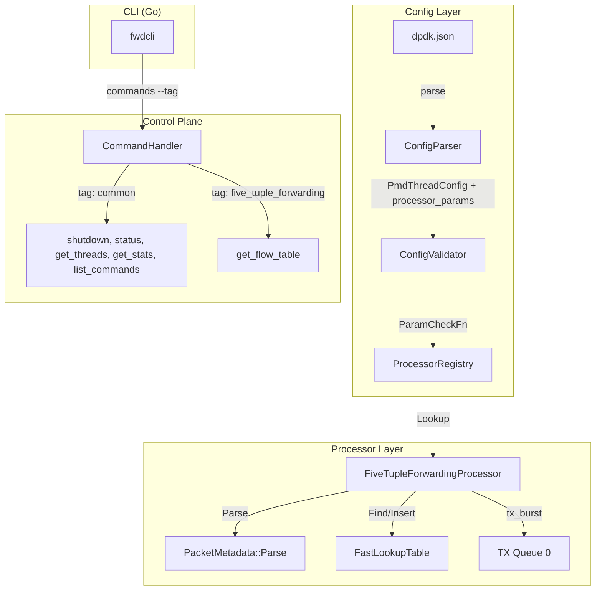

# Design Document: Five-Tuple Forwarding

## Overview

This feature adds a `FiveTupleForwardingProcessor` that extends the existing CRTP-based processor framework with flow-table awareness. Where `SimpleForwardingProcessor` blindly forwards packets from RX to TX, the new processor parses each packet's five-tuple (src_ip, dst_ip, src_port, dst_port, protocol) plus VNI via `PacketMetadata::Parse`, performs a lookup in a `FastLookupTable`, inserts new flows on miss, and forwards all packets to `tx_queues[0]`.

The feature also introduces:
- Per-processor configuration parameters (`processor_params`) in the JSON config, with processor-specific validation via a new `ParamCheckFn` in `ProcessorEntry`.
- A command-tag system on the control plane, where each command carries a string tag (e.g. `"common"`, `"five_tuple_forwarding"`).
- A `list_commands` control-plane command and a CLI `commands` subcommand with `--tag` filtering.

## Architecture

The feature touches four subsystems. The diagram below shows the data flow:



The processor hot-path is monomorphized via CRTP and the `REGISTER_PROCESSOR` macro, identical to `SimpleForwardingProcessor`. The `FastLookupTable` is owned by the processor instance and lives on the PMD thread's stack frame inside the launcher closure.

## Components and Interfaces

### 1. FiveTupleForwardingProcessor

New file: `processor/five_tuple_forwarding_processor.h` / `.cc`

```cpp
class FiveTupleForwardingProcessor
    : public PacketProcessorBase<FiveTupleForwardingProcessor> {
 public:
  explicit FiveTupleForwardingProcessor(
      const dpdk_config::PmdThreadConfig& config,
      PacketStats* stats = nullptr);

  absl::Status check_impl(
      const std::vector<dpdk_config::QueueAssignment>& rx_queues,
      const std::vector<dpdk_config::QueueAssignment>& tx_queues);

  void process_impl();

 private:
  static constexpr uint16_t kBatchSize = 32;
  static constexpr std::size_t kDefaultCapacity = 65536;
  PacketStats* stats_ = nullptr;
  rxtx::FastLookupTable<> table_;
};
```

**Registration**: Self-registers as `"five_tuple_forwarding"` via `REGISTER_PROCESSOR` in the `.cc` file.

**check_impl**: Returns `InvalidArgument` if `tx_queues` is empty; otherwise returns OK.

**process_impl** (hot path):
1. For each RX queue, burst up to `kBatchSize` packets.
2. For each packet, call `PacketMetadata::Parse`. If OK, call `table_.Find(meta)`. If `Find` returns nullptr, call `table_.Insert(...)` with the five-tuple fields from the metadata.
3. If parse fails, skip lookup but still forward the packet.
4. Record stats if stats pointer is non-null.
5. `rte_eth_tx_burst` to `tx_queues[0]`. Free untransmitted mbufs.

**Capacity**: Read from `config.processor_params["capacity"]` in the constructor. If absent, use `kDefaultCapacity` (65536).

### 2. ProcessorEntry Extension — ParamCheckFn

Modified file: `processor/processor_registry.h`

Add a third function to `ProcessorEntry`:

```cpp
using ParamCheckFn = std::function<absl::Status(
    const absl::flat_hash_map<std::string, std::string>& params)>;

struct ProcessorEntry {
  LauncherFn launcher;
  CheckFn checker;
  ParamCheckFn param_checker;  // NEW
};
```

Each processor provides a static `CheckParams` function. The `MakeProcessorEntry` template wires it in. Processors that accept no params (like `SimpleForwardingProcessor`) reject any non-empty map with an error listing the unrecognized key. An empty map always returns OK.

**FiveTupleForwardingProcessor::CheckParams**: Accepts `"capacity"` (must parse to a positive integer). Rejects unrecognized keys.

**SimpleForwardingProcessor::CheckParams**: Rejects all keys (no supported params).

### 3. PmdThreadConfig Extension — processor_params

Modified file: `config/dpdk_config.h`

```cpp
struct PmdThreadConfig {
  // ... existing fields ...
  absl::flat_hash_map<std::string, std::string> processor_params;  // NEW
};
```

### 4. ConfigParser — processor_params Parsing

Modified file: `config/config_parser.cc`

After parsing the `"processor"` field in each `pmd_threads` entry, parse an optional `"processor_params"` JSON object. Each key-value pair is stored as string→string in `PmdThreadConfig::processor_params`. If the field is absent, the map remains empty.

### 5. ConfigValidator — Processor Param Validation

Modified file: `config/config_validator.cc`

During PMD thread validation, after checking lcore/queue assignments, look up the processor name in `ProcessorRegistry` and call `entry->param_checker(pmd_config.processor_params)`. If the param check fails, return the error.

### 6. CommandHandler — Tag System

Modified files: `control/command_handler.h` / `.cc`

Replace the if-else dispatch with a registry of `CommandEntry` structs:

```cpp
struct CommandEntry {
  std::string tag;
  std::function<CommandResponse(const nlohmann::json&)> handler;
};

absl::flat_hash_map<std::string, CommandEntry> commands_;
```

Existing commands (`shutdown`, `status`, `get_threads`, `get_stats`) are registered with tag `"common"`. New commands:
- `"get_flow_table"` — tag `"five_tuple_forwarding"`. Returns `{"entry_count": N}` if the active processor is FiveTupleForwarding, otherwise returns error with status `"not_supported"`.
- `"list_commands"` — tag `"common"`. Returns all commands with tags, or filtered by a `"tag"` param.

New methods:
- `GetCommandsByTag(tag)` → vector of command names matching the tag.
- `GetAllCommands()` → vector of `{name, tag}` pairs.

### 7. Client Extension — SendWithParams

Modified file: `fwdcli/client/client.go`

Add a `SendWithParams(command string, params map[string]string)` method that builds `{"command":"<name>","params":{...}}` and sends it. The existing `Send` method delegates to `SendWithParams` with nil params.

### 8. CLI — commands Subcommand

New file: `fwdcli/cmd/commands.go`

```go
var commandsCmd = &cobra.Command{
    Use:   "commands",
    Short: "List available control-plane commands",
    RunE:  runCommands,
}
```

Flags: `--tag <string>` (optional filter).

Sends `list_commands` (with optional `tag` param) to the control plane. Formats output as a table with columns `COMMAND` and `TAG`, or raw JSON with `--json`.

### 9. Formatter Extension

Modified file: `fwdcli/formatter/formatter.go`

Add `FormatCommands(result json.RawMessage)` that renders the command list as a table.

## Data Models

### PmdThreadConfig (extended)

| Field | Type | Description |
|---|---|---|
| lcore_id | uint32_t | CPU core for this PMD thread |
| rx_queues | vector\<QueueAssignment\> | RX queue assignments |
| tx_queues | vector\<QueueAssignment\> | TX queue assignments |
| processor_name | string | Processor type name |
| processor_params | flat_hash_map\<string, string\> | Per-processor key-value parameters |

### JSON Config Example

```json
{
  "pmd_threads": [
    {
      "lcore_id": 2,
      "processor": "five_tuple_forwarding",
      "processor_params": {
        "capacity": "131072"
      },
      "rx_queues": [{"port_id": 0, "queue_id": 0}],
      "tx_queues": [{"port_id": 0, "queue_id": 0}]
    }
  ]
}
```

### CommandEntry

| Field | Type | Description |
|---|---|---|
| tag | string | Category tag (e.g. "common", "five_tuple_forwarding") |
| handler | function | Handler function for the command |

### list_commands Response

```json
{
  "status": "success",
  "result": {
    "commands": [
      {"name": "shutdown", "tag": "common"},
      {"name": "status", "tag": "common"},
      {"name": "get_flow_table", "tag": "five_tuple_forwarding"}
    ]
  }
}
```

### get_flow_table Response (success)

```json
{
  "status": "success",
  "result": {
    "entry_count": 42
  }
}
```

### get_flow_table Response (not supported)

```json
{
  "status": "error",
  "error": "not_supported"
}
```


## Correctness Properties

*A property is a characteristic or behavior that should hold true across all valid executions of a system — essentially, a formal statement about what the system should do. Properties serve as the bridge between human-readable specifications and machine-verifiable correctness guarantees.*

### Property 1: Insert-on-miss populates the flow table

*For any* valid PacketMetadata whose five-tuple is not already present in a FastLookupTable, calling Find (returning nullptr) followed by Insert with the same five-tuple fields should result in a subsequent Find returning a non-null pointer to an entry whose key fields match the original metadata.

**Validates: Requirements 2.3**

### Property 2: check_impl accepts all non-empty tx_queues

*For any* non-empty vector of QueueAssignment values, calling `FiveTupleForwardingProcessor::check_impl` with that vector as tx_queues should return OK status.

**Validates: Requirements 3.2**

### Property 3: processor_params round-trip through JSON

*For any* map of string-to-string key-value pairs (with valid JSON-string keys and values), serializing the map as a `"processor_params"` JSON object inside a pmd_thread entry and parsing it with ConfigParser should produce a PmdThreadConfig whose `processor_params` field equals the original map.

**Validates: Requirements 4.1**

### Property 4: Capacity validation accepts valid positive integers and rejects all others

*For any* string value, the FiveTupleForwardingProcessor parameter-check function with `{"capacity": value}` should return OK if and only if the string represents a positive integer. Non-integer strings, zero, and negative values should return InvalidArgument.

**Validates: Requirements 5.2, 6.3**

### Property 5: Unrecognized processor parameter keys are rejected

*For any* string key that is not in the set of recognized parameter names for a given processor, the processor's parameter-check function with `{key: "1"}` should return InvalidArgument with an error message containing the unrecognized key name.

**Validates: Requirements 5.3**

### Property 6: Empty parameter map is accepted by all processors

*For any* registered processor in the ProcessorRegistry, calling its param_checker with an empty map should return OK status.

**Validates: Requirements 5.5**

### Property 7: Configured capacity matches table capacity

*For any* valid positive integer capacity value, constructing a FiveTupleForwardingProcessor with `processor_params = {"capacity": "<value>"}` should produce a processor whose internal FastLookupTable has capacity equal to that integer.

**Validates: Requirements 6.1**

### Property 8: Tag filtering returns exactly the matching commands

*For any* tag string, filtering the CommandHandler's registered commands by that tag should return exactly the set of commands whose registered tag equals the given string — no more, no less.

**Validates: Requirements 7.3, 10.3**

### Property 9: Command list formatter includes all command names and tags

*For any* list of `{name, tag}` command entries, the FormatCommands formatter should produce output that contains every command name and every tag from the input list.

**Validates: Requirements 9.4**

## Error Handling

### Processor Layer

| Condition | Behavior |
|---|---|
| `tx_queues` empty at startup | `check_impl` returns `InvalidArgument` — PMD thread does not launch |
| `PacketMetadata::Parse` returns non-OK | Skip flow-table lookup; still forward the packet |
| `FastLookupTable` slab full on Insert | Insert returns nullptr; packet is still forwarded (flow just isn't tracked) |
| `rte_eth_tx_burst` partial send | Free each untransmitted mbuf via `rte_pktmbuf_free` |

### Config Layer

| Condition | Behavior |
|---|---|
| `processor_params` contains unrecognized key | `ParamCheckFn` returns `InvalidArgument` listing the key — startup aborts |
| `capacity` is not a positive integer | `ParamCheckFn` returns `InvalidArgument` — startup aborts |
| `processor_params` field absent from JSON | Map is empty; param check passes (empty map always OK) |

### Control Plane

| Condition | Behavior |
|---|---|
| `get_flow_table` sent to non-FiveTupleForwarding processor | Returns `{"status":"error","error":"not_supported"}` |
| `list_commands` with unknown tag | Returns success with empty commands array |
| Unknown command name | Returns `{"status":"error","error":"Unknown command: <name>"}` |

## Testing Strategy

### Unit Tests

Unit tests cover specific examples and edge cases:

- **Registration**: Verify `ProcessorRegistry::Lookup("five_tuple_forwarding")` returns a valid entry with non-null launcher, checker, and param_checker.
- **check_impl edge case**: Empty tx_queues returns InvalidArgument.
- **Default capacity**: Constructing without `"capacity"` param yields table capacity 65536.
- **Command tags**: Verify shutdown/status/get_threads/get_stats have tag "common"; get_flow_table has tag "five_tuple_forwarding"; list_commands has tag "common".
- **get_flow_table not supported**: Send get_flow_table when active processor is SimpleForwarding, verify "not_supported" error.
- **list_commands unfiltered**: Verify all commands returned.
- **CLI --json output**: Verify raw JSON output for commands subcommand.
- **Absent processor_params**: Verify parsed map is empty.

### Property-Based Tests

Property-based tests use [RapidCheck](https://github.com/emil-e/rapidcheck) (C++) and [rapid](https://pkg.go.dev/pgregory.net/rapid) or Go's built-in `testing/quick` (Go) with a minimum of 100 iterations per property. Each test is tagged with a comment referencing its design property.

| Property | Library | Description |
|---|---|---|
| 1: Insert-on-miss | RapidCheck | Generate random PacketMetadata, Find+Insert, verify Find returns match |
| 2: check_impl accepts non-empty tx_queues | RapidCheck | Generate random non-empty QueueAssignment vectors, verify OK |
| 3: processor_params round-trip | RapidCheck | Generate random string maps, serialize to JSON, parse, compare |
| 4: Capacity validation | RapidCheck | Generate random strings, verify OK iff valid positive integer |
| 5: Unrecognized keys rejected | RapidCheck | Generate random non-"capacity" keys, verify InvalidArgument |
| 6: Empty params accepted | RapidCheck | For each registered processor, verify empty map → OK |
| 7: Configured capacity | RapidCheck | Generate random positive integers, construct processor, verify capacity |
| 8: Tag filtering | RapidCheck | Generate random tag strings, verify filter correctness |
| 9: Command list formatter | Go rapid | Generate random command lists, verify formatter output contains all entries |

**Tag format**: Each property test includes a comment:
```
// Feature: five-tuple-forwarding, Property N: <property title>
```
