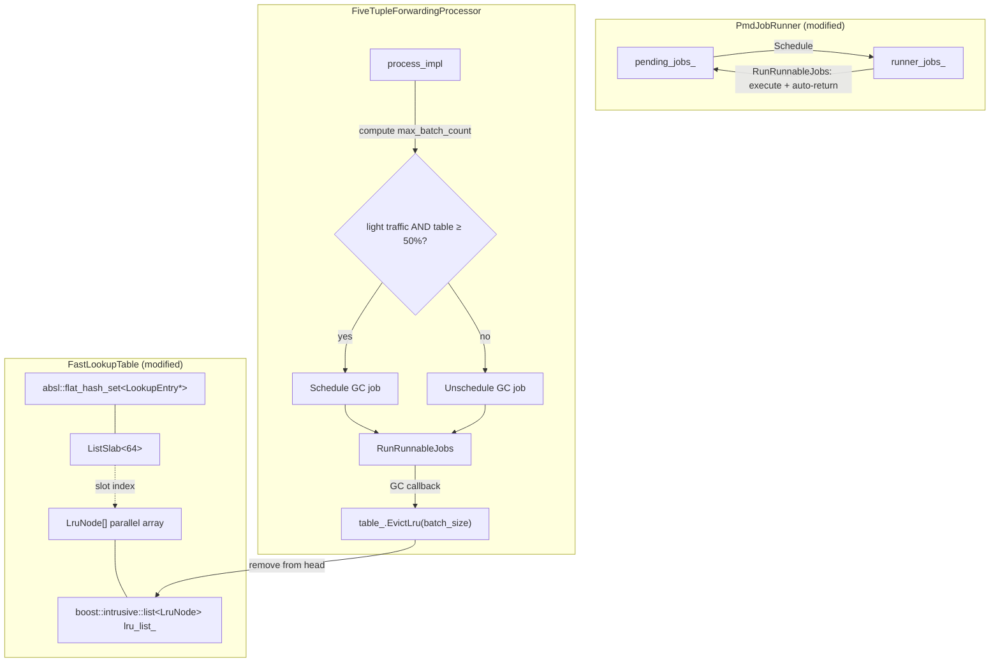

# Design Document: Flow Table Garbage Collection

## Overview

This design covers three coordinated changes to the packet-processing data plane:

1. **PmdJobRunner auto-return** — After `RunRunnableJobs()` executes all jobs on the runner list, it drains the runner list back to pending. Callers must explicitly `Schedule()` each cycle to run a job again. This gives the scheduling logic (e.g., GC conditions) a natural re-evaluation point every cycle.

2. **LRU tracking in FastLookupTable** — A parallel `LruNode` array, indexed by slab slot, maintains a `boost::intrusive::list` (doubly-linked) ordered from least-recently-used (head) to most-recently-used (tail). `Find()` promotes on hit; `Insert()` appends to tail; `Remove()` unlinks. The 64-byte `LookupEntry` layout is unchanged.

3. **Traffic-aware GC scheduling** — `FiveTupleForwardingProcessor` tracks the maximum RX batch count per `process_impl()` call. When traffic is light (`max_batch_count < kBatchSize / 2`) AND the table is ≥ 50% full, the GC job is scheduled. The GC callback evicts a fixed batch of LRU-head entries unconditionally. After execution, auto-return moves the job back to pending, so conditions are re-evaluated next cycle.

### Design Rationale

- **Parallel array, not embedded in LookupEntry**: Adding a `list_member_hook` (16 bytes for doubly-linked) to `LookupEntry` would break the 64-byte cache-line layout. A parallel `LruNode` array indexed by slab slot keeps the hot lookup path cache-friendly while adding O(1) LRU operations.
- **Unconditional eviction**: No timestamp or age checks during GC. The LRU ordering itself is the eviction policy — entries at the head haven't been looked up recently. This keeps per-entry GC cost to a constant.
- **Auto-return pattern**: Jobs return to pending after execution rather than staying on the runner list. This prevents stale scheduling decisions — each cycle must re-evaluate whether conditions still warrant running the job.

## Architecture



### Data Flow

1. `process_impl()` bursts packets from all RX queues, tracking `max_batch_count`.
2. For each packet, `Find()` promotes the matching `LruNode` to the LRU tail.
3. On miss, `Insert()` allocates a slab entry and appends a new `LruNode` to the tail.
4. After all RX queues are processed, `RefreshGcScheduling()` evaluates conditions.
5. `RunRunnableJobs()` executes the GC callback if scheduled, then auto-returns it to pending.
6. The GC callback calls `EvictLru()`, which pops entries from the LRU head, erases them from the hash set, and deallocates from the slab.

## Components and Interfaces

### 1. PmdJobRunner — Auto-Return Modification

**File**: `processor/pmd_job.h`

Current `RunRunnableJobs()` iterates `runner_jobs_` and calls each job's callback but leaves jobs on the runner list. The modification drains `runner_jobs_` back to `pending_jobs_` after execution.

```cpp
void RunRunnableJobs(uint64_t now_tsc) {
  // Execute all runner jobs.
  for (auto it = runner_jobs_.begin(); it != runner_jobs_.end(); ++it) {
    it->Run(now_tsc);
  }
  // Auto-return: move all executed jobs back to pending.
  while (!runner_jobs_.empty()) {
    PmdJob& job = runner_jobs_.front();
    runner_jobs_.pop_front();
    job.state_ = PmdJob::State::kPending;
    pending_jobs_.push_back(job);
  }
}
```

**Key invariant**: After `RunRunnableJobs()` returns, `runner_jobs_` is empty and all previously-running jobs are in `kPending` state.

**Impact on callers**: `FiveTupleForwardingProcessor` already tracks `gc_job_scheduled_` separately. After auto-return, `gc_job_scheduled_` must be reset to `false` so `RefreshGcScheduling()` can re-evaluate. This is handled by checking the job's state in `RefreshGcScheduling()`.

### 2. LruNode and Parallel Array

**File**: `rxtx/fast_lookup_table.h` (new struct + new members)

```cpp
struct LruNode {
  boost::intrusive::list_member_hook<> lru_hook;
  std::size_t slot_index;  // index into slab backing array
};
```

- `lru_hook`: 16 bytes (two pointers for doubly-linked list).
- `slot_index`: 8 bytes. Identifies the corresponding `LookupEntry` in the slab.
- Total: 24 bytes per node.

**Parallel array**: `std::unique_ptr<LruNode[]> lru_nodes_` allocated in the `FastLookupTable` constructor with the same capacity as the slab.

**LRU list type**:
```cpp
using LruList = boost::intrusive::list<
    LruNode,
    boost::intrusive::member_hook<
        LruNode, boost::intrusive::list_member_hook<>, &LruNode::lru_hook>>;
```

### 3. ListSlab — Expose Slab Base Pointer

**File**: `rxtx/list_slab.h`

Add a public accessor to expose the slab base pointer for slot index computation:

```cpp
const uint8_t* slab_base() const { return slab_; }
```

**Slot index computation** (in `FastLookupTable`):
```cpp
std::size_t SlotIndex(const LookupEntry* entry) const {
  return (reinterpret_cast<const uint8_t*>(entry) - slab_.slab_base()) 
         / sizeof(LookupEntry);
}
```

### 4. FastLookupTable — LRU Integration

**File**: `rxtx/fast_lookup_table.h`

New/modified methods:

| Method | Change |
|--------|--------|
| `Insert()` | After inserting into hash set, compute slot index, set `lru_nodes_[slot].slot_index`, push `LruNode` to LRU tail |
| `Find()` (both overloads) | On hit, compute slot index, move `LruNode` to LRU tail (splice to end) |
| `Remove()` | Before deallocating, unlink `LruNode` from LRU list |
| `EvictLru(size_t batch_size)` | **New**. Pop up to `batch_size` nodes from LRU head, erase from hash set, deallocate from slab. Returns count removed. |
| `ForEach()` | When `fn` returns true (erase), also unlink the corresponding `LruNode` |

**LRU promotion** (O(1) with `boost::intrusive::list`):
```cpp
// Move node to tail (most-recently-used).
lru_list_.splice(lru_list_.end(), lru_list_, lru_list_.iterator_to(node));
```

**EvictLru** signature:
```cpp
std::size_t EvictLru(std::size_t batch_size);
```

### 5. FiveTupleForwardingProcessor — GC Scheduling

**File**: `processor/five_tuple_forwarding_processor.h/.cc`

New/modified members:

| Member | Purpose |
|--------|---------|
| `static constexpr std::size_t kGcBatchSize = 16` | Default GC eviction batch size |
| `uint16_t max_batch_count_` | Max `batch.Count()` across all RX queues in current `process_impl()` |

**Modified `process_impl()`**: Reset `max_batch_count_ = 0` at the top. After each `rte_eth_rx_burst`, update `max_batch_count_ = std::max(max_batch_count_, batch.Count())`. Call `RefreshGcScheduling()` after the RX loop.

**Modified `ShouldTriggerGc()`**:
```cpp
bool ShouldTriggerGc() const {
  return max_batch_count_ < kBatchSize / 2 &&
         table_.size() >= table_.capacity() / 2;
}
```

**Modified `RefreshGcScheduling()`**: After auto-return, the job is in `kPending` state. Sync `gc_job_scheduled_` by checking `flow_gc_job_.state() == PmdJob::State::kRunner`:
```cpp
void RefreshGcScheduling() {
  if (job_runner_ == nullptr || !gc_job_registered_) return;
  // Sync with auto-return: if job was returned to pending, update our flag.
  gc_job_scheduled_ = (flow_gc_job_.state() == PmdJob::State::kRunner);
  
  bool should_run = ShouldTriggerGc();
  if (should_run && !gc_job_scheduled_) {
    gc_job_scheduled_ = job_runner_->Schedule(&flow_gc_job_);
  } else if (!should_run && gc_job_scheduled_) {
    if (job_runner_->Unschedule(&flow_gc_job_)) {
      gc_job_scheduled_ = false;
    }
  }
}
```

**Modified `RunFlowGc()`**:
```cpp
void RunFlowGc(uint64_t /*now_tsc*/) {
  table_.EvictLru(kGcBatchSize);
}
```


## Data Models

### LruNode

```cpp
struct LruNode {
  boost::intrusive::list_member_hook<> lru_hook;  // 16 bytes (prev + next ptr)
  std::size_t slot_index;                          // 8 bytes
};
// Total: 24 bytes per node
```

- Allocated as a contiguous array: `std::unique_ptr<LruNode[]>` with `capacity` elements.
- `slot_index` is set once at insert time and never changes for the lifetime of the node's participation in the LRU list.
- `lru_hook` uses `safe_link` mode so `is_linked()` can be queried.

### LruList

```cpp
using LruList = boost::intrusive::list<
    LruNode,
    boost::intrusive::member_hook<
        LruNode, boost::intrusive::list_member_hook<>, &LruNode::lru_hook>>;
```

- Head = least-recently-used, Tail = most-recently-used.
- All operations (push_back, splice, erase, pop_front) are O(1).

### Slot Index Mapping

```
ListSlab backing array:  [ Entry_0 | Entry_1 | Entry_2 | ... | Entry_{N-1} ]
LruNode parallel array:  [ Node_0  | Node_1  | Node_2  | ... | Node_{N-1}  ]
                            ↕          ↕          ↕               ↕
                         slot 0     slot 1     slot 2          slot N-1
```

- `LruNode[i].slot_index == i` always.
- Given a `LookupEntry*`, compute slot index: `(ptr - slab_base) / sizeof(LookupEntry)`.
- Given a slot index, get `LookupEntry*`: `reinterpret_cast<LookupEntry*>(slab_base + slot * sizeof(LookupEntry))`.

### PmdJob State Machine (Modified)

```
         Register()          Schedule()
  kIdle ──────────► kPending ──────────► kRunner
    ▲                  ▲                    │
    │                  │   auto-return      │
    │ Unregister()     └────────────────────┘
    │                  │   RunRunnableJobs()
    └──────────────────┘
         Unregister()
```

The new auto-return transition replaces the previous behavior where jobs stayed on the runner list indefinitely until explicitly unscheduled.

### FastLookupTable Modified State

| Field | Type | Description |
|-------|------|-------------|
| `slab_` | `ListSlab<64>` | Existing slab allocator |
| `set_` | `absl::flat_hash_set<LookupEntry*>` | Existing hash set |
| `modifiable_` | `std::atomic<bool>` | Existing modification guard |
| `lru_nodes_` | `std::unique_ptr<LruNode[]>` | **New** — parallel array |
| `lru_list_` | `LruList` | **New** — doubly-linked LRU list |

### FiveTupleForwardingProcessor Modified State

| Field | Type | Description |
|-------|------|-------------|
| `max_batch_count_` | `uint16_t` | **New** — max batch count across RX queues per cycle |
| `kGcBatchSize` | `static constexpr size_t` | **New** — default 16, entries evicted per GC run |


## Correctness Properties

*A property is a characteristic or behavior that should hold true across all valid executions of a system — essentially, a formal statement about what the system should do. Properties serve as the bridge between human-readable specifications and machine-verifiable correctness guarantees.*

### Property 1: Auto-return drains runner list

*For any* set of N registered and scheduled PmdJobs (N ≥ 0), after `RunRunnableJobs(now_tsc)` completes, every job that was on the runner list SHALL be in `kPending` state and `runner_size()` SHALL be zero, while `pending_size()` SHALL equal the total number of registered jobs.

**Validates: Requirements 1.1, 1.2**

### Property 2: Auto-return enables re-scheduling (round-trip)

*For any* PmdJob that has been registered, scheduled, and executed via `RunRunnableJobs()`, a subsequent `Schedule()` call SHALL succeed (return true) and move the job back to `kRunner` state.

**Validates: Requirements 1.3**

### Property 3: Exactly-once callback execution per RunRunnableJobs

*For any* set of N jobs on the runner list, calling `RunRunnableJobs(now_tsc)` SHALL invoke each job's callback exactly once. Verified by: each job's call counter increments by exactly 1.

**Validates: Requirements 1.5**

### Property 4: LRU list size invariant

*For any* sequence of `Insert()`, `Remove()`, `Find()`, and `EvictLru()` operations on a `FastLookupTable`, the LRU list size SHALL always equal `set_.size()` (the hash set size). Equivalently, `lru_list_.size() == size()` is an invariant after every operation.

**Validates: Requirements 2.5, 2.6, 4.7**

### Property 5: Find promotes hit to LRU tail

*For any* `FastLookupTable` containing two or more entries, when `Find()` returns a non-null entry, that entry's corresponding `LruNode` SHALL be at the tail of the LRU list after the call.

**Validates: Requirements 3.1**

### Property 6: Find miss preserves LRU order

*For any* `FastLookupTable` state, when `Find()` returns nullptr (miss), the sequence of `LruNode` elements in the LRU list SHALL be identical before and after the call.

**Validates: Requirements 3.2**

### Property 7: Eviction removes from LRU head in order

*For any* `FastLookupTable` with K entries (K > 0) and a call to `EvictLru(batch_size)`, the entries removed SHALL be exactly the first `min(batch_size, K)` entries from the head of the LRU list (i.e., the least-recently-used entries), and they SHALL be removed in head-to-tail order.

**Validates: Requirements 4.1**

### Property 8: Eviction count bounded by min(batch_size, table_size)

*For any* `FastLookupTable` with K entries and any `batch_size` value, `EvictLru(batch_size)` SHALL return exactly `min(batch_size, K)` and the table size SHALL decrease by that amount.

**Validates: Requirements 4.2, 4.6**

### Property 9: GC scheduling decision correctness

*For any* combination of `max_batch_count` (0..kBatchSize) and table occupancy ratio, `ShouldTriggerGc()` SHALL return true if and only if `max_batch_count < kBatchSize / 2` AND `table_.size() >= table_.capacity() / 2`.

**Validates: Requirements 5.2, 6.1, 6.2**

## Error Handling

### PmdJobRunner

- `RunRunnableJobs()` with empty runner list: no-op, no error. Pending jobs are unaffected.
- `Schedule()` on a job not in `kPending` state: returns `false`, no state change.
- `Schedule()` after auto-return: succeeds because job is back in `kPending`.

### FastLookupTable LRU Operations

- `EvictLru(batch_size)` on empty table: returns 0, no side effects.
- `EvictLru(batch_size)` when `batch_size > table size`: removes all entries, returns actual count.
- `Find()` miss: no LRU modification, returns nullptr.
- `Insert()` when slab is full: returns nullptr, no LRU node added (existing behavior preserved).
- `Remove()` when `modifiable_` is false: returns false, no LRU modification (existing behavior preserved).

### FiveTupleForwardingProcessor GC

- GC callback on empty table: `EvictLru()` returns 0, callback completes normally.
- `job_runner_` is nullptr: `RefreshGcScheduling()` returns immediately.
- GC job not registered: `RefreshGcScheduling()` returns immediately.

## Testing Strategy

### Property-Based Testing

Use [RapidCheck](https://github.com/emil-e/rapidcheck) as the property-based testing library (already available in the project via `patches/rapidcheck_build.patch`).

Each property test MUST:
- Run a minimum of 100 iterations
- Reference the design property via comment tag
- Use RapidCheck generators for random input generation

**Property test mapping:**

| Property | Test Target | Generator Strategy |
|----------|-------------|-------------------|
| Property 1: Auto-return drains runner list | `PmdJobRunner` | Generate N ∈ [0, 20] jobs, register + schedule all, run, verify states |
| Property 2: Auto-return round-trip | `PmdJobRunner` | Generate N ∈ [1, 10] jobs, run cycle, re-schedule, verify success |
| Property 3: Exactly-once callback | `PmdJobRunner` | Generate N ∈ [1, 20] jobs with counters, run once, verify counters |
| Property 4: LRU list size invariant | `FastLookupTable` | Generate random sequences of Insert/Remove/Find/EvictLru ops, verify invariant after each |
| Property 5: Find promotes to tail | `FastLookupTable` | Generate table with K ∈ [2, 50] entries, find random entry, verify tail |
| Property 6: Find miss preserves order | `FastLookupTable` | Generate table, snapshot LRU order, find non-existent key, verify order unchanged |
| Property 7: Eviction from head | `FastLookupTable` | Generate table with K entries, snapshot head entries, evict, verify removed set matches |
| Property 8: Eviction count | `FastLookupTable` | Generate table with K ∈ [0, 100] entries and batch_size ∈ [1, 50], verify return == min(batch, K) |
| Property 9: GC scheduling decision | `ShouldTriggerGc` | Generate (max_batch_count, table_size, capacity) tuples, verify boolean result |

**Tag format**: `// Feature: flow-table-gc, Property N: <property_text>`

### Unit Tests

Unit tests complement property tests for specific examples, edge cases, and integration points:

**PmdJobRunner:**
- Empty runner list: `RunRunnableJobs()` is a no-op
- Single job auto-return cycle
- Multiple jobs with interleaved Schedule/Run cycles

**FastLookupTable LRU:**
- `sizeof(LookupEntry) == 64` static assertion (compile-time, existing)
- Insert single entry → LRU list has one element at tail
- Remove only entry → LRU list is empty
- `EvictLru(0)` returns 0
- `EvictLru` on empty table returns 0
- `EvictLru` when table has fewer entries than batch_size
- `ForEach` with removal correctly unlinks LruNodes
- Slot index computation: insert entry, verify `SlotIndex()` matches expected arithmetic

**FiveTupleForwardingProcessor (integration):**
- GC callback on empty table completes without error
- GC job auto-return + re-evaluation cycle (mock `process_impl` conditions)
- `ShouldTriggerGc` boundary values: `max_batch_count` at exactly `kBatchSize / 2`, table at exactly 50%

### Test Configuration

- Property tests: minimum 100 iterations each via RapidCheck
- Unit tests: Google Test framework (existing)
- All tests run single-threaded (matching production PMD thread model)
