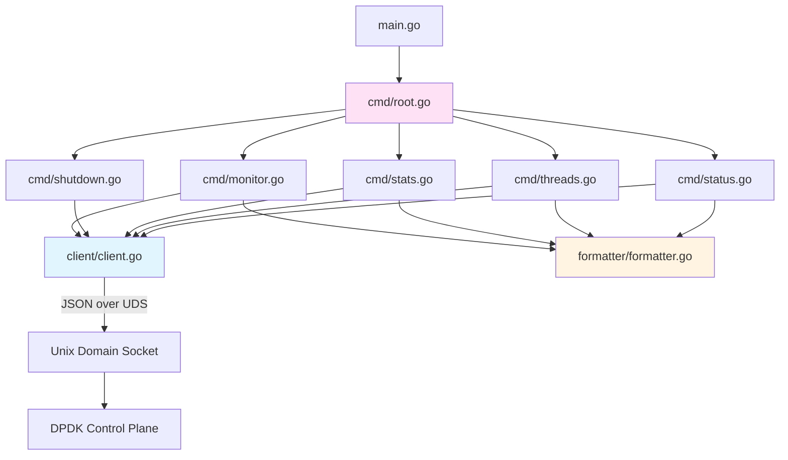
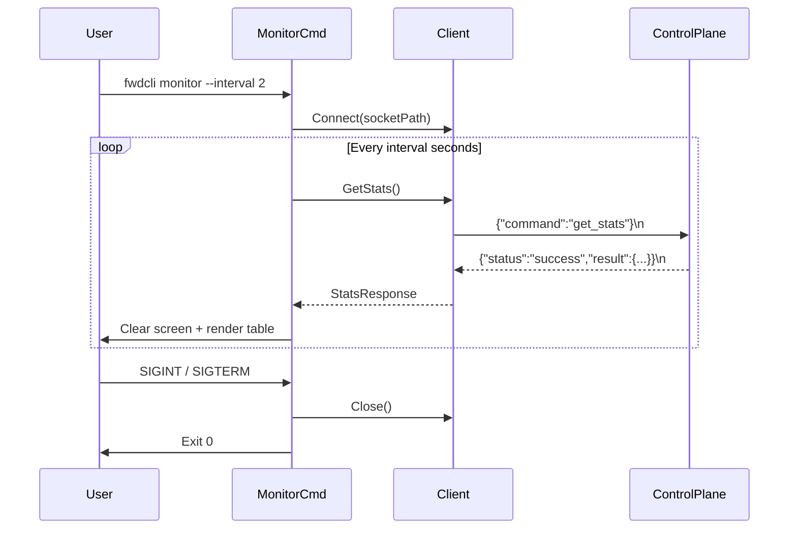

# Design Document: fwdcli-tool

## Overview

fwdcli is a Go CLI tool that communicates with the DPDK forwarding application's control plane over a Unix domain socket. It sends newline-delimited JSON commands and renders responses as either human-readable tables or raw JSON. The tool is built with Bazel using `rules_go` and produces a single statically linked binary.

The design is organized into three Go packages:
- `client` — Unix socket I/O and JSON protocol handling
- `cmd` — cobra subcommand definitions and flag parsing
- `formatter` — output rendering (human-readable tables and raw JSON)

A `monitor` loop in the `cmd` package handles the long-running stats polling mode with signal-based cancellation via Go's `context` and `os/signal` packages.

## Architecture

### Component Diagram



### Execution Flow

1. `main.go` calls `cmd.Execute()` which invokes the cobra root command
2. Cobra parses flags (`--socket`, `--json`, `--version`) and routes to a subcommand
3. The subcommand creates a `client.Client`, calls the appropriate method (e.g., `Status()`)
4. `client.Client` connects to the Unix socket, sends the JSON command, reads the response
5. The subcommand passes the response to `formatter` for rendering
6. Exit code is set based on the outcome (0 success, 1 connection error, 2 usage error, 3 server error)

### Monitor Mode Flow



## Components and Interfaces

### Package: `client`

The client package handles all Unix socket communication and JSON protocol encoding/decoding.

```go
package client

// Client communicates with the DPDK control plane over a Unix domain socket.
type Client struct {
    socketPath string
    conn       net.Conn
    timeout    time.Duration
}

// New creates a Client configured for the given socket path.
func New(socketPath string, timeout time.Duration) *Client

// Connect establishes the Unix domain socket connection.
// Returns an error if the socket file does not exist or connection fails.
func (c *Client) Connect() error

// Close closes the underlying socket connection.
func (c *Client) Close() error

// Send sends a command name to the control plane and returns the parsed response.
// It writes {"command":"<name>"}\n and reads until the next newline.
func (c *Client) Send(command string) (*Response, error)

// Response represents a parsed JSON response from the control plane.
type Response struct {
    Status string          `json:"status"`
    Result json.RawMessage `json:"result"`
    Error  string          `json:"error"`
}

// IsSuccess returns true if the response status is "success".
func (r *Response) IsSuccess() bool
```

**Design decisions:**
- `json.RawMessage` for `Result` defers parsing to the caller, keeping the client generic
- `Connect()` is separate from `New()` so monitor mode can create the client once and connect once, reusing the connection across polling cycles
- 5-second default timeout matches Requirement 2.7

### Package: `cmd`

The cmd package defines the cobra command tree and wires together client and formatter.

```go
package cmd

var (
    socketPath string  // --socket flag
    jsonOutput bool    // --json flag
    version    string  // injected via ldflags / x_defs
)

// Execute runs the root cobra command. Called from main().
func Execute()
```

Each subcommand file (`status.go`, `threads.go`, `stats.go`, `shutdown.go`, `monitor.go`) registers itself with the root command via `init()`.

**Root command flags:**
- `--socket` (string, default `/tmp/dpdk_control.sock`) — socket path
- `--json` (bool, default false) — raw JSON output mode
- `--version` (bool) — print version and exit

**Monitor-specific flags:**
- `--interval` (int, default 1) — polling interval in seconds

**Exit code mapping:**
```go
const (
    ExitSuccess       = 0
    ExitConnError     = 1
    ExitUsageError    = 2
    ExitServerError   = 3
)
```

### Package: `formatter`

The formatter package renders control plane responses for terminal output.

```go
package formatter

// FormatStatus renders a status response as a human-readable string.
// Fields: main_lcore, num_pmd_threads, uptime_seconds
func FormatStatus(result json.RawMessage) (string, error)

// FormatThreads renders a get_threads response as a human-readable list.
func FormatThreads(result json.RawMessage) (string, error)

// FormatStats renders a get_stats response as a tabular string.
// Columns: lcore_id, packets, bytes
// Footer: total packets, total bytes
func FormatStats(result json.RawMessage) (string, error)

// FormatStatsMonitor renders stats with a timestamp header and ANSI clear-screen prefix.
func FormatStatsMonitor(result json.RawMessage, ts time.Time) (string, error)

// FormatJSON pretty-prints raw JSON for --json mode.
func FormatJSON(raw json.RawMessage) (string, error)
```

**Design decisions:**
- Each formatter function takes `json.RawMessage` and returns a string, keeping formatting pure and testable
- `FormatStatsMonitor` prepends ANSI escape `\033[2J\033[H` for clear-screen dashboard behavior
- `FormatJSON` uses `json.MarshalIndent` for readable JSON output in `--json` mode

### `main.go`

```go
package main

import "github.com/your-org/fwdcli/cmd"

func main() {
    cmd.Execute()
}
```

### Signal Handling (Monitor Mode)

Monitor mode uses Go's `context.Context` with `signal.NotifyContext` for clean cancellation:

```go
ctx, stop := signal.NotifyContext(context.Background(), syscall.SIGINT, syscall.SIGTERM)
defer stop()

ticker := time.NewTicker(interval)
defer ticker.Stop()

for {
    select {
    case <-ctx.Done():
        return nil  // exit 0
    case <-ticker.C:
        resp, err := client.Send("get_stats")
        if err != nil {
            return err  // exit 1
        }
        // render
    }
}
```

## Data Models

### JSON Protocol (Wire Format)

The CLI uses the existing newline-delimited JSON protocol defined by the C++ control plane.

#### Request

```json
{"command":"<name>"}\n
```

The CLI only sends the `command` field. No `params` are needed for any current command.

#### Success Response

```json
{"status":"success","result":{...}}\n
```

#### Error Response

```json
{"status":"error","error":"<message>"}\n
```

### Command-Specific Result Schemas

#### `status` Result

```json
{
  "main_lcore": 0,
  "num_pmd_threads": 4,
  "uptime_seconds": 3600
}
```

#### `get_threads` Result

```json
{
  "threads": [
    {"lcore_id": 1},
    {"lcore_id": 2}
  ]
}
```

#### `get_stats` Result

```json
{
  "threads": [
    {"lcore_id": 1, "packets": 1000, "bytes": 64000},
    {"lcore_id": 2, "packets": 2000, "bytes": 128000}
  ],
  "total": {
    "packets": 3000,
    "bytes": 192000
  }
}
```

### Go Structs for Response Parsing

```go
// StatusResult maps the status command result.
type StatusResult struct {
    MainLcore     int `json:"main_lcore"`
    NumPmdThreads int `json:"num_pmd_threads"`
    UptimeSeconds int `json:"uptime_seconds"`
}

// ThreadInfo represents a single PMD thread entry.
type ThreadInfo struct {
    LcoreID int `json:"lcore_id"`
}

// ThreadsResult maps the get_threads command result.
type ThreadsResult struct {
    Threads []ThreadInfo `json:"threads"`
}

// ThreadStats represents per-thread statistics.
type ThreadStats struct {
    LcoreID int    `json:"lcore_id"`
    Packets uint64 `json:"packets"`
    Bytes   uint64 `json:"bytes"`
}

// TotalStats represents aggregate statistics.
type TotalStats struct {
    Packets uint64 `json:"packets"`
    Bytes   uint64 `json:"bytes"`
}

// StatsResult maps the get_stats command result.
type StatsResult struct {
    Threads []ThreadStats `json:"threads"`
    Total   TotalStats    `json:"total"`
}
```

### Bazel Build Configuration

#### MODULE.bazel additions

```python
bazel_dep(name = "rules_go", version = "0.53.0")
bazel_dep(name = "gazelle", version = "0.42.0")

go_deps = use_extension("@gazelle//:extensions.bzl", "go_deps")
go_deps.from_file(go_mod = "//fwdcli:go.mod")
use_repo(go_deps, "com_github_spf13_cobra")
```

#### `fwdcli/BUILD`

```python
load("@rules_go//go:def.bzl", "go_binary", "go_library", "go_test")

go_library(
    name = "fwdcli_lib",
    srcs = ["main.go"],
    importpath = "fwdcli",
    deps = ["//fwdcli/cmd"],
)

go_binary(
    name = "fwdcli",
    embed = [":fwdcli_lib"],
    x_defs = {
        "fwdcli/cmd.version": "{STABLE_VERSION}",
    },
    visibility = ["//visibility:public"],
)
```

#### Directory Layout

```
fwdcli/
├── BUILD
├── go.mod
├── go.sum
├── main.go
├── client/
│   ├── BUILD
│   ├── client.go
│   └── client_test.go
├── cmd/
│   ├── BUILD
│   ├── root.go
│   ├── status.go
│   ├── threads.go
│   ├── stats.go
│   ├── shutdown.go
│   └── monitor.go
└── formatter/
    ├── BUILD
    ├── formatter.go
    └── formatter_test.go
```


## Correctness Properties

*A property is a characteristic or behavior that should hold true across all valid executions of a system — essentially, a formal statement about what the system should do. Properties serve as the bridge between human-readable specifications and machine-verifiable correctness guarantees.*

### Property 1: Command serialization format

*For any* valid command name string, the bytes written to the socket by `client.Send()` should be exactly `{"command":"<name>"}` followed by a newline character, and the result should be valid JSON.

**Validates: Requirements 2.4**

### Property 2: Response deserialization round-trip

*For any* valid JSON response string terminated by a newline (with status "success" or "error"), parsing it with the client's response reader should produce a `Response` struct whose re-serialization contains the same status, result, and error fields.

**Validates: Requirements 2.5**

### Property 3: Status formatter completeness

*For any* `StatusResult` with arbitrary non-negative values for `main_lcore`, `num_pmd_threads`, and `uptime_seconds`, the output of `FormatStatus()` should contain string representations of all three values.

**Validates: Requirements 3.2**

### Property 4: Threads formatter completeness

*For any* `ThreadsResult` containing a list of threads with arbitrary `lcore_id` values, the output of `FormatThreads()` should contain the string representation of every `lcore_id` in the list.

**Validates: Requirements 4.2**

### Property 5: Stats formatter completeness

*For any* `StatsResult` with arbitrary per-thread `lcore_id`, `packets`, and `bytes` values, and a `total` with `packets` and `bytes`, the output of `FormatStats()` should contain string representations of every per-thread value and both total values.

**Validates: Requirements 5.2**

### Property 6: Error response handling

*For any* `Response` with status "error" and an arbitrary non-empty error message string, the CLI should output that error message to stderr and return exit code 3.

**Validates: Requirements 3.3, 4.3, 5.3, 6.4, 10.4**

### Property 7: Exit code mapping

*For any* command execution outcome, the exit code should be deterministic: 0 for success, 1 for connection errors, 2 for usage/flag errors, and 3 for server error responses. No other exit codes should be produced.

**Validates: Requirements 10.1, 10.2, 10.3, 10.4**

### Property 8: Interval validation

*For any* integer value provided to the `--interval` flag, the value should be accepted if and only if it is a positive integer. Non-positive integers and non-numeric strings should be rejected with exit code 2.

**Validates: Requirements 7.3, 7.4**

### Property 9: Monitor output format

*For any* `StatsResult` and any timestamp, the output of `FormatStatsMonitor()` should begin with ANSI clear-screen escape codes and contain a string representation of the timestamp.

**Validates: Requirements 7.5, 7.9**

### Property 10: JSON output mode passthrough

*For any* valid JSON response from the control plane, when `--json` mode is active, the stdout output should be valid JSON that is semantically equivalent to the original response.

**Validates: Requirements 8.1**

### Property 11: JSON monitor mode line format

*For any* sequence of stats responses in monitor mode with `--json`, each output line should be a valid, self-contained JSON object parseable by `json.Unmarshal`.

**Validates: Requirements 8.3**

### Property 12: Socket path override

*For any* valid filesystem path string provided via the `--socket` flag, the client should attempt to connect to exactly that path (not the default).

**Validates: Requirements 2.3**

## Error Handling

### Error Categories and Exit Codes

| Category | Exit Code | Examples |
|---|---|---|
| Success | 0 | Command completed, shutdown acknowledged, monitor interrupted by signal |
| Connection Error | 1 | Socket not found, connection refused, timeout, server unreachable during monitor |
| Usage Error | 2 | Unknown subcommand, invalid flag, non-positive interval |
| Server Error | 3 | Control plane returned `{"status":"error",...}` |

### Connection Errors

- **Socket not found**: `client.Connect()` checks if the socket file exists before dialing. If not, returns a descriptive error. The subcommand maps this to exit code 1.
- **Connection refused**: The Unix socket exists but no server is listening. `net.Dial` returns an error, mapped to exit code 1.
- **Timeout**: A 5-second deadline is set on the connection via `conn.SetDeadline()`. If the server doesn't respond in time, the read returns `os.ErrDeadlineExceeded`, mapped to exit code 1.

### Shutdown Edge Case

When the shutdown command is sent, the server may close the connection before sending a response (because it's shutting down). The client detects `io.EOF` on read and, for the shutdown command specifically, treats this as success (exit code 0) per Requirement 6.3.

### Monitor Mode Errors

- If the server becomes unreachable mid-polling, `client.Send()` returns an error. The monitor loop prints the error to stderr and exits with code 1.
- SIGINT/SIGTERM during monitoring triggers clean exit (code 0) via `context.Context` cancellation.

### Invalid Input Handling

- Cobra handles unknown subcommands and flags, printing usage and exiting with code 2.
- The `--interval` flag is validated in the monitor command's `PreRunE`: non-positive values trigger exit code 2.

## Testing Strategy

### Unit Tests

Unit tests verify specific examples, edge cases, and integration points:

**client package:**
- Connecting to a valid mock Unix socket succeeds
- Connecting to a non-existent socket path returns an error
- Sending a command writes the correct JSON bytes to the socket
- Reading a newline-terminated response parses correctly
- Timeout triggers when server doesn't respond within deadline
- Shutdown command treats EOF as success

**formatter package:**
- `FormatStatus` renders known values correctly
- `FormatThreads` renders an empty thread list
- `FormatStats` renders a known stats response as a table
- `FormatStatsMonitor` includes ANSI clear codes and timestamp
- `FormatJSON` produces indented valid JSON

**cmd package:**
- Default socket path is `/tmp/dpdk_control.sock`
- `--socket` flag overrides the default
- `--json` flag enables JSON output mode
- `--interval 0` is rejected
- `--interval -1` is rejected
- `--interval abc` is rejected

### Property-Based Tests

Property tests use the `testing/quick` package from Go's standard library (or `gopter` for more control). Each test runs a minimum of 100 iterations.

Each property test references its design document property with a comment:
```go
// Feature: fwdcli-tool, Property N: <property text>
```

**client package property tests:**
- Property 1: Command serialization format
- Property 2: Response deserialization round-trip

**formatter package property tests:**
- Property 3: Status formatter completeness
- Property 4: Threads formatter completeness
- Property 5: Stats formatter completeness
- Property 9: Monitor output format
- Property 10: JSON output mode passthrough
- Property 11: JSON monitor mode line format

**cmd package property tests:**
- Property 6: Error response handling
- Property 7: Exit code mapping
- Property 8: Interval validation
- Property 12: Socket path override

### Test Configuration

- Framework: Go's built-in `testing` package
- Property testing: `testing/quick` (stdlib) for simple properties, `gopter` if generators need more control
- Minimum 100 iterations per property test
- Tests run via `bazel test //fwdcli/...`
- Mock Unix socket server for client tests (use `net.Listen("unix", ...)` in test setup)
- Each property test tagged with: `// Feature: fwdcli-tool, Property {number}: {property_text}`
