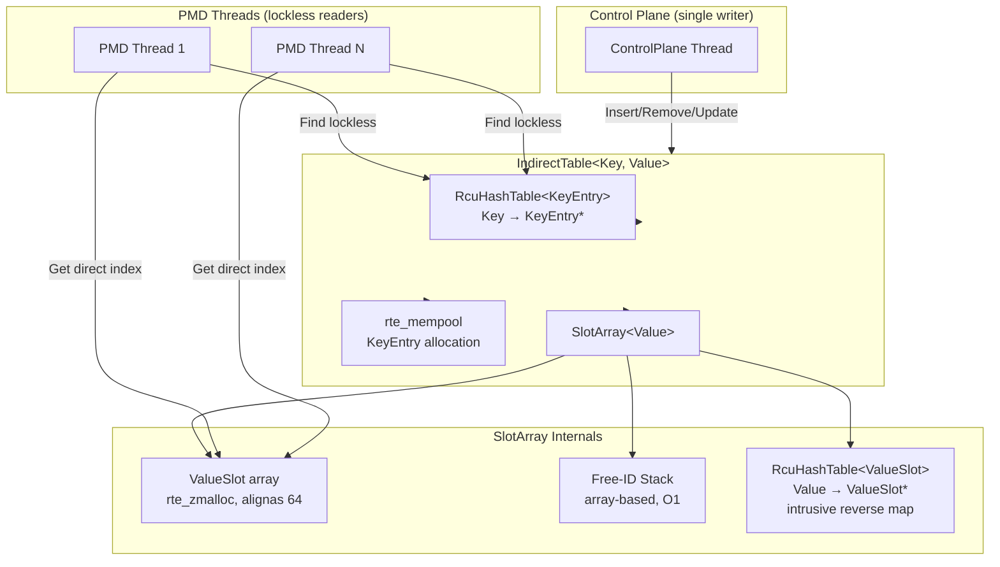
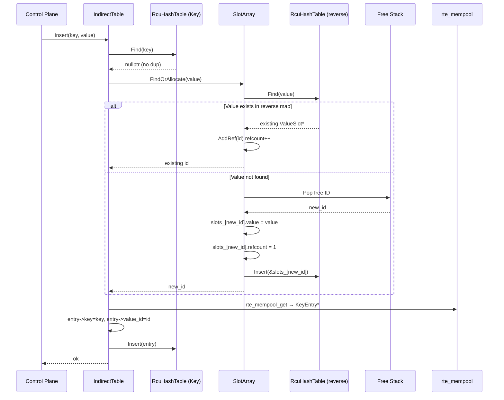
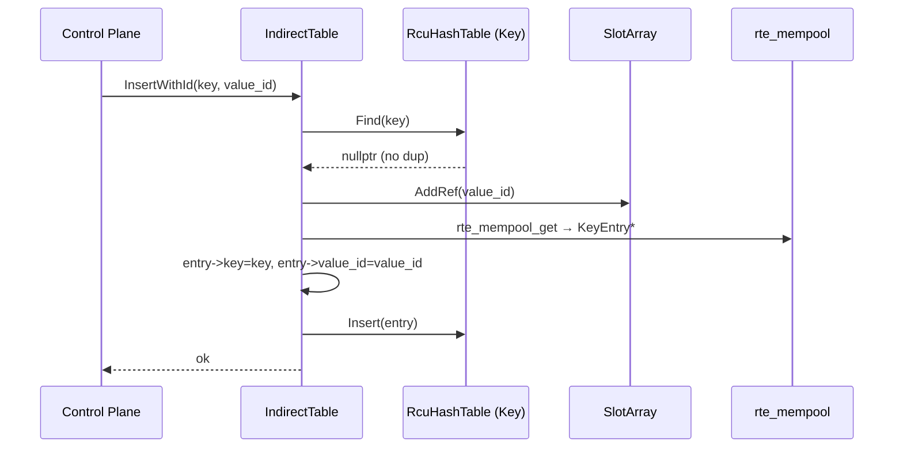
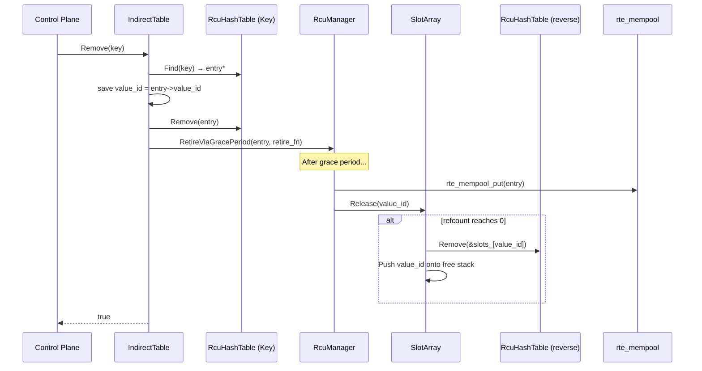
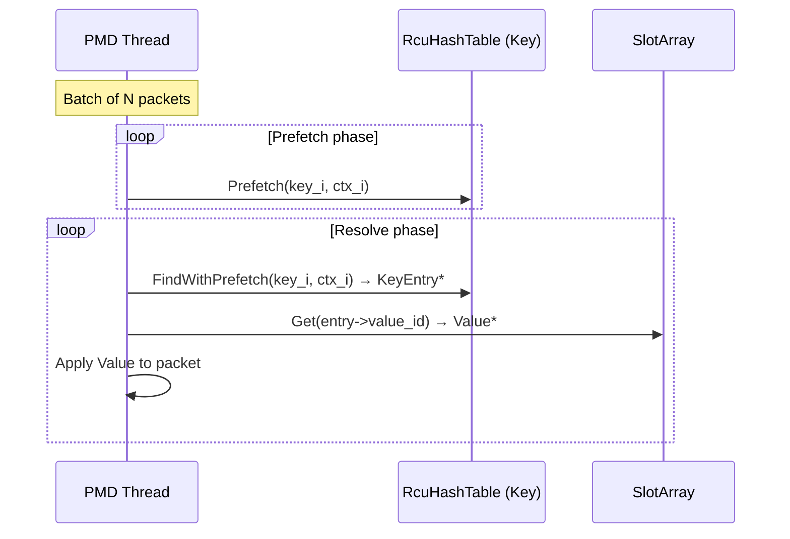

# Design Document: IndirectTable

## Overview

IndirectTable is a two-layer indirection system for mapping arbitrary keys to shared, reference-counted values in a DPDK data-plane environment. The primary use case is many-to-one: multiple keys can reference the same value slot, with automatic deduplication and reference counting.

Two composable components:

1. **SlotArray\<Value\>** — reusable template owning a flat array of `ValueSlot<Value>`, a free-ID stack, and an intrusive reverse hash table for O(1) value deduplication without duplicating the Value in memory.

2. **IndirectTable\<Key, Value\>** — composes `RcuHashTable` (Key→KeyEntry), `rte_mempool` (KeyEntry allocation), and `SlotArray<Value>` (ID→Value with dedup).

All mutations happen on the control-plane thread. PMD threads perform lockless reads via `Get()` (direct array indexing) and `Find()` (RcuHashTable lockless lookup).

The reverse hash table uses `RcuHashTable` parameterized on `ValueSlot<Value>` itself as the node type, with hash/equality functors that dereference into `slot.value`. The `IntrusiveRcuListHook` embedded in each `ValueSlot` serves as the chain link. No value duplication occurs — the reverse map references the same memory as the SlotArray.

## Architecture



## Sequence Diagrams

### 1. Insert Key→Value (with dedup via intrusive reverse hash table)



### 2. InsertWithId (attach key to existing value slot)



### 3. Remove Key (with RCU retire and refcount release)



### 4. PMD Lockless Read (batched prefetch)



## Components and Interfaces

### Component 1: SlotArray\<Value\>

Reusable template providing a flat array of reference-counted value slots with O(1) allocation, deallocation, and value deduplication via an intrusive reverse hash table. No value duplication in memory.

**Responsibilities:**
- Allocate a slot and return its ID (refcount initialized to 1)
- Deduplicate values: `FindOrAllocate()` checks the reverse hash table before allocating
- Deallocate a slot by ID, returning it to the free stack and removing from reverse map
- Direct-index lookup by ID for lockless PMD reads
- Reference counting: AddRef increments, Release decrements and returns true when hitting 0

**Thread Safety:**
- `FindOrAllocate()`, `Allocate()`, `Deallocate()`, `AddRef()`, `Release()`, `UpdateValue()` — control-plane only
- `Get()` — safe for concurrent PMD reads (returns pointer into stable rte_zmalloc'd array)

### Component 2: IndirectTable\<Key, Value\>

Composes `RcuHashTable` + `rte_mempool` + `SlotArray<Value>` to provide a complete key→value mapping with many-to-one semantics, value deduplication, and RCU-safe reclamation.

**Responsibilities:**
- Insert a key with a value (dedup via `FindOrAllocate`)
- Insert a key referencing an existing value ID (`InsertWithId` with `AddRef`)
- Remove a key (unlinks from hash table, retires via RCU, releases refcount)
- Lockless PMD read path: `Find(key)` → `KeyEntry` → `slot_array().Get(id)` → `Value*`

**Thread Safety:**
- `Insert()`, `InsertWithId()`, `Remove()`, `UpdateValue()` — control-plane only
- `Find()`, `FindWithPrefetch()` — lockless PMD reads via RcuHashTable
- KeyEntry retirement goes through RCU grace period before mempool return + refcount release

## Data Models

### ValueSlot\<Value\>

```cpp
// Cache-line aligned slot in the SlotArray backing array.
// reverse_hook is used by the intrusive reverse hash table (control-plane only).
// refcount is std::atomic for visibility to PMD threads but only mutated by control-plane.
// PMD threads access via Get() which returns &slot.value — they never touch hook or refcount.
template <typename Value>
struct alignas(64) ValueSlot {
  rcu::IntrusiveRcuListHook reverse_hook;  // for reverse RcuHashTable chain
  std::atomic<uint32_t> refcount{0};       // 0 = free, >0 = in use
  Value value;                              // user payload
};
```

### KeyEntry\<Key\>

```cpp
// Allocated from rte_mempool. Stored in the key RcuHashTable.
template <typename Key>
struct KeyEntry {
  rcu::IntrusiveRcuListHook hook;  // for key RcuHashTable chain
  Key key;
  uint32_t value_id;               // index into SlotArray
};
```

### Functors

```cpp
// Key extractor for the key RcuHashTable: KeyEntry → Key
template <typename Key>
struct KeyEntryKeyExtractor {
  const Key& operator()(const KeyEntry<Key>& entry) const {
    return entry.key;
  }
};

// Key extractor for the reverse RcuHashTable: ValueSlot → Value
template <typename Value>
struct ValueSlotKeyExtractor {
  const Value& operator()(const ValueSlot<Value>& slot) const {
    return slot.value;
  }
};
```

The reverse `RcuHashTable` is instantiated as:
```cpp
RcuHashTable<ValueSlot<Value>,
             &ValueSlot<Value>::reverse_hook,
             Value,
             ValueSlotKeyExtractor<Value>,
             ValueHash,
             ValueEqual>
```
This hashes/compares on `slot.value` directly — no copy of Value is stored anywhere outside the SlotArray.

## Key Functions with Formal Specifications

### SlotArray\<Value\>

```cpp
template <typename Value,
          typename ValueHash = std::hash<Value>,
          typename ValueEqual = std::equal_to<Value>>
class SlotArray {
 public:
  static constexpr uint32_t kInvalidId = UINT32_MAX;

  struct Config {
    uint32_t capacity = 0;     // max slots (up to 1M)
    uint32_t bucket_count = 0; // reverse hash table buckets (power of 2)
    const char* name = "";     // rte_zmalloc tag
  };

  SlotArray() = default;
  ~SlotArray();

  SlotArray(const SlotArray&) = delete;
  SlotArray& operator=(const SlotArray&) = delete;

  absl::Status Init(const Config& config);

  // --- Control-plane mutation API ---

  // Dedup-aware: if value exists in reverse map, AddRef and return existing ID.
  // Otherwise allocate new slot, write value, insert into reverse map.
  // Returns kInvalidId if full.
  uint32_t FindOrAllocate(const Value& value);

  // Raw allocation without dedup. Returns kInvalidId if full.
  uint32_t Allocate();

  // Return slot to free stack, remove from reverse map.
  // Precondition: refcount == 0.
  void Deallocate(uint32_t id);

  // Increment refcount. Precondition: refcount > 0.
  void AddRef(uint32_t id);

  // Decrement refcount. Returns true when it hits 0.
  // Caller must then Deallocate().
  bool Release(uint32_t id);

  // Lookup value in reverse hash table. Returns kInvalidId if not found.
  uint32_t FindByValue(const Value& value) const;

  // Update value in-place and rehash in reverse map.
  void UpdateValue(uint32_t id, const Value& new_value);

  // Read current refcount.
  uint32_t RefCount(uint32_t id) const;

  // Iterate all in-use slots (linear scan, refcount > 0).
  // fn(uint32_t id, const Value& value) called for each.
  template <typename Fn>
  void ForEachInUse(Fn&& fn) const;

  // --- PMD-safe lockless read ---

  // Direct array index. Returns pointer into stable rte_zmalloc'd array.
  Value* Get(uint32_t id);
  const Value* Get(uint32_t id) const;

  uint32_t capacity() const;
  uint32_t used_count() const;

 private:
  ValueSlot<Value>* slots_ = nullptr;    // rte_zmalloc'd array
  uint32_t* free_stack_ = nullptr;       // array-based free-ID stack
  uint32_t free_top_ = 0;
  uint32_t capacity_ = 0;

  // Intrusive reverse hash table: Value → ValueSlot* (no value duplication)
  using ReverseMap = RcuHashTable<ValueSlot<Value>,
                                   &ValueSlot<Value>::reverse_hook,
                                   Value,
                                   ValueSlotKeyExtractor<Value>,
                                   ValueHash, ValueEqual>;
  ReverseMap reverse_map_;
};
```

### IndirectTable\<Key, Value\>

```cpp
template <typename Key, typename Value,
          typename KeyHash = std::hash<Key>,
          typename KeyEqual = std::equal_to<Key>,
          typename ValueHash = std::hash<Value>,
          typename ValueEqual = std::equal_to<Value>>
class IndirectTable {
 public:
  struct Config {
    uint32_t value_capacity = 0;       // SlotArray capacity
    uint32_t value_bucket_count = 0;   // reverse map buckets (power of 2)
    uint32_t key_capacity = 0;         // rte_mempool / max KeyEntries
    uint32_t key_bucket_count = 0;     // key hash table buckets (power of 2)
    const char* name = "";
  };

  IndirectTable() = default;
  ~IndirectTable();

  IndirectTable(const IndirectTable&) = delete;
  IndirectTable& operator=(const IndirectTable&) = delete;

  absl::Status Init(const Config& config, rcu::RcuManager* rcu_manager);

  // --- Control-plane mutation API ---

  // Insert key→value. Dedup via FindOrAllocate.
  // Returns value_id on success, kInvalidId on failure.
  uint32_t Insert(const Key& key, const Value& value);

  // Insert key referencing existing value_id. AddRef.
  bool InsertWithId(const Key& key, uint32_t value_id);

  // Remove key. RCU-retire KeyEntry; release refcount after grace period.
  bool Remove(const Key& key);

  // Update value in-place at given slot ID.
  void UpdateValue(uint32_t value_id, const Value& value);

  // Iterate all key entries. fn(const Key&, uint32_t value_id).
  template <typename Fn>
  void ForEachKey(Fn&& fn) const;

  // --- PMD-safe lockless read API ---

  KeyEntry<Key>* Find(const Key& key) const;

  using PrefetchContext = typename KeyHashTable::PrefetchContext;
  void Prefetch(const Key& key, PrefetchContext& ctx) const;
  KeyEntry<Key>* FindWithPrefetch(const Key& key,
                                   const PrefetchContext& ctx) const;

  // Direct access to SlotArray for PMD Get() calls.
  const SlotArray<Value, ValueHash, ValueEqual>& slot_array() const;
  SlotArray<Value, ValueHash, ValueEqual>& slot_array();

 private:
  using KeyHashTable = RcuHashTable<
      KeyEntry<Key>, &KeyEntry<Key>::hook,
      Key, KeyEntryKeyExtractor<Key>,
      KeyHash, KeyEqual>;

  KeyHashTable key_table_;
  struct rte_mempool* key_pool_ = nullptr;
  SlotArray<Value, ValueHash, ValueEqual> slot_array_;
  rcu::RcuManager* rcu_manager_ = nullptr;
};
```

## Algorithmic Pseudocode

### SlotArray::FindOrAllocate

```cpp
uint32_t SlotArray<Value>::FindOrAllocate(const Value& value) {
  // Step 1: Check reverse map for existing value (no copy — hash/eq on slot.value)
  ValueSlot<Value>* existing = reverse_map_.Find(value);
  if (existing != nullptr) {
    uint32_t id = SlotIndex(existing);
    AddRef(id);
    return id;
  }

  // Step 2: Allocate new slot from free stack
  if (free_top_ == 0) return kInvalidId;
  --free_top_;
  uint32_t new_id = free_stack_[free_top_];

  // Step 3: Initialize slot
  slots_[new_id].value = value;
  slots_[new_id].refcount.store(1, std::memory_order_release);

  // Step 4: Insert into reverse map (intrusive — slot IS the node)
  reverse_map_.Insert(&slots_[new_id]);

  return new_id;
}
```

**Preconditions:** Called from control-plane thread only. `Init()` completed.
**Postconditions:**
- If value existed: refcount incremented, returns existing ID
- If value new and space available: new slot with refcount=1, value written, in reverse map
- If full: returns kInvalidId, no state change

### SlotArray::Allocate

```cpp
uint32_t SlotArray<Value>::Allocate() {
  if (free_top_ == 0) return kInvalidId;
  --free_top_;
  uint32_t id = free_stack_[free_top_];
  slots_[id].refcount.store(1, std::memory_order_release);
  return id;
  // NOTE: caller must write value and call reverse_map_.Insert() if dedup is desired
}
```

**Preconditions:** Control-plane only.
**Postconditions:** Returns ID with refcount=1, value uninitialized. Or kInvalidId if full.

### SlotArray::Deallocate

```cpp
void SlotArray<Value>::Deallocate(uint32_t id) {
  assert(id < capacity_);
  assert(slots_[id].refcount.load(std::memory_order_relaxed) == 0);

  // Remove from reverse map (intrusive unlink)
  reverse_map_.Remove(&slots_[id]);

  // Return ID to free stack
  free_stack_[free_top_] = id;
  ++free_top_;
}
```

**Preconditions:** `id < capacity_`, `refcount == 0`, control-plane only.
**Postconditions:** Slot removed from reverse map, ID back on free stack.

### SlotArray::AddRef / Release

```cpp
void SlotArray<Value>::AddRef(uint32_t id) {
  assert(id < capacity_);
  uint32_t prev = slots_[id].refcount.load(std::memory_order_relaxed);
  assert(prev > 0);
  slots_[id].refcount.store(prev + 1, std::memory_order_release);
}

bool SlotArray<Value>::Release(uint32_t id) {
  assert(id < capacity_);
  uint32_t prev = slots_[id].refcount.load(std::memory_order_relaxed);
  assert(prev > 0);
  uint32_t next = prev - 1;
  slots_[id].refcount.store(next, std::memory_order_release);
  return next == 0;
}
```

**Note:** Single-writer (control-plane only), so no CAS needed. `memory_order_release` ensures PMD threads see consistent refcount via acquire loads if needed.

### SlotArray::Get

```cpp
Value* SlotArray<Value>::Get(uint32_t id) {
  assert(id < capacity_);
  return &slots_[id].value;
}
```

**PMD-safe:** Returns pointer into stable rte_zmalloc'd array. No lock, no atomic.

### SlotArray::FindByValue

```cpp
uint32_t SlotArray<Value>::FindByValue(const Value& value) const {
  ValueSlot<Value>* slot = reverse_map_.Find(value);
  if (slot == nullptr) return kInvalidId;
  return SlotIndex(slot);
}
```

### SlotArray::UpdateValue

```cpp
void SlotArray<Value>::UpdateValue(uint32_t id, const Value& new_value) {
  assert(id < capacity_);
  assert(slots_[id].refcount.load(std::memory_order_relaxed) > 0);

  // Remove old value from reverse map
  reverse_map_.Remove(&slots_[id]);

  // Write new value
  slots_[id].value = new_value;

  // Re-insert with new hash
  reverse_map_.Insert(&slots_[id]);
}
```

### IndirectTable::Insert

```cpp
uint32_t IndirectTable::Insert(const Key& key, const Value& value) {
  // 1. Check for duplicate key
  if (key_table_.Find(key) != nullptr) return kInvalidId;

  // 2. Get or create value slot (dedup via reverse hash table)
  uint32_t value_id = slot_array_.FindOrAllocate(value);
  if (value_id == SlotArray::kInvalidId) return kInvalidId;

  // 3. Allocate KeyEntry from mempool
  void* raw = nullptr;
  if (rte_mempool_get(key_pool_, &raw) != 0) {
    // Rollback: release the refcount we just acquired
    if (slot_array_.Release(value_id)) {
      slot_array_.Deallocate(value_id);
    }
    return kInvalidId;
  }
  auto* entry = new (raw) KeyEntry<Key>{};
  entry->key = key;
  entry->value_id = value_id;

  // 4. Insert into key hash table (refcount already incremented)
  bool ok = key_table_.Insert(entry);
  assert(ok);
  (void)ok;

  return value_id;
}
```

**Postconditions:** On success: key findable, value slot refcount reflects new reference. On failure: no state change (full rollback).

### IndirectTable::InsertWithId

```cpp
bool IndirectTable::InsertWithId(const Key& key, uint32_t value_id) {
  if (key_table_.Find(key) != nullptr) return false;

  slot_array_.AddRef(value_id);

  void* raw = nullptr;
  if (rte_mempool_get(key_pool_, &raw) != 0) {
    slot_array_.Release(value_id);  // undo AddRef
    return false;
  }
  auto* entry = new (raw) KeyEntry<Key>{};
  entry->key = key;
  entry->value_id = value_id;

  bool ok = key_table_.Insert(entry);
  assert(ok);
  (void)ok;
  return true;
}
```

### IndirectTable::Remove

```cpp
bool IndirectTable::Remove(const Key& key) {
  KeyEntry<Key>* entry = key_table_.Find(key);
  if (entry == nullptr) return false;

  uint32_t value_id = entry->value_id;
  key_table_.Remove(entry);

  // Defer cleanup until RCU grace period completes
  rcu::RetireViaGracePeriod(rcu_manager_, entry,
    [this, value_id](KeyEntry<Key>* e) {
      e->~KeyEntry<Key>();
      rte_mempool_put(key_pool_, e);
      if (slot_array_.Release(value_id)) {
        slot_array_.Deallocate(value_id);
      }
    });

  return true;
}
```

**Key invariant:** Between `Remove()` and grace period completion, PMD threads with existing pointers to the KeyEntry can still safely read it. The refcount is only decremented after the grace period, ensuring the value slot stays alive while any PMD might reference it.

## Correctness Properties

**P1 — Refcount Invariant:**
`∀ id ∈ [0, capacity): slots_[id].refcount == |{e ∈ KeyEntries : e.value_id == id}|`
The refcount of every slot equals the number of KeyEntries currently referencing it.

**P2 — Value Deduplication:**
`∀ id₁, id₂ ∈ in-use slots: id₁ ≠ id₂ ⟹ slots_[id₁].value ≠ slots_[id₂].value`
No two in-use slots contain the same value. The intrusive reverse hash table enforces this.

**P3 — Reverse Map Consistency:**
`∀ id ∈ in-use slots: reverse_map_.Find(slots_[id].value) == &slots_[id]`
`∀ slot* ∈ reverse_map_: slot->refcount > 0`
The reverse map is a faithful mirror of in-use slot contents. Every entry in the reverse map points to a slot with refcount > 0, and every in-use slot is findable in the reverse map.

**P4 — Allocation Uniqueness:**
`Allocate()` / `FindOrAllocate()` never returns the same ID twice without an intervening `Deallocate()`.

**P5 — Free Stack Consistency:**
`free_top_ + used_count == capacity_`
The free stack size plus the number of in-use slots always equals total capacity.

**P6 — No Use-After-Free on KeyEntry:**
A KeyEntry is not returned to `rte_mempool` until the RCU grace period completes after removal from the hash table.

**P7 — Value Lifetime:**
A slot is not deallocated until its refcount reaches 0. `Deallocate()` asserts `refcount == 0`.

**P8 — Lockless Read Safety:**
`Get(id)` returns a pointer into the `rte_zmalloc`'d `slots_` array, which is never reallocated during the table's lifetime.

**P9 — Many-to-One Consistency:**
`FindOrAllocate` and `InsertWithId` increment the refcount before the KeyEntry is inserted into the key hash table. PMD threads never observe a KeyEntry pointing to a deallocated slot.

**P10 — No Double-Free:**
`Deallocate()` asserts `refcount == 0`. A slot on the free stack cannot be deallocated again.

**P11 — No Value Duplication in Memory:**
The reverse hash table stores no copy of Value. It references `ValueSlot` nodes in-place via `IntrusiveRcuListHook`. The only copy of each Value exists in `slots_[id].value`.

## Error Handling

| Scenario | Condition | Response | Recovery |
|---|---|---|---|
| SlotArray full | `FindOrAllocate()` when `free_top_ == 0` and value not in reverse map | Returns `kInvalidId` | Caller propagates failure. No state change. |
| Mempool exhausted | `rte_mempool_get()` fails in `Insert()` / `InsertWithId()` | Rollback refcount via `Release()` (and `Deallocate()` if refcount→0) | Returns failure. System consistent. |
| Duplicate key | `Insert()` / `InsertWithId()` with existing key | Returns `kInvalidId` / `false` | No state change. Check happens before allocation. |
| Remove non-existent | `Remove()` with key not in hash table | Returns `false` | No state change. |
| Invalid ID (debug) | `Get()`, `AddRef()`, `Release()`, `Deallocate()` with `id >= capacity_` | `assert()` failure | Programming error caught in development. |

## Example Usage

```cpp
#include "indirect_table/indirect_table.h"

// --- Value type: must support Hash and Equality ---
struct NextHopValue {
  uint32_t gateway_ip;
  uint16_t egress_port;
  uint8_t dst_mac[6];

  friend bool operator==(const NextHopValue& a, const NextHopValue& b) {
    return a.gateway_ip == b.gateway_ip &&
           a.egress_port == b.egress_port &&
           std::memcmp(a.dst_mac, b.dst_mac, 6) == 0;
  }

  template <typename H>
  friend H AbslHashValue(H h, const NextHopValue& v) {
    return H::combine(std::move(h), v.gateway_ip, v.egress_port,
                      absl::string_view(reinterpret_cast<const char*>(v.dst_mac), 6));
  }
};

struct NextHopKey {
  uint32_t prefix;
  uint8_t prefix_len;

  friend bool operator==(const NextHopKey& a, const NextHopKey& b) {
    return a.prefix == b.prefix && a.prefix_len == b.prefix_len;
  }

  template <typename H>
  friend H AbslHashValue(H h, const NextHopKey& k) {
    return H::combine(std::move(h), k.prefix, k.prefix_len);
  }
};

using NextHopTable = IndirectTable<NextHopKey, NextHopValue,
                                    absl::Hash<NextHopKey>, std::equal_to<NextHopKey>,
                                    absl::Hash<NextHopValue>, std::equal_to<NextHopValue>>;

// --- Control Plane: Setup ---
NextHopTable table;
auto status = table.Init({
    .value_capacity = 4096,
    .value_bucket_count = 4096,
    .key_capacity = 1000000,
    .key_bucket_count = 131072,
    .name = "nexthop",
}, rcu_manager);

// --- Control Plane: Insert (dedup happens automatically) ---
NextHopValue gw1{.gateway_ip = 0x0A000001, .egress_port = 0,
                  .dst_mac = {0xAA,0xBB,0xCC,0xDD,0xEE,0x01}};

table.Insert({0xC0A80100, 24}, gw1);  // 192.168.1.0/24 → gw1 (new slot, refcount=1)
table.Insert({0xC0A80200, 24}, gw1);  // 192.168.2.0/24 → gw1 (same slot, refcount=2)
table.Insert({0x0A0A0000, 16}, gw1);  // 10.10.0.0/16   → gw1 (same slot, refcount=3)

NextHopValue gw2{.gateway_ip = 0x0A000002, .egress_port = 1,
                  .dst_mac = {0xAA,0xBB,0xCC,0xDD,0xEE,0x02}};
table.Insert({0xAC100000, 16}, gw2);  // 172.16.0.0/16  → gw2 (new slot, refcount=1)

// --- Control Plane: Remove ---
table.Remove({0xC0A80100, 24});  // gw1 refcount: 3→2
table.Remove({0xC0A80200, 24});  // gw1 refcount: 2→1
table.Remove({0x0A0A0000, 16});  // gw1 refcount: 1→0 → Deallocate after grace period

// --- PMD Thread: Batched Prefetch Lookup ---
void PmdProcessBatch(const NextHopTable& table,
                     const NextHopKey* keys, size_t n) {
  NextHopTable::PrefetchContext ctxs[32];
  for (size_t i = 0; i < n; ++i) {
    table.Prefetch(keys[i], ctxs[i]);
  }
  for (size_t i = 0; i < n; ++i) {
    auto* entry = table.FindWithPrefetch(keys[i], ctxs[i]);
    if (entry) {
      const NextHopValue* nh = table.slot_array().Get(entry->value_id);
      // Apply: set dst MAC, select egress port, etc.
      (void)nh;
    }
  }
}
```

## Testing Strategy

### Unit Testing

SlotArray and IndirectTable tested independently using a test allocator (heap-backed, no DPDK) and mock RCU (immediate grace period).

Key test cases:
- **SlotArray:** Allocate/deallocate cycle, FindOrAllocate dedup (same value returns same ID with incremented refcount), Release→Deallocate lifecycle, free stack exhaustion, reverse map consistency after mixed operations, UpdateValue rehashes correctly
- **IndirectTable:** Insert/Find/Remove round-trip, many-to-one (multiple keys same value via dedup), mempool exhaustion rollback, duplicate key rejection, RCU retire callback correctness

### Property-Based Testing

Library: RapidCheck (already in project via `patches/rapidcheck_build.patch`)

Properties to test with random operation sequences:
- **P1 (Refcount):** After any sequence of Insert/Remove, verify refcount matches actual KeyEntry count per slot
- **P2 (Dedup):** After any sequence of inserts, no two in-use slots have the same value
- **P3 (Reverse Map):** After any operation, verify bidirectional consistency between slots and reverse map
- **P5 (Free Stack):** After any operation, `free_top_ + used_count == capacity_`

### Integration Testing

End-to-end with real DPDK EAL:
- PMD thread lockless reads while control-plane mutates
- RCU grace period correctly defers KeyEntry reclamation
- Batched prefetch lookup under concurrent modification

## Performance Considerations

- **SlotArray::Get()** — single array index, O(1), one cache line access per slot
- **Free-ID stack** — O(1) push/pop, no heap allocation, no atomics (control-plane only)
- **Reverse hash table** — O(1) amortized lookup via RcuHashTable. Control-plane only cost. No value duplication means no extra memory bandwidth.
- **RcuHashTable** — lockless reads with seqlock validation for PMD threads
- **Batched prefetch** — amortizes cache miss latency across packet batch
- **rte_mempool** — O(1) KeyEntry allocation, cache-aligned, no fragmentation
- **1M value slots at 64B** — 64MB, fits in hugepage memory
- **CLI dump** — linear scan of 1M entries ≈ 64MB sequential read, acceptable for diagnostics

## Security Considerations

- All IDs bounds-checked (`id < capacity_`) with assertions in debug builds
- `rte_zmalloc` zero-initializes memory, preventing information leakage from recycled slots
- No user-facing input directly reaches SlotArray or IndirectTable — all access mediated by control-plane command handler
- No dynamic allocation on PMD read path — immune to allocation-based DoS

## Dependencies

- **DPDK:** `rte_zmalloc`, `rte_mempool`, `rte_pause` — hugepage allocation and mempool
- **Abseil:** `absl::Hash`, `absl::Status` — hashing and error reporting
- **rcu/intrusive_rcu_list.h:** `IntrusiveRcuListHook` — chain link for both hash tables
- **rcu/rcu_retire.h:** `RetireViaGracePeriod` — deferred KeyEntry reclamation
- **rcu/rcu_manager.h:** `RcuManager` — grace period scheduling
- **rxtx/rcu_hash_table.h:** `RcuHashTable` — used for both key lookup and reverse value map
- **Bazel:** Build system
