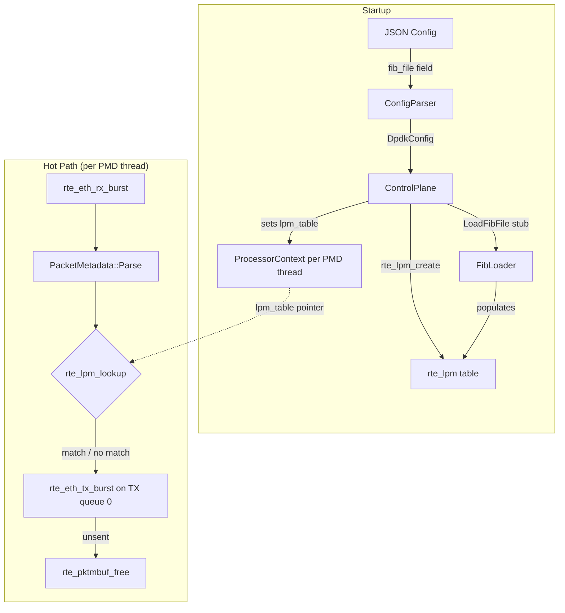

# Design Document: LPM Forwarding Processor

## Overview

This design adds an LPM (Longest Prefix Match) forwarding processor to the DPDK packet processing pipeline. The processor performs IPv4 destination-address lookup in a shared FIB (Forwarding Information Base) backed by DPDK's `rte_lpm` library, then forwards all packets to the first configured TX queue.

The design touches six areas of the codebase:

1. **DpdkConfig / ConfigParser** — new `fib_file` field
2. **ProcessorContext** — new `lpm_table` void pointer
3. **FIB Loader** — stub function in `fib/fib_loader.h/.cc`
4. **ControlPlane** — creates, wires, and destroys the `rte_lpm` table
5. **LpmForwardingProcessor** — the processor class itself
6. **BUILD files** — new targets and dependency wiring

The processor is intentionally lightweight: no FastLookupTable, no SessionTable, no control-plane commands. It follows the same CRTP + self-registration pattern as `FiveTupleForwardingProcessor` and `SimpleForwardingProcessor`.

## Architecture



### Data Flow

1. Operator specifies `"fib_file": "/path/to/fib.txt"` in JSON config.
2. `ConfigParser` stores the path in `DpdkConfig::fib_file`.
3. `ControlPlane::Initialize` creates an `rte_lpm` table if `fib_file` is non-empty, calls `LoadFibFile` (stub, no-op for now), and sets `ProcessorContext::lpm_table` for each PMD thread.
4. Each PMD thread running `lpm_forwarding` processor: RX burst → parse each packet → if IPv4 and `lpm_table != nullptr`, call `rte_lpm_lookup` → record stats → TX burst → free unsent.
5. On shutdown, `ControlPlane` destroys the `rte_lpm` table after all PMD threads have stopped.

## Components and Interfaces

### 1. DpdkConfig Extension (Requirement 1)

Add a single field to `DpdkConfig`:

```cpp
// In config/dpdk_config.h, inside struct DpdkConfig:
std::string fib_file;  // Path to FIB file. Empty = no FIB.
```

Default is empty string (no FIB created).

### 2. ConfigParser Changes (Requirement 1)

In `config/config_parser.cc`, add parsing for `"fib_file"` alongside existing fields:

```cpp
// Parse fib_file (optional string)
if (j.contains("fib_file")) {
  if (!j["fib_file"].is_string()) {
    return absl::InvalidArgumentError("Field 'fib_file' must be a string");
  }
  config.fib_file = j["fib_file"].get<std::string>();
}
```

Add `"fib_file"` to the `known_fields` set so it doesn't leak into `additional_params`.

### 3. ProcessorContext Extension (Requirement 4)

Add `lpm_table` field to `ProcessorContext`:

```cpp
// In processor/processor_context.h, inside struct ProcessorContext:
void* lpm_table = nullptr;  // rte_lpm* (or nullptr if no FIB)
```

### 4. FIB Loader Stub (Requirement 5)

New files: `fib/fib_loader.h` and `fib/fib_loader.cc`.

```cpp
// fib/fib_loader.h
#ifndef FIB_FIB_LOADER_H_
#define FIB_FIB_LOADER_H_

#include <string>
#include "absl/status/status.h"

struct rte_lpm;

namespace fib {

// Load FIB entries from file into the LPM table.
// Current implementation is a stub that returns OkStatus without
// inserting any prefixes. Future implementation will parse the file
// and call rte_lpm_add for each prefix entry.
absl::Status LoadFibFile(const std::string& file_path, struct rte_lpm* lpm);

}  // namespace fib

#endif  // FIB_FIB_LOADER_H_
```

Implementation returns `absl::OkStatus()` unconditionally.

### 5. ControlPlane Changes (Requirements 2, 3)

Add to `ControlPlane`:

**Header** (`control/control_plane.h`):
- New private member: `struct rte_lpm* lpm_table_ = nullptr;`
- New config field: `std::string fib_file;` in `ControlPlane::Config`

**Implementation** (`control/control_plane.cc`):

In `Initialize()`, after SessionTable creation and before CommandHandler creation:

```cpp
// Create LPM table if fib_file is configured.
if (!config_.fib_file.empty()) {
  struct rte_lpm_config lpm_conf;
  memset(&lpm_conf, 0, sizeof(lpm_conf));
  lpm_conf.max_rules = 1048576;    // 1M rules
  lpm_conf.number_tbl8s = 65536;   // 64K tbl8s for 1M prefixes
  lpm_conf.flags = 0;

  lpm_table_ = rte_lpm_create("fib_lpm", SOCKET_ID_ANY, &lpm_conf);
  if (lpm_table_ == nullptr) {
    return absl::InternalError("rte_lpm_create failed");
  }

  auto status = fib::LoadFibFile(config_.fib_file, lpm_table_);
  if (!status.ok()) {
    rte_lpm_free(lpm_table_);
    lpm_table_ = nullptr;
    return status;
  }

  // Wire LPM table into each PMD thread's ProcessorContext.
  if (thread_manager_) {
    for (uint32_t lcore_id : thread_manager_->GetLcoreIds()) {
      PmdThread* thread = thread_manager_->GetThread(lcore_id);
      if (thread) {
        thread->GetMutableProcessorContext().lpm_table = lpm_table_;
      }
    }
  }
}
```

In `Shutdown()`, after PMD threads stop and before SessionTable destruction:

```cpp
// Destroy LPM table after PMD threads stop.
if (lpm_table_ != nullptr) {
  rte_lpm_free(lpm_table_);
  lpm_table_ = nullptr;
}
```

### 6. LpmForwardingProcessor Class (Requirements 6–13)

**Header** (`processor/lpm_forwarding_processor.h`):

```cpp
class LpmForwardingProcessor
    : public PacketProcessorBase<LpmForwardingProcessor> {
 public:
  explicit LpmForwardingProcessor(
      const dpdk_config::PmdThreadConfig& config,
      PacketStats* stats = nullptr);

  absl::Status check_impl(
      const std::vector<dpdk_config::QueueAssignment>& rx_queues,
      const std::vector<dpdk_config::QueueAssignment>& tx_queues);

  void process_impl();

  void ExportProcessorData(ProcessorContext& ctx);

  static absl::Status CheckParams(
      const absl::flat_hash_map<std::string, std::string>& params);

 private:
  static constexpr uint16_t kBatchSize = 64;
  PacketStats* stats_ = nullptr;
  struct rte_lpm* lpm_table_ = nullptr;  // Borrowed from ProcessorContext
};
```

Key design decisions:
- No `RegisterControlCommands` — requirement 13 says no control-plane commands.
- `ExportProcessorData` reads `ctx.lpm_table` and caches it locally. Does NOT touch `ctx.session_table` or `ctx.processor_data`.
- `CheckParams` rejects any non-empty parameter map (no processor-specific params).

**Implementation** (`processor/lpm_forwarding_processor.cc`):

`process_impl()` follows the same structure as `SimpleForwardingProcessor` but adds parse + LPM lookup:

```
for each RX queue:
  rx_burst → batch
  if batch empty: continue

  for each packet in batch:
    PacketMetadata::Parse(pkt, meta)
    if parse failed: skip lookup, still forward
    if lpm_table_ != nullptr && !meta.IsIpv6():
      rte_lpm_lookup(lpm_table_, ntohl(meta.dst_ip.v4), &next_hop)
      // next_hop recorded for future use, packet forwarded regardless

  if stats_: record batch count + total bytes
  tx_burst on tx_queues[0]
  free unsent mbufs
  batch.Release()
```

Registration at bottom of .cc file:
```cpp
REGISTER_PROCESSOR("lpm_forwarding", LpmForwardingProcessor);
```

## Data Models

### DpdkConfig (extended)

| Field | Type | Default | Description |
|-------|------|---------|-------------|
| `fib_file` | `std::string` | `""` | Path to FIB file. Empty = no FIB. |

### ProcessorContext (extended)

| Field | Type | Default | Description |
|-------|------|---------|-------------|
| `lpm_table` | `void*` | `nullptr` | Pointer to `rte_lpm` table. |

### ControlPlane::Config (extended)

| Field | Type | Default | Description |
|-------|------|---------|-------------|
| `fib_file` | `std::string` | `""` | Path to FIB file. |

### LpmForwardingProcessor internal state

| Field | Type | Source | Description |
|-------|------|--------|-------------|
| `stats_` | `PacketStats*` | Constructor | Per-thread stats (nullable). |
| `lpm_table_` | `struct rte_lpm*` | `ExportProcessorData` | Borrowed pointer to shared FIB. |

## Error Handling

| Scenario | Behavior | Requirement |
|----------|----------|-------------|
| `fib_file` field is not a string in JSON | `ConfigParser` returns `InvalidArgumentError` | 1.3 |
| `rte_lpm_create` fails | `ControlPlane::Initialize` returns error, aborts startup | 2.3 |
| `LoadFibFile` fails | `ControlPlane` frees LPM table, returns error | 2.2 |
| TX queue list empty | `check_impl` returns `InvalidArgumentError` | 7.1 |
| `PacketMetadata::Parse` fails | Skip LPM lookup, still forward packet | 8.2 |
| `rte_lpm_lookup` returns no match | Forward packet anyway (default behavior) | 9.3 |
| `lpm_table` is null | Skip LPM lookup, forward packet | 9.4 |
| Packet is IPv6 | Skip LPM lookup, forward packet | 9.5 |
| `rte_eth_tx_burst` partial send | Free unsent mbufs with `rte_pktmbuf_free` | 10.2 |
| `stats_` is null | Skip stats recording | 11.2 |
| Non-empty `CheckParams` map | Return `InvalidArgumentError` with unrecognized key | 12.2 |

## Testing Strategy

All tests are unit tests. No property-based testing.

### Unit Test: LpmForwardingProcessor (`processor/lpm_forwarding_processor_test.cc`)

Tests follow the same pattern as `five_tuple_forwarding_processor_test.cc`: a standalone `main()` with `TestCase()` helper, no gtest dependency for the processor test (matching existing convention).

#### Test Cases

**Registration (Req 6):**
- `ProcessorRegistry::Lookup("lpm_forwarding")` returns OK
- Entry has non-null launcher, checker, param_checker

**check_impl (Req 7):**
- Empty `tx_queues` → `InvalidArgumentError`
- Non-empty `tx_queues` → `OkStatus`

**CheckParams (Req 12):**
- Empty map → `OkStatus`
- Non-empty map (e.g., `{"unknown": "value"}`) → `InvalidArgumentError`

**ExportProcessorData (Req 9.4, 13):**
- When `ctx.lpm_table` is set, processor caches it internally
- When `ctx.lpm_table` is null, processor's internal pointer remains null
- Processor does NOT write to `ctx.session_table` or `ctx.processor_data`

### Unit Test: ConfigParser fib_file (`config/config_parser_test.cc`)

Add test cases to the existing config parser test:

- JSON with `"fib_file": "/path/to/fib.txt"` → `config.fib_file == "/path/to/fib.txt"`
- JSON without `"fib_file"` → `config.fib_file == ""`
- JSON with `"fib_file": 123` → `InvalidArgumentError`

### Unit Test: FIB Loader (`fib/fib_loader_test.cc`)

- `LoadFibFile("any_path", nullptr)` returns `OkStatus` (stub behavior)

### BUILD File Changes

**New target: `fib/BUILD`**
```
cc_library(
    name = "fib_loader",
    srcs = ["fib_loader.cc"],
    hdrs = ["fib_loader.h"],
    deps = ["@abseil-cpp//absl/status"],
)

cc_test(
    name = "fib_loader_test",
    srcs = ["fib_loader_test.cc"],
    deps = [":fib_loader"],
)
```

**Modified: `processor/BUILD`** — add `lpm_forwarding_processor` library and test targets.

**Modified: `control/BUILD`** — add `//fib:fib_loader` and `//:dpdk_lib` deps to `control_plane`.

**Modified: `config/BUILD`** — no changes needed (fib_file is just a string field).
