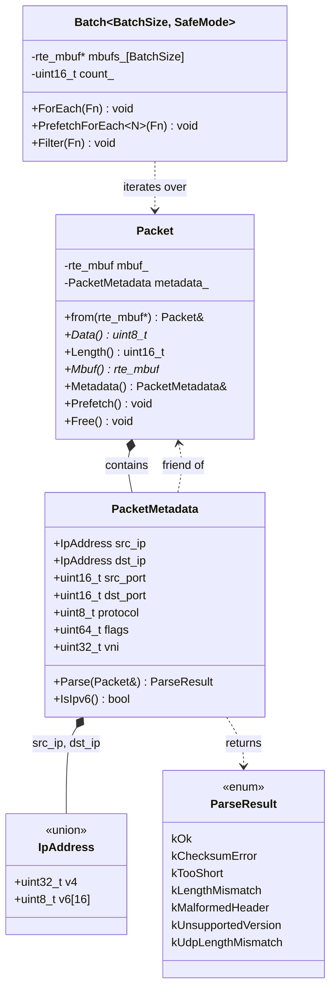
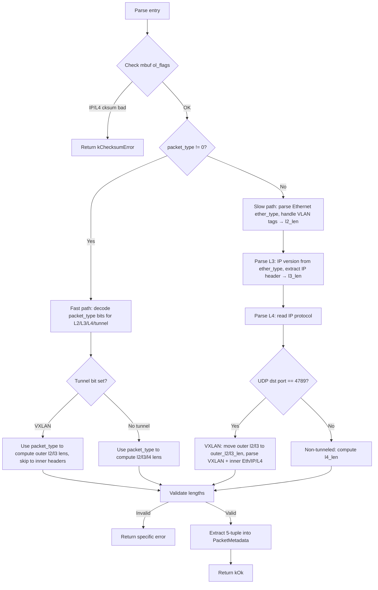

# Design Document: Packet Metadata

## Overview

This design introduces `PacketMetadata`, a fixed-layout struct stored in the `Packet` metadata region immediately after the `rte_mbuf`. It holds a parsed 5-tuple (source/destination IP, source/destination L4 port, protocol), a 64-bit flags field (bit 0 = IPv6 discriminator), and a 32-bit VNI for VXLAN. A `Parse` function extracts these fields from raw packet data, populates mbuf layer-length fields for TX offload, and rejects malformed packets via a lightweight enum return code.

The `Batch` class gains a `PrefetchForEach<N>` method that prefetches packet data and metadata N slots ahead during iteration, hiding cache misses on the hot path. `Packet::Prefetch()` is defined inline in the header as a named function, keeping prefetch logic in one place while allowing the compiler to inline it into hot loops for optimal instruction scheduling.

### Key Design Decisions

1. **IP address union with external discriminator** — The `IpAddress` union stores either `uint32_t v4` or `uint8_t v6[16]`. The discriminator lives in bit 0 of a separate 64-bit `flags` field, not inside the union. This keeps the union trivially copyable and avoids wasting space on a per-address tag.

2. **Lightweight parse result enum** — `Parse` returns a `ParseResult` enum (not `absl::Status`) to avoid heap allocation on the hot path. The enum encodes success and specific failure reasons.

3. **`packet_type` fast path with manual fallback** — The parser checks `mbuf.packet_type` first. If hardware/software classification populated it, protocol detection is a few bitwise ops. If `packet_type` is zero or insufficient, the parser falls back to reading raw header bytes.

4. **Friend relationship for mbuf writes** — `PacketMetadata` is a friend of `Packet` so the parser can write `l2_len`, `l3_len`, `l4_len`, and outer layer lengths directly on the mbuf without exposing setters.

5. **Inline `Prefetch()`** — `Packet::Prefetch()` is defined inline in the header. This allows the compiler to interleave prefetch intrinsics with the surrounding loop body for better instruction scheduling. It remains a separate named function (rather than raw `rte_prefetch0` calls in `PrefetchForEach`) so prefetch targets can be tuned in one place.

## Architecture



### Memory Layout

```
┌─────────────────────────────────────────────────┐
│  rte_mbuf (128 bytes, 2 cache lines)            │  ← Packet starts here
├─────────────────────────────────────────────────┤
│  PacketMetadata (≤ 64 bytes, 1 cache line)      │  ← metadata region
├─────────────────────────────────────────────────┤
│  Headroom remainder → packet data               │
└─────────────────────────────────────────────────┘
```

The metadata region sits between the end of the `rte_mbuf` struct and the start of packet data headroom. `kMetadataSize` is set to `sizeof(PacketMetadata)`, and a `static_assert` verifies `kMbufStructSize + kMetadataSize <= kMbufStructSize + RTE_PKTMBUF_HEADROOM`.

### Parse Flow



## Components and Interfaces

### PacketMetadata (`rxtx/packet_metadata.h`)

```cpp
namespace rxtx {

union IpAddress {
  uint32_t v4;
  uint8_t v6[16];
};

enum class ParseResult : uint8_t {
  kOk = 0,
  kChecksumError,
  kTooShort,
  kLengthMismatch,
  kMalformedHeader,
  kUnsupportedVersion,
  kUdpLengthMismatch,
};

struct PacketMetadata {
  IpAddress src_ip;
  IpAddress dst_ip;
  uint16_t src_port;
  uint16_t dst_port;
  uint32_t vni;    // 0 for non-VXLAN (placed here to fill alignment hole)
  uint8_t protocol;
  uint64_t flags;  // bit 0: 1=IPv6, 0=IPv4; bits 1-63 reserved (zero)

  // Returns true if the stored addresses are IPv6.
  bool IsIpv6() const { return flags & 1u; }

  // Parse packet headers, populate this metadata and mbuf layer lengths.
  // pkt must reference a valid Packet with accessible mbuf data.
  static ParseResult Parse(Packet& pkt, PacketMetadata& meta);

 private:
  friend class Packet;
};

}  // namespace rxtx
```

**Design rationale:**
- `Parse` is a static function taking both `Packet&` and `PacketMetadata&` so it can be called before the metadata is "attached" (useful in testing) or on the in-place metadata region.
- `ParseResult` is a `uint8_t`-backed enum — zero overhead, no heap, branch-predictable.

### Packet class modifications (`rxtx/packet.h`)

Changes to the existing `Packet` class:

1. `kMetadataSize` changes from `0` to `sizeof(PacketMetadata)`.
2. The commented-out `metadata_` array is replaced with a real `PacketMetadata metadata_` member.
3. A `Metadata()` accessor is added returning `PacketMetadata&`.
4. A `Prefetch()` member function is added, defined inline in the header.
5. `friend struct PacketMetadata;` is added.

```cpp
// In Packet class:
public:
  PacketMetadata& Metadata() { return metadata_; }
  const PacketMetadata& Metadata() const { return metadata_; }

  // Prefetch packet data and metadata for upcoming access.
  // Defined inline so the compiler can interleave prefetch instructions
  // with the caller's loop body. Kept as a named function so prefetch
  // targets can be tuned in one place.
  void Prefetch() {
    rte_prefetch0(Data());
    rte_prefetch0(&metadata_);
  }

private:
  friend struct PacketMetadata;
  rte_mbuf mbuf_;
  PacketMetadata metadata_;
```

### Batch::PrefetchForEach (`rxtx/batch.h`)

```cpp
// In Batch class:
template <uint16_t N, typename Fn>
void PrefetchForEach(Fn&& fn) {
  for (uint16_t i = 0; i < count_; ++i) {
    if constexpr (N > 0) {
      if (i + N < count_) {
        Packet::from(mbufs_[i + N]).Prefetch();
      }
    }
    Packet& pkt = Packet::from(mbufs_[i]);
    fn(pkt);
  }
}
```

When `N == 0`, the `if constexpr` eliminates the prefetch branch entirely, making `PrefetchForEach<0>` identical to `ForEach`.

### Packet::Prefetch (inline in `rxtx/packet.h`)

`Prefetch()` is defined inline in the `Packet` class body (shown above in the Packet class modifications section). It calls `rte_prefetch0` on the packet data and the metadata region. Being inline allows the compiler to fold the prefetch intrinsics directly into the `PrefetchForEach` loop, enabling better instruction scheduling and avoiding function call overhead on the hot path. No separate `.cc` file is needed for this function.

### Parse Implementation Strategy (`rxtx/packet_metadata.cc`)

The `Parse` function follows this sequence:

1. **Checksum validation** — Read `mbuf.ol_flags`. If `RTE_MBUF_F_RX_IP_CKSUM_BAD` or `RTE_MBUF_F_RX_L4_CKSUM_BAD` is set, return `kChecksumError`.

2. **Protocol detection via `packet_type`** — If `mbuf.packet_type` is non-zero, extract L2/L3/L4/tunnel type using DPDK `RTE_PTYPE_*` masks. This avoids reading raw bytes.

3. **Fallback to manual inspection** — If `packet_type` is zero, parse the Ethernet header manually: read `ether_type` at offset 12, handle VLAN tags (0x8100/0x88A8) by skipping 4 bytes per tag and re-reading `ether_type`, compute `l2_len`. Then determine IP version from `ether_type` (0x0800 → IPv4, 0x86DD → IPv6).

4. **L3/L4 parsing (slow path)** — Parse the IP header to get `l3_len` and the IP protocol field. Then parse the L4 header. If the protocol is UDP and the destination port is 4789, this is a VXLAN packet — move the already-parsed L2/L3 lengths to `outer_l2_len`/`outer_l3_len`, skip the outer UDP (8 bytes) and VXLAN header (8 bytes), then parse the inner Ethernet + IP + L4 headers to populate `l2_len`/`l3_len`/`l4_len`. For non-VXLAN packets, compute `l4_len` directly.

5. **VXLAN handling (fast path)** — If `packet_type` tunnel bits indicate VXLAN, the hardware has already classified the layers. Use the packet_type L2/L3/tunnel fields to compute outer and inner header offsets without walking bytes.

6. **Length validation** — Check `mbuf.data_len` against minimum header sizes. Verify IP total length ≤ `data_len`. For IPv4, verify IHL ≥ 5. For UDP, verify UDP length field consistency.

7. **Field population** — Write `l2_len`, `l3_len`, `l4_len` (and outer variants for VXLAN) on the mbuf. Extract the 5-tuple from the parsed headers (source/destination IP addresses, source/destination L4 ports, IP protocol) and write them into the `PacketMetadata` struct along with the flags and VNI fields.

## Data Models

### PacketMetadata Layout

| Field      | Type         | Size (bytes) | Offset | Description                                    |
|------------|-------------|-------------|--------|------------------------------------------------|
| `src_ip`   | `IpAddress` | 16          | 0      | Source IP (v4 in first 4 bytes, or full v6)    |
| `dst_ip`   | `IpAddress` | 16          | 16     | Destination IP                                 |
| `src_port` | `uint16_t`  | 2           | 32     | Source L4 port (0 if not TCP/UDP)              |
| `dst_port` | `uint16_t`  | 2           | 34     | Destination L4 port (0 if not TCP/UDP)         |
| `vni`      | `uint32_t`  | 4           | 36     | VXLAN VNI (0 for non-VXLAN)                    |
| `protocol` | `uint8_t`   | 1           | 40     | IP protocol number (6=TCP, 17=UDP, etc.)       |
| *(pad)*    |             | 7           | 41     | Compiler-inserted alignment padding            |
| `flags`    | `uint64_t`  | 8           | 48     | Bit 0: IPv6 flag. Bits 1-63: reserved (zero)  |

Total size: 56 bytes (fits in one cache line). The `vni` field is placed after `dst_port` to fill the 4-byte alignment hole that would otherwise exist before the 8-byte-aligned `flags` field.

### ParseResult Enum

| Value                  | Numeric | Meaning                                          |
|------------------------|---------|--------------------------------------------------|
| `kOk`                  | 0       | Parse succeeded                                  |
| `kChecksumError`       | 1       | IP or L4 checksum bad (from mbuf ol_flags)       |
| `kTooShort`            | 2       | Packet shorter than minimum header requirement   |
| `kLengthMismatch`      | 3       | IP total length exceeds mbuf data length         |
| `kMalformedHeader`     | 4       | IPv4 IHL < 5 or other header field invalid       |
| `kUnsupportedVersion`  | 5       | IP version is neither 4 nor 6                    |
| `kUdpLengthMismatch`   | 6       | UDP length field inconsistent with IP length     |

### IpAddress Union

```cpp
union IpAddress {
  uint32_t v4;       // IPv4: network byte order
  uint8_t  v6[16];   // IPv6: network byte order, 16 bytes
};
```

Size: 16 bytes (determined by the larger `v6` member). The active member is determined by `PacketMetadata::flags & 1`.


## Correctness Properties

*A property is a characteristic or behavior that should hold true across all valid executions of a system — essentially, a formal statement about what the system should do. Properties serve as the bridge between human-readable specifications and machine-verifiable correctness guarantees.*

### Property 1: IPv4 parse round-trip

*For any* valid non-tunneled IPv4 packet (with TCP or UDP L4) constructed from random source/destination IPv4 addresses, random ports, and a random protocol, parsing the packet should produce a `PacketMetadata` whose `src_ip.v4`, `dst_ip.v4`, `src_port`, `dst_port`, `protocol` match the constructed header values, `flags` bit 0 should be 0, `vni` should be 0, and `mbuf.l2_len`, `mbuf.l3_len`, `mbuf.l4_len` should match the constructed header sizes.

**Validates: Requirements 2.1, 1.4, 1.6, 3.1**

### Property 2: IPv6 parse round-trip

*For any* valid non-tunneled IPv6 packet (with TCP or UDP L4) constructed from random source/destination IPv6 addresses, random ports, and a random protocol, parsing the packet should produce a `PacketMetadata` whose `src_ip.v6`, `dst_ip.v6`, `src_port`, `dst_port`, `protocol` match the constructed header values, `flags` bit 0 should be 1, `vni` should be 0, and `mbuf.l2_len`, `mbuf.l3_len`, `mbuf.l4_len` should match the constructed header sizes.

**Validates: Requirements 2.2, 1.4, 3.1**

### Property 3: VXLAN parse round-trip

*For any* valid VXLAN-encapsulated packet constructed from random outer headers, a random 24-bit VNI, and a random inner 5-tuple (IPv4 or IPv6), parsing the packet should produce a `PacketMetadata` whose inner 5-tuple fields match the inner headers, `vni` matches the VXLAN VNI, `flags` bit 0 reflects the inner IP version, `mbuf.outer_l2_len` and `mbuf.outer_l3_len` match the outer header sizes, and `mbuf.l2_len`, `mbuf.l3_len`, `mbuf.l4_len` match the inner header sizes.

**Validates: Requirements 2.3, 2.4, 2.5, 3.2, 3.3**

### Property 4: Reserved flags bits are zero

*For any* valid packet (IPv4, IPv6, tunneled, or non-tunneled), after a successful parse, bits 1 through 63 of the `flags` field should all be zero.

**Validates: Requirements 1.5**

### Property 5: Non-TCP/UDP ports are zeroed

*For any* valid packet whose IP protocol is neither TCP (6) nor UDP (17), after parsing, `src_port` and `dst_port` should both be zero.

**Validates: Requirements 2.6**

### Property 6: Checksum error detection

*For any* packet where `mbuf.ol_flags` has `RTE_MBUF_F_RX_IP_CKSUM_BAD` or `RTE_MBUF_F_RX_L4_CKSUM_BAD` set, `Parse` should return `kChecksumError`.

**Validates: Requirements 4.1, 4.2**

### Property 7: Too-short packet detection

*For any* packet whose `mbuf.data_len` is less than the minimum required for the Ethernet header plus the IP header (34 bytes for IPv4, 54 bytes for IPv6), `Parse` should return `kTooShort`.

**Validates: Requirements 4.3**

### Property 8: IP total length exceeds data length

*For any* valid-looking packet where the IP total length field is set to a value greater than `mbuf.data_len - l2_len`, `Parse` should return `kLengthMismatch`.

**Validates: Requirements 4.4**

### Property 9: Malformed IPv4 IHL detection

*For any* IPv4 packet where the IHL field is set to a value less than 5 (i.e., less than 20 bytes), `Parse` should return `kMalformedHeader`.

**Validates: Requirements 4.5**

### Property 10: Unsupported IP version detection

*For any* packet where the IP version nibble is a value other than 4 or 6 (randomly chosen from {0,1,2,3,5,7,...,15}), `Parse` should return `kUnsupportedVersion`.

**Validates: Requirements 4.6**

### Property 11: UDP length mismatch detection

*For any* UDP packet where the UDP header length field does not equal the IP total length minus the IP header length, `Parse` should return `kUdpLengthMismatch`.

**Validates: Requirements 4.7**

### Property 12: packet_type fallback equivalence

*For any* valid packet, parsing with the original `mbuf.packet_type` value and parsing with `mbuf.packet_type` set to zero should produce identical `PacketMetadata` fields and identical mbuf layer-length values.

**Validates: Requirements 6.1, 6.2, 6.3**

### Property 13: PrefetchForEach visits all packets in order

*For any* batch of packets with random count in [0, BatchSize), `PrefetchForEach<N>` (for any N in [0, BatchSize)) should invoke the callback on every packet in index order [0, Count()), producing the same sequence of packet pointers as `ForEach`.

**Validates: Requirements 7.1, 7.6**

## Error Handling

### Parse Errors

All parse errors are communicated via the `ParseResult` enum return value. The parser never throws exceptions or allocates memory. Callers check the return value and decide how to handle the packet (drop, count, log).

| Error                  | Trigger                                                    | Recommended Action          |
|------------------------|------------------------------------------------------------|-----------------------------|
| `kChecksumError`       | `ol_flags` indicates bad IP or L4 checksum                 | Drop and increment counter  |
| `kTooShort`            | `data_len` < minimum header size                           | Drop and increment counter  |
| `kLengthMismatch`      | IP total length > available data                           | Drop and increment counter  |
| `kMalformedHeader`     | IPv4 IHL < 5                                               | Drop and increment counter  |
| `kUnsupportedVersion`  | IP version ≠ 4 and ≠ 6                                    | Drop and increment counter  |
| `kUdpLengthMismatch`   | UDP length ≠ IP total length - IP header length            | Drop and increment counter  |

### Prefetch Errors

`Packet::Prefetch()` and `PrefetchForEach` have no error conditions. Prefetch is a hint; if the address is invalid, the CPU silently ignores it. The bounds check `i + N < count_` prevents out-of-bounds array access.

### Integration Error Handling

If `Parse` returns an error, the `PacketMetadata` fields are in an unspecified state. Callers must not read metadata fields after a failed parse. The recommended pattern in a processor:

```cpp
batch.ForEach([](Packet& pkt) {
  auto result = PacketMetadata::Parse(pkt, pkt.Metadata());
  if (result != ParseResult::kOk) {
    // drop or count
    return;
  }
  // use pkt.Metadata() safely
});
```

## Testing Strategy

### Property-Based Testing

Property-based tests use **rapidcheck** (already in the project via `MODULE.bazel`) with the GoogleTest integration (`rapidcheck/gtest.h`). Each property from the Correctness Properties section maps to exactly one `RC_GTEST_PROP` test.

**Configuration:**
- Minimum 100 iterations per property test (rapidcheck default is 100, sufficient)
- Each test is tagged with a comment: `// Feature: packet-metadata, Property N: <title>`
- Tests use a packet builder helper that constructs valid raw packet bytes in an mbuf

**Test generators needed:**
- Random IPv4 address (`uint32_t`)
- Random IPv6 address (`uint8_t[16]`)
- Random L4 ports (`uint16_t`)
- Random IP protocol (full `uint8_t` range, or constrained to TCP/UDP for port tests)
- Random 24-bit VNI
- Random valid packet builder: constructs Ethernet + IP + L4 headers in an mbuf with correct lengths and checksums
- Random malformed packet builder: introduces specific corruptions (truncation, bad IHL, bad version, length mismatches)

**Property test list:**
1. IPv4 parse round-trip (Property 1)
2. IPv6 parse round-trip (Property 2)
3. VXLAN parse round-trip (Property 3)
4. Reserved flags bits are zero (Property 4)
5. Non-TCP/UDP ports are zeroed (Property 5)
6. Checksum error detection (Property 6)
7. Too-short packet detection (Property 7)
8. IP total length exceeds data length (Property 8)
9. Malformed IPv4 IHL detection (Property 9)
10. Unsupported IP version detection (Property 10)
11. UDP length mismatch detection (Property 11)
12. packet_type fallback equivalence (Property 12)
13. PrefetchForEach visits all packets in order (Property 13)

### Unit Testing

Unit tests complement property tests by covering specific examples, edge cases, and integration points:

- **Packet layout**: Verify `Metadata()` returns a reference at the expected offset after `rte_mbuf`.
- **Prefetch smoke test**: Call `Packet::Prefetch()` and verify it doesn't crash.
- **PrefetchForEach<0> empty batch**: Verify no callback invocations on an empty batch.
- **Specific packet examples**: Hand-crafted IPv4/TCP, IPv6/UDP, VXLAN packets with known field values, verifying exact parse output.
- **Edge cases**: Minimum-size IPv4 packet (20-byte header, no options), IPv4 with options (IHL > 5), VXLAN with inner IPv6, packet with ICMP protocol (ports should be zero).
- **static_assert verification**: Compilation itself verifies `kMbufStructSize + kMetadataSize` fits in headroom.

### Test File Organization

| File                              | Contents                                    |
|-----------------------------------|---------------------------------------------|
| `rxtx/packet_metadata_test.cc`   | Property tests and unit tests for Parse     |
| `rxtx/packet_test.cc`            | Unit tests for Packet layout and Prefetch   |
| `rxtx/batch_test.cc`             | PrefetchForEach property and unit tests     |
| `rxtx/test_packet_builder.h`     | Helper to construct raw packets in mbufs    |
