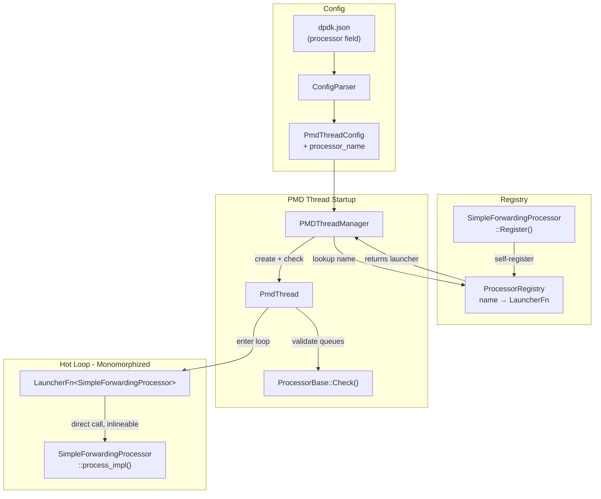

# Design Document: Packet Processor

## Overview

This design introduces a packet processor abstraction that decouples the PMD thread's main loop from specific forwarding logic. The key challenge is achieving config-driven processor selection (by string name) while eliminating virtual function overhead on the data-plane hot path.

The solution uses a two-layer dispatch strategy:

1. **Startup (cold path)**: A `ProcessorRegistry` maps string names to *launcher functions*. Each launcher is a template-stamped function that monomorphizes the entire PMD thread loop for a specific processor type. Runtime dispatch happens exactly once — when the registry selects the launcher.

2. **Data plane (hot path)**: The launcher instantiates the concrete processor type and runs a tight loop calling `process_impl()` directly on the known type. The compiler sees the exact type, can inline the call, and produces the same code as a hand-written loop. No virtual calls, no `std::function`, no indirection.

The first concrete implementation is `SimpleForwardingProcessor`, which drains all RX queues into a single TX queue.

### Design Rationale: CRTP + Registry vs. Alternatives

| Approach | Hot-path overhead | Config-driven | Complexity |
|---|---|---|---|
| Virtual functions | vtable indirect call per iteration | Yes | Low |
| `std::function` / type-erasure | Indirect call + possible heap alloc | Yes | Medium |
| **CRTP + monomorphized launcher** | **Zero — compiler sees concrete type** | **Yes** | **Medium** |
| Template-only (no registry) | Zero | No (hardcoded at compile time) | Low |

CRTP + registry gives us the best of both worlds: zero-overhead hot path with runtime configurability.

## Architecture

### Component Diagram



### Data Flow

```
Startup:
  JSON config → ConfigParser → PmdThreadConfig.processor_name
                                       ↓
                              ProcessorRegistry::Lookup(name)
                                       ↓
                              LauncherFn (template-stamped)
                                       ↓
                              ProcessorBase::Check(rx_queues, tx_queues)
                                       ↓ (if OK)
                              PmdThread stores LauncherFn

Hot loop (per lcore):
  LauncherFn<ConcreteProcessor>(config, stop_flag)
    → ConcreteProcessor proc(config);
    → while (!stop) { proc.process_impl(); }
```

### Namespace Organization

- `processor/` — new directory for all packet processor code
- `processor::PacketProcessorBase<Derived>` — CRTP base
- `processor::ProcessorRegistry` — singleton registry
- `processor::SimpleForwardingProcessor` — first concrete processor

## Components and Interfaces

### 1. PacketProcessorBase (CRTP Base)

```cpp
// processor/packet_processor_base.h
namespace processor {

// CRTP base class for packet processors.
// Derived classes implement:
//   - absl::Status check_impl(rx_queues, tx_queues)  [cold path]
//   - void process_impl()                              [hot path]
template <typename Derived>
class PacketProcessorBase {
 public:
  explicit PacketProcessorBase(const dpdk_config::PmdThreadConfig& config)
      : config_(config) {}

  // Cold-path: validate queue assignments before entering the loop.
  // Delegates to Derived::check_impl().
  absl::Status Check() {
    return static_cast<Derived*>(this)->check_impl(
        config_.rx_queues, config_.tx_queues);
  }

  // Hot-path: one iteration of receive → process → transmit.
  // Delegates to Derived::process_impl(). Inlineable when type is known.
  void Process() {
    static_cast<Derived*>(this)->process_impl();
  }

 protected:
  const dpdk_config::PmdThreadConfig& config() const { return config_; }

 private:
  dpdk_config::PmdThreadConfig config_;
};

}  // namespace processor
```

### 2. ProcessorRegistry

```cpp
// processor/processor_registry.h
namespace processor {

// A launcher function runs the entire monomorphized hot loop for a
// specific processor type. It is called once per PMD thread.
// Returns 0 on success, non-zero on error.
using LauncherFn = std::function<int(const dpdk_config::PmdThreadConfig& config,
                                     std::atomic<bool>* stop_flag)>;

// A check function validates queue assignments for a processor type.
// Called at startup before entering the hot loop.
using CheckFn = std::function<absl::Status(
    const std::vector<dpdk_config::QueueAssignment>& rx_queues,
    const std::vector<dpdk_config::QueueAssignment>& tx_queues)>;

struct ProcessorEntry {
  LauncherFn launcher;
  CheckFn checker;
};

class ProcessorRegistry {
 public:
  // Get the singleton instance.
  static ProcessorRegistry& Instance();

  // Register a processor type under a string name.
  // Typically called from a static initializer in each processor's .cc file.
  void Register(const std::string& name, ProcessorEntry entry);

  // Look up a processor by name. Returns NotFoundError if unknown.
  absl::StatusOr<const ProcessorEntry*> Lookup(const std::string& name) const;

  // List all registered processor names (for error messages).
  std::vector<std::string> RegisteredNames() const;

  // The default processor name used when config omits the field.
  static constexpr const char* kDefaultProcessorName = "simple_forwarding";

 private:
  ProcessorRegistry() = default;
  absl::flat_hash_map<std::string, ProcessorEntry> entries_;
};

}  // namespace processor
```

### 3. Registration Helper

```cpp
// processor/processor_registry.h (continued)
namespace processor {

// Helper: generates a monomorphized launcher for a CRTP processor type.
template <typename ProcessorType>
ProcessorEntry MakeProcessorEntry() {
  return ProcessorEntry{
      // Launcher: constructs the processor and runs the tight loop.
      .launcher = [](const dpdk_config::PmdThreadConfig& config,
                     std::atomic<bool>* stop_flag) -> int {
        ProcessorType proc(config);
        while (!stop_flag->load(std::memory_order_relaxed)) {
          proc.process_impl();  // Direct call — compiler knows exact type.
        }
        return 0;
      },
      // Checker: constructs a temporary processor and calls check.
      .checker = [](const std::vector<dpdk_config::QueueAssignment>& rx,
                    const std::vector<dpdk_config::QueueAssignment>& tx)
                     -> absl::Status {
        // Use a dummy config just for checking.
        dpdk_config::PmdThreadConfig dummy;
        dummy.rx_queues = rx;
        dummy.tx_queues = tx;
        ProcessorType proc(dummy);
        return proc.Check();
      },
  };
}

// Macro for self-registration in a .cc file.
// Usage: REGISTER_PROCESSOR("simple_forwarding", SimpleForwardingProcessor);
#define REGISTER_PROCESSOR(name, type)                                  \
  static bool registered_##type = [] {                                  \
    ::processor::ProcessorRegistry::Instance().Register(                \
        name, ::processor::MakeProcessorEntry<type>());                 \
    return true;                                                        \
  }()

}  // namespace processor
```

### 4. SimpleForwardingProcessor

```cpp
// processor/simple_forwarding_processor.h
namespace processor {

class SimpleForwardingProcessor
    : public PacketProcessorBase<SimpleForwardingProcessor> {
 public:
  using PacketProcessorBase::PacketProcessorBase;

  // Check: requires exactly 1 TX queue, any number of RX queues.
  absl::Status check_impl(
      const std::vector<dpdk_config::QueueAssignment>& rx_queues,
      const std::vector<dpdk_config::QueueAssignment>& tx_queues);

  // Process: drain all RX queues into the single TX queue.
  void process_impl();

 private:
  static constexpr uint16_t kBatchSize = 32;
};

}  // namespace processor
```

### 5. PmdThreadConfig Extension

```cpp
// In config/dpdk_config.h — add to PmdThreadConfig:
struct PmdThreadConfig {
  uint32_t lcore_id;
  std::vector<QueueAssignment> rx_queues;
  std::vector<QueueAssignment> tx_queues;
  std::string processor_name;  // NEW: empty means use default
};
```

### 6. PmdThread Integration

The `PmdThread::Run()` method changes from a stub loop to:

```cpp
int PmdThread::Run() {
  // Look up the launcher from the registry (already validated at startup).
  auto& registry = processor::ProcessorRegistry::Instance();
  std::string name = config_.processor_name.empty()
      ? processor::ProcessorRegistry::kDefaultProcessorName
      : config_.processor_name;

  auto entry_or = registry.Lookup(name);
  if (!entry_or.ok()) {
    std::cerr << "Processor lookup failed: " << entry_or.status() << "\n";
    return -1;
  }

  // Enter the monomorphized hot loop.
  return (*entry_or)->launcher(config_, stop_flag_ptr_);
}
```

The check is performed earlier, in `PMDThreadManager::LaunchThreads()`, before calling `rte_eal_remote_launch`:

```cpp
// In PMDThreadManager::LaunchThreads():
std::string proc_name = config.processor_name.empty()
    ? processor::ProcessorRegistry::kDefaultProcessorName
    : config.processor_name;

auto entry_or = registry.Lookup(proc_name);
if (!entry_or.ok()) {
  return entry_or.status();
}

auto check_status = (*entry_or)->checker(config.rx_queues, config.tx_queues);
if (!check_status.ok()) {
  return absl::InvalidArgumentError(
      absl::StrCat("PMD thread on lcore ", config.lcore_id,
                   ": processor '", proc_name, "' check failed: ",
                   check_status.message()));
}
```

## Data Models

### PmdThreadConfig (Extended)

```cpp
struct PmdThreadConfig {
  uint32_t lcore_id;
  std::vector<QueueAssignment> rx_queues;
  std::vector<QueueAssignment> tx_queues;
  std::string processor_name;  // Empty string → use default ("simple_forwarding")
};
```

### ProcessorEntry

```cpp
struct ProcessorEntry {
  LauncherFn launcher;  // Monomorphized hot loop function
  CheckFn checker;      // Queue assignment validator
};
```

### JSON Schema Extension

The `pmd_threads` array entries gain an optional `"processor"` field:

```json
{
  "pmd_threads": [
    {
      "lcore_id": 1,
      "processor": "simple_forwarding",
      "rx_queues": [
        {"port_id": 0, "queue_id": 0},
        {"port_id": 0, "queue_id": 1}
      ],
      "tx_queues": [
        {"port_id": 0, "queue_id": 0}
      ]
    }
  ]
}
```

### Registry State

```
ProcessorRegistry (singleton):
  entries_: {
    "simple_forwarding" → ProcessorEntry {
      launcher: LauncherFn<SimpleForwardingProcessor>,
      checker:  CheckFn<SimpleForwardingProcessor>
    }
  }
```


## Correctness Properties

*A property is a characteristic or behavior that should hold true across all valid executions of a system — essentially, a formal statement about what the system should do. Properties serve as the bridge between human-readable specifications and machine-verifiable correctness guarantees.*

### Property 1: SimpleForwarding check succeeds iff exactly 1 TX queue

*For any* vector of RX queue assignments (including empty) and *for any* vector of TX queue assignments, `SimpleForwardingProcessor::check_impl()` returns `Ok` if and only if the TX vector has exactly 1 element. When the TX count is not 1, the returned error message must contain the actual TX queue count.

**Validates: Requirements 1.1, 6.2, 6.3**

### Property 2: Processor config preservation

*For any* valid `PmdThreadConfig` (with arbitrary lcore_id, RX queues, TX queues, and processor_name), constructing a `SimpleForwardingProcessor` with that config and then accessing the stored config via `config()` should yield values identical to the original.

**Validates: Requirements 1.4**

### Property 3: Unknown processor name yields error containing the name

*For any* string that is not a registered processor name, calling `ProcessorRegistry::Lookup()` with that string returns a `NotFoundError` whose message contains the queried name.

**Validates: Requirements 3.3**

### Property 4: Processor name JSON round-trip

*For any* valid processor name string (non-empty, printable ASCII, no control characters), embedding it in a PMD thread JSON object as the `"processor"` field, parsing the JSON via `ConfigParser`, and reading back `PmdThreadConfig::processor_name` should yield the original string.

**Validates: Requirements 4.2**

### Property 5: Failed processor check aborts thread launch with descriptive error

*For any* `PmdThreadConfig` whose queue assignments fail the processor's `check_impl()` (e.g., SimpleForwarding with TX count != 1), calling `PMDThreadManager::LaunchThreads()` with that config should return a non-Ok status whose message contains both the lcore ID and the processor name.

**Validates: Requirements 5.2, 5.3**

### Property 6: Untransmitted packets are freed

*For any* batch of N packets where `rte_eth_tx_burst` transmits only K < N packets, the `SimpleForwardingProcessor` shall call `rte_pktmbuf_free` on exactly N - K mbufs. After `process_impl()` returns, no mbufs from the batch remain allocated (i.e., all are either transmitted or freed).

**Validates: Requirements 6.6**

## Error Handling

### Registry Errors

- **Unknown processor name**: `ProcessorRegistry::Lookup()` returns `absl::NotFoundError` with a message listing the unknown name and all registered names. This is caught in `PMDThreadManager::LaunchThreads()` before any thread is launched.

### Check Errors

- **Queue requirement mismatch**: Each processor's `check_impl()` returns `absl::InvalidArgumentError` with a descriptive message. For `SimpleForwardingProcessor`, the message includes the expected TX count (1) and the actual count.
- **Propagation**: `PMDThreadManager::LaunchThreads()` calls the checker before `rte_eal_remote_launch()`. If the check fails, the thread is not launched and the error is returned to the caller with the lcore ID and processor name prepended.

### Runtime Errors

- **Partial TX**: When `rte_eth_tx_burst` returns fewer than the batch count, the processor frees remaining mbufs immediately. No packets are leaked.
- **Launcher lookup failure on lcore**: If `PmdThread::Run()` fails to look up the processor (should not happen if check passed), it logs the error and returns -1. `PMDThreadManager::WaitForThreads()` will report this as a thread error.

### Error Message Format

All error messages follow the pattern used in the existing codebase:
```
"PMD thread on lcore {lcore_id}: processor '{name}' check failed: {detail}"
"Processor '{name}' not found. Registered processors: {list}"
"SimpleForwardingProcessor requires exactly 1 TX queue, but {n} were assigned"
```

## Testing Strategy

### Property-Based Testing

Library: **RapidCheck** (already in MODULE.bazel as `rapidcheck`)

Each correctness property maps to a single property-based test with a minimum of 100 iterations. Tests are tagged with the property they validate:

```cpp
// Feature: packet-processor, Property 1: SimpleForwarding check succeeds iff exactly 1 TX queue
RC_GTEST_PROP(SimpleForwardingCheck, CheckSucceedsIffOneTxQueue,
              (std::vector<QueueAssignment> rx, std::vector<QueueAssignment> tx)) {
  // ...
}
```

Property test generators:
- `QueueAssignment`: random `port_id` in [0, 3], `queue_id` in [0, 7]
- `PmdThreadConfig`: random lcore_id, random RX/TX queue vectors, random processor_name
- Processor name strings: random printable ASCII strings of length [1, 64]

### Unit Testing

Unit tests complement property tests for specific examples and edge cases:

- **Registry**: Verify `"simple_forwarding"` is registered. Verify default name constant.
- **Config parsing**: Verify `"processor"` field is parsed. Verify omitted field yields empty string.
- **SimpleForwarding check**: Specific examples — 0 TX queues, 1 TX queue, 3 TX queues, 0 RX queues.
- **Integration**: `PMDThreadManager` rejects configs with unknown processor names. `PMDThreadManager` rejects configs that fail the check.

### Test Organization

```
processor/
  packet_processor_base.h
  processor_registry.h
  processor_registry.cc
  simple_forwarding_processor.h
  simple_forwarding_processor.cc
  processor_test.cc                  # Unit tests
  processor_properties_test.cc       # Property-based tests (RapidCheck)
  BUILD
```

### What Is NOT Tested via Properties

- Actual packet I/O (`rte_eth_rx_burst` / `rte_eth_tx_burst`) — requires DPDK integration tests
- CRTP inlining / zero-overhead — verified by code review and compiler output inspection
- Thread lifecycle / ownership — verified by integration tests with DPDK EAL
- `process_impl()` correctness for real packets — requires e2e tests with TAP interfaces
