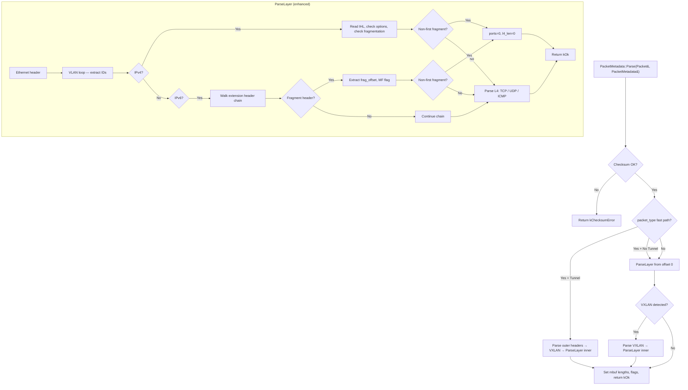

# Design Document: Parser and Test Builder Enhancement

## Overview

This design extends the `PacketMetadata` parser and test infrastructure in the `rxtx` module. The parser enhancements add IPv4 fragmentation detection, IPv4 options awareness, IPv6 extension header chain walking, QinQ VLAN metadata extraction, and ICMP/ICMPv6 parsing. The test infrastructure introduces a `HexPacket` utility class that loads scapy-generated hex strings into DPDK mbufs, replacing the manual `TestPacketBuilder` for deterministic test cases while retaining it for rapidcheck property-based tests.

The changes are confined to the `rxtx/` directory and touch three areas:

1. **PacketMetadata struct** (`packet_metadata.h`) — new fields for `frag_offset`, `outer_vlan_id`, `inner_vlan_id`, `vlan_count`, and updated flag bit assignments.
2. **ParseLayer function** (`packet_metadata.cc`) — new parsing branches for fragmentation, IPv4 options, IPv6 extension headers, VLAN ID extraction, and ICMP/ICMPv6.
3. **Test infrastructure** — new `HexPacket` class (`hex_packet.h`), scapy-generated test data constants, and updated test file (`packet_metadata_test.cc`).

## Architecture

The parser follows a layered, single-pass design. `PacketMetadata::Parse()` is the entry point, which delegates to the static `ParseLayer()` function for actual header parsing. The architecture remains unchanged — we extend `ParseLayer()` with new branches rather than introducing new functions.



### Key Design Decisions

**Decision 1: Extend ParseLayer rather than split into sub-functions.**
Rationale: The parser is a single-pass, offset-tracking function. Splitting into sub-functions would require passing many offset/length parameters. The function grows from ~160 to ~250 lines, which is acceptable for a packet parser where locality aids comprehension.

**Decision 2: ICMP uses the existing src_port/dst_port fields with a defined encoding.**
Rationale: Reusing the 5-tuple structure avoids adding ICMP-specific fields. The encoding `dst_port = (type << 8) | code` and `src_port = identifier (echo) or 0 (non-echo)` is a well-known convention in flow classification systems.

**Decision 3: HexPacket as a header-only utility alongside TestPacketBuilder.**
Rationale: HexPacket handles deterministic test cases with scapy-generated data. TestPacketBuilder remains for rapidcheck tests that need runtime-generated packets with random parameters. Both live in separate headers for independent inclusion.

**Decision 4: IPv6 extension header walking stops at `IPPROTO_AH`/`IPPROTO_ESP`.**
Rationale: AH and ESP have non-standard length encoding. Treating them as terminal protocols (ports=0) is the safe choice for a forwarding-plane parser that doesn't need to decrypt.

## Components and Interfaces

### Modified Components

#### PacketMetadata struct (`packet_metadata.h`)

New fields added after `protocol`:

```cpp
struct PacketMetadata {
  IpAddress src_ip;          // offset  0, 16 bytes
  IpAddress dst_ip;          // offset 16, 16 bytes
  uint16_t src_port;         // offset 32,  2 bytes
  uint16_t dst_port;         // offset 34,  2 bytes
  uint32_t vni;              // offset 36,  4 bytes
  uint8_t protocol;          // offset 40,  1 byte
  uint8_t vlan_count;        // offset 41,  1 byte  (NEW: 0, 1, or 2)
  uint16_t frag_offset;      // offset 42,  2 bytes (NEW: 13-bit value, 8-byte units)
  uint16_t outer_vlan_id;    // offset 44,  2 bytes (NEW: 12-bit VLAN ID)
  uint16_t inner_vlan_id;    // offset 46,  2 bytes (NEW: 12-bit VLAN ID)
  uint64_t flags;            // offset 48,  8 bytes
  // Total: 56 bytes — unchanged from current size
};
```

The 7 bytes of padding after `protocol` in the current layout are replaced by the new fields (1 + 2 + 2 + 2 = 7 bytes), keeping the struct at exactly 56 bytes.

Flag bit enum (defined in `packet_metadata.h`, outside the struct):
```cpp
enum MetaFlag : uint64_t {
  kFlagIpv6          = 1u << 0,  // Addresses are IPv6
  kFlagFragment      = 1u << 1,  // Packet is a fragment (IPv4 or IPv6)
  kFlagIpv4Options   = 1u << 2,  // IPv4 options present (IHL > 5)
  kFlagIpv6ExtHeaders = 1u << 3, // IPv6 extension headers present
};
```

New helper methods:
```cpp
bool IsIpv6() const { return flags & kFlagIpv6; }
bool IsFragment() const { return flags & kFlagFragment; }
bool HasIpv4Options() const { return flags & kFlagIpv4Options; }
bool HasIpv6ExtHeaders() const { return flags & kFlagIpv6ExtHeaders; }
```

#### ParseLayer function (`packet_metadata.cc`)

Changes to the existing function:

1. **VLAN loop** — During the existing `while` loop that skips VLAN tags, extract VLAN IDs and increment `vlan_count`:
   - First VLAN tag encountered: store as `outer_vlan_id`, set `vlan_count = 1`
   - Second VLAN tag encountered: move outer to outer, store new as `inner_vlan_id`, set `vlan_count = 2`
   - The loop already handles both 0x8100 and 0x88A8 EtherTypes

2. **IPv4 fragmentation** — After reading the IPv4 header, extract the 16-bit flags+fragment_offset field:
   ```cpp
   uint16_t frag_field = rte_be_to_cpu_16(ipv4->fragment_offset);
   uint16_t frag_off = frag_field & RTE_IPV4_HDR_OFFSET_MASK;  // 13-bit offset
   bool mf = (frag_field & RTE_IPV4_HDR_MF_FLAG) != 0;
   if (frag_off != 0 || mf) {
     meta.flags |= kFlagFragment;  // Set fragment flag
     meta.frag_offset = frag_off;
   }
   if (frag_off != 0) {
     // Non-first fragment: no L4 header present
     meta.src_port = 0;
     meta.dst_port = 0;
     out_l4_len = 0;
     return ParseResult::kOk;  // Skip L4 parsing
   }
   ```

3. **IPv4 options** — After computing `ip_hdr_len = ihl * 4`:
   ```cpp
   if (ihl > 5) {
     meta.flags |= kFlagIpv4Options;  // Set IPv4 options flag
   }
   ```
   The existing code already uses `ihl * 4` for the L4 offset, so options are already skipped correctly.

4. **IPv6 extension header chain walking** — Replace the fixed `out_l3_len = kIpv6HdrLen` with a loop:
   ```cpp
   uint8_t next_hdr = ipv6->proto;
   uint16_t ext_offset = ip_offset + kIpv6HdrLen;
   uint16_t total_ext_len = 0;
   bool has_ext = false;
   bool is_fragment = false;

   while (IsIpv6ExtensionHeader(next_hdr)) {
     has_ext = true;
     if (next_hdr == IPPROTO_FRAGMENT) {  // 44
       if (ext_offset + 8 > data_len) return ParseResult::kTooShort;
       // Fragment header: next_hdr(1) + reserved(1) + frag_off_mf(2) + id(4)
       uint8_t frag_next = data[ext_offset];
       uint16_t frag_field = (data[ext_offset + 2] << 8) | data[ext_offset + 3];
       uint16_t frag_off = frag_field >> 3;
       bool mf = (frag_field & 1) != 0;
       meta.frag_offset = frag_off;
       if (frag_off != 0 || mf) {
         meta.flags |= kFlagFragment;
       }
       is_fragment = (frag_off != 0);
       next_hdr = frag_next;
       total_ext_len += 8;  // Fragment header is always 8 bytes
       ext_offset += 8;
     } else if (next_hdr == IPPROTO_AH) {  // 51
       // Stop walking — unsupported upper-layer
       meta.protocol = next_hdr;
       meta.src_port = 0;
       meta.dst_port = 0;
       out_l4_len = 0;
       break;
     } else if (next_hdr == IPPROTO_ESP) {  // 50
       meta.protocol = next_hdr;
       meta.src_port = 0;
       meta.dst_port = 0;
       out_l4_len = 0;
       break;
     } else {
       // Hop-by-Hop (IPPROTO_HOPOPTS), Routing (IPPROTO_ROUTING), Destination Options (IPPROTO_DSTOPTS)
       if (ext_offset + 2 > data_len) return ParseResult::kTooShort;
       uint8_t ext_next = data[ext_offset];
       uint8_t ext_len = data[ext_offset + 1];  // in 8-byte units, excluding first 8
       uint16_t ext_size = (static_cast<uint16_t>(ext_len) + 1) * 8;
       if (ext_offset + ext_size > data_len) return ParseResult::kTooShort;
       next_hdr = ext_next;
       total_ext_len += ext_size;
       ext_offset += ext_size;
     }
   }

   if (has_ext) meta.flags |= kFlagIpv6ExtHeaders;
   out_l3_len = kIpv6HdrLen + total_ext_len;
   meta.protocol = next_hdr;
   ```

   Helper function (uses POSIX `IPPROTO_*` constants from `<netinet/in.h>`, included transitively via `<rte_ip.h>`):
   ```cpp
   static bool IsIpv6ExtensionHeader(uint8_t next_hdr) {
     return next_hdr == IPPROTO_HOPOPTS ||    // 0
            next_hdr == IPPROTO_ROUTING ||     // 43
            next_hdr == IPPROTO_FRAGMENT ||    // 44
            next_hdr == IPPROTO_ESP ||         // 50
            next_hdr == IPPROTO_AH ||          // 51
            next_hdr == IPPROTO_DSTOPTS;       // 60
   }
   ```

5. **ICMP/ICMPv6 parsing** — Add a new branch in the L4 parsing section:
   ```cpp
   // ICMP type constants (no standard DPDK/POSIX macros for these).
   constexpr uint8_t kIcmpEchoReply = 0;
   constexpr uint8_t kIcmpEchoRequest = 8;
   constexpr uint8_t kIcmpv6EchoRequest = 128;
   constexpr uint8_t kIcmpv6EchoReply = 129;

   // In the L4 section (both IPv4 and IPv6 paths).
   // Uses POSIX IPPROTO_ICMP (1) and IPPROTO_ICMPV6 (58) from <netinet/in.h>.
   } else if (meta.protocol == IPPROTO_ICMP || meta.protocol == IPPROTO_ICMPV6) {
     constexpr uint16_t kIcmpHdrLen = 8;
     if (l4_offset + kIcmpHdrLen > data_len) {
       return ParseResult::kTooShort;
     }
     uint8_t icmp_type = data[l4_offset];
     uint8_t icmp_code = data[l4_offset + 1];
     meta.dst_port = (static_cast<uint16_t>(icmp_type) << 8) | icmp_code;

     // Echo Request/Reply: extract Identifier
     bool is_echo = false;
     if (meta.protocol == IPPROTO_ICMP) {
       is_echo = (icmp_type == kIcmpEchoRequest || icmp_type == kIcmpEchoReply);
     } else {
       is_echo = (icmp_type == kIcmpv6EchoRequest || icmp_type == kIcmpv6EchoReply);
     }
     if (is_echo) {
       meta.src_port = (data[l4_offset + 4] << 8) | data[l4_offset + 5];
     } else {
       meta.src_port = 0;
     }
     out_l4_len = kIcmpHdrLen;
   }
   ```

### New Components

#### HexPacket class (`rxtx/hex_packet.h`)

A header-only test utility that converts hex strings to DPDK mbufs:

```cpp
class HexPacket {
 public:
  // Construct from hex string. Decodes hex to bytes, allocates mbuf,
  // copies bytes into mbuf data area.
  HexPacket(const char* hex, TestMbufAllocator& alloc,
            uint32_t packet_type = 0, uint64_t ol_flags = 0);

  // Returns a Packet& suitable for PacketMetadata::Parse().
  Packet& GetPacket();

  // Returns the decoded byte count.
  uint16_t Length() const;

  // Returns true if construction succeeded.
  bool Valid() const;

 private:
  rte_mbuf* mbuf_ = nullptr;
  bool valid_ = false;
};
```

Design notes:
- Constructor validates hex string (even length, valid hex chars), decodes to bytes, allocates mbuf via `TestMbufAllocator::Alloc()`, copies bytes with `rte_pktmbuf_append()` + `memcpy`.
- On invalid input, `valid_` is set to false and `mbuf_` remains null.
- `GetPacket()` returns `Packet::from(mbuf_)`.
- Optional `packet_type` and `ol_flags` are set on the mbuf after allocation.

#### Test data constants (`rxtx/test_packet_data.h`)

A header file containing `static constexpr const char*` hex string constants, each preceded by a comment showing the scapy command that generated it. Constants cover:

**Valid packets:**
- `kIpv4TcpPacket` — basic Ethernet/IPv4/TCP
- `kIpv4UdpPacket` — basic Ethernet/IPv4/UDP
- `kIpv6TcpPacket` — basic Ethernet/IPv6/TCP
- `kIpv6UdpPacket` — basic Ethernet/IPv6/UDP
- `kIpv4FragFirstPacket` — IPv4 first fragment (MF=1, offset=0)
- `kIpv4FragSecondPacket` — IPv4 non-first fragment (offset>0)
- `kIpv4OptionsPacket` — IPv4 with options (IHL>5)
- `kIpv6FragmentPacket` — IPv6 with Fragment extension header
- `kIpv6ExtHdrPacket` — IPv6 with Hop-by-Hop + Routing headers
- `kVlanIpv4TcpPacket` — single VLAN tagged
- `kQinQIpv6UdpPacket` — QinQ double-tagged
- `kVxlanIpv4TcpPacket` — VXLAN encapsulated
- `kIcmpEchoRequestPacket` — IPv4 ICMP Echo Request
- `kIcmpEchoReplyPacket` — IPv4 ICMP Echo Reply
- `kIcmpv6EchoRequestPacket` — IPv6 ICMPv6 Echo Request
- `kIcmpDestUnreachPacket` — ICMP Destination Unreachable (non-echo)

**Malformed packets:**
- `kTruncatedEthernetPacket` — fewer than 14 bytes
- `kTruncatedIpv4Packet` — valid Ethernet, truncated IPv4 header
- `kTruncatedL4Packet` — valid Ethernet+IP, truncated TCP/UDP/ICMP header
- `kIpv4TotalLenExceedsPacket` — IPv4 total_length > actual data
- `kIpv6PayloadLenExceedsPacket` — IPv6 payload_len > actual data
- `kIpv4BadIhlPacket` — IHL < 5
- `kBadIpVersionPacket` — IP version neither 4 nor 6
- `kUdpLenMismatchPacket` — UDP dgram_len doesn't match IP total_length
- `kVxlanTruncatedPacket` — truncated mid-VXLAN header
- `kBadChecksumPacket` — ol_flags with checksum bad bits set

## Data Models

### PacketMetadata Struct Layout (56 bytes)

```
Offset  Field            Type        Size   Notes
──────  ───────────────  ──────────  ─────  ─────────────────────────────
 0      src_ip           IpAddress   16     IPv4 (4 bytes used) or IPv6
16      dst_ip           IpAddress   16     IPv4 (4 bytes used) or IPv6
32      src_port         uint16_t     2     L4 src port / ICMP identifier
34      dst_port         uint16_t     2     L4 dst port / ICMP (type<<8)|code
36      vni              uint32_t     4     VXLAN VNI (0 if not tunneled)
40      protocol         uint8_t      1     IP protocol number
41      vlan_count       uint8_t      1     Number of VLAN tags (0, 1, 2)
42      frag_offset      uint16_t     2     Fragment offset in 8-byte units
44      outer_vlan_id    uint16_t     2     Outer VLAN ID (0 if no VLAN)
46      inner_vlan_id    uint16_t     2     Inner VLAN ID (0 if < 2 VLANs)
48      flags            uint64_t     8     Bit flags (see below)
──────  ───────────────  ──────────  ─────
Total: 56 bytes (fits in one cache line)
```

### Flags Bit Layout

```
Bit   Enum Value              Meaning
────  ──────────────────────  ──────────────────────────────────
 0    kFlagIpv6               Addresses are IPv6
 1    kFlagFragment           Packet is a fragment (IPv4 or IPv6)
 2    kFlagIpv4Options        IPv4 options present (IHL > 5)
 3    kFlagIpv6ExtHeaders     IPv6 extension headers present
4-63  (reserved)              Initialized to zero
```

### ParseResult Enum

No changes to the existing enum. The existing error codes cover all new error conditions:
- `kTooShort` — used for truncated extension headers, truncated ICMP headers
- `kMalformedHeader` — used for IHL < 5 (already exists)
- `kUnsupportedVersion` — used for bad IP version (already exists)

### ICMP Field Encoding in PacketMetadata

| Protocol | ICMP Type | src_port | dst_port |
|---|---|---|---|
| `IPPROTO_ICMP` (1) | Echo Request (`kIcmpEchoRequest`) / Echo Reply (`kIcmpEchoReply`) | Identifier field | `(type << 8) \| code` |
| `IPPROTO_ICMPV6` (58) | Echo Request (`kIcmpv6EchoRequest`) / Echo Reply (`kIcmpv6EchoReply`) | Identifier field | `(type << 8) \| code` |
| Either | Other (e.g., Dest Unreachable) | 0 | `(type << 8) \| code` |


## Correctness Properties

*A property is a characteristic or behavior that should hold true across all valid executions of a system — essentially, a formal statement about what the system should do. Properties serve as the bridge between human-readable specifications and machine-verifiable correctness guarantees.*

### Property 1: Fragmentation flag correctness

*For any* valid IPv4 packet (with any combination of Fragment_Offset and MF_Flag) or any valid IPv6 packet (with or without a Fragment extension header), the fragment flag (bit 1) in `flags` is set if and only if the packet is fragmented (IPv4: Fragment_Offset > 0 or MF_Flag set; IPv6: Fragment header present with offset > 0 or MF set), and `frag_offset` stores the correct 13-bit offset value. For non-fragmented packets, the fragment flag is clear and `frag_offset` is zero.

**Validates: Requirements 1.1, 1.4, 1.6, 3.2**

### Property 2: Non-first fragment port zeroing

*For any* valid fragmented packet (IPv4 or IPv6) where Fragment_Offset > 0, the parser sets `src_port = 0`, `dst_port = 0`, and `mbuf.l4_len = 0`. Conversely, for any first fragment (offset = 0, MF set) or unfragmented packet, the parser extracts L4 ports normally from the TCP/UDP/ICMP header.

**Validates: Requirements 1.2, 1.3, 3.3, 3.4**

### Property 3: IPv4 options flag and L4 offset correctness

*For any* valid IPv4 packet with a TCP or UDP L4 header, the IPv4 options flag (bit 2) is set if and only if IHL > 5, and the extracted `src_port` and `dst_port` match the values in the L4 header regardless of whether options are present (proving the L4 offset calculation `IHL × 4` is correct).

**Validates: Requirements 2.1, 2.2, 2.3**

### Property 4: IPv6 extension header chain walking

*For any* valid IPv6 packet with a chain of extension headers (any combination of Hop-by-Hop, Routing, Fragment, Destination Options, terminated by TCP/UDP/ICMP or AH/ESP), the parser identifies the correct upper-layer protocol number, `mbuf.l3_len` equals 40 plus the total size of all extension headers traversed, and the IPv6 extension headers flag (bit 3) is set. For `IPPROTO_AH` or `IPPROTO_ESP`, the protocol field is set to that value and ports are zero.

**Validates: Requirements 3.1, 3.5, 3.7, 3.8, 3.9**

### Property 5: VLAN metadata extraction

*For any* valid packet with 0, 1, or 2 VLAN tags, `vlan_count` equals the number of VLAN tags present, `outer_vlan_id` equals the first VLAN ID (or 0 if no tags), `inner_vlan_id` equals the second VLAN ID (or 0 if fewer than 2 tags), and `mbuf.l2_len` equals 14 + (4 × vlan_count).

**Validates: Requirements 4.1, 4.2, 4.3, 4.5**

### Property 6: HexPacket decode/encode round-trip

*For any* string of valid hexadecimal characters with even length, decoding the hex string to bytes via `HexPacket` and then re-encoding the mbuf data bytes back to a hex string produces the identical original string.

**Validates: Requirements 6.1, 7.4**

### Property 7: ICMP/ICMPv6 field extraction

*For any* valid ICMP (`IPPROTO_ICMP`, IPv4) or ICMPv6 (`IPPROTO_ICMPV6`, IPv6) packet, `dst_port` equals `(type << 8) | code`, `src_port` equals the 16-bit Identifier field if the type is Echo Request/Reply (IPv4: `kIcmpEchoRequest`/`kIcmpEchoReply`, IPv6: `kIcmpv6EchoRequest`/`kIcmpv6EchoReply`) or zero otherwise, and `mbuf.l4_len` equals 8.

**Validates: Requirements 9.1, 9.2, 9.3, 9.4, 9.5, 9.6**

## Error Handling

### Parse Errors

All error conditions return a `ParseResult` enum value. No exceptions are thrown. The caller checks the return value and handles errors (e.g., dropping the packet, incrementing an error counter).

| Condition | ParseResult | Requirements |
|---|---|---|
| Checksum bad (ol_flags) | `kChecksumError` | Existing |
| Data too short for any header | `kTooShort` | 2.5, 3.6, 9.7 |
| IPv4 total_length > data | `kLengthMismatch` | Existing |
| IPv6 payload_len > data | `kLengthMismatch` | Existing |
| IHL < 5 | `kMalformedHeader` | Existing |
| IP version not 4 or 6 | `kUnsupportedVersion` | Existing |
| UDP dgram_len mismatch | `kUdpLengthMismatch` | Existing |

### HexPacket Errors

- Odd-length hex string: `Valid()` returns false, `GetPacket()` is undefined behavior (caller must check `Valid()` first).
- Invalid hex characters: same as above.
- Mempool exhaustion: `Alloc()` returns nullptr, `Valid()` returns false.

### Initialization of New Fields

On entry to `ParseLayer`, the new fields (`frag_offset`, `outer_vlan_id`, `inner_vlan_id`, `vlan_count`) must be zero-initialized. This is done in `PacketMetadata::Parse()` before calling `ParseLayer()`:

```cpp
meta.frag_offset = 0;
meta.outer_vlan_id = 0;
meta.inner_vlan_id = 0;
meta.vlan_count = 0;
```

## Testing Strategy

### Dual Testing Approach

Tests use both unit tests (specific examples via HexPacket) and property-based tests (universal properties via rapidcheck + TestPacketBuilder).

### Unit Tests (HexPacket-based)

Each deterministic test case uses a scapy-generated hex string constant loaded via `HexPacket`. These cover:

- **Happy path**: IPv4/TCP, IPv4/UDP, IPv6/TCP, IPv6/UDP, VXLAN, ICMP Echo Request/Reply, ICMPv6 Echo Request, ICMP Dest Unreachable
- **Feature-specific**: IPv4 first fragment, IPv4 non-first fragment, IPv4 with options, IPv6 with Fragment header, IPv6 with Hop-by-Hop + Routing headers, single VLAN, QinQ double VLAN
- **Malformed packets**: truncated Ethernet, truncated IPv4, truncated L4, bad total_length, bad payload_len, bad IHL, bad IP version, UDP length mismatch, truncated VXLAN, bad checksum flags

Each unit test asserts the exact expected `ParseResult`, field values, and mbuf layer lengths.

### Property-Based Tests (rapidcheck)

Each correctness property from the design is implemented as a single rapidcheck property test. Tests use `TestPacketBuilder` to generate packets with random parameters.

**Configuration:**
- Minimum 100 iterations per property test (rapidcheck default is 100, which satisfies this)
- Each test is tagged with a comment: `// Feature: parser-and-test-builder-enhancement, Property N: <title>`

**Property test list:**
1. `// Feature: parser-and-test-builder-enhancement, Property 1: Fragmentation flag correctness`
2. `// Feature: parser-and-test-builder-enhancement, Property 2: Non-first fragment port zeroing`
3. `// Feature: parser-and-test-builder-enhancement, Property 3: IPv4 options flag and L4 offset correctness`
4. `// Feature: parser-and-test-builder-enhancement, Property 4: IPv6 extension header chain walking`
5. `// Feature: parser-and-test-builder-enhancement, Property 5: VLAN metadata extraction`
6. `// Feature: parser-and-test-builder-enhancement, Property 6: HexPacket decode/encode round-trip`
7. `// Feature: parser-and-test-builder-enhancement, Property 7: ICMP/ICMPv6 field extraction`

**TestPacketBuilder extensions needed for property tests:**
- `SetFragOffset(uint16_t)` and `SetMfFlag(bool)` for IPv4 fragmentation
- `SetIhl(uint8_t)` for IPv4 options (with padding bytes)
- IPv6 extension header building methods
- ICMP header building methods
- QinQ VLAN support (outer + inner VLAN IDs)

These extensions keep `TestPacketBuilder` useful for rapidcheck while `HexPacket` handles the deterministic cases.

### Test File Organization

```
rxtx/
├── hex_packet.h              # HexPacket class (header-only, testonly)
├── test_packet_data.h         # Scapy-generated hex string constants (testonly)
├── test_packet_builder.h      # Existing builder (kept for rapidcheck)
├── test_utils.h               # Existing TestMbufAllocator
├── packet_metadata_test.cc    # All parser tests (unit + property)
└── BUILD                      # Updated with new test library targets
```

### BUILD Target Changes

```python
cc_library(
    name = "hex_packet",
    hdrs = ["hex_packet.h"],
    deps = [
        "//rxtx:packet",
        "//rxtx:test_utils",
        "//:dpdk_lib",
    ],
    testonly = True,
    visibility = ["//visibility:public"],
)

cc_library(
    name = "test_packet_data",
    hdrs = ["test_packet_data.h"],
    testonly = True,
    visibility = ["//visibility:public"],
)
```

The `packet_metadata_test` target adds deps on `hex_packet` and `test_packet_data`.
