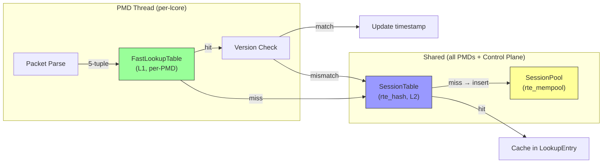
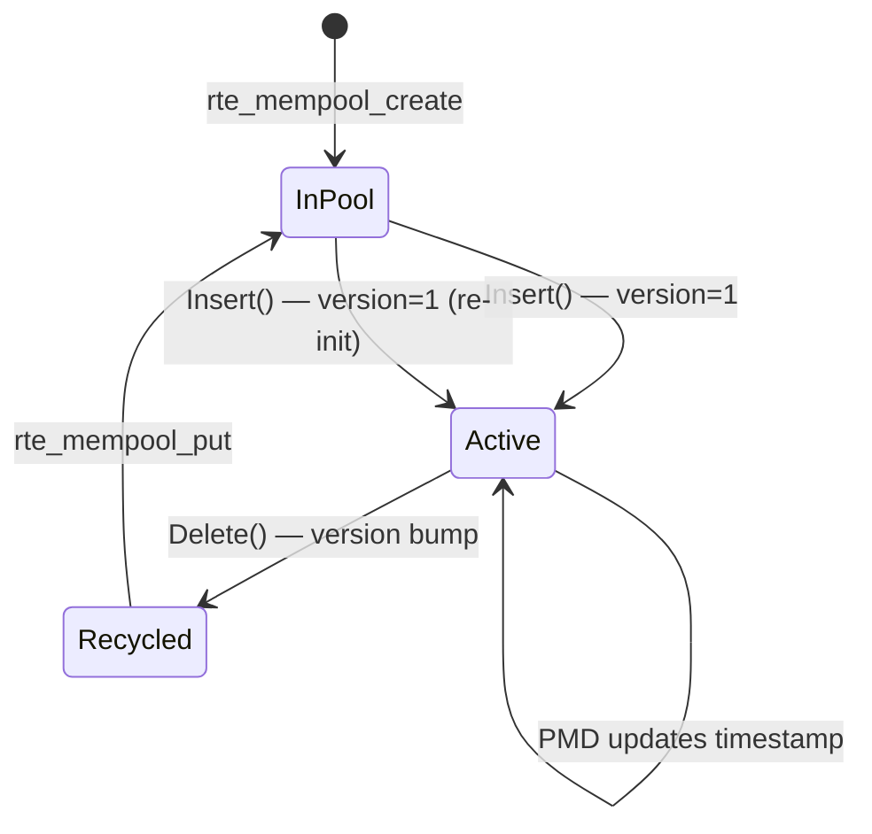

# Design Document: SessionTable — Shared Concurrent Session Tracking

## Overview

This design adds a shared, concurrent SessionTable to the packet processing pipeline. The SessionTable is backed by DPDK's `rte_hash` (cuckoo hash with lock-free readers and per-bucket spinlock writers) and `rte_mempool` (MPMC session entry allocation). It provides an authoritative L2 session index shared across all PMD threads, sitting beneath the existing per-PMD FastLookupTable (L1 cache).

The two-tier lookup works as follows:

1. **L1 hit + version match** (fast path): The PMD thread finds a LookupEntry in its per-thread FastLookupTable. The entry carries a cached `SessionEntry*` pointer and a `cached_version`. The PMD compares `cached_version` against `session->version.load(relaxed)`. Match → session is valid, update timestamp, done.

2. **L1 hit + version mismatch**: The cached session was recycled by the control plane. The PMD clears the cached pointer, falls through to L2.

3. **L1 miss → L2 lookup**: The PMD queries the shared SessionTable by 5-tuple + zone_id. If found, caches the `SessionEntry*` and version in the LookupEntry. If not found, inserts a new session.

Session memory is owned by an `rte_mempool` (SessionPool). Entries are never freed — only recycled with a version bump. The control plane is the sole writer for version bumps and deletions. PMD threads insert new sessions and update timestamps. RCU QSBR integration via `rte_hash_rcu_qsbr_add()` provides automatic deferred internal slot reclamation.

## Architecture

### Two-Tier Lookup Diagram



### Thread Safety Model

| Operation | Thread | Synchronization |
|---|---|---|
| `SessionTable::Lookup()` | PMD threads | Lock-free (rte_hash RW_CONCURRENCY_LF) |
| `SessionTable::Insert()` | PMD threads | Per-bucket spinlock (rte_hash MULTI_WRITER_ADD) |
| `SessionTable::Delete()` | Control plane only | Per-bucket spinlock (rte_hash) |
| `SessionTable::ForEach()` | Control plane only | rte_hash_iterate (single-threaded) |
| `SessionEntry::version` read | PMD threads | `std::memory_order_relaxed` atomic load |
| `SessionEntry::version` write | Control plane only | Relaxed load + increment + relaxed store (single-writer) |
| `SessionEntry::timestamp` write | PMD threads | `std::memory_order_relaxed` atomic store |
| `SessionPool::Get()` | PMD threads | rte_mempool MPMC (lock-free) |
| `SessionPool::Put()` | Control plane | rte_mempool MPMC (lock-free) |

### Version-Based Invalidation Flow

```
PMD thread hot path:
  entry = FastLookupTable.Find(meta)
  if entry != nullptr:
    if entry->session != nullptr:
      current_ver = entry->session->version.load(relaxed)
      if entry->cached_version == current_ver:
        // FAST PATH: session valid
        entry->session->timestamp.store(now, relaxed)
        return
      else:
        // Version mismatch: session was recycled
        entry->session = nullptr
        entry->cached_version = 0
        // Fall through to L2

  // L2 lookup
  session = SessionTable.Lookup(key)
  if session == nullptr:
    session = SessionTable.Insert(key)
  if session != nullptr && entry != nullptr:
    entry->session = session
    entry->cached_version = session->version.load(relaxed)
```

```
Control plane delete:
  session = rte_hash_lookup_data(key)
  ver = session->version.load(relaxed)
  session->version.store(ver + 1, relaxed)   // invalidate all cached refs
  rte_hash_del_key(key)                       // deferred slot reclaim via QSBR
  rte_mempool_put(pool, session)              // return to pool for reuse
```

## Components and Interfaces

### New Files

```
session/
├── BUILD                    # Bazel build targets
├── session_entry.h          # SessionEntry struct (header-only)
├── session_key.h            # SessionKey struct + hash (header-only)
├── session_table.h          # SessionTable class declaration
└── session_table.cc         # SessionTable implementation
```

### Modified Files

| File | Change |
|---|---|
| `rxtx/lookup_entry.h` | Add `SessionEntry* session` and `uint32_t cached_version` fields, reclaim padding to stay at 64 bytes |
| `processor/processor_context.h` | Add `void* session_table` field |
| `processor/five_tuple_forwarding_processor.h/.cc` | Add SessionTable pointer, two-tier lookup logic in `process_impl()` |
| `control/control_plane.h/.cc` | Own `SessionTable`, pass to ProcessorContext |
| `config/dpdk_config.h` | Add `session_capacity` field to `DpdkConfig` |
| `config/config_parser.cc` | Parse `session_capacity` from JSON |
| `config/config_validator.cc` | Validate `session_capacity` |
| `config/config_printer.cc` | Print `session_capacity` |
| `control/BUILD` | Add `//session:session_table` dep |
| `processor/BUILD` | Add `//session:session_table` dep to five_tuple_forwarding_processor |
| `rxtx/BUILD` | Add forward-declaration dep for `lookup_entry` (if needed) |
| `BUILD` (root) | Add `//session:session_table` dep to main binary |


### Component 1: SessionEntry

**File**: `session/session_entry.h`

Cache-line-aligned session state. Allocated from `rte_mempool`, never freed — only recycled with version bump.

```cpp
#ifndef SESSION_SESSION_ENTRY_H_
#define SESSION_SESSION_ENTRY_H_

#include <atomic>
#include <cstdint>

namespace session {

// Session state stored in the rte_mempool.
// Aligned to 64 bytes to avoid false sharing between entries.
//
// Memory layout (64 bytes):
//   Offset  0: version    (atomic<uint32_t>, 4 bytes)
//   Offset  4: [padding]  (4 bytes)
//   Offset  8: timestamp  (atomic<uint64_t>, 8 bytes)
//   Offset 16: [reserved] (48 bytes for future fields)
//
// Thread safety:
//   - version: written by control plane only (relaxed load + store),
//              read by PMD threads (relaxed load)
//   - timestamp: written by PMD threads (relaxed store),
//                read by control plane (relaxed load)
struct alignas(64) SessionEntry {
  std::atomic<uint32_t> version{0};
  std::atomic<uint64_t> timestamp{0};

  // Padding to fill cache line. Reserved for future session state
  // (e.g., byte counters, TCP state, NAT mappings).
  uint8_t reserved_[48] = {};
};

static_assert(sizeof(SessionEntry) == 64,
              "SessionEntry must be exactly one cache line");
static_assert(alignof(SessionEntry) == 64,
              "SessionEntry must be cache-line aligned");

}  // namespace session

#endif  // SESSION_SESSION_ENTRY_H_
```

**Design notes**:
- `version` starts at 0 in the mempool (uninitialized). On first allocation for a new session, `Insert()` sets it to 1. On recycle (delete), the control plane bumps it. A `cached_version` of 0 in LookupEntry means "no session cached" — it will never match a live session (version ≥ 1).
- `timestamp` is `uint64_t` to hold nanosecond or TSC values. The exact time source is caller's choice.
- 48 bytes reserved for future fields without changing the struct size.

### Component 2: SessionKey

**File**: `session/session_key.h`

The lookup key for `rte_hash`. Must be a flat, memcmp-able struct since `rte_hash` uses byte-level key comparison.

```cpp
#ifndef SESSION_SESSION_KEY_H_
#define SESSION_SESSION_KEY_H_

#include <cstdint>
#include <cstring>

#include "rxtx/packet_metadata.h"

namespace session {

// Flat key for rte_hash. Must be trivially copyable and memcmp-safe.
// rte_hash compares keys byte-by-byte, so all padding must be zeroed.
//
// Memory layout (40 bytes):
//   Offset  0: src_ip    (IpAddress, 16 bytes)
//   Offset 16: dst_ip    (IpAddress, 16 bytes)
//   Offset 32: src_port  (uint16_t, 2 bytes)
//   Offset 34: dst_port  (uint16_t, 2 bytes)
//   Offset 36: zone_id   (uint32_t, 4 bytes)
//   Offset 40: protocol  (uint8_t, 1 byte)
//   Offset 41: flags     (uint8_t, 1 byte)  — bit 0: IPv6
//   Offset 42: [padding] (2 bytes, must be zero)
//   Total: 44 bytes
struct SessionKey {
  rxtx::IpAddress src_ip;
  rxtx::IpAddress dst_ip;
  uint16_t src_port;
  uint16_t dst_port;
  uint32_t zone_id;
  uint8_t protocol;
  uint8_t flags;       // bit 0: 1 = IPv6, 0 = IPv4
  uint8_t pad_[2];     // explicit padding, must be zero

  // Build a SessionKey from PacketMetadata with a given zone_id.
  // Zeroes the struct first to ensure padding bytes are clean.
  static SessionKey FromMetadata(const rxtx::PacketMetadata& meta,
                                 uint32_t zone_id) {
    SessionKey key;
    std::memset(&key, 0, sizeof(key));
    key.src_ip = meta.src_ip;
    key.dst_ip = meta.dst_ip;
    key.src_port = meta.src_port;
    key.dst_port = meta.dst_port;
    key.zone_id = zone_id;
    key.protocol = meta.protocol;
    key.flags = static_cast<uint8_t>(meta.flags & rxtx::kFlagIpv6);
    return key;
  }
};

static_assert(sizeof(SessionKey) == 44,
              "SessionKey must be 44 bytes for rte_hash");

}  // namespace session

#endif  // SESSION_SESSION_KEY_H_
```

**Design notes**:
- `zone_id` replaces `vni` from LookupEntry. Different semantic: zones partition sessions logically, VNI is a tunnel identifier.
- `memset(&key, 0, sizeof(key))` in `FromMetadata` ensures padding bytes are zero for correct `rte_hash` key comparison.
- `flags` carries the IPv6 bit so that the same 5-tuple with different IP versions hashes differently.

### Component 3: SessionTable

**File**: `session/session_table.h`, `session/session_table.cc`

The shared concurrent session index. Owns the `rte_hash` and `rte_mempool`.

**Interface**:

```cpp
#ifndef SESSION_SESSION_TABLE_H_
#define SESSION_SESSION_TABLE_H_

#include <cstdint>

#include "absl/status/status.h"
#include "absl/status/statusor.h"
#include "session/session_entry.h"
#include "session/session_key.h"

struct rte_hash;
struct rte_mempool;
struct rte_rcu_qsbr;

namespace session {

class SessionTable {
 public:
  struct Config {
    uint32_t capacity = 0;       // 0 = disabled
    const char* name = "session_table";  // rte_hash/rte_mempool name prefix
  };

  SessionTable() = default;
  ~SessionTable();

  SessionTable(const SessionTable&) = delete;
  SessionTable& operator=(const SessionTable&) = delete;

  // Initialize the hash table and mempool.
  // qsbr_var may be nullptr (RCU deferred reclamation disabled).
  absl::Status Init(const Config& config, struct rte_rcu_qsbr* qsbr_var);

  // Look up a session by key. Lock-free for readers.
  // Thread safety: safe to call from any PMD thread.
  SessionEntry* Lookup(const SessionKey& key) const;

  // Insert a new session. Allocates a SessionEntry from the pool,
  // initializes version=1 and timestamp=current, inserts into rte_hash.
  // If the key already exists, returns the existing entry.
  // Returns nullptr if the pool is exhausted or rte_hash insert fails.
  // Thread safety: safe to call from any PMD thread (per-bucket spinlock).
  SessionEntry* Insert(const SessionKey& key);

  // Delete a session by key. Bumps version, returns entry to pool,
  // removes from rte_hash. The rte_hash defers internal slot reclamation
  // via QSBR if attached.
  // Thread safety: call from control plane only.
  absl::Status Delete(const SessionKey& key);

  // Iterate all sessions. Callback receives key and entry pointer.
  // If callback returns true, the entry is deleted (same as Delete).
  // Thread safety: call from control plane only.
  // Returns the number of entries visited.
  template <typename Fn>
  uint32_t ForEach(Fn fn);

  // Current number of entries (approximate under concurrency).
  int32_t Count() const;

  // Configured capacity.
  uint32_t capacity() const { return capacity_; }

 private:
  // Bump version using single-writer pattern (relaxed load + store).
  void BumpVersion(SessionEntry* entry);

  // Return a SessionEntry to the mempool.
  void ReturnToPool(SessionEntry* entry);

  struct rte_hash* hash_ = nullptr;
  struct rte_mempool* pool_ = nullptr;
  uint32_t capacity_ = 0;
};

}  // namespace session

#endif  // SESSION_SESSION_TABLE_H_
```


**Implementation Details**:

**Init**:
```
FUNCTION Init(config, qsbr_var)
  IF config.capacity == 0 THEN
    RETURN InvalidArgumentError("capacity must be > 0")
  END IF

  capacity_ = config.capacity

  // Create rte_mempool for SessionEntry objects.
  // MPMC (default) — any thread can get/put.
  // rte_mempool_create does NOT clear object contents on get.
  pool_ = rte_mempool_create(
      name = "<config.name>_pool",
      n = config.capacity,
      elt_size = sizeof(SessionEntry),
      cache_size = 256,          // per-lcore cache for reduced contention
      private_data_size = 0,
      mp_init = nullptr,
      mp_init_arg = nullptr,
      obj_init = nullptr,        // no per-object init — version survives recycle
      obj_init_arg = nullptr,
      socket_id = SOCKET_ID_ANY,
      flags = 0)
  IF pool_ == nullptr THEN
    RETURN ResourceExhaustedError("rte_mempool_create failed")
  END IF

  // Create rte_hash with lock-free readers + multi-writer.
  rte_hash_parameters params = {
      .name = "<config.name>_hash",
      .entries = config.capacity,
      .key_len = sizeof(SessionKey),
      .hash_func = rte_hash_crc,   // hardware CRC32 on x86
      .hash_func_init_val = 0,
      .socket_id = SOCKET_ID_ANY,
      .extra_flag = RTE_HASH_EXTRA_FLAGS_RW_CONCURRENCY_LF
                  | RTE_HASH_EXTRA_FLAGS_MULTI_WRITER_ADD,
  }
  hash_ = rte_hash_create(&params)
  IF hash_ == nullptr THEN
    rte_mempool_free(pool_)
    pool_ = nullptr
    RETURN InternalError("rte_hash_create failed: " + rte_strerror(rte_errno))
  END IF

  // Attach RCU QSBR for deferred internal slot reclamation.
  IF qsbr_var != nullptr THEN
    rte_hash_rcu_config rcu_cfg = {
        .v = qsbr_var,
        .mode = RTE_HASH_QSBR_MODE_DQ,   // deferred queue, non-blocking
        .dq_size = 0,                      // default (entries / 2)
        .trigger_reclaim_limit = 0,        // default
        .max_reclaim_size = 0,             // default
    }
    ret = rte_hash_rcu_qsbr_add(hash_, &rcu_cfg)
    IF ret != 0 THEN
      rte_hash_free(hash_)
      rte_mempool_free(pool_)
      hash_ = nullptr
      pool_ = nullptr
      RETURN InternalError("rte_hash_rcu_qsbr_add failed")
    END IF
  END IF

  RETURN OK
END FUNCTION
```

**Lookup**:
```
FUNCTION Lookup(key) -> SessionEntry*
  void* data = nullptr
  ret = rte_hash_lookup_data(hash_, &key, &data)
  IF ret < 0 THEN RETURN nullptr
  RETURN static_cast<SessionEntry*>(data)
END FUNCTION
```

**Insert**:
```
FUNCTION Insert(key) -> SessionEntry*
  // Check if key already exists (lock-free read).
  existing = Lookup(key)
  IF existing != nullptr THEN RETURN existing

  // Allocate from pool.
  SessionEntry* entry = nullptr
  ret = rte_mempool_get(pool_, (void**)&entry)
  IF ret != 0 THEN RETURN nullptr   // pool exhausted

  // Initialize entry. version=1 (first incarnation), timestamp=now.
  entry->version.store(1, std::memory_order_relaxed)
  entry->timestamp.store(rte_rdtsc(), std::memory_order_relaxed)

  // Insert into rte_hash.
  ret = rte_hash_add_key_data(hash_, &key, entry)
  IF ret < 0 THEN
    // Insert failed (shouldn't happen unless table is full).
    rte_mempool_put(pool_, entry)
    RETURN nullptr
  END IF

  RETURN entry
END FUNCTION
```

**Note on Insert race**: Two PMD threads may both call `Insert()` for the same key concurrently. Both pass the initial `Lookup()` check (both see miss). Both allocate from the pool. Both call `rte_hash_add_key_data()`. The `rte_hash` with `MULTI_WRITER_ADD` handles this: one wins, the other's `add_key_data` returns success but overwrites the data pointer. This means one SessionEntry leaks in the pool. This is acceptable for the current design — the leaked entry is a pool slot that won't be reclaimed until shutdown. A future optimization could use `rte_hash_add_key_with_hash_data()` with the `RTE_HASH_EXTRA_FLAGS_NO_FREE_ON_DEL` pattern or a CAS loop, but for now the simplicity is preferred. The race is rare (two PMDs seeing the exact same new flow simultaneously) and the cost is one 64-byte pool slot.

**Delete** (control plane only):
```
FUNCTION Delete(key) -> absl::Status
  void* data = nullptr
  ret = rte_hash_lookup_data(hash_, &key, &data)
  IF ret < 0 THEN
    RETURN NotFoundError("session key not found")
  END IF

  SessionEntry* entry = static_cast<SessionEntry*>(data)

  // Bump version to invalidate all cached references.
  BumpVersion(entry)

  // Remove from hash. With QSBR attached, internal slot reclamation
  // is deferred until all PMD threads pass a quiescent state.
  rte_hash_del_key(hash_, &key)

  // Return entry to pool. The entry memory is safe to reuse because:
  // 1. PMD threads only do relaxed loads on version/timestamp (always valid memory)
  // 2. The version bump ensures cached pointers will detect staleness
  // 3. rte_mempool doesn't clear contents, so version survives
  ReturnToPool(entry)

  RETURN OK
END FUNCTION
```

**BumpVersion** (single-writer pattern):
```
FUNCTION BumpVersion(entry)
  uint32_t v = entry->version.load(std::memory_order_relaxed)
  entry->version.store(v + 1, std::memory_order_relaxed)
END FUNCTION
```

**ForEach**:
```
FUNCTION ForEach(fn) -> uint32_t
  const void* key_ptr = nullptr
  void* data = nullptr
  uint32_t iter = 0
  uint32_t visited = 0

  WHILE rte_hash_iterate(hash_, &key_ptr, &data, &iter) >= 0 DO
    const SessionKey* sk = static_cast<const SessionKey*>(key_ptr)
    SessionEntry* entry = static_cast<SessionEntry*>(data)
    visited++

    IF fn(*sk, entry) THEN
      // Callback requested deletion.
      BumpVersion(entry)
      rte_hash_del_key(hash_, sk)
      ReturnToPool(entry)
    END IF
  END WHILE

  RETURN visited
END FUNCTION
```

**Destructor**:
```
FUNCTION ~SessionTable()
  IF hash_ != nullptr THEN
    // Iterate and return all entries to pool before freeing hash.
    ForEach([](const SessionKey&, SessionEntry*) { return true; })
    rte_hash_free(hash_)
  END IF
  IF pool_ != nullptr THEN
    rte_mempool_free(pool_)
  END IF
END FUNCTION
```

### Component 4: LookupEntry Extension

**File**: `rxtx/lookup_entry.h` (modified)

Add `session` pointer and `cached_version` to the existing LookupEntry, reclaiming 12 bytes of padding.

**Current layout** (64 bytes):
```
Offset  0: hook       (8 bytes)
Offset  8: src_ip     (16 bytes)
Offset 24: dst_ip     (16 bytes)
Offset 40: src_port   (2 bytes)
Offset 42: dst_port   (2 bytes)
Offset 44: protocol   (1 byte)
Offset 45: flags      (1 byte)
Offset 46: [padding]  (2 bytes)
Offset 48: vni        (4 bytes)
Offset 52: [padding]  (12 bytes)  ← reclaim this
```

**New layout** (64 bytes):
```
Offset  0: hook            (8 bytes)
Offset  8: src_ip          (16 bytes)
Offset 24: dst_ip          (16 bytes)
Offset 40: src_port        (2 bytes)
Offset 42: dst_port        (2 bytes)
Offset 44: protocol        (1 byte)
Offset 45: flags           (1 byte)
Offset 46: [padding]       (2 bytes)
Offset 48: vni             (4 bytes)
Offset 52: cached_version  (4 bytes)
Offset 56: session         (8 bytes, pointer)
```

**Code change**:
```cpp
struct alignas(kCacheLineSize) LookupEntry {
  boost::intrusive::slist_member_hook<> hook;

  IpAddress src_ip;
  IpAddress dst_ip;
  uint16_t src_port;
  uint16_t dst_port;
  uint8_t protocol;
  uint8_t flags;
  // 2 bytes implicit padding
  uint32_t vni;
  uint32_t cached_version = 0;           // NEW: cached SessionEntry version
  void* session = nullptr;               // NEW: pointer to SessionEntry (or nullptr)

  // ... existing methods unchanged ...
};
```

**Design notes**:
- `session` is `void*` rather than `SessionEntry*` to avoid a dependency from `rxtx/lookup_entry.h` → `session/session_entry.h`. The processor casts it.
- `cached_version = 0` means "no session cached". Since live sessions have version ≥ 1, a zero cached_version never matches.
- The struct remains exactly 64 bytes. The `static_assert` continues to pass.
- `LookupEntryHash` and `LookupEntryEq` are unchanged — they don't include `session` or `cached_version` in hash/equality (those are not part of the flow key).

### Component 5: ProcessorContext Extension

**File**: `processor/processor_context.h` (modified)

```cpp
struct ProcessorContext {
  PacketStats* stats = nullptr;
  void* processor_data = nullptr;
  void* session_table = nullptr;   // NEW: SessionTable* (or nullptr if disabled)
};
```

The `session_table` field is `void*` to avoid coupling `processor_context.h` to `session/session_table.h`. The processor casts it to `session::SessionTable*`.

### Component 6: FiveTupleForwardingProcessor Integration

**File**: `processor/five_tuple_forwarding_processor.h/.cc` (modified)

The processor gains a `SessionTable*` member, set from `ProcessorContext::session_table` during construction or export. The `process_impl()` method is updated with the two-tier lookup.

**Updated constructor**:
```cpp
FiveTupleForwardingProcessor::FiveTupleForwardingProcessor(
    const dpdk_config::PmdThreadConfig& config, PacketStats* stats)
    : PacketProcessorBase(config),
      stats_(stats),
      session_table_(nullptr),   // set later via SetSessionTable
      table_(/* capacity from config */) {}
```

**New method to wire SessionTable**:
```cpp
void FiveTupleForwardingProcessor::SetSessionTable(
    session::SessionTable* session_table) {
  session_table_ = session_table;
}
```

**Updated ExportProcessorData** (reads session_table from context):
```cpp
void ExportProcessorData(ProcessorContext& ctx) {
  ctx.processor_data = &table_;
  // Read session_table from context (set by ControlPlane before launch)
  if (ctx.session_table) {
    session_table_ = static_cast<session::SessionTable*>(ctx.session_table);
  }
}
```

**Updated process_impl() hot loop** (per-packet section):
```
FOR each packet in batch:
  parse packet → meta
  IF parse fails: skip lookup, still forward

  entry = FastLookupTable.Find(meta)

  IF entry != nullptr AND session_table_ != nullptr:
    // L1 hit — validate session
    IF entry->session != nullptr:
      current_ver = ((SessionEntry*)entry->session)->version.load(relaxed)
      IF entry->cached_version == current_ver:
        // Fast path: session valid, update timestamp
        ((SessionEntry*)entry->session)->timestamp.store(now, relaxed)
        CONTINUE to next packet
      ELSE:
        // Version mismatch: invalidate cached pointer
        entry->session = nullptr
        entry->cached_version = 0
      END IF
    END IF

    // L2 lookup (session pointer is null — either initial or invalidated)
    session_key = SessionKey::FromMetadata(meta, /*zone_id=*/0)
    session = session_table_->Lookup(session_key)
    IF session == nullptr:
      session = session_table_->Insert(session_key)
    END IF
    IF session != nullptr:
      entry->session = session
      entry->cached_version = session->version.load(relaxed)
      session->timestamp.store(now, relaxed)
    END IF

  ELSE IF entry == nullptr:
    // L1 miss — insert into FastLookupTable
    entry = FastLookupTable.Insert(meta fields...)
    IF entry != nullptr AND session_table_ != nullptr:
      session_key = SessionKey::FromMetadata(meta, /*zone_id=*/0)
      session = session_table_->Lookup(session_key)
      IF session == nullptr:
        session = session_table_->Insert(session_key)
      END IF
      IF session != nullptr:
        entry->session = session
        entry->cached_version = session->version.load(relaxed)
        session->timestamp.store(now, relaxed)
      END IF
    END IF
  END IF
END FOR
```

**Backward compatibility**: When `session_table_` is `nullptr`, the processor behaves exactly as before — FastLookupTable only, no session operations.

### Component 7: ControlPlane Integration

**File**: `control/control_plane.h/.cc` (modified)

The ControlPlane gains ownership of the SessionTable.

**New members**:
```cpp
class ControlPlane {
 private:
  // ... existing members ...
  std::unique_ptr<session::SessionTable> session_table_;
};
```

**Updated Initialize** (after RCU manager init, before thread launch):
```
// Create SessionTable if configured.
IF config.session_capacity > 0 THEN
  session_table_ = make_unique<SessionTable>()
  session::SessionTable::Config st_config;
  st_config.capacity = config.session_capacity;
  status = session_table_->Init(st_config, rcu_manager_->GetQsbrVar())
  IF !status.ok() THEN RETURN status
END IF
```

**Wiring to ProcessorContext**: The ControlPlane sets `session_table` on the ProcessorContext before PMD threads are launched. This happens in the thread manager's launch sequence — the ControlPlane passes the pointer to the thread manager, which sets it on each thread's context.

**Updated Shutdown** (destroy SessionTable before pool):
```
// Stop PMD threads first (they hold SessionEntry pointers)
// ... existing thread stop/wait ...

// Destroy SessionTable (returns all entries to pool, frees hash)
session_table_.reset();

// ... existing cleanup ...
```

### Component 8: Configuration Extension

**File**: `config/dpdk_config.h` (modified)

```cpp
struct DpdkConfig {
  // ... existing fields ...

  // Maximum number of concurrent sessions. 0 = session tracking disabled.
  uint32_t session_capacity = 0;
};
```

**File**: `config/config_parser.cc` (modified)

Parse `"session_capacity"` from the top-level JSON object:
```cpp
if (json.contains("session_capacity")) {
  config.session_capacity = json["session_capacity"].get<uint32_t>();
}
```

**File**: `config/config_validator.cc` (modified)

Validate that `session_capacity` is a non-negative integer (0 is valid = disabled):
```cpp
// session_capacity is uint32_t, so it's always >= 0.
// No additional validation needed beyond JSON type checking.
```

**File**: `config/config_printer.cc` (modified)

Print `session_capacity` in the config summary.

### Bazel Build Targets

**File**: `session/BUILD`

```python
load("@rules_cc//cc:defs.bzl", "cc_library", "cc_test")

package(default_visibility = ["//visibility:public"])

cc_library(
    name = "session_entry",
    hdrs = ["session_entry.h"],
)

cc_library(
    name = "session_key",
    hdrs = ["session_key.h"],
    deps = ["//rxtx:packet_metadata"],
)

cc_library(
    name = "session_table",
    srcs = ["session_table.cc"],
    hdrs = ["session_table.h"],
    deps = [
        ":session_entry",
        ":session_key",
        "//:dpdk_lib",
        "@abseil-cpp//absl/status",
        "@abseil-cpp//absl/status:statusor",
    ],
)

cc_test(
    name = "session_table_test",
    size = "small",
    srcs = ["session_table_test.cc"],
    deps = [
        ":session_table",
        ":session_entry",
        ":session_key",
        "//rxtx:packet_metadata",
        "//:dpdk_lib",
        "@googletest//:gtest",
    ],
    linkopts = [
        "-lnuma",
        "-latomic",
    ],
)
```

## Data Models

### SessionEntry Lifecycle



### Memory Ownership

```
┌─────────────────────────────────────────────────────┐
│ ControlPlane                                        │
│   owns: SessionTable (unique_ptr)                   │
│         └── owns: rte_hash (hash_)                  │
│         └── owns: rte_mempool (pool_)               │
│                   └── contains: SessionEntry[N]     │
│                                                     │
│ PMD Threads                                         │
│   hold: SessionEntry* pointers (in LookupEntry)     │
│         — validated via version check               │
│         — never freed by PMD, only by control plane  │
└─────────────────────────────────────────────────────┘
```

### rte_hash Internal Slot Reclamation

```
Delete(key):
  1. BumpVersion(entry)           — invalidates cached refs
  2. rte_hash_del_key(key)        — marks internal slot for deferred reclaim
     └── rte_hash internally:
         a. Marks slot as "pending delete"
         b. Enqueues slot index into internal defer queue (DQ mode)
         c. On next rte_hash operation, checks if QSBR grace period
            elapsed for queued slots
         d. When grace period complete, recycles internal slot
  3. rte_mempool_put(pool, entry) — returns SessionEntry to pool immediately
```

The key insight: step 2 and step 3 are independent. The `rte_hash` defers its own internal slot (bucket/key-store memory). The `SessionEntry` in the mempool is returned immediately because:
- PMD threads only do relaxed atomic loads on `version`/`timestamp` — the memory is always valid (mempool doesn't unmap)
- The version bump in step 1 ensures any PMD thread that still has a cached pointer will detect the mismatch on next access

## Error Handling

### Initialization Errors

| Error | Cause | Status Code |
|---|---|---|
| Pool creation failed | `rte_mempool_create` returns nullptr (hugepage exhaustion) | `absl::ResourceExhaustedError` |
| Hash creation failed | `rte_hash_create` returns nullptr | `absl::InternalError` |
| RCU attach failed | `rte_hash_rcu_qsbr_add` returns non-zero | `absl::InternalError` |
| Invalid capacity | capacity is 0 when Init is called | `absl::InvalidArgumentError` |

### Runtime Errors

| Error | Cause | Behavior |
|---|---|---|
| Pool exhausted | `rte_mempool_get` fails during Insert | Returns nullptr (caller skips session) |
| Hash insert failed | `rte_hash_add_key_data` fails | Returns entry to pool, returns nullptr |
| Key not found on delete | `rte_hash_lookup_data` returns < 0 | Returns `absl::NotFoundError` |

### Error Recovery

- **Pool exhaustion**: Not fatal. The PMD thread simply doesn't create a session for that flow. The packet is still forwarded. The flow will be retried on the next packet.
- **Hash insert failure**: Same as pool exhaustion — graceful degradation.
- **Initialization failure**: Fatal. The application should log and exit, as the SessionTable is a required component when `session_capacity > 0`.

## Testing Strategy

### Unit Tests (session/session_table_test.cc)

All tests use Google Test. No property-based tests.

**Test categories**:

1. **SessionEntry tests**:
   - Verify sizeof and alignof static assertions
   - Verify version and timestamp atomic operations with relaxed ordering

2. **SessionKey tests**:
   - Verify `FromMetadata` correctly populates all fields
   - Verify padding bytes are zeroed (memcmp two keys built from same metadata)
   - Verify IPv4 vs IPv6 flag propagation

3. **SessionTable Init tests**:
   - Init with valid capacity succeeds
   - Init with capacity=0 returns error
   - Init with nullptr qsbr_var succeeds (RCU disabled)

4. **SessionTable Insert/Lookup tests**:
   - Insert new key returns non-null entry with version=1
   - Insert duplicate key returns existing entry (same pointer)
   - Lookup existing key returns correct entry
   - Lookup non-existing key returns nullptr
   - Insert when pool exhausted returns nullptr

5. **SessionTable Delete tests**:
   - Delete existing key succeeds, bumps version
   - Delete non-existing key returns NotFoundError
   - After delete, lookup returns nullptr
   - After delete, entry version is incremented

6. **SessionTable ForEach tests**:
   - ForEach visits all entries
   - ForEach with deletion callback removes entries
   - ForEach on empty table returns 0

7. **Version invalidation tests**:
   - After delete, cached version no longer matches entry version
   - Re-inserted entry (from recycled pool slot) has version=1

**Note**: These tests require DPDK EAL initialization for `rte_hash` and `rte_mempool`. The test binary must be run with EAL args (e.g., `--no-huge --log-level=0`).

### LookupEntry Extension Tests (rxtx/fast_lookup_table_test.cc)

- Verify LookupEntry is still 64 bytes after adding new fields
- Verify `session` defaults to nullptr and `cached_version` defaults to 0
- Verify existing hash/eq functors ignore `session` and `cached_version`

### Integration Tests (processor/five_tuple_forwarding_processor_test.cc)

- Verify processor works without SessionTable (backward compatible)
- Verify `CheckParams` accepts `session_capacity` parameter (if routed through processor_params)
