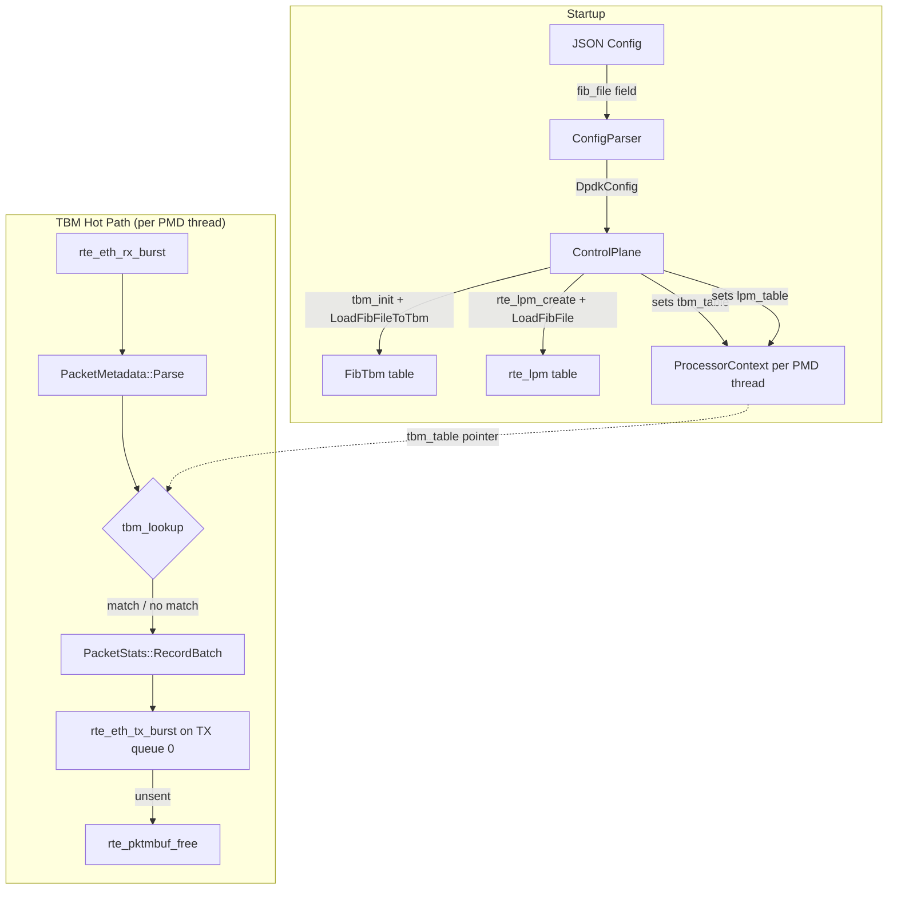

# Design Document: TBM Forwarding Processor

## Overview

This design adds a TBM (Tree Bitmap) forwarding processor as an alternative to the existing `rte_lpm`-based LPM forwarding processor. The TBM processor delegates longest-prefix-match lookups to `tbm_lookup()` from the prebuilt `tbmlib` library instead of DPDK's `rte_lpm_lookup()`.

The design touches six areas of the codebase:

1. **ProcessorContext** — new `void* tbm_table` field
2. **TBM FIB Loader** — new `LoadFibFileToTbm()` function in `fib/fib_loader.h/.cc`
3. **ControlPlane** — creates, populates, wires, and destroys the `FibTbm` instance
4. **TbmForwardingProcessor** — the processor class itself
5. **BUILD files** — new targets and dependency wiring
6. **Main binary** — link dependency on the new processor target

The processor mirrors `LpmForwardingProcessor` exactly in structure: CRTP base, self-registration via `REGISTER_PROCESSOR`, burst RX/TX, `PacketMetadata` parsing, per-thread stats. It is intentionally lightweight — no FastLookupTable, no SessionTable, no control-plane commands.

Both processors coexist: the ControlPlane initializes both tables from the same FIB file when `fib_file` is non-empty, and operators select the backend per PMD thread via `"processor": "tbm_forwarding"` or `"processor": "lpm_forwarding"` in JSON config.

## Architecture



### Data Flow

1. Operator specifies `"fib_file": "/path/to/fib.txt"` and `"processor": "tbm_forwarding"` in JSON config.
2. `ControlPlane::Initialize` creates a `FibTbm` via `tbm_init()`, calls `LoadFibFileToTbm()` to populate it, and sets `ProcessorContext::tbm_table` for each PMD thread. (The existing LPM table is also created from the same file.)
3. Each PMD thread running `tbm_forwarding`: RX burst → parse each packet → if IPv4 and `tbm_table != nullptr`, call `tbm_lookup()` with `ntohl(meta.dst_ip.v4)` → record stats → TX burst → free unsent.
4. On shutdown, `ControlPlane` calls `tbm_free()` on the `FibTbm` after all PMD threads have stopped.

## Components and Interfaces

### 1. ProcessorContext Extension (Requirement 1)

Add a `tbm_table` field to `ProcessorContext`:

```cpp
// In processor/processor_context.h, inside struct ProcessorContext:
void* tbm_table = nullptr;  // FibTbm* (or nullptr if no TBM FIB)
```

This field is initialized to null and does not affect any existing fields.

### 2. TBM FIB Loader (Requirement 4)

New function added to the existing `fib/fib_loader.h/.cc` files (not a separate module):

```cpp
// In fib/fib_loader.h:
#include "tbm/tbmlib.h"

namespace fib {

// Load FIB entries from file into a TBM table.
// If rules_loaded is non-null, stores the number of prefixes inserted.
absl::Status LoadFibFileToTbm(const std::string& file_path, FibTbm* tbm,
                               uint32_t* rules_loaded = nullptr);

}  // namespace fib
```

The implementation mirrors `LoadFibFile()` but calls `tbm_insert()` instead of `rte_lpm_add()`:

- Opens the file, reads line pairs (IP address, CIDR length).
- Parses IPv4 address via `inet_pton`, converts to host byte order with `ntohl`.
- Validates CIDR range 0–32.
- Constructs a `FibCidr{.ip = ip_host, .cidr = cidr}` and calls `tbm_insert(tbm, cidr_val, 0)`.
- If `tbm_insert()` returns a non-null `c3fault_t`, returns `InternalError`.
- Null `tbm` pointer returns `InvalidArgumentError`.
- Missing file returns `NotFoundError`.
- Invalid IP or CIDR returns `InvalidArgumentError` with line number.

### 3. ControlPlane Changes (Requirements 2, 3, 14)

**Header** (`control/control_plane.h`):
- New include: `extern "C" { #include "tbm/tbmlib.h" }`
- New private member: `FibTbm tbm_table_{};` (stack/member-owned, zero-initialized)
- New private member: `bool tbm_initialized_ = false;`
- New private member: `uint32_t tbm_rules_loaded_ = 0;`

**Implementation** (`control/control_plane.cc`):

In `Initialize()`, after the existing LPM table creation block:

```cpp
// Create TBM table if fib_file is configured.
// FibTbm must be zero-initialized before tbm_init (see tbm/test.c pattern).
if (!config_.fib_file.empty()) {
  tbm_table_ = {};  // Zero-init before tbm_init
  tbm_init(&tbm_table_, 1048576);  // Match LPM max_rules capacity
  tbm_initialized_ = true;

  auto status = fib::LoadFibFileToTbm(config_.fib_file, &tbm_table_,
                                       &tbm_rules_loaded_);
  if (!status.ok()) {
    tbm_free(&tbm_table_);
    tbm_initialized_ = false;
    return status;
  }

  // Wire TBM table into each PMD thread's ProcessorContext.
  // Only set when tbm_initialized_ is true, so ExportProcessorData
  // can null-check ctx.tbm_table to know if a usable table exists.
  if (thread_manager_) {
    for (uint32_t lcore_id : thread_manager_->GetLcoreIds()) {
      PmdThread* thread = thread_manager_->GetThread(lcore_id);
      if (thread) {
        thread->GetMutableProcessorContext().tbm_table = &tbm_table_;
      }
    }
  }
}
```

In `Shutdown()`, after PMD threads stop and after LPM table destruction:

```cpp
// Destroy TBM table after PMD threads stop.
if (tbm_initialized_) {
  tbm_free(&tbm_table_);
  tbm_initialized_ = false;
}
```

Design decision: The ControlPlane owns `FibTbm` as a direct member (not heap-allocated), matching the pattern in `tbm/test.c` where `FibTbm tbm = {};` is zero-initialized before `tbm_init()`. Both LPM and TBM tables are created from the same `fib_file`. This allows operators to run mixed configurations where some PMD threads use `lpm_forwarding` and others use `tbm_forwarding`.

### 4. TbmForwardingProcessor Class (Requirements 5–12)

**Header** (`processor/tbm_forwarding_processor.h`):

```cpp
class TbmForwardingProcessor
    : public PacketProcessorBase<TbmForwardingProcessor> {
 public:
  explicit TbmForwardingProcessor(
      const dpdk_config::PmdThreadConfig& config,
      PacketStats* stats = nullptr);

  absl::Status check_impl(
      const std::vector<dpdk_config::QueueAssignment>& rx_queues,
      const std::vector<dpdk_config::QueueAssignment>& tx_queues);

  void process_impl();

  void ExportProcessorData(ProcessorContext& ctx);

  static absl::Status CheckParams(
      const absl::flat_hash_map<std::string, std::string>& params);

 private:
  static constexpr uint16_t kBatchSize = 64;
  PacketStats* stats_ = nullptr;
  FibTbm* tbm_table_ = nullptr;  // Borrowed from ProcessorContext
};
```

Key design decisions:
- No `RegisterControlCommands` — Requirement 12 says no control-plane commands.
- `ExportProcessorData` reads `ctx.tbm_table` and casts it to `FibTbm*`, but only sets `tbm_table_` if the pointer is non-null. Since `tbm_table_` is a direct member of ControlPlane (not heap-allocated), its address always exists — so the ControlPlane only sets `ctx.tbm_table` when `tbm_initialized_` is true (i.e., FIB was actually loaded). This way `ExportProcessorData` can simply null-check `ctx.tbm_table` to know whether a usable TBM table exists. Does NOT touch `ctx.session_table`, `ctx.processor_data`, or `ctx.lpm_table`.
- `CheckParams` rejects any non-empty parameter map.

**Implementation** (`processor/tbm_forwarding_processor.cc`):

`process_impl()` follows the same structure as `LpmForwardingProcessor::process_impl()`:

```
for each RX queue:
  rx_burst → batch
  if batch empty: Release and continue

  PrefetchForEach:
    PacketMetadata::Parse(pkt, meta)
    if parse failed: skip lookup, still forward
    if tbm_table_ != nullptr && !meta.IsIpv6():
      uint32_t next_hop = 0;
      c3fault_t fault = tbm_lookup(&next_hop, tbm_table_, ntohl(meta.dst_ip.v4));
      // next_hop recorded for future use; packet forwarded regardless of fault

  if stats_: record batch count + total bytes
  tx_burst on tx_queues[0]
  free unsent mbufs
  batch.Release()
```

Registration at bottom of .cc file:
```cpp
REGISTER_PROCESSOR("tbm_forwarding", TbmForwardingProcessor);
```

### 5. Bazel BUILD Changes (Requirement 13)

**`processor/BUILD`** — new target:

```python
cc_library(
    name = "tbm_forwarding_processor",
    srcs = ["tbm_forwarding_processor.cc"],
    hdrs = ["tbm_forwarding_processor.h"],
    alwayslink = True,
    deps = [
        ":packet_processor_base",
        ":packet_stats",
        ":processor_context",
        ":processor_registry",
        "//config:dpdk_config",
        "//rxtx:batch",
        "//rxtx:packet",
        "//rxtx:packet_metadata",
        "//rxtx:packet_metadata_impl",
        "//tbm:tbmlib",
        "//:dpdk_lib",
        "@abseil-cpp//absl/container:flat_hash_map",
        "@abseil-cpp//absl/status",
        "@abseil-cpp//absl/strings",
    ],
)
```

**`fib/BUILD`** — add `//tbm:tbmlib` dep to `fib_loader`:

```python
cc_library(
    name = "fib_loader",
    srcs = ["fib_loader.cc"],
    hdrs = ["fib_loader.h"],
    deps = [
        "//tbm:tbmlib",
        "//:dpdk_lib",
        "@abseil-cpp//absl/status",
        "@abseil-cpp//absl/strings",
    ],
)
```

**`control/BUILD`** — add `//tbm:tbmlib` dep to `control_plane` (for `FibTbm` type in header).

**`BUILD` (root)** — add `//processor:tbm_forwarding_processor` dep to `main`:

```python
cc_binary(
    name = "main",
    deps = [
        # ... existing deps ...
        "//processor:tbm_forwarding_processor",
    ],
)
```

## Data Models

### ProcessorContext (extended)

| Field | Type | Default | Description |
|-------|------|---------|-------------|
| `tbm_table` | `void*` | `nullptr` | Pointer to `FibTbm` table (or nullptr if no TBM FIB). |

### FibTbm (from tbmlib)

The `FibTbm` type (`tbmlib__Tbm$5$uint$uint$__`) is a struct from `tbm/tbmlib.h`. It is owned as a direct member of ControlPlane, zero-initialized with `= {}` before `tbm_init()`, and freed via `tbm_free()`. No heap allocation needed.

### FibCidr (from tbmlib)

| Field | Type | Description |
|-------|------|-------------|
| `ip` | `uint32_t` | IPv4 address in host byte order |
| `cidr` | `uint32_t` | CIDR prefix length (0–32) |

### TbmForwardingProcessor internal state

| Field | Type | Source | Description |
|-------|------|--------|-------------|
| `stats_` | `PacketStats*` | Constructor | Per-thread stats (nullable). |
| `tbm_table_` | `FibTbm*` | `ExportProcessorData` | Borrowed pointer to shared TBM FIB. |

### ControlPlane (extended private members)

| Field | Type | Default | Description |
|-------|------|---------|-------------|
| `tbm_table_` | `FibTbm` | `{}` | Owned TBM FIB table (member, not heap). |
| `tbm_initialized_` | `bool` | `false` | Whether `tbm_init()` was called. |
| `tbm_rules_loaded_` | `uint32_t` | `0` | Number of prefixes loaded into TBM. |


## Correctness Properties

*A property is a characteristic or behavior that should hold true across all valid executions of a system — essentially, a formal statement about what the system should do. Properties serve as the bridge between human-readable specifications and machine-verifiable correctness guarantees.*

### Property 1: FIB load round-trip

*For any* valid FIB file containing N line pairs of (valid IPv4 address, CIDR length in 0–32), loading it into a `FibTbm` via `LoadFibFileToTbm` and then iterating the table with `tbm_iterate` should yield exactly the same set of N prefixes (IP in host byte order, CIDR length), and `rules_loaded` should equal N.

**Validates: Requirements 4.2, 4.7**

### Property 2: Invalid FIB entries are rejected

*For any* FIB file containing a line pair where the IP string is not a valid IPv4 address or the CIDR length is outside the range 0–32, `LoadFibFileToTbm` should return an error status (InvalidArgumentError) and not return OkStatus.

**Validates: Requirements 4.4, 4.5**

### Property 3: ProcessorContext field isolation

*For any* `ProcessorContext` with arbitrary values in `lpm_table`, `session_table`, `processor_data`, and `stats`, setting the `tbm_table` field to any pointer value should leave all other fields unchanged.

**Validates: Requirements 1.2**

### Property 4: Non-empty TX queues pass check_impl

*For any* non-empty list of TX queue assignments, `TbmForwardingProcessor::check_impl` should return `OkStatus`.

**Validates: Requirements 6.2**

### Property 5: Unrecognized parameters are rejected

*For any* non-empty `flat_hash_map<string, string>`, `TbmForwardingProcessor::CheckParams` should return `InvalidArgumentError`.

**Validates: Requirements 11.2**

## Error Handling

| Scenario | Behavior | Requirement |
|----------|----------|-------------|
| `tbm_init()` or `LoadFibFileToTbm` fails | ControlPlane calls `tbm_free()`, sets `tbm_initialized_ = false`, returns error, aborts init | 2.3 |
| `fib_file` is empty | ControlPlane skips TBM FIB creation, `tbm_table` stays null | 2.4 |
| FIB file cannot be opened | `LoadFibFileToTbm` returns `NotFoundError` | 4.3 |
| Invalid IPv4 address in FIB file | `LoadFibFileToTbm` returns `InvalidArgumentError` with line number | 4.4 |
| CIDR length outside 0–32 | `LoadFibFileToTbm` returns `InvalidArgumentError` with line number | 4.5 |
| `tbm_insert()` returns non-null fault | `LoadFibFileToTbm` returns `InternalError` with prefix info | 4.6 |
| `tbm` pointer is null | `LoadFibFileToTbm` returns `InvalidArgumentError` | 4.8 |
| TX queue list empty | `check_impl` returns `InvalidArgumentError` | 6.1 |
| `PacketMetadata::Parse` fails | Skip TBM lookup, still forward packet | 7.2 |
| `tbm_lookup()` returns non-null fault (no match) | Forward packet anyway (default behavior) | 8.3 |
| `tbm_table` is null in ProcessorContext | Skip TBM lookup, forward packet | 8.4 |
| Packet is IPv6 | Skip TBM lookup, forward packet | 8.5 |
| `rte_eth_tx_burst` partial send | Free unsent mbufs with `rte_pktmbuf_free` | 9.2 |
| `stats_` is null | Skip stats recording | 10.2 |
| Non-empty `CheckParams` map | Return `InvalidArgumentError` with unrecognized key | 11.2 |

## Testing Strategy

### Unit Tests Only

This feature uses unit tests to verify specific examples, edge cases, and error conditions. No property-based tests.

#### TbmForwardingProcessor Unit Tests (`processor/tbm_forwarding_processor_test.cc`)

**Registration (Req 5.1, 14.1):**
- `ProcessorRegistry::Lookup("tbm_forwarding")` returns OK with non-null launcher, checker, param_checker
- Both `"lpm_forwarding"` and `"tbm_forwarding"` are registered without conflict

**check_impl (Req 6.1, 6.2):**
- Empty `tx_queues` → `InvalidArgumentError`
- Non-empty `tx_queues` → `OkStatus`

**CheckParams (Req 11.1, 11.2):**
- Empty map → `OkStatus`
- Non-empty map → `InvalidArgumentError`

**ExportProcessorData (Req 1.2, 12.2):**
- Setting `ctx.tbm_table` to a known value, calling `ExportProcessorData`, verifying `ctx.session_table` and `ctx.processor_data` are unchanged

#### LoadFibFileToTbm Unit Tests (`fib/fib_loader_test.cc`)

**Null pointer (Req 4.8):**
- `LoadFibFileToTbm("any_path", nullptr)` → `InvalidArgumentError`

**Missing file (Req 4.3):**
- `LoadFibFileToTbm("/nonexistent/path", &tbm)` → `NotFoundError`

**Valid FIB load (Req 4.2, 4.7):**
- Write a temp FIB file with known entries, load via `LoadFibFileToTbm`, verify `rules_loaded` matches, iterate via `tbm_iterate` to confirm entries present

**Invalid IPv4 (Req 4.4):**
- FIB file with invalid IP string → `InvalidArgumentError`

**Invalid CIDR (Req 4.5):**
- FIB file with CIDR outside 0–32 → `InvalidArgumentError`
